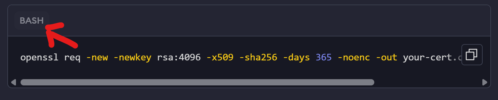
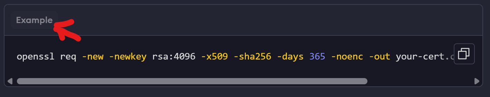
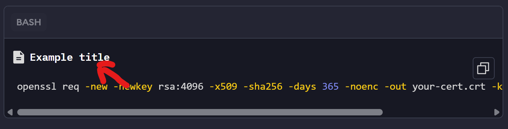
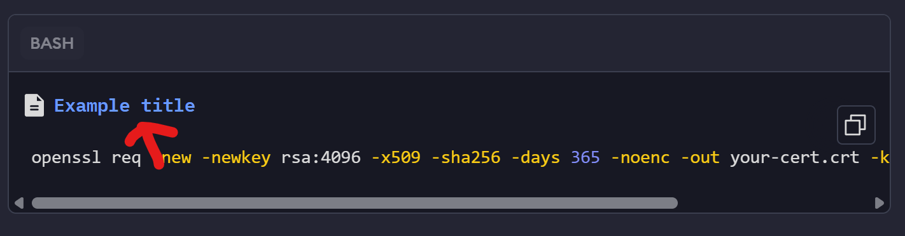
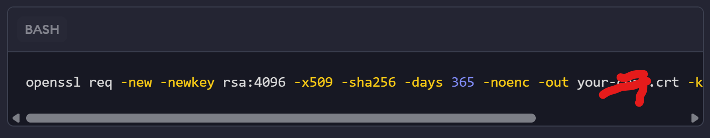

Table of Contents

- [Creating code blocks](#creating-code-blocks)
  - [Valid properties](#valid-properties)
    - [`tabName`](#-tabname-)

This guide is for internal ngrok teammates who want to use the codeblock and LangSwitcher components to render code snippets in the docs.

# Creating code blocks

A standard codeblock will look like this:

````txt
```bash title="file-title"
openssl req -new -newkey rsa:4096 -x509 -sha256 -days 365 -noenc -out your-cert.crt -keyout your-key.key
```
````

Result:


## Valid properties

The code block can take the following meta properties, which you use by adding them to the same line where you specify the language.

### `tabName`

Use `tabName` to rename the language tab shown in the code block component.

Example:

````txt
```bash tabName="Example"
openssl req -new -newkey rsa:4096 -x509 -sha256 -days 365 -noenc -out your-cert.crt -keyout your-key.key
```
````

Result:


### `title`

Use `title` to add a file name to a code block component.

Example:

````txt
```bash title="Example file"
openssl req -new -newkey rsa:4096 -x509 -sha256 -days 365 -noenc -out your-cert.crt -keyout your-key.key
```
````

Result:


#### `titleLink`

After defining a `title`, use `titleLink` wrap a link around the file name of a codeblock.

Example:

````txt
```bash title="Example file" titleLink=https://ngrok.com/pricing
openssl req -new -newkey rsa:4096 -x509 -sha256 -days 365 -noenc -out your-cert.crt -keyout your-key.key
```
````



### `mode`

Define which file icon appears next to the `title` of a codeblock.

Example:

````txt
```bash title="Example file" mode=traffic-policy
openssl req -new -newkey rsa:4096 -x509 -sha256 -days 365 -noenc -out your-cert.crt -keyout your-key.key
```
````


### `disableCopy`

Boolean. Decide if the "copy code" button will appear in the codeblock

Example:

````txt
```bash disableCopy=true
openssl req -new -newkey rsa:4096 -x509 -sha256 -days 365 -noenc -out your-cert.crt -keyout your-key.key
```
````



### `collapsible`

Default `false`. Decide if a codeblock will be collapsible.

Example:

````txt
```bash title="Example file" titleLink=https://ngrok.com/pricing
openssl req -new -newkey rsa:4096 -x509 -sha256 -days 365 -noenc -out your-cert.crt -keyout your-key.key
```
````


#### `collapseLineNumber`

Default `false`. Decide if a codeblock will be collapsible.

Example:

````txt
```bash title="Example file" titleLink=https://ngrok.com/pricing
openssl req -new -newkey rsa:4096 -x509 -sha256 -days 365 -noenc -out your-cert.crt -keyout your-key.key
```
````


