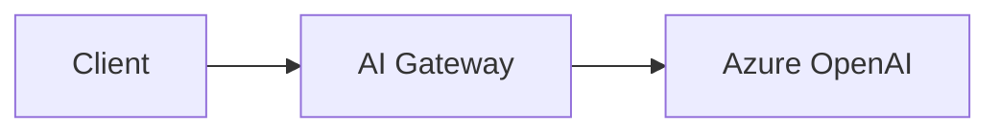

[Azure OpenAI Service](https://azure.microsoft.com/en-us/products/ai-services/openai-service) provides access to OpenAI models through Microsoft's Azure cloud. This guide shows you how to connect Azure OpenAI to the ngrok AI Gateway.

## Prerequisites

- [ngrok account](https://dashboard.ngrok.com/signup) with AI Gateway access
- [Azure OpenAI Service](https://azure.microsoft.com/en-us/products/ai-services/openai-service) resource
- Deployed model in Azure OpenAI

## Overview

Azure OpenAI uses a different URL structure than standard OpenAI. You configure the full deployment URL as the `base_url` and the gateway routes requests to it.



## Getting started

<Steps>
  <Step title="Get Azure OpenAI details">
    From the Azure Portal, gather:

    1. **Endpoint URL**: `https://your-resource.openai.azure.com`
    2. **API Key**: From "Keys and Endpoint" section
    3. **Deployment Name**: The name you gave your model deployment
  </Step>

  <Step title="Store your API key">
    Add your Azure OpenAI API key to [ngrok secrets](/traffic-policy/secrets):

    ```bash
    ngrok api secrets create \
      --name azure-openai \
      --secret-data '{"api-key": "your-azure-api-key"}'
    ```

    <Tip>
    You can also create secrets in the [ngrok Dashboard](https://dashboard.ngrok.com/vaults).
    </Tip>
  </Step>

  <Step title="Configure the AI Gateway">
    Create a traffic policy with Azure OpenAI as a provider:

    ```yaml title="policy.yaml"
    on_http_request:
      - type: ai-gateway
        config:
          headers:
            api-version: "2024-02-15-preview"
          providers:
            - id: "azure-openai"
              base_url: "https://your-resource.openai.azure.com/openai/deployments/your-deployment"
              api_keys:
                - value: ${secrets.get('azure-openai', 'api-key')}
              models:
                - id: "gpt-4o"
    ```

    <Note>
    Azure OpenAI requires the `api-version` header. The `headers` configuration above ensures this is added to all requests.
    </Note>
  </Step>

  <Step title="Use with OpenAI SDK">
    Point any OpenAI-compatible SDK at your AI Gateway:

    <CodeGroup>
    ```python Python
    from openai import OpenAI

    client = OpenAI(
        base_url="https://your-ai-subdomain.ngrok.app/v1",
        api_key="unused"  # Gateway handles auth
    )

    response = client.chat.completions.create(
        model="azure-openai:gpt-4o",
        messages=[{"role": "user", "content": "Hello!"}]
    )

    print(response.choices[0].message.content)
    ```

    ```typescript TypeScript
    import OpenAI from "openai";

    const client = new OpenAI({
      baseURL: "https://your-ai-subdomain.ngrok.app/v1",
      apiKey: "unused"
    });

    const response = await client.chat.completions.create({
      model: "azure-openai:gpt-4o",
      messages: [{ role: "user", content: "Hello!" }]
    });

    console.log(response.choices[0].message.content);
    ```
    </CodeGroup>
  </Step>
</Steps>

## Advanced configuration

### Multiple deployments

Configure multiple Azure OpenAI deployments:

```yaml
on_http_request:
  - type: ai-gateway
    config:
      headers:
        api-version: "2024-02-15-preview"
      providers:
        - id: "azure-gpt4"
          base_url: "https://your-resource.openai.azure.com/openai/deployments/gpt-4o-deployment"
          api_keys:
            - value: ${secrets.get('azure-openai', 'api-key')}
          models:
            - id: "gpt-4o"
        
        - id: "azure-gpt35"
          base_url: "https://your-resource.openai.azure.com/openai/deployments/gpt-35-deployment"
          api_keys:
            - value: ${secrets.get('azure-openai', 'api-key')}
          models:
            - id: "gpt-3.5-turbo"
```

### Multiple regions

Configure multiple Azure regions for failover:

```yaml
on_http_request:
  - type: ai-gateway
    config:
      headers:
        api-version: "2024-02-15-preview"
      providers:
        - id: "azure-eastus"
          base_url: "https://myapp-eastus.openai.azure.com/openai/deployments/gpt-4o"
          api_keys:
            - value: ${secrets.get('azure-openai-eastus', 'api-key')}
          models:
            - id: "gpt-4o"
          metadata:
            region: "eastus"
        
        - id: "azure-westus"
          base_url: "https://myapp-westus.openai.azure.com/openai/deployments/gpt-4o"
          api_keys:
            - value: ${secrets.get('azure-openai-westus', 'api-key')}
          models:
            - id: "gpt-4o"
          metadata:
            region: "westus"
```

<Note>
Without a model selection strategy, requesting `model: "gpt-4o"` returns both regions as candidates (in config order), enabling failover. Requesting `model: "azure-eastus:gpt-4o"` pins to that region only. For explicit control over failover order, clients can use `models: ["azure-eastus:gpt-4o", "azure-westus:gpt-4o"]`.
</Note>

### Failover to OpenAI

Use Azure as primary with OpenAI fallback:

```yaml
on_http_request:
  - type: ai-gateway
    config:
      headers:
        api-version: "2024-02-15-preview"
      providers:
        - id: "azure-openai"
          base_url: "https://your-resource.openai.azure.com/openai/deployments/gpt-4o"
          api_keys:
            - value: ${secrets.get('azure-openai', 'api-key')}
          models:
            - id: "gpt-4o"
        
        - id: "openai"
          api_keys:
            - value: ${secrets.get('openai', 'api-key')}
      
      model_selection:
        strategy:
          - "ai.models.filter(m, m.provider_id == 'azure-openai')"
          - "ai.models.filter(m, m.provider_id == 'openai')"
```

<Note>
The first strategy that returns models wins. If Azure has matching models, only those are tried. OpenAI is only used if no Azure models match. For cross-provider failover when requests fail, have clients specify multiple models: `models: ["azure-openai:gpt-4o", "openai:gpt-4o"]`.
</Note>

### Embeddings

Configure Azure OpenAI embeddings:

```yaml
on_http_request:
  - type: ai-gateway
    config:
      headers:
        api-version: "2024-02-15-preview"
      providers:
        - id: "azure-embeddings"
          base_url: "https://your-resource.openai.azure.com/openai/deployments/text-embedding-ada-002"
          api_keys:
            - value: ${secrets.get('azure-openai', 'api-key')}
          models:
            - id: "text-embedding-ada-002"
```

## Troubleshooting

### 401 unauthorized

**Symptom**: Requests fail with authentication errors.

**Solutions**:
1. Verify the API key is correct in secrets
2. Check the key hasn't been regenerated in Azure Portal
3. Ensure the secret name matches your config

### 404 deployment not found

**Symptom**: Requests fail with deployment not found.

**Solutions**:
1. Verify the deployment name in your `base_url`
2. Check the deployment exists in Azure Portal
3. Ensure the deployment is in the correct region

### API version errors

**Symptom**: Requests fail with API version errors.

**Solutions**:
1. Update the `api-version` header to a supported version
2. Check [Azure OpenAI API versions](https://learn.microsoft.com/en-us/azure/ai-services/openai/reference) for current versions

### Rate limiting

**Symptom**: 429 errors from Azure.

**Solutions**:
1. Configure multiple deployments for failover
2. Request quota increase in Azure Portal
3. Add multiple API keys per deployment for automatic failover

## Next steps

- [Custom Providers](/ai-gateway/custom-providers) - URL requirements and configuration
- [Model Selection Strategies](/ai-gateway/guides/model-selection-strategies) - Intelligent routing
- [Multi-Provider Failover](/ai-gateway/examples/multi-provider-failover) - Failover patterns

