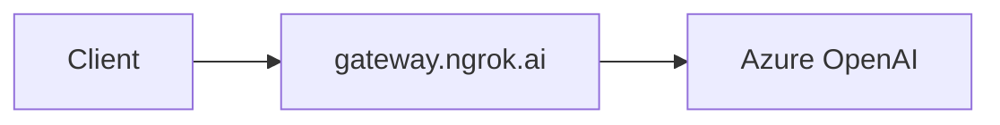

[Azure OpenAI Service](https://azure.microsoft.com/en-us/products/ai-services/openai-service) provides OpenAI models on Microsoft Azure. Connect your deployment to the AI Gateway as a [custom provider](/ai-gateway/concepts/custom-providers).

## What you'll need

- [ngrok account](https://app.ngrok.ai) with AI Gateway access
- [Azure OpenAI Service](https://azure.microsoft.com/en-us/products/ai-services/openai-service) resource with a deployed model
- An [access key](/ai-gateway/concepts/access-keys) from [app.ngrok.ai](https://app.ngrok.ai)

## Overview

Azure OpenAI uses deployment-specific URLs and requires an `api-version` query parameter. The gateway injects your Azure API key server-side.


```mermaid
graph LR
    A[Client] --> B[gateway.ngrok.ai]
    B --> C[Azure OpenAI]
```

## Getting started

<Steps>
  <Step title="Gather Azure details">
    From the Azure Portal, collect:

    1. **Resource endpoint**: `https://your-resource.openai.azure.com`
    2. **API key**: from **Keys and Endpoint**
    3. **Deployment name**: the name of your model deployment
    4. **API version**: a supported version (for example `2024-02-15-preview`)
  </Step>

  <Step title="Create the custom provider">
    Azure requires the deployment path and `api-version` in the base URL. See [Create a custom provider](/ai-gateway/guides/use-a-model-you-run-yourself#create-a-custom-provider) with:

    - **Provider ID**: `azure-openai`
    - **Base URL**: `https://your-resource.openai.azure.com/openai/deployments/your-deployment?api-version=2024-02-15-preview`
    - **API format**: OpenAI Chat Completions
    - **Models**: the model name for this deployment (for example `gpt-4o`)

    <Note>
    Include `api-version` as a query parameter on the base URL. Azure rejects requests without it.
    </Note>
  </Step>

  <Step title="Store your Azure API key">
    [Add a provider key](/ai-gateway/guides/attaching-provider-keys#add-a-provider-key) for your Azure deployment.
  </Step>

  <Step title="Configure access">
    Create an [access key configuration](/ai-gateway/guides/access-key-configurations) that:

    1. Allows the `azure-openai` provider in the access scope
    2. Adds a routing rule for `azure-openai` with **Bring your own API key** and your stored key attached

    Assign the configuration to your access key.
  </Step>

  <Step title="Send requests">
    <CodeGroup>
    ```python Python
    from openai import OpenAI

    client = OpenAI(
        base_url="https://gateway.ngrok.ai/v1",
        api_key="ng-xxxxx-g1-xxxxx"
    )

    response = client.chat.completions.create(
        model="azure-openai:gpt-4o",
        messages=[{"role": "user", "content": "Hello!"}]
    )

    print(response.choices[0].message.content)
    ```

    ```typescript TypeScript
    import OpenAI from "openai";

    const client = new OpenAI({
      baseURL: "https://gateway.ngrok.ai/v1",
      apiKey: "ng-xxxxx-g1-xxxxx"
    });

    const response = await client.chat.completions.create({
      model: "azure-openai:gpt-4o",
      messages: [{ role: "user", content: "Hello!" }]
    });

    console.log(response.choices[0].message.content);
    ```
    </CodeGroup>
  </Step>
</Steps>

## Multiple deployments and regions

Create a separate custom provider for each Azure deployment or region. Give each a unique provider ID (for example `azure-gpt4`, `azure-eastus`) with its own deployment URL and model list.

Attach the same or different provider keys per deployment. Pin a region with `azure-eastus:gpt-4o`, or list multiple models for failover: `models: ["azure-eastus:gpt-4o", "openai:gpt-4o"]`.

## Troubleshooting

| Symptom | Fix |
|---------|-----|
| 401 unauthorized | Verify the provider key in app.ngrok.ai matches Azure Portal and is attached in your access key configuration |
| 404 deployment not found | Check the deployment name in the base URL matches Azure Portal |
| API version errors | Update the `api-version` query parameter to a [supported version](https://learn.microsoft.com/en-us/azure/ai-services/openai/reference) |
| 429 rate limiting | Add multiple provider keys for failover or request a quota increase in Azure Portal |

## Next steps

- [Use a model you run yourself](/ai-gateway/guides/use-a-model-you-run-yourself): URL requirements and configuration
- [Provider Keys](/ai-gateway/guides/attaching-provider-keys): Store upstream credentials
- [Access Key Configurations](/ai-gateway/guides/access-key-configurations): Route traffic per access key
- [Quickstart](/ai-gateway/quickstart): Create your first access key
