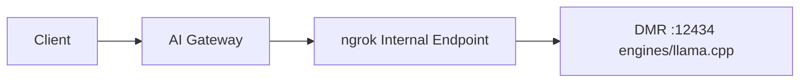

[Docker Model Runner (DMR)](https://github.com/docker/model-runner) makes it easy to manage, run, and serve AI models with Docker. DMR exposes OpenAI-compatible endpoints via inference engines like `llama.cpp` and `vLLM`, so you can integrate it with the ngrok AI Gateway.

## Prerequisites

- [ngrok account](https://dashboard.ngrok.com/signup) with AI Gateway access
- [Docker Desktop](https://docs.docker.com/desktop/) (macOS/Windows) or [Docker Engine](https://docs.docker.com/engine/install/) (Linux)
- Docker Model Runner (included with Docker Desktop/Engine from Docker's official repos)
- [ngrok agent](https://download.ngrok.com) installed
- GPU recommended for large models (NVIDIA/AMD as appropriate for your engine)

<Note>
On Linux, install Docker Engine from Docker's official repository to get Docker Model Runner. If `docker model` isn't available, reinstall from Docker's repos. See DMR docs: https://docs.docker.com/ai/model-runner/get-started/
</Note>

## Overview

DMR serves OpenAI-compatible APIs under an engine-specific path, for example:

- llama.cpp engine: `/engines/llama.cpp/v1/...`
- vLLM engine: `/engines/vllm/v1/...`

The AI Gateway routes directly to your chosen engine path.



## Getting started

<Steps>
  <Step title="Verify DMR is available">
    Ensure Docker Model Runner is installed and running:

    ```bash
    # Check Docker CLI plugin
    docker model --help

    # Optional: Check built-in DMR port on Docker Desktop
    # Docker Desktop typically runs DMR on 12434
    curl http://localhost:12434/metrics || true
    ```

    If you're developing or running the server yourself, you may use a different port (e.g., 13434 as used in DMR examples).
  </Step>

  <Step title="Prepare a model">
    DMR can download and manage models for you. Two common ways to prepare a model:

    - With the Docker CLI:

      ```bash
      # Smoke test a model (also ensures it's pulled/prepared)
      docker model run ai/smollm2 "Hello"
      ```

    - With the DMR API:

      ```bash
      # Create (pull) a model via REST (adjust port if needed)
      curl http://localhost:12434/models/create \
        -X POST \
        -H "Content-Type: application/json" \
        -d '{"from": "ai/smollm2"}'
      ```

    You can list and inspect models with:

    ```bash
    curl http://localhost:12434/models
    curl http://localhost:12434/models/ai/smollm2
    ```
  </Step>

  <Step title="Expose DMR with ngrok">
    Use the [ngrok agent](/agent/) to create an internal endpoint to your DMR port (12434 shown here):

    ```bash
    ngrok http 12434 --url https://dmr.internal
    ```

    <Note>
    Internal endpoints (`.internal` domains) are private to your ngrok account and not accessible from the public internet.
    </Note>
  </Step>

  <Step title="Configure the AI Gateway">
    Point the AI Gateway at the engine path that provides OpenAI-compatible endpoints. For `llama.cpp`:

    ```yaml title="policy.yaml" highlight={8}
    on_http_request:
      - type: ai-gateway
        config:
          providers:
            - id: "docker-model-runner"
              # Note the engine path segment below
              base_url: "https://dmr.internal/engines/llama.cpp"
              models:
                - id: "ai/smollm2"
    ```

    If you are running vLLM through DMR, use `base_url: https://dmr.internal/engines/vllm` and list your vLLM-served models instead.
  </Step>

  <Step title="Use with OpenAI SDK">
    Point any OpenAI-compatible SDK at your AI Gateway and prefix the model with the provider ID:

    <CodeGroup>
    ```python Python highlight={4,8}
    from openai import OpenAI

    client = OpenAI(
        base_url="https://your-ai-subdomain.ngrok.app/v1",
        api_key="unused"  # DMR does not require an API key by default
    )

    response = client.chat.completions.create(
        model="docker-model-runner:ai/smollm2",
        messages=[{"role": "user", "content": "Hello!"}]
    )

    print(response.choices[0].message.content)
    ```

    ```typescript TypeScript highlight={4,8}
    import OpenAI from "openai";

    const client = new OpenAI({
      baseURL: "https://your-ai-subdomain.ngrok.app/v1",
      apiKey: "unused"  // DMR does not require an API key by default
    });

    const response = await client.chat.completions.create({
      model: "docker-model-runner:ai/smollm2",
      messages: [{ role: "user", content: "Hello!" }]
    });

    console.log(response.choices[0].message.content);
    ```
    </CodeGroup>
  </Step>
</Steps>

## Best practices

### Choose the correct engine path

DMR namespaces OpenAI endpoints by engine. Use one of:

- `base_url: https://dmr.internal/engines/llama.cpp`
- `base_url: https://dmr.internal/engines/vllm`

If you see 404s on `/v1/chat/completions`, double-check the engine path.

### Timeouts

Local models can be slower on first load. Increase timeouts as needed:

```yaml title="policy.yaml" highlight={4-5}
on_http_request:
  - type: ai-gateway
    config:
      per_request_timeout: "180s"
      total_timeout: "10m"
      providers:
        - id: "docker-model-runner"
          base_url: "https://dmr.internal/engines/llama.cpp"
          models:
            - id: "ai/smollm2"
```

### NVIDIA NIM and private registries

Some models (for example, NVIDIA NIM containers) require credentials to pull. Set environment variables for the DMR process as needed, such as `NGC_API_KEY`, and pre-create the model:

```bash
export NGC_API_KEY=...  # Do not commit secrets
curl http://localhost:12434/models/create \
  -X POST -H 'Content-Type: application/json' \
  -d '{"from": "nvcr.io/nim/google/gemma-3-1b-it:latest"}'
```

<Warning>
Never hardcode or print secrets. Store provider credentials in a secure secret manager.
</Warning>

## Advanced configuration

### Multiple engines or models

Run different engines and route accordingly:

```yaml title="policy.yaml" highlight={6,13}
on_http_request:
  - type: ai-gateway
    config:
      providers:
        - id: "dmr-llama"
          base_url: "https://dmr.internal/engines/llama.cpp"
          models:
            - id: "ai/smollm2"

        - id: "dmr-vllm"
          base_url: "https://dmr.internal/engines/vllm"
          models:
            - id: "meta-llama/Llama-3.2-8B-Instruct"
```

### Failover to cloud

Use DMR locally with cloud fallback:

```yaml title="policy.yaml" highlight={16-19}
on_http_request:
  - type: ai-gateway
    config:
      providers:
        - id: "docker-model-runner"
          base_url: "https://dmr.internal/engines/llama.cpp"
          models:
            - id: "ai/smollm2"

        - id: "openai"
          api_keys:
            - value: ${secrets.get('openai', 'api-key')}

      model_selection:
        strategy:
          - "ai.models.filter(m, m.provider_id == 'docker-model-runner')"
          - "ai.models"
```

### Model metadata

Add metadata for routing decisions:

```yaml title="policy.yaml" highlight={7-9,12-14}
on_http_request:
  - type: ai-gateway
    config:
      providers:
        - id: "docker-model-runner"
          base_url: "https://dmr.internal/engines/llama.cpp"
          metadata:
            hardware: "RTX 4090"
            location: "local"
          models:
            - id: "ai/smollm2"
              metadata:
                parameters: "2.2B"
                context_length: 8192
```

## Troubleshooting

### `docker model` not found

- Install Docker Desktop or Docker Engine from Docker's official repositories
- Verify: `docker model --help` and `docker model version`

### Cannot connect to DMR

- Desktop default is port 12434; custom/dev setups may use 13434 or 8080 (container)
- Verify: `curl http://localhost:12434/models` or your chosen port
- Ensure the ngrok tunnel is running and `base_url` points to the same host:port

### 404 on `/v1/...` paths

- Ensure `base_url` includes the engine path, for example `/engines/llama.cpp`
- Example full path used by the gateway: `https://dmr.internal/engines/llama.cpp/v1/chat/completions`

### Model not found

- Create or pull the model first via CLI or API:
  - `docker model run ai/smollm2 "Hello"`
  - `curl -X POST http://localhost:12434/models/create -d '{"from":"ai/smollm2"}'`

### Slow first response

- Increase `per_request_timeout` to allow for initial model load
- Pre-warm the model by sending a small request

## References

- DMR repository: https://github.com/docker/model-runner
- DMR API examples: see README under "API Examples"
- Getting started with DMR: https://docs.docker.com/ai/model-runner/get-started/

## Next steps

- [Custom Providers](/ai-gateway/custom-providers) - URL requirements and configuration
- [Model Selection Strategies](/ai-gateway/guides/model-selection-strategies) - Intelligent routing
- [Multi-Provider Failover](/ai-gateway/examples/multi-provider-failover) - Failover patterns
