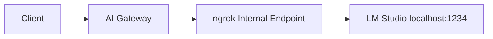

[LM Studio](https://lmstudio.ai) is a desktop application for running large language models locally with a user-friendly interface. It provides an [OpenAI-compatible API](https://lmstudio.ai/docs/developer/openai-compat), making it easy to integrate with the ngrok AI Gateway.

## Prerequisites

- [ngrok account](https://dashboard.ngrok.com/signup) with AI Gateway access
- [LM Studio](https://lmstudio.ai/download) installed
- [ngrok agent](https://download.ngrok.com) installed
- A model downloaded in LM Studio

## Overview

Since LM Studio runs locally on HTTP, you'll expose it through an ngrok internal endpoint, then configure the AI Gateway to route requests to it.



## Getting started

<Steps>
  <Step title="Download a model">
    Download a model using the GUI or CLI:

    <Tabs>
      <Tab title="GUI">
        1. Open LM Studio
        2. Go to the **Discover** tab (or press `Ctrl+2` on Windows/Linux, `⌘+2` on Mac)
        3. Search for a model (for example, `llama-3.2-3b-instruct`)
        4. Choose a quantization level (Q4 or higher recommended) and click **Download**
      </Tab>
      <Tab title="CLI">
        Use the `lms get` command to download models directly:

        ```bash
        lms get llama-3.2-3b-instruct@q4_k_m
        ```

        You can specify any model and quantization level using the `model@quantization` format.
      </Tab>
    </Tabs>

    <Tip>
    See the [LM Studio download guide](https://lmstudio.ai/docs/app/basics/download-model) for more details on choosing the right model and quantization level.
    </Tip>
  </Step>

  <Step title="Start LM Studio's local server">
    Start the server using the GUI or CLI:

    <Tabs>
      <Tab title="GUI">
        1. Go to the **Developer** tab in LM Studio
        2. Select the model you want to serve
        3. Click **Start Server**
      </Tab>
      <Tab title="CLI">
        Start the server in headless mode:

        ```bash
        lms server start
        ```
      </Tab>
    </Tabs>

    By default, LM Studio runs on port `1234`. Verify the server is running:

    ```bash
    curl http://localhost:1234/v1/models
    ```
  </Step>

  <Step title="Expose LM Studio with ngrok">
    Use the [ngrok agent](/agent/) to create an internal endpoint:

    ```bash
    ngrok http 1234 --url https://lm-studio.internal
    ```

    <Note>
    Internal endpoints (`.internal` domains) are private to your ngrok account. They're not accessible from the public internet.
    </Note>
  </Step>

  <Step title="Configure the AI Gateway">
    Create a Traffic Policy with LM Studio as a provider:

    ```yaml title="policy.yaml"
    on_http_request:
      - type: ai-gateway
        config:
          providers:
            - id: "lm-studio"
              base_url: "https://lm-studio.internal"
              models:
                - id: "llama-3.2-3b-instruct"
                - id: "mistral-7b-instruct-v0.3"
                - id: "qwen2.5-coder-7b-instruct"
    ```

    <Tip>
    LM Studio doesn't require API keys, so you can omit the `api_keys` field entirely.
    </Tip>

    <Note>
    The model ID should match the identifier shown in LM Studio. You can find it by calling `GET /v1/models` or checking the model details in the app.
    </Note>
  </Step>

  <Step title="Use with OpenAI SDK">
    Point any OpenAI-compatible SDK at your AI Gateway:

    <CodeGroup>
    ```python Python
    from openai import OpenAI

    client = OpenAI(
        base_url="https://your-ai-subdomain.ngrok.app/v1",
        api_key="unused"  # LM Studio doesn't need a key
    )

    response = client.chat.completions.create(
        model="lm-studio:llama-3.2-3b-instruct",  # Prefix with provider ID
        messages=[{"role": "user", "content": "Hello!"}]
    )

    print(response.choices[0].message.content)
    ```

    ```typescript TypeScript
    import OpenAI from "openai";

    const client = new OpenAI({
      baseURL: "https://your-ai-subdomain.ngrok.app/v1",
      apiKey: "unused"  // LM Studio doesn't need a key
    });

    const response = await client.chat.completions.create({
      model: "lm-studio:llama-3.2-3b-instruct",  // Prefix with provider ID
      messages: [{ role: "user", content: "Hello!" }]
    });

    console.log(response.choices[0].message.content);
    ```

    ```bash cURL
    curl https://your-ai-subdomain.ngrok.app/v1/chat/completions \
      -H "Content-Type: application/json" \
      -d '{
        "model": "lm-studio:llama-3.2-3b-instruct",
        "messages": [{"role": "user", "content": "Hello!"}]
      }'
    ```
    </CodeGroup>
  </Step>
</Steps>

## Advanced configuration

### Restrict to LM Studio only

Block requests to cloud providers and only allow LM Studio:

```yaml
on_http_request:
  - type: ai-gateway
    config:
      only_allow_configured_providers: true
      only_allow_configured_models: true
      providers:
        - id: "lm-studio"
          base_url: "https://lm-studio.internal"
          models:
            - id: "llama-3.2-3b-instruct"
            - id: "mistral-7b-instruct-v0.3"
```

### Failover to cloud provider

Use LM Studio as primary with automatic failover to OpenAI:

```yaml
on_http_request:
  - type: ai-gateway
    config:
      providers:
        - id: "lm-studio"
          base_url: "https://lm-studio.internal"
          models:
            - id: "llama-3.2-3b-instruct"
        
        - id: "openai"
          api_keys:
            - value: ${secrets.get('openai', 'api-key')}
      
      model_selection:
        strategy:
          - "ai.models.filter(m, m.provider_id == 'lm-studio')"
          - "ai.models.filter(m, m.provider_id == 'openai')"
```

<Note>
The first strategy that returns models wins. If LM Studio has matching models, only those are tried. OpenAI is only used if no LM Studio models match. For cross-provider failover when requests fail, have clients specify multiple models: `models: ["lm-studio:llama-3.2-3b-instruct", "openai:gpt-4o"]`.
</Note>

### Increase timeouts

Local models can be slower, especially on first load. Increase timeouts as needed:

```yaml
on_http_request:
  - type: ai-gateway
    config:
      per_request_timeout: "120s"
      total_timeout: "5m"
      providers:
        - id: "lm-studio"
          base_url: "https://lm-studio.internal"
          models:
            - id: "llama-3.2-3b-instruct"
```

### Add model metadata

Track model details with metadata:

```yaml
on_http_request:
  - type: ai-gateway
    config:
      providers:
        - id: "lm-studio"
          base_url: "https://lm-studio.internal"
          metadata:
            location: "local"
            hardware: "Apple M2 Pro"
          models:
            - id: "llama-3.2-3b-instruct"
              metadata:
                parameters: "3B"
                quantization: "Q4_K_M"
            - id: "qwen2.5-coder-7b-instruct"
              metadata:
                parameters: "7B"
                use_case: "coding"
```

### Use embeddings

LM Studio supports the `/v1/embeddings` endpoint for embedding models:

```yaml
on_http_request:
  - type: ai-gateway
    config:
      providers:
        - id: "lm-studio"
          base_url: "https://lm-studio.internal"
          models:
            - id: "nomic-embed-text-v1.5"
```

```python
response = client.embeddings.create(
    model="lm-studio:nomic-embed-text-v1.5",
    input="The quick brown fox jumps over the lazy dog"
)
```

## Troubleshooting

### Connection refused

**Symptom**: Requests fail with connection errors.

**Solutions**:
1. Verify LM Studio server is running: Check the Developer tab shows "Server running"
2. Verify the server port: Default is `1234`, check LM Studio settings if different
3. Verify ngrok tunnel is running: Check for `https://lm-studio.internal` in your [ngrok dashboard](https://dashboard.ngrok.com)
4. Ensure the internal endpoint URL matches your config

### Model not found

**Symptom**: Error saying model doesn't exist.

**Solutions**:
1. List available models: `curl http://localhost:1234/v1/models`
2. Verify the model is loaded in LM Studio (check the Developer tab)
3. Ensure the model ID matches exactly what LM Studio reports

### Slow first response

**Symptom**: First request takes a very long time.

**Cause**: LM Studio loads models into memory on first use.

**Solutions**:
1. Increase `per_request_timeout` to allow for model loading
2. Pre-load the model by selecting it in LM Studio before starting the server
3. Enable "Keep model in memory" in LM Studio settings

### Out of memory

**Symptom**: LM Studio crashes or returns errors for large models.

**Solutions**:
1. Use a smaller model or more quantized version (for example, Q4 instead of Q8)
2. Close other applications to free up RAM
3. Adjust GPU layers in LM Studio's model settings
4. Use CPU-only inference if GPU memory is insufficient

### Server not starting

**Symptom**: LM Studio server won't start.

**Solutions**:
1. Check if port 1234 is already in use: `netstat -an | grep 1234`
2. Try a different port in LM Studio settings
3. Restart LM Studio

## Next steps

- [Custom Providers](/ai-gateway/custom-providers) - Learn about URL requirements and configuration options
- [Model Selection Strategies](/ai-gateway/guides/model-selection-strategies) - Route requests intelligently
- [Multi-Provider Failover](/ai-gateway/examples/multi-provider-failover) - Advanced failover patterns

