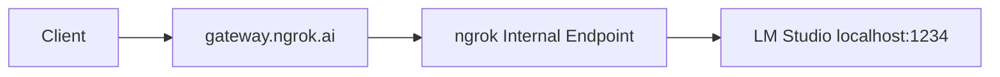

[LM Studio](https://lmstudio.ai) is a desktop app for running LLMs locally with an [OpenAI-compatible API](https://lmstudio.ai/docs/developer/openai-compat). Connect it to the AI Gateway as a [custom provider](/ai-gateway/concepts/custom-providers).

## What you'll need

- [ngrok account](https://app.ngrok.ai) with AI Gateway access
- [LM Studio](https://lmstudio.ai/download) installed
- [ngrok agent](https://download.ngrok.com) installed
- A model downloaded in LM Studio
- An [access key](/ai-gateway/concepts/access-keys) from [app.ngrok.ai](https://app.ngrok.ai)

## Overview

LM Studio runs a local HTTP server. Expose it with an ngrok internal endpoint, register the endpoint as a custom provider, then route traffic through the gateway.


```mermaid
graph LR
    A[Client] --> B[gateway.ngrok.ai]
    B --> C[ngrok Internal Endpoint]
    C --> D[LM Studio localhost:1234]
```

## Getting started

<Steps>
  <Step title="Start LM Studio's local server">
    Download a model and start the server:

    <Tabs>
      <Tab title="GUI">
        1. Open LM Studio and download a model from the **Discover** tab
        2. Go to **Developer**, select the model, and click **Start Server**
      </Tab>
      <Tab title="CLI">
        ```bash
        lms get llama-3.2-3b-instruct@q4_k_m
        lms server start
        ```
      </Tab>
    </Tabs>

    By default, LM Studio listens on port `1234`. Verify the server is running:

    ```bash
    curl http://localhost:1234/v1/models
    ```

    <Note>
    Use the model ID exactly as LM Studio reports it from `GET /v1/models`.
    </Note>
  </Step>

  <Step title="Expose LM Studio with ngrok">
    Create an [internal endpoint](/ai-gateway/guides/use-a-model-you-run-yourself#connect-a-local-model-with-an-internal-endpoint):

    ```bash
    ngrok http 1234 --url https://lm-studio.internal
    ```

    <Note>
    Internal endpoints (`.internal` domains) are private to your ngrok account, meaning they're not reachable from the public internet. Use the same ngrok account here and in the AI Gateway, otherwise the gateway can't reach the endpoint.
    </Note>
  </Step>

  <Step title="Create the custom provider">
    See [Create a custom provider](/ai-gateway/guides/use-a-model-you-run-yourself#create-a-custom-provider). Use provider ID `lm-studio`, base URL `https://lm-studio.internal`, and your model IDs.

    <Tip>
    LM Studio doesn't require upstream authentication, so you can skip provider keys.
    </Tip>
  </Step>

  <Step title="Configure access">
    Create an [access key configuration](/ai-gateway/guides/access-key-configurations) that allows the `lm-studio` provider, then assign it to your access key.
  </Step>

  <Step title="Send requests">
    <CodeGroup>
    ```python Python
    from openai import OpenAI

    client = OpenAI(
        base_url="https://gateway.ngrok.ai/v1",
        api_key="ng-xxxxx-g1-xxxxx"
    )

    response = client.chat.completions.create(
        model="lm-studio:llama-3.2-3b-instruct",
        messages=[{"role": "user", "content": "Hello!"}]
    )

    print(response.choices[0].message.content)
    ```

    ```typescript TypeScript
    import OpenAI from "openai";

    const client = new OpenAI({
      baseURL: "https://gateway.ngrok.ai/v1",
      apiKey: "ng-xxxxx-g1-xxxxx"
    });

    const response = await client.chat.completions.create({
      model: "lm-studio:llama-3.2-3b-instruct",
      messages: [{ role: "user", content: "Hello!" }]
    });

    console.log(response.choices[0].message.content);
    ```

    ```bash cURL
    curl https://gateway.ngrok.ai/v1/chat/completions \
      -H "Content-Type: application/json" \
      -H "Authorization: Bearer ng-xxxxx-g1-xxxxx" \
      -d '{
        "model": "lm-studio:llama-3.2-3b-instruct",
        "messages": [{"role": "user", "content": "Hello!"}]
      }'
    ```
    </CodeGroup>
  </Step>
</Steps>

## Tips

- **Embeddings**: LM Studio supports `/v1/embeddings`. Register embedding models on the same custom provider and call them with `lm-studio:your-embedding-model`.
- **Slow first response**: Pre-load the model in LM Studio or enable "Keep model in memory" in settings. Increase `perRequestTimeout` in [account settings](/ai-gateway/guides/account-settings) if needed.
- **Cloud fallback**: Add a built-in provider to your access key configuration and use `models: ["lm-studio:llama-3.2-3b-instruct", "openai:gpt-4o"]` for failover.

## Troubleshooting

| Symptom | Fix |
|---------|-----|
| Connection refused | Confirm the LM Studio server is running and the ngrok tunnel is active |
| Model not found | Check `curl http://localhost:1234/v1/models` and match the model ID exactly |
| Out of memory | Use a smaller model or lower quantization (Q4 instead of Q8) |
| Port in use | Change the port in LM Studio settings and update your ngrok command |

## Next steps

- [Use a model you run yourself](/ai-gateway/guides/use-a-model-you-run-yourself): URL requirements and local networking
- [Access Key Configurations](/ai-gateway/guides/access-key-configurations): Scope providers per key
- [Quickstart](/ai-gateway/quickstart): Create your first access key
