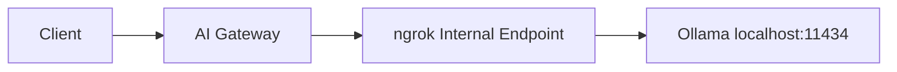

[Ollama](https://ollama.ai) is a popular tool for running open-source large language models locally. This guide shows you how to connect Ollama to the ngrok AI Gateway, enabling you to use local models through the OpenAI SDK with automatic failover to cloud providers.

## Prerequisites

- [ngrok account](https://dashboard.ngrok.com/signup) with AI Gateway access
- [Ollama](https://ollama.ai/download) installed locally
- [ngrok agent](https://download.ngrok.com) installed

## Overview

Since Ollama runs locally on HTTP, you'll expose it through an ngrok internal endpoint, then configure the AI Gateway to route requests to it.



## Getting started

<Steps>
  <Step title="Start Ollama">
    Start the Ollama server:

    ```bash
    ollama serve
    ```

    Pull a model if you haven't already:

    ```bash
    ollama pull llama3.2
    ```

    Verify Ollama is running:

    ```bash
    curl http://localhost:11434/api/tags
    ```
  </Step>

  <Step title="Expose Ollama with ngrok">
    Use the [ngrok agent](/agent/) to create an internal endpoint:

    ```bash
    ngrok http 11434 --url https://ollama.internal
    ```

    <Note>
    Internal endpoints (`.internal` domains) are private to your ngrok account. They're not accessible from the public internet.
    </Note>
  </Step>

  <Step title="Configure the AI Gateway">
    Create a traffic policy with Ollama as a provider:

    ```yaml title="policy.yaml"
    on_http_request:
      - type: ai-gateway
        config:
          providers:
            - id: "ollama"
              base_url: "https://ollama.internal"
              models:
                - id: "llama3.2"
                - id: "llama3.2:1b"
                - id: "mistral"
                - id: "codellama"
    ```

    <Tip>
    Ollama doesn't require API keys, so you can omit the `api_keys` field entirely.
    </Tip>
  </Step>

  <Step title="Use with OpenAI SDK">
    Point any OpenAI-compatible SDK at your AI Gateway:

    <CodeGroup>
    ```python Python
    from openai import OpenAI

    client = OpenAI(
        base_url="https://your-ai-subdomain.ngrok.app/v1",
        api_key="unused"  # Ollama doesn't need a key
    )

    response = client.chat.completions.create(
        model="ollama:llama3.2",  # Prefix with provider ID
        messages=[{"role": "user", "content": "Hello!"}]
    )

    print(response.choices[0].message.content)
    ```

    ```typescript TypeScript
    import OpenAI from "openai";

    const client = new OpenAI({
      baseURL: "https://your-ai-subdomain.ngrok.app/v1",
      apiKey: "unused"  // Ollama doesn't need a key
    });

    const response = await client.chat.completions.create({
      model: "ollama:llama3.2",  // Prefix with provider ID
      messages: [{ role: "user", content: "Hello!" }]
    });

    console.log(response.choices[0].message.content);
    ```

    ```bash cURL
    curl https://your-ai-subdomain.ngrok.app/v1/chat/completions \
      -H "Content-Type: application/json" \
      -d '{
        "model": "ollama:llama3.2",
        "messages": [{"role": "user", "content": "Hello!"}]
      }'
    ```
    </CodeGroup>
  </Step>
</Steps>

## Advanced configuration

### Restrict to Ollama only

Block requests to cloud providers and only allow Ollama:

```yaml title="policy.yaml" highlight={4-5}
on_http_request:
  - type: ai-gateway
    config:
      only_allow_configured_providers: true
      only_allow_configured_models: true
      providers:
        - id: "ollama"
          base_url: "https://ollama.internal"
          models:
            - id: "llama3.2"
            - id: "mistral"
```

### Failover to cloud provider

Use Ollama as primary with automatic failover to OpenAI:

```yaml title="policy.yaml" highlight={14-17}
on_http_request:
  - type: ai-gateway
    config:
      providers:
        - id: "ollama"
          base_url: "https://ollama.internal"
          models:
            - id: "llama3.2"
        
        - id: "openai"
          api_keys:
            - value: ${secrets.get('openai', 'api-key')}
      
      model_selection:
        strategy:
          - "ai.models.filter(m, m.provider_id == 'ollama')"
          - "ai.models.filter(m, m.provider_id == 'openai')"
```

<Note>
The first strategy that returns models wins. If Ollama has matching models, only those are tried. OpenAI is only used if no Ollama models match. For cross-provider failover when requests fail, have clients specify multiple models: `models: ["ollama:llama3.2", "openai:gpt-4o"]`.
</Note>

### Increase timeouts

Local models can be slower, especially on first load. Increase timeouts as needed:

```yaml title="policy.yaml" highlight={4-5}
on_http_request:
  - type: ai-gateway
    config:
      per_request_timeout: "120s"
      total_timeout: "5m"
      providers:
        - id: "ollama"
          base_url: "https://ollama.internal"
          models:
            - id: "llama3.2"
```

### Multiple Ollama instances

Load balance across multiple machines:

```yaml title="policy.yaml" highlight={16-17}
on_http_request:
  - type: ai-gateway
    config:
      only_allow_configured_providers: true
      providers:
        - id: "ollama-gpu-1"
          base_url: "https://ollama-gpu-1.internal"
          models:
            - id: "llama3.2"
        
        - id: "ollama-gpu-2"
          base_url: "https://ollama-gpu-2.internal"
          models:
            - id: "llama3.2"
      
      model_selection:
        strategy:
          # Randomize across configured Ollama instances
          - "ai.models.filter(m, m.provider_id in ['ollama-gpu-1', 'ollama-gpu-2']).random()"
```

### Add model metadata

Track model details with metadata:

```yaml title="policy.yaml" highlight={7-9,12-14}
on_http_request:
  - type: ai-gateway
    config:
      providers:
        - id: "ollama"
          base_url: "https://ollama.internal"
          metadata:
            location: "local"
            hardware: "RTX 4090"
          models:
            - id: "llama3.2"
              metadata:
                parameters: "8B"
                quantization: "Q4_K_M"
            - id: "llama3.2:70b"
              metadata:
                parameters: "70B"
                quantization: "Q4_K_M"
```

## Troubleshooting

### Connection refused

**Symptom**: Requests fail with connection errors.

**Solutions**:
1. Verify Ollama is running: `curl http://localhost:11434/api/tags`
2. Verify ngrok tunnel is running: Check for `https://ollama.internal` in your [ngrok dashboard](https://dashboard.ngrok.com)
3. Ensure the internal endpoint URL matches your config

### Model not found

**Symptom**: Error saying model doesn't exist.

**Solutions**:
1. List available models: `ollama list`
2. Pull the model: `ollama pull llama3.2`
3. Verify the model ID matches exactly (including tags like `:1b`)

### Slow first response

**Symptom**: First request takes a very long time.

**Cause**: Ollama loads models into memory on first use.

**Solutions**:
1. Increase `per_request_timeout` to allow for model loading
2. Pre-warm the model: `curl http://localhost:11434/api/generate -d '{"model":"llama3.2","prompt":""}'`
3. Keep the model loaded by sending periodic requests

### Out of memory

**Symptom**: Ollama crashes or returns errors for large models.

**Solutions**:
1. Use a smaller model or quantized version (for example, `llama3.2:1b`)
2. Increase system RAM or use a machine with more VRAM
3. Set `OLLAMA_NUM_PARALLEL=1` to limit concurrent requests

## Next steps

- [Custom Providers](/ai-gateway/custom-providers) - Learn about URL requirements and configuration options
- [Model Selection Strategies](/ai-gateway/guides/model-selection-strategies) - Route requests intelligently
- [Multi-Provider Failover](/ai-gateway/examples/multi-provider-failover) - Advanced failover patterns

