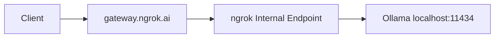

[Ollama](https://ollama.ai) runs open-source large language models locally. This guide shows you how to connect Ollama to the ngrok AI Gateway as a [custom provider](/ai-gateway/concepts/custom-providers).

## What you'll need

- [ngrok account](https://app.ngrok.ai) with AI Gateway access
- [Ollama](https://ollama.ai/download) installed locally
- [ngrok agent](https://download.ngrok.com) installed
- An [access key](/ai-gateway/concepts/access-keys) from [app.ngrok.ai](https://app.ngrok.ai)

## Overview

Ollama runs on HTTP locally. Expose it with an ngrok internal endpoint, register the endpoint as a custom provider, then route traffic through the gateway.


```mermaid
graph LR
    A[Client] --> B[gateway.ngrok.ai]
    B --> C[ngrok Internal Endpoint]
    C --> D[Ollama localhost:11434]
```

## Getting started

<Steps>
  <Step title="Start Ollama">
    Start the Ollama server:

    ```bash
    ollama serve
    ```

    Pull a model if you haven't already:

    ```bash
    ollama pull llama3.2
    ```

    Verify Ollama is running:

    ```bash
    curl http://localhost:11434/api/tags
    ```
  </Step>

  <Step title="Expose Ollama with ngrok">
    Create an [internal endpoint](/ai-gateway/guides/use-a-model-you-run-yourself#connect-a-local-model-with-an-internal-endpoint) with the [ngrok agent](/agent/):

    ```bash
    ngrok http 11434 --url https://ollama.internal
    ```

    <Note>
    Internal endpoints (`.internal` domains) are private to your ngrok account, meaning they're not reachable from the public internet. Use the same ngrok account here and in the AI Gateway, otherwise the gateway can't reach the endpoint.
    </Note>
  </Step>

  <Step title="Create the custom provider">
    See [Create a custom provider](/ai-gateway/guides/use-a-model-you-run-yourself#create-a-custom-provider). Use provider ID `ollama`, base URL `https://ollama.internal`, and your model IDs (for example `llama3.2`).

    <Tip>
    Ollama doesn't require upstream authentication, so you can skip provider keys.
    </Tip>
  </Step>

  <Step title="Configure access">
    Create an [access key configuration](/ai-gateway/guides/access-key-configurations) that allows your `ollama` provider, then assign it to your access key. See the [Quickstart](/ai-gateway/quickstart) if you haven't created an access key yet.
  </Step>

  <Step title="Send requests">
    Point any OpenAI-compatible SDK at the gateway using your access key:

    <CodeGroup>
    ```python Python
    from openai import OpenAI

    client = OpenAI(
        base_url="https://gateway.ngrok.ai/v1",
        api_key="ng-xxxxx-g1-xxxxx"
    )

    response = client.chat.completions.create(
        model="ollama:llama3.2",
        messages=[{"role": "user", "content": "Hello!"}]
    )

    print(response.choices[0].message.content)
    ```

    ```typescript TypeScript
    import OpenAI from "openai";

    const client = new OpenAI({
      baseURL: "https://gateway.ngrok.ai/v1",
      apiKey: "ng-xxxxx-g1-xxxxx"
    });

    const response = await client.chat.completions.create({
      model: "ollama:llama3.2",
      messages: [{ role: "user", content: "Hello!" }]
    });

    console.log(response.choices[0].message.content);
    ```

    ```bash cURL
    curl https://gateway.ngrok.ai/v1/chat/completions \
      -H "Content-Type: application/json" \
      -H "Authorization: Bearer ng-xxxxx-g1-xxxxx" \
      -d '{
        "model": "ollama:llama3.2",
        "messages": [{"role": "user", "content": "Hello!"}]
      }'
    ```
    </CodeGroup>
  </Step>
</Steps>

## Tips

- **Slow first response**: Ollama loads models into memory on first use. Increase `perRequestTimeout` in [account settings](/ai-gateway/guides/account-settings) if requests time out during warm-up.
- **Multiple instances**: Create separate custom providers (for example `ollama-gpu-1`, `ollama-gpu-2`) with different internal endpoints. Pin a request with `ollama-gpu-1:llama3.2` or list multiple models for failover.
- **Cloud fallback**: Add a built-in provider to your access key configuration and request `models: ["ollama:llama3.2", "openai:gpt-4o"]` for cross-provider failover. See [Multi-provider failover](/ai-gateway/examples/multi-provider-failover).

## Troubleshooting

| Symptom | Fix |
|---------|-----|
| Connection refused | Confirm Ollama is running (`curl http://localhost:11434/api/tags`) and the ngrok tunnel is active |
| Model not found | Run `ollama list`, pull the model, and match the model ID exactly (including tags like `:1b`) |
| Out of memory | Use a smaller or quantized model, or set `OLLAMA_NUM_PARALLEL=1` |

## Next steps

- [Use a model you run yourself](/ai-gateway/guides/use-a-model-you-run-yourself): URL requirements and local networking
- [Access Key Configurations](/ai-gateway/guides/access-key-configurations): Scope providers per key
- [Quickstart](/ai-gateway/quickstart): Create your first access key
