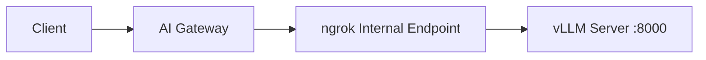

[vLLM](https://github.com/vllm-project/vllm) is a high-performance inference engine for large language models. It provides an OpenAI-compatible API server out of the box, making it easy to integrate with the ngrok AI Gateway.

## Prerequisites

- [ngrok account](https://dashboard.ngrok.com/signup) with AI Gateway access
- [vLLM](https://docs.vllm.ai/en/latest/getting_started/installation.html) installed
- [ngrok agent](https://download.ngrok.com) installed
- GPU with sufficient VRAM for your chosen model

## Overview

vLLM runs an OpenAI-compatible server that the AI Gateway can route to directly.



## Getting started

<Steps>
  <Step title="Start vLLM">
    Start the vLLM OpenAI-compatible server:

    ```bash
    vllm serve meta-llama/Llama-3.2-8B-Instruct
    ```

    Verify it's running:

    ```bash
    curl http://localhost:8000/v1/models
    ```

</Step>

  <Step title="Expose with ngrok">
    Use the [ngrok agent](/agent/) to create an internal endpoint:

    ```bash
    ngrok http 8000 --url https://vllm.internal
    ```

</Step>

  <Step title="Configure the AI Gateway">
    Create a Traffic Policy with vLLM as a provider:

    ```yaml title="policy.yaml" highlight={5-9}
    on_http_request:
  - type: ai-gateway
        config:
          providers:
  - id: "vllm"
              base_url: "https://vllm.internal"
              models:
  - id: "meta-llama/Llama-3.2-8B-Instruct"
    ```

</Step>

  <Step title="Use with OpenAI SDK">
    Point any OpenAI-compatible SDK at your AI Gateway:

    <CodeGroup>
    ```python Python highlight={4,8}
    from openai import OpenAI

    client = OpenAI(
        base_url="https://your-ai-gateway.ngrok.app/v1",
        api_key="unused"
    )

    response = client.chat.completions.create(
        model="vllm:meta-llama/Llama-3.2-8B-Instruct",
        messages=[{"role": "user", "content": "Hello!"}]
    )

    print(response.choices[0].message.content)
    ```

    ```typescript TypeScript highlight={4,8}
    import OpenAI from "openai";

    const client = new OpenAI({
      baseURL: "https://your-ai-gateway.ngrok.app/v1",
      apiKey: "unused"
    });

    const response = await client.chat.completions.create({
      model: "vllm:meta-llama/Llama-3.2-8B-Instruct",
      messages: [{ role: "user", content: "Hello!" }]
    });

    console.log(response.choices[0].message.content);
    ```
</CodeGroup>

</Step>
</Steps>

## Best practices

### Require provider API key authentication

Secure your vLLM server with an API key:

```bash
vllm serve meta-llama/Llama-3.2-8B-Instruct --api-key your-secret-key
```

Store the key in [ngrok secrets](/traffic-policy/secrets):

```bash
ngrok api secrets create \
  --name vllm \
  --secret-data '{"api-key": "your-secret-key"}'
```

Then reference it in your AI Gateway config:

```yaml title="policy.yaml" highlight={7-8}
on_http_request:
  - type: ai-gateway
    config:
      providers:
        - id: "vllm"
          base_url: "https://vllm.internal"
          api_keys:
            - value: ${secrets.get('vllm', 'api-key')}
          models:
            - id: "meta-llama/Llama-3.2-8B-Instruct"
```

<Tip>  You can also create secrets in the [ngrok Dashboard](https://dashboard.ngrok.com/vaults).
</Tip>

### Configure timeouts

Large models can be slow.
Increase timeouts for production:

```yaml title="policy.yaml" highlight={4-5}
on_http_request:
  - type: ai-gateway
    config:
      per_request_timeout: "180s"
      total_timeout: "10m"
      providers:
        - id: "vllm"
          base_url: "https://vllm.internal"
          models:
            - id: "meta-llama/Llama-3.2-8B-Instruct"
```

### Hugging face authentication

For gated models, set your HF token before starting vLLM:

```bash
export HF_TOKEN=your_huggingface_token
vllm serve meta-llama/Llama-3.2-8B-Instruct
```

## Advanced configuration

### vLLM server options

Common `vllm serve` flags:

```bash
# Custom host and port
vllm serve model --host 0.0.0.0 --port 8080

# Limit GPU memory (useful for smaller GPUs)
vllm serve model --gpu-memory-utilization 0.9

# Multi-GPU with tensor parallelism
vllm serve model --tensor-parallel-size 2

# Enable async scheduling for better throughput
vllm serve model --async-scheduling
```

<Note>  See the [vLLM serve CLI reference](https://docs.vllm.ai/en/latest/cli/serve/) for all available options.
</Note>

### Multiple models

Run separate vLLM instances for different models:

```yaml title="policy.yaml" highlight={5-13}
on_http_request:
  - type: ai-gateway
    config:
      providers:
        - id: "vllm-llama"
          base_url: "https://vllm-llama.internal"
          models:
            - id: "meta-llama/Llama-3.2-8B-Instruct"

        - id: "vllm-mistral"
          base_url: "https://vllm-mistral.internal"
          models:
            - id: "mistralai/Mistral-7B-Instruct-v0.3"
```

### Failover to cloud

Use vLLM as primary with automatic cloud fallback:

```yaml title="policy.yaml" highlight={15-18}
on_http_request:
  - type: ai-gateway
    config:
      providers:
        - id: "vllm"
          base_url: "https://vllm.internal"
          models:
            - id: "meta-llama/Llama-3.2-8B-Instruct"

        - id: "openai"
          api_keys:
            - value: ${secrets.get('openai', 'api-key')}

      model_selection:
        strategy:
          - "ai.models.filter(m, m.provider_id == 'vllm')"
          - "ai.models"
```

### Model metadata

Add metadata for routing decisions:

```yaml title="policy.yaml" highlight={7-9,12-14}
on_http_request:
  - type: ai-gateway
    config:
      providers:
        - id: "vllm"
          base_url: "https://vllm.internal"
          metadata:
            hardware: "A100-80GB"
            location: "us-east"
          models:
            - id: "meta-llama/Llama-3.2-8B-Instruct"
              metadata:
                parameters: "8B"
                context_length: 128000
```

## Troubleshooting

### Model loading errors

**Symptom**: vLLM fails to start or crashes.

**Solutions**:

1. Check GPU memory: `nvidia-smi`
2. Use a smaller model or quantized version
3. Reduce memory usage: `--gpu-memory-utilization 0.9`

### Slow responses

**Symptom**: Requests take longer than expected.

**Solutions**:

1. Use tensor parallelism for multi-GPU: `--tensor-parallel-size 2`
2. Enable async scheduling: `--async-scheduling`
3. Adjust `--max-num-seqs` for your workload

### Connection timeouts

**Symptom**: Gateway times out waiting for response.

**Solutions**:

1. Increase `per_request_timeout` in gateway config
2. Check vLLM health: `curl http://localhost:8000/health`
3. Verify ngrok tunnel is running

## Next steps

- [Custom Providers](/ai-gateway/custom-providers) - URL requirements and configuration
- [Model Selection Strategies](/ai-gateway/guides/model-selection-strategies) - Intelligent routing
- [Multi-Provider Failover](/ai-gateway/examples/multi-provider-failover) - Failover patterns
