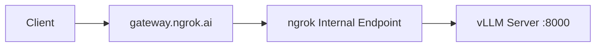

[vLLM](https://github.com/vllm-project/vllm) is a high-performance inference engine with an OpenAI-compatible API. Connect your vLLM server to the AI Gateway as a [custom provider](/ai-gateway/concepts/custom-providers).

## What you'll need

- [ngrok account](https://app.ngrok.ai) with AI Gateway access
- [vLLM](https://docs.vllm.ai/en/latest/getting_started/installation.html) installed
- [ngrok agent](https://download.ngrok.com) installed
- GPU with sufficient VRAM for your chosen model
- An [access key](/ai-gateway/concepts/access-keys) from [app.ngrok.ai](https://app.ngrok.ai)

## Overview

vLLM provides an OpenAI-compatible server that you can expose with an ngrok internal endpoint (or use a public HTTPS URL), register as a custom provider, and attach credentials through an access key configuration.


```mermaid
graph LR
    A[Client] --> B[gateway.ngrok.ai]
    B --> C[ngrok Internal Endpoint]
    C --> D[vLLM Server :8000]
```

## Getting started

<Steps>
  <Step title="Start vLLM">
    Start the OpenAI-compatible server:

    ```bash
    vllm serve meta-llama/Llama-3.2-8B-Instruct
    ```

    Verify it's running:

    ```bash
    curl http://localhost:8000/v1/models
    ```
  </Step>

  <Step title="Expose with ngrok">
    Create an [internal endpoint](/ai-gateway/guides/use-a-model-you-run-yourself#connect-a-local-model-with-an-internal-endpoint):

    ```bash
    ngrok http 8000 --url https://vllm.internal
    ```

    If vLLM already has a public HTTPS endpoint, skip this step and use that URL as the provider base URL instead.
  </Step>

  <Step title="Create the custom provider">
    See [Create a custom provider](/ai-gateway/guides/use-a-model-you-run-yourself#create-a-custom-provider). Use provider ID `vllm`, base URL `https://vllm.internal`, API format **OpenAI Chat Completions**, and your model IDs.
  </Step>

  <Step title="Store a provider key (if required)">
    If your vLLM server requires an API key (`vllm serve model --api-key your-secret-key`), [add a provider key](/ai-gateway/guides/attaching-provider-keys#add-a-provider-key).
  </Step>

  <Step title="Configure access">
    Create an [access key configuration](/ai-gateway/guides/access-key-configurations) that:

    1. Allows the `vllm` provider in the access scope
    2. Adds a routing rule with **Bring your own API key** if the server requires authentication

    Assign the configuration to your access key.
  </Step>

  <Step title="Send requests">
    <CodeGroup>
    ```python Python
    from openai import OpenAI

    client = OpenAI(
        base_url="https://gateway.ngrok.ai/v1",
        api_key="ng-xxxxx-g1-xxxxx"
    )

    response = client.chat.completions.create(
        model="vllm:meta-llama/Llama-3.2-8B-Instruct",
        messages=[{"role": "user", "content": "Hello!"}]
    )

    print(response.choices[0].message.content)
    ```

    ```typescript TypeScript
    import OpenAI from "openai";

    const client = new OpenAI({
      baseURL: "https://gateway.ngrok.ai/v1",
      apiKey: "ng-xxxxx-g1-xxxxx"
    });

    const response = await client.chat.completions.create({
      model: "vllm:meta-llama/Llama-3.2-8B-Instruct",
      messages: [{ role: "user", content: "Hello!" }]
    });

    console.log(response.choices[0].message.content);
    ```
    </CodeGroup>
  </Step>
</Steps>

## Tips

- **Secure vLLM**: Run with `--api-key` and attach the key through an [access key configuration](/ai-gateway/guides/access-key-configurations). The AI Gateway adds it to upstream requests server-side.
- **Gated models**: Set `HF_TOKEN` before starting vLLM for Hugging Face gated models.
- **Timeouts**: Large models can be slow. Increase `perRequestTimeout` and `totalTimeout` in [account settings](/ai-gateway/guides/account-settings).
- **Multiple models**: Run separate vLLM instances with different internal endpoints and register each as its own custom provider.

## Troubleshooting

| Symptom | Fix |
|---------|-----|
| Model loading errors | Check GPU memory with `nvidia-smi`; try `--gpu-memory-utilization 0.9` or a smaller model |
| Connection timeouts | Verify the ngrok tunnel and vLLM health (`curl http://localhost:8000/health`); increase gateway timeouts |
| 401 unauthorized | Confirm the provider key in app.ngrok.ai matches your vLLM `--api-key` and is attached in the access key configuration |

## Next steps

- [Use a model you run yourself](/ai-gateway/guides/use-a-model-you-run-yourself): URL requirements and configuration
- [Provider Keys](/ai-gateway/guides/attaching-provider-keys): Store upstream credentials
- [Quickstart](/ai-gateway/quickstart): Create your first access key
