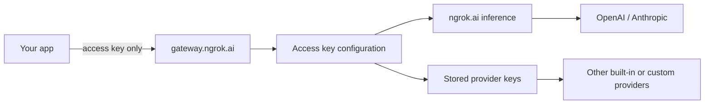

Every request to `https://gateway.ngrok.ai` must include an [access key](/ai-gateway/concepts/access-keys). Upstream provider credentials are managed in [app.ngrok.ai](https://app.ngrok.ai) and injected server-side based on the access key's **configuration**—see [Access keys vs provider keys](/ai-gateway/concepts/access-keys#access-keys-vs-provider-keys).

Access key configurations control:

- **Access scope**: which providers and models the key may call
- **Routing rules**: whether to use ngrok.ai inference or your stored [provider keys](/ai-gateway/guides/attaching-provider-keys) for each provider

See [Create a configuration](#create-a-configuration) below, or the [Access Key Configurations API](/ai-gateway/api-reference/access-key-configurations/create).

## How it fits together



1. Your app sends an **access key** with each request.
2. The gateway loads the configuration linked to that key (or default rules if none is linked).
3. The AI Gateway selects upstream credentials from the configuration's routing rules.

## Default behavior

An access key with **no configuration** (allow-all scope) can reach any provider and model your account supports. For built-in **OpenAI** and **Anthropic**, ngrok.ai inference is used automatically when you have [credits](/ai-gateway/concepts/credits).

To use your own provider accounts, restrict scope, or control failover, create a configuration and assign it to the key.

## Create a configuration

### Via the ngrok dashboard

1. Open [app.ngrok.ai](https://app.ngrok.ai) → **Keys** → **Configurations**.
2. Click **New configuration**.
3. Set a name and optional description.
4. Under **Access**, allow only the providers and models this key should use.
5. Under **Routing**, add a rule per provider:
   - **ngrok**: ngrok.ai inference supplies the credentials (built-in OpenAI and Anthropic only)
   - **Bring your own API key**: attach one or more stored provider keys (tried in order)
6. Save the configuration.
7. On **Keys**, edit an access key and assign the configuration.

### Via the AI Gateway API

Create configurations with the [Access Key Configurations API](/ai-gateway/api-reference/access-key-configurations/create). Authorize the request with your [AI Gateway API key](/ai-gateway/concepts/access-keys#credentials-overview).

```bash
curl -X POST https://api.ngrok.ai/access-key-configurations \
  -H "Authorization: Bearer $AI_GATEWAY_API_KEY" \
  -H "Content-Type: application/json" \
  -d '{
    "name": "Production OpenAI BYOK",
    "access": {
      "providers": { "allow": ["openai"] },
      "models": { "allow": ["openai/gpt-4o"] }
    },
    "router": {
      "rules": [
        {
          "provider": "openai",
          "steps": [
            {
              "type": "user",
              "keySelectionStrategy": "ordered",
              "keys": [{ "id": "aigpk_xxxxx" }]
            }
          ]
        }
      ]
    }
  }'
```

Link the configuration when creating or updating an access key:

```bash
curl -X PATCH https://api.ngrok.ai/access-keys/aigk_xxxxx \
  -H "Authorization: Bearer $AI_GATEWAY_API_KEY" \
  -H "Content-Type: application/json" \
  -d '{ "accessKeyConfigurationId": "aigac_xxxxx" }'
```

See the [Access Key Configurations API reference](/ai-gateway/api-reference/access-key-configurations/create) and [Access Keys API](/ai-gateway/api-reference/access-keys/update).

## Routing rules

Each routing rule targets a **provider** or **model** and defines an ordered list of steps:

| Step type | Meaning |
|-----------|---------|
| `ngrok` | Use ngrok.ai inference (built-in OpenAI and Anthropic only) |
| `user` | Use attached provider keys, tried in list order |

For built-in providers, you can use ngrok.ai inference, bring your own key, or list ngrok first with provider keys as fallback in later steps.

Custom providers require a `user` step with at least one provider key when the upstream requires authentication.

## Multi-key failover

Attach multiple provider keys to the same routing rule step. The gateway tries them in order when a key hits a rate limit or auth error. See [Multi-key failover](/ai-gateway/guides/key-selection-failover).

## Restrict providers and models

Use the **access** block to limit what an access key can call:

```json
{
  "access": {
    "providers": { "allow": ["openai", "anthropic"] },
    "models": { "allow": ["openai/gpt-4o", "anthropic/claude-sonnet-4-6"] }
  }
}
```

Omit `access` entirely for allow-all scope. An empty `allow` array blocks all traffic on that dimension.

## Next steps

- [Access Keys](/ai-gateway/concepts/access-keys): Create keys and assign configurations
- [Bring your own provider key](/ai-gateway/guides/attaching-provider-keys): Store upstream credentials
- [Restrict providers and models](/ai-gateway/guides/restrict-providers-and-models): Limit what a key can call
- [Choose a model](/ai-gateway/guides/model-selection-strategies): Choose models in requests
- [Securing Your Gateway](/ai-gateway/guides/securing-endpoints): Per-client keys and revocation
