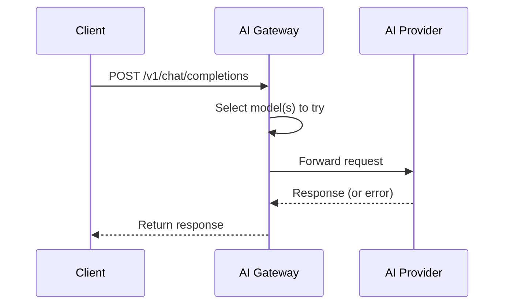
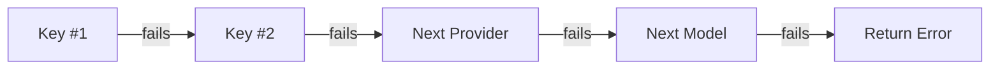

## Request flow

When you send a request to your AI Gateway endpoint:



1. **Your app sends a request** to your ngrok endpoint
2. **The gateway selects which models to try** based on your configuration
3. **The request is forwarded** to the provider with the appropriate provider API key
4. **If it fails, the gateway retries** with the next model or key in the list
5. **The response is returned** to your app

## Model selection

The gateway needs to determine which model and provider to use for each request. This happens in two stages: resolving what the client asked for, then selecting from available options.

### Resolving the client's request

The model name in your request determines the starting point:

| Model in Request | What Happens |
|------------------|--------------|
| `gpt-4o` | Recognized as OpenAI from the [model catalog](/ai-gateway/reference/model-catalog) |
| `claude-3-5-sonnet-latest` | Recognized as Anthropic |
| `openai:gpt-4o` | Explicit provider prefix - no lookup needed |
| `openai:gpt-5-preview` | Unknown model - passed through to OpenAI as-is |
| `my-provider:my-model` | Uses your configured custom provider |
| `ngrok/auto` | Let the gateway choose based on your selection strategy |

<Note>
Unknown models (not in the catalog) are automatically passed through if you include a provider prefix. This lets you use new models immediately without waiting for catalog updates.
</Note>

### Default selection

By default, the gateway uses the model and provider you requested. If that fails, it tries:
1. Other provider API keys for the same provider
2. Other providers that offer the same model

### Custom selection strategies

You can completely customize how models are selected using CEL expressions. Define a `model_selection` strategy to control the order models are tried:

```yaml title="traffic-policy.yaml" highlight={5-10}
on_http_request:
  - type: ai-gateway
    config:
      providers:
        - id: openai
          api_keys:
            - value: ${secrets.get('openai', 'api-key')}
        - id: ollama
          base_url: "https://ollama.internal"
      model_selection:
        strategy:
          - "ai.models.filter(m, m.provider_id == 'ollama')"
          - "ai.models.sortBy(m, m.pricing.input)"
```

Strategies are evaluated in order—the first one that returns models wins. If Ollama has matching models, only those are tried. The second strategy (sorted by price) is only used if no Ollama models match.

This lets you define sophisticated routing logic:

- **Cost optimization** - Route to cheapest models first
- **Provider preference** - Prefer certain providers over others
- **Load balancing** - Randomize across equivalent models
- **Capability filtering** - Select models with specific features

<Tip>
Use `ngrok/auto` as the model name to let your selection strategy choose entirely. See [Model Selection Strategies](/ai-gateway/guides/model-selection-strategies) for detailed examples.
</Tip>

## Failover

When a request fails, the gateway automatically tries the next candidate. This happens transparently—your app just sees a successful response (or a final error if all candidates are exhausted).

### What triggers failover?

- **Timeouts** - Provider took too long to respond
- **HTTP errors** - Any non-2xx/3xx response (4xx, 5xx)
- **Connection failures** - Network errors, DNS issues, etc.

The gateway never retries the same model/key combination—it always moves to the next candidate.

### Failover order

The gateway works through your configured options:



For example, if you configure OpenAI with 2 keys and Anthropic as backup:

1. OpenAI with key #1
2. OpenAI with key #2
3. Anthropic

The gateway stops as soon as one succeeds.

## Timeouts

Two settings control how long the gateway waits:

| Setting | Default | Description |
|---------|---------|-------------|
| `per_request_timeout` | 30s | Max time for a single attempt |
| `total_timeout` | 5m | Max time including all failover attempts |

```yaml title="traffic-policy.yaml" highlight={4-5}
on_http_request:
  - type: ai-gateway
    config:
      per_request_timeout: "60s"  # Wait longer for slow models
      total_timeout: "3m"          # Limit total failover time
      providers:
        - id: openai
          api_keys:
            - value: ${secrets.get('openai', 'api-key')}
```

If a single attempt exceeds `per_request_timeout`, the gateway moves to the next option. If total time exceeds `total_timeout`, the gateway returns an error to your app.

## Token counting

The gateway counts tokens for each request, enabling:

- **Usage tracking** - See token usage per provider and model
- **Input limits** - Reject oversized requests before they're sent to providers

```yaml title="traffic-policy.yaml" highlight={4}
on_http_request:
  - type: ai-gateway
    config:
      max_input_tokens: 4000  # Reject requests over 4000 input tokens
      providers:
        - id: openai
          api_keys:
            - value: ${secrets.get('openai', 'api-key')}
```

## Content modification

You can modify requests and responses using Traffic Policy's find and replace actions ([`request-body-find-replace`](/traffic-policy/actions/request-body-find-replace), [`response-body-find-replace`](/traffic-policy/actions/response-body-find-replace), [`sse-find-replace`](/traffic-policy/actions/sse-find-replace)). This enables use cases like:

- **PII redaction** - Remove sensitive data before it reaches AI providers
- **Response sanitization** - Filter inappropriate content from responses
- **Prompt injection** - Add system instructions to user prompts

```yaml title="traffic-policy.yaml" highlight={3-9,19-25}
on_http_request:
  - actions:
      # Redact emails from prompts
      - type: request-body-find-replace
        config:
          replacements:
            - from: "[a-zA-Z0-9._%+-]+@[a-zA-Z0-9.-]+\\.[a-zA-Z]{2,}"
              to: "[EMAIL]"
      - type: ai-gateway
        config:
          providers:
            - id: openai
              api_keys:
                - value: ${secrets.get('openai', 'api-key')}
on_event_stream_message:
  - actions:
      # Redact SSNs from streaming responses
      - type: sse-find-replace
        config:
          replacements:
            - field: data
              from: "\\b\\d{3}-\\d{2}-\\d{4}\\b"
              to: "[SSN]"
```

<CardGroup cols={2}>
  <Card title="Modifying Requests" icon="arrow-right-to-bracket" href="/ai-gateway/guides/modifying-requests">
    Redact PII, inject prompts, add headers
  </Card>
  <Card title="Modifying Responses" icon="arrow-right-from-bracket" href="/ai-gateway/guides/modifying-responses">
    Sanitize responses and streaming content
  </Card>
</CardGroup>

## Next steps

<CardGroup cols={2}>
  <Card title="Configuring Providers" icon="building" href="/ai-gateway/guides/configuring-providers">
    Set up providers and provider API keys
  </Card>
  <Card title="Model Selection Strategies" icon="route" href="/ai-gateway/guides/model-selection-strategies">
    Define custom routing logic
  </Card>
</CardGroup>
