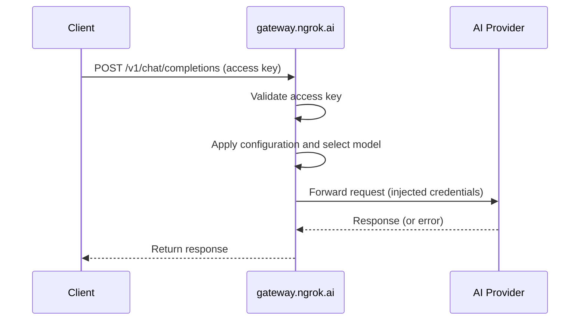

## Request flow

When you send a request to `https://gateway.ngrok.ai`:

```mermaid
sequenceDiagram
    participant Client
    participant Gateway as gateway.ngrok.ai
    participant Provider as AI Provider

    Client->>Gateway: POST /v1/chat/completions (access key)
    Gateway->>Gateway: Validate access key
    Gateway->>Gateway: Apply configuration and select model
    Gateway->>Provider: Forward request (injected credentials)
    Provider-->>Gateway: Response (or error)
    Gateway-->>Client: Return response
```

1. **Your app sends a request** with your [access key](/ai-gateway/concepts/access-keys) to `https://gateway.ngrok.ai`
2. **The gateway validates the key** and loads its [access key configuration](/ai-gateway/guides/access-key-configurations)
3. **The gateway resolves the model** from your request body
4. **Upstream credentials are selected** from the configuration's routing rules—ngrok.ai inference or your stored [provider keys](/ai-gateway/guides/attaching-provider-keys)
5. **Unsupported parameters are stripped** for the chosen model before forwarding
6. **The request is forwarded** to the upstream provider
7. **On failure, the gateway retries** with the next provider key or model candidate
8. **The response is returned** to your app and usage is recorded

Manage keys, configurations, providers, and credits at [app.ngrok.ai](https://app.ngrok.ai). Your apps send traffic to `gateway.ngrok.ai`.

## Authentication

Every request must include a valid **access key**. Send it as `Authorization: Bearer ng-xxxxx-g1-xxxxx` (OpenAI-compatible APIs) or `x-api-key` (Anthropic native API).

Provider keys stay in [app.ngrok.ai](https://app.ngrok.ai). The AI Gateway injects those from your configuration after validating the access key.

## Model selection

The gateway determines which model and provider to use from your request.

| Model in request | What happens |
|------------------|--------------|
| `gpt-4o` | Catalog lookup → OpenAI |
| `openai:gpt-4o` | Explicit OpenAI routing |
| `my-provider:my-model` | A [model you run yourself](/ai-gateway/guides/use-a-model-you-run-yourself) |
| `models` array | Fail over through listed models in order |

To choose model IDs and provider-qualified model names, see [Choose a model](/ai-gateway/guides/model-selection-strategies).

## Access key configurations

Configurations define:

- **Access scope**: allowed providers and models
- **Routing rules**: ngrok.ai inference vs provider keys per provider

An access key without a configuration uses allow-all scope. Built-in OpenAI and Anthropic default to ngrok.ai inference when you have [credits](/ai-gateway/concepts/credits).

## Failover

The gateway retries automatically when upstream requests fail.

### What triggers failover?

- Rate limits (HTTP 429)
- Auth errors from exhausted or invalid provider keys
- Timeouts and server errors (HTTP 5xx)

### Failover order

1. Next provider key in the routing rule (ordered list)
2. Next step in the routing rule (if configured)
3. Next model in the request's `models` array

To attach several provider keys and control the order they're tried, see [Multi-key failover](/ai-gateway/guides/key-selection-failover).

## Timeouts and token limits

Configure account-level limits in [Account Settings](/ai-gateway/guides/account-settings).

| Setting | Default | Description |
|---------|---------|-------------|
| Per-request timeout | 60s | Max time for a single upstream attempt |
| Total timeout | 120s | Max time including all failover attempts |
| Max input tokens | none | Reject requests exceeding estimated input tokens |
| Max output tokens | none | Cap completion length |

## Next steps

<CardGroup cols={2}>
  <Card title="Access Keys" icon="key" href="/ai-gateway/concepts/access-keys">
    Create keys to authenticate requests
  </Card>
  <Card title="Access Key Configurations" icon="sliders" href="/ai-gateway/guides/access-key-configurations">
    Scope and route traffic per key
  </Card>
  <Card title="Choose a model" icon="route" href="/ai-gateway/guides/model-selection-strategies">
    Model IDs, provider prefixes, and custom provider models
  </Card>
  <Card title="Error Handling" icon="triangle-exclamation" href="/ai-gateway/guides/error-handling">
    How the gateway handles failures
  </Card>
</CardGroup>
