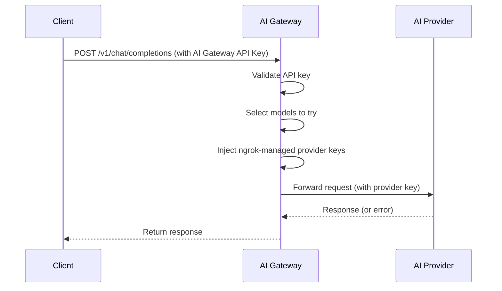
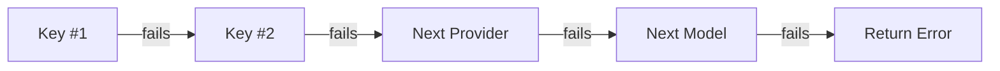

## Request flow

When you send a request to your AI Gateway endpoint:


```mermaid
sequenceDiagram
    participant Client
    participant Gateway as AI Gateway
    participant Provider as AI Provider

    Client->>Gateway: POST /v1/chat/completions (with AI Gateway API Key)
    Gateway->>Gateway: Validate API key
    Gateway->>Gateway: Select models to try
    Gateway->>Gateway: Inject ngrok-managed provider keys
    Gateway->>Provider: Forward request (with provider key)
    Provider-->>Gateway: Response (or error)
    Gateway-->>Client: Return response
```

1. **Your app sends a request** with your [AI Gateway API Key](/ai-gateway/concepts/api-keys) to your ngrok endpoint
2. **The gateway validates your key** and injects ngrok's managed provider keys
3. **The gateway selects which models to try** based on your configuration and the request
4. **The request is forwarded** to the provider with the appropriate provider API key
5. **If it fails, the gateway retries** with the next model or key in the list
6. **The response is returned** to your app

## Authentication

The gateway supports two authentication paths:

### AI Gateway API Keys (recommended)

When you use an [AI Gateway API Key](/ai-gateway/concepts/api-keys), ngrok handles provider authentication automatically:

1. Your app sends a request with the AI Gateway API Key as `Authorization: Bearer ng-xxxxx-g1-xxxxx`
2. The gateway validates the key
3. ngrok's managed provider keys are injected for supported providers (currently OpenAI and Anthropic)
4. The request is forwarded to the provider

No Traffic Policy configuration is needed—authentication is built-in.

### Bring Your Own Keys (BYOK)

When you [bring your own provider keys](/ai-gateway/bring-your-own-keys/overview), you configure them in your Traffic Policy:

```yaml
providers:
  - id: openai
    api_keys:
      - value: ${secrets.get('openai', 'key')}
```

Or in passthrough mode (no provider config), the gateway forwards whatever key your SDK sends.

## Model selection

The gateway needs to determine which model and provider to use for each request. This happens in two stages: resolving what the client asked for, then selecting from available options.

### Resolving the client's request

The model name in your request determines the starting point:

| Model in Request | What Happens |
|------------------|--------------|
| `gpt-4o` | Known OpenAI model in the [model catalog](/ai-gateway/reference/model-catalog) |
| `claude-3-5-sonnet-latest` | Known Anthropic model in the model catalog |
| `openai:gpt-4o` | Provider and model match known OpenAI model |
| `openai:gpt-5-preview` | Known provider but unknown model, so passed through to OpenAI as-is |
| `my-provider:my-model` | Uses your configured custom provider |
| `ngrok/auto` | Let the gateway choose based on your selection strategy |

<Note>
Unknown models (not in the catalog) are automatically passed through if you include a known provider prefix. This lets you use new models immediately without waiting for catalog updates.
</Note>

### Building the set of available options

The gateway builds a set of available options based on your configuration and the request path.

Starting from the model catalog, the gateway adds any custom models from your configuration to the set of available options.  

Then the gateway uses the request path to determine the API format and filters out providers that don't support it. For example, if the request path is `/v1/chat/completions`, only providers that support the OpenAI API format are included; likewise for `/v1/messages` and providers that support the Anthropic Claude API format.

### Custom selection strategies

You can completely customize how models are selected using CEL expressions. Define a `model_selection` strategy to control the order models are tried:

<Note>
The example below uses BYOK provider keys. When using [AI Gateway API Keys](/ai-gateway/concepts/api-keys), provider keys are handled automatically.
</Note>

```yaml title="traffic-policy.yaml" highlight={10-13}
on_http_request:
  - type: ai-gateway
    config:
      providers:
        - id: openai
          api_keys:
            - value: ${secrets.get('openai', 'api-key')}
        - id: ollama
          base_url: "https://ollama.internal"
      model_selection:
        strategy:
          - "ai.models.filter(m, m.provider_id == 'ollama')"
          - "ai.models.sortBy(m, m.pricing.input)"
```

Strategies are evaluated in order—the first one that returns models wins. If Ollama has matching models, only those are tried. The second strategy (sorted by price) is only used if no Ollama models match.

Common routing patterns:

- **Cost optimization** - Route to cheapest models first
- **Provider preference** - Prefer certain providers over others
- **Load balancing** - Randomize across equivalent models
- **Capability filtering** - Select models with specific features

<Tip>
Use `ngrok/auto` as the model name to let your selection strategy choose entirely. See [Model Selection Strategies](/ai-gateway/guides/model-selection-strategies) for detailed examples.
</Tip>

## Failover

When a request fails, the gateway automatically tries the next candidate. Your app receives a successful response, or a final error if all candidates are exhausted.

### What triggers failover?

- **Timeouts** - Provider took too long to respond
- **HTTP errors** - Any non-2xx/3xx response (4xx, 5xx)
- **Connection failures** - Network errors, DNS issues, etc.

The gateway never retries the same model/key combination—it always moves to the next candidate.

### Failover order

The gateway works through your configured options:


```mermaid
flowchart LR
    A[Key #1] -->|fails| B[Key #2]
    B -->|fails| C[Next Provider]
    C -->|fails| D[Next Model]
    D -->|fails| E[Return Error]
```

For example, if you configure OpenAI with 2 keys and Anthropic as backup:

1. OpenAI with key #1
2. OpenAI with key #2
3. Anthropic

The gateway stops as soon as one succeeds.

## Timeouts

Two settings control how long the gateway waits:

| Setting | Default | Description |
|---------|---------|-------------|
| `per_request_timeout` | 3m | Max time for a single attempt |
| `total_timeout` | 6m | Max time including all failover attempts |

```yaml title="traffic-policy.yaml" highlight={4-5}
on_http_request:
  - type: ai-gateway
    config:
      per_request_timeout: "60s"  # Wait longer for slow models
      total_timeout: "3m"          # Limit total failover time
      providers:
        - id: openai
          api_keys:
            - value: ${secrets.get('openai', 'api-key')}
```

If a single attempt exceeds `per_request_timeout`, the gateway moves to the next option. If total time exceeds `total_timeout`, the gateway returns an error to your app.

## Token counting

The gateway counts tokens for each request, enabling:

- **Usage tracking** - See token usage per provider and model
- **Input limits** - Reject oversized requests before they're sent to providers

```yaml title="traffic-policy.yaml" highlight={4}
on_http_request:
  - type: ai-gateway
    config:
      max_input_tokens: 4000  # Reject requests over 4000 input tokens
      providers:
        - id: openai
          api_keys:
            - value: ${secrets.get('openai', 'api-key')}
```

## Content modification

You can modify requests and responses using Traffic Policy's find and replace actions ([`request-body-find-replace`](/traffic-policy/actions/request-body-find-replace), [`response-body-find-replace`](/traffic-policy/actions/response-body-find-replace), [`sse-find-replace`](/traffic-policy/actions/sse-find-replace)). This enables use cases like:

- **PII redaction** - Remove sensitive data before it reaches AI providers
- **Response sanitization** - Filter inappropriate content from responses
- **Prompt injection** - Add system instructions to user prompts

```yaml title="traffic-policy.yaml" highlight={3-9,19-25}
on_http_request:
  - actions:
      # Redact emails from prompts
      - type: request-body-find-replace
        config:
          replacements:
            - from: "[a-zA-Z0-9._%+-]+@[a-zA-Z0-9.-]+\\.[a-zA-Z]{2,}"
              to: "[EMAIL]"
      - type: ai-gateway
        config:
          providers:
            - id: openai
              api_keys:
                - value: ${secrets.get('openai', 'api-key')}
on_event_stream_message:
  - actions:
      # Redact SSNs from streaming responses
      - type: sse-find-replace
        config:
          replacements:
            - field: data
              from: "\\b\\d{3}-\\d{2}-\\d{4}\\b"
              to: "[SSN]"
```

<CardGroup cols={2}>
  <Card title="Modifying Requests" icon="arrow-right-to-bracket" href="/ai-gateway/guides/modifying-requests">
    Redact PII, inject prompts, add headers
  </Card>
  <Card title="Modifying Responses" icon="arrow-right-from-bracket" href="/ai-gateway/guides/modifying-responses">
    Sanitize responses and streaming content
  </Card>
</CardGroup>

## Next steps

<CardGroup cols={2}>
  <Card title="AI Gateway API Keys" icon="key" href="/ai-gateway/concepts/api-keys">
    Create keys to authenticate requests
  </Card>
  <Card title="Configuring Providers (BYOK)" icon="building" href="/ai-gateway/bring-your-own-keys/overview">
    Set up providers and provider API keys
  </Card>
  <Card title="Model Selection Strategies" icon="route" href="/ai-gateway/guides/model-selection-strategies">
    Define custom routing logic
  </Card>
</CardGroup>
