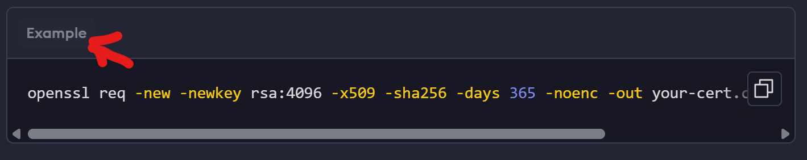

# Internal Contribution Guide

This guide outlines useful info specifically for folks within the ngrok team who want to contribute to the docs.

## Creating code blocks

A standard codeblock will look like this:

````txt
```bash title="file-title"
ngrok http 80
```
````

### Valid properties

The code block can take the following meta properties, which you use by adding them to the same line where you specify the language.

#### `tabName`

Use this to rename the language tab shown in the code block component.

Example:

````txt
```bash tabName="Example"
openssl req -new -newkey rsa:4096 -x509 -sha256 -days 365 -noenc -out your-cert.crt -keyout your-key.key
```
````

Result:

- Before:
	- 

- After:
	- 


