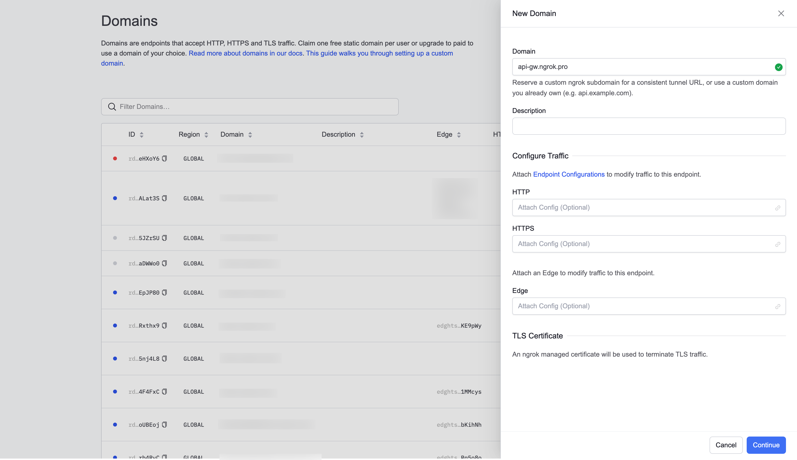
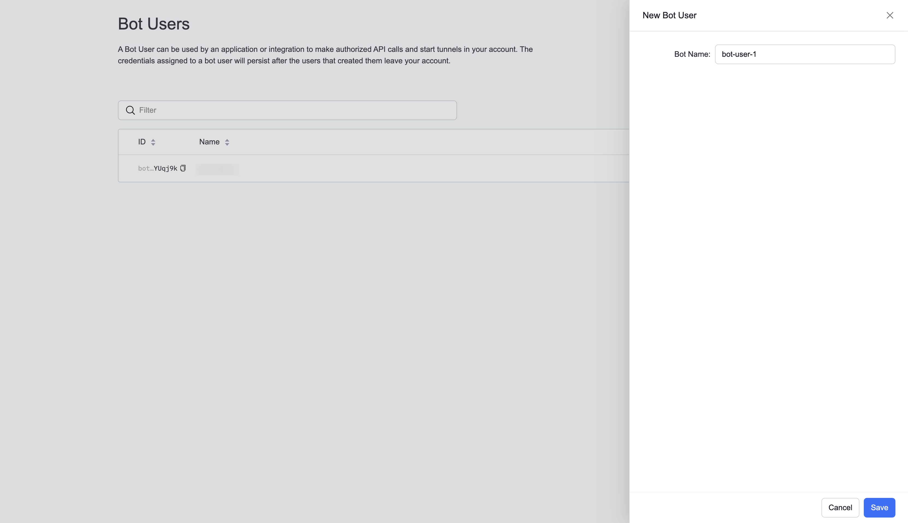
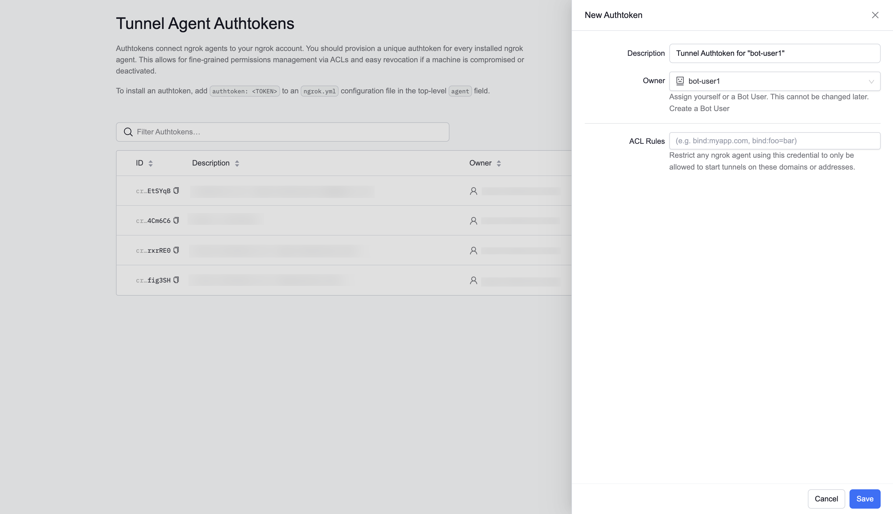

# Get started: Deliver and secure APIs in production

An API gateway simplifies routing, security, contract management, protocol translation, and more, providing a single point of entry for clients and services accessing your APIs.
This guide provides step-by-step instructions to help you get started using ngrok as an API gateway.

You'll run an agent in the same network as the API you wish to manage and
create an [Internal Endpoint](/docs/network-edge/internal-endpoints/). This endpoint cannot be accessed directly.
Instead, you'll create a Cloud Endpoint

## Prerequisites
You'll need an ngrok account to follow the steps in this guide. You can [sign up](https://dashboard.ngrok.com/signup) for free if you don't already have one.

## Install the ngrok agent
[Download](https://ngrok.com/download) the appropriate version and install it on the same subnet as the API you wish to manage.

## Create an internal endpoint

## Get an ngrok API Key
[Create an ngrok API key](https://dashboard.ngrok.com/api-keys/new) using the ngrok dashboard. Make sure you save the API key before you leave the screen because it won't be displayed again.

## Reserve a domain
You'll need to reserve the domain you wish to use to serve your API. This guide uses an
[ngrok-managed domain](https://ngrok.com/docs/network-edge/domains-and-tcp-addresses/#ngrok-managed-domains), but you can also
use your own [branded domain](https://ngrok.com/docs/network-edge/domains-and-tcp-addresses/#branded-domains).

To reserve a domain:
1. Login to the ngrok dashboard
2. Click [**Domains**](https://dashboard.ngrok.com/domains) under **Cloud Edge**
3. Click [**New Domain**](https://dashboard.ngrok.com/domains/new)
4. For *Domain*, enter a value and select one of the available ngrok-managed domains **OR** enter your branded domains and
[follow the instructions](https://ngrok.com/docs/network-edge/domains-and-tcp-addresses/#branded-domains) to configure DNS.
5. Leave the other options blanks
5. Click **Save**



## Create a bot user
Now, you’ll create a bot user so that in the next section, you can create an agent authtoken independent of any user account. A bot user does not belong to a particular user account.

To create a bot user:
1. Login to the ngrok dashboard
2. Click [**Bot Users**](https://dashboard.ngrok.com/bot-users) under **Users**
3. Click [**New Bot User**](https://dashboard.ngrok.com/bot-users/new)
4. Enter a name for your bot user
5. Click **Save**



## Create an agent authtoken
You should start each agent using a separate authtoken belonging to a bot user.

To create an authtoken:
1. Login to the ngrok dashboard
2. Click [Authtokens](https://dashboard.ngrok.com/authtokens) under **Tunnels**
3. Click [**Add a Tunnel Authtoken**](https://dashboard.ngrok.com/authtokens/new)
4. For *Owner*, select the bot user you use created
4. For *ACL Rules*, leave it blank for this example. You can also [bind the authtoken to a specific domain](https://ngrok.com/docs/agent/#authtoken-acls)
to restrict the which domain the authtoken can start tunnels on.
5. Click **Save**



## Add the authtoken to your ngrok agent config
Add the authtoken you just created to your ngrok agent by running the following command from the host where you
installed the agent:

```bash
ngrok config add-authtoken {AUTHTOKEN}
```

## Start the ngrok agent to create an internal endpoint
Now start the ngrok agent, substituting the correct value for `{PORT}`.

```bash
ngrok http {PORT}
```

## Create a cloud endpoint and apply policy actions

