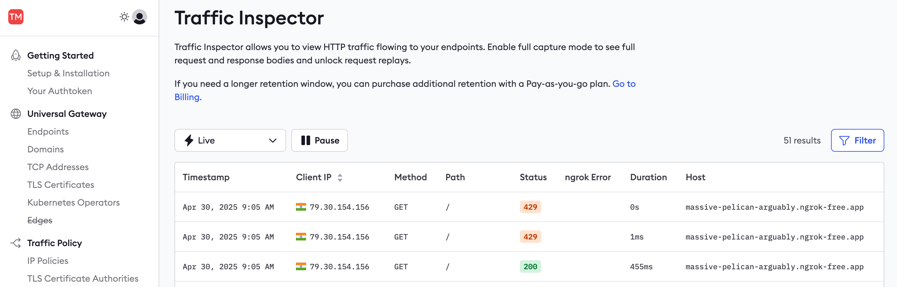
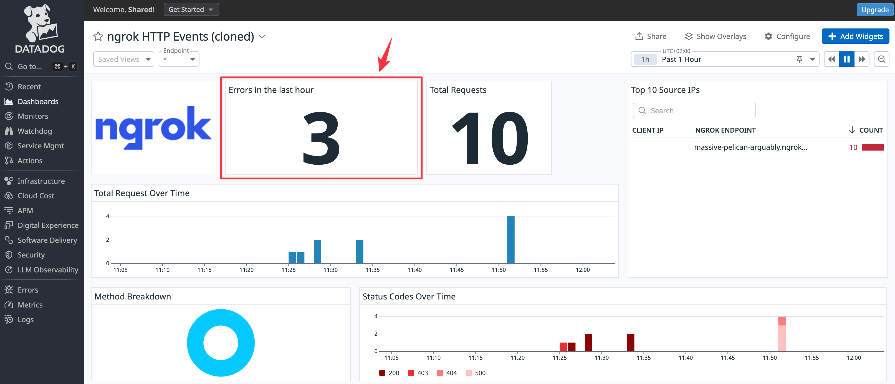

## Introduction

This guide explains how to monitor your API gateway and the traffic passing through it with ngrok by viewing traffic reports, using error request replays, and exporting logs and events to an external dashboard.

## What you'll need

This guide assumes you've already shipped ngrok as an API gateway using one of these guides:

- [Get started with ngrok's API gateway](https://ngrok.com/docs/guides/api-gateway/get-started/)
- [Deploy an API gateway with Kubernetes](https://ngrok.com/docs/guides/api-gateway/kubernetes/)
- [Deploy a multicloud API gateway](https://ngrok.com/docs/guides/api-gateway/multicloud/)

You'll use the [ngrok sample API](https://github.com/ngrok-samples/api-demo) in this tutorial. Even if you have an existing API you want to monitor, you can test the sample before making changes to your real API. If you have no interest in running the sample app and immediately want to work on your live app, jump ahead to the [Monitor your API](#monitor-your-api) section.

## Start the sample API to monitor

Let's start the sample API. Open a terminal and run the commands below.

```sh
docker network create ngrokTest

docker run --init --platform=linux/amd64 --rm -p 4000:80 --network=ngrokTest --name="api" -e PORT=80 joelatngrok/api-demo
```

This command runs the Docker sample API container, exposing the API locally on port 4000, names the Docker container `api`, and removes the container with `--rm` upon exiting. You can now browse to http://localhost:4000 to test the API.

:::note
The API uses a named network, `ngrokTest`, so that in the next section, you can start the ngrok Agent on the same network as the API.
:::


## Publish your API with ngrok

Now that the API is running locally, you can expose it on a public URL, using the [Docker image for the ngrok agent](https://hub.docker.com/r/ngrok/ngrok).

- Replace the authentication token in the command below with your token from the [ngrok dashboard](https://dashboard.ngrok.com/get-started/your-authtoken), and run the command in a new terminal.

  ```sh
  docker run -it --rm --platform=linux/amd64 --network=ngrokTest -e NGROK_AUTHTOKEN=Y0urS3cr3tK3y ngrok/ngrok:3.22.0-alpine-amd64 http http://api
  ```

  This command starts the ngrok agent locally and connects it to the API running on the `api` container.

- Browse to the URL labeled `Forwarding`, which should look like this in your terminal: `https://eb45-79-127-145-72.ngrok-free.app`.
- You can now see your request going from the browser to the ngrok agent you're running in one terminal window and then to the API in your other terminal window.


## Monitor your API

You can monitor web servers in two ways in ngrok, with the Traffic Inspector and with [Events](https://ngrok.com/docs/obs/events).

The Traffic Inspector is a filterable list of your API's requests and responses, available on the ngrok dashboard. The Traffic Inspector is useful for viewing error details and for replaying requests to test new policies and bug fixes. The inspector is a manual way to monitor your API. Request data is kept for three days (or for 90 days as a paid extra).

An event is the data that ngrok provides about a request, which is exported to a dedicated monitoring platform. Events offer an automated means of monitoring your API. Events are also the only way for your team to get automatic error alerts (notifications) instead of constantly having to check for errors on a dashboard.

At the time of writing, ngrok allows you to export events only to AWS, Azure, and Datadog. We do not support event exports to OpenTelemetry or custom URLs, such as self-hosted servers, so you have to use a paid cloud service. You can't perform custom processing or use Elastic, Prometheus, Splunk, or alternative monitoring apps.

## Observe API traffic with Traffic Inspector

In this section, you'll learn to use the Traffic Inspector and work through an example of using the Traffic Inspector for rate limiting.

- Browse to the ngrok [Traffic Inspector](https://dashboard.ngrok.com/traffic-inspector) on your ngrok account dashboard.

  The list of recent requests provides you with basic information, such as the time, origin, destination, duration, and response code of calls to your API.

- You can filter requests by these fields, for instance, to show only server error responses and not successes.

  

:::note
Requests made to the API at http://localhost:4000 will not be displayed in the inspector. Only requests that pass through the ngrok endpoint, and therefore the ngrok agent running in Docker, will be known to ngrok.
:::

To see more details about a request or to replay it, you need to enable full capture, which permits ngrok to store up to 10 KB of your request data.

- Click a request in the Traffic Inspector list, then click **Enable full capture** in the sidebar.

  

- This button takes you to your account settings, where you can enable full capture under **Observability**.

  

- Then, return to your published API URL and refresh the browser page a few times to send fresh requests through ngrok.
- In the ngrok Traffic Inspector, click on the event at the top of the list.

  The event should now show all the request and response details and content. If the full capture details don't appear, you may need to restart your ngrok agent in the terminal.

- Click the **Replay** button and notice that the request is resent from the ngrok host.

  

- You can also replay a request with changes to alter any of the headers or POST data.

  

Replaying requests is useful for debugging. For example, you could find the request that caused an error in your API, deploy a fix for the API, and replay the request to confirm you've fixed the issue.

### Observe and debug Traffic Policy rules with request replay

You can also replay requests to test new [Traffic Policies](https://ngrok.com/docs/traffic-policy). ngrok applies the Traffic Policy rules in effect at the current time of replay, which may be different from the rules that were in effect when the original request was received.

You can use policies to request passwords, block malicious traffic, route requests, rewrite URLs, and respond with custom content. If you use a custom permanent domain name (called a [Cloud Endpoint](https://ngrok.com/docs/universal-gateway/cloud-endpoints)) on ngrok, you can set a policy for every agent that uses that domain. Otherwise, for temporary [Agent Endpoints](https://ngrok.com/docs/universal-gateway/agent-endpoints), you can set a Traffic Policy inside each agent individually.

Let's look at rate limiting as an example of a Traffic Policy. Rate limiting is one of the many [Traffic Policy actions](https://ngrok.com/docs/traffic-policy/actions/rate-limit) available. You can rate limit your login page to make password guessing tedious for hackers, or rate limit SMS requests to prevent automated attacks that try to incur massive costs to your business.

At this stage of the guide, you could send unlimited requests to the test API you've created. Let's change that to allow only one request a minute.

In order to test policies, you need to be able to reuse the same URL, which isn't possible if you keep using the temporary URLs that ngrok generates each time you restart an agent. So let's create a permanent URL:

- Browse to the **Domains** page in the ngrok sidebar. If you're using a free account, register for your free domain with a random name, like `massive-pelican-arguably.ngrok-free.app`. If you're using a paid account, create a new domain for this test.
- Next, you need to stop and restart the ngrok container using a traffic policy.
- Stop the ngrok Docker container in the terminal with <kbd>Ctrl</kbd><kbd>+</kbd><kbd>C</kbd>.
- Create a file named `policy.yml` with the code below.

  ```yml
  on_http_request:
    - actions:
      - type: rate-limit
        config:
          name: 1 request per minute
          algorithm: sliding_window
          capacity: 1
          rate: 1m
          bucket_key:
            - "hasReqHeader('host') ? getReqHeader('host')[0] : 'unknown'"
  ```

- Run the agent again with the command below. Replace the authentication token and the URL with your token and URL (using `https`, not `http`).

  ```sh
  docker run -it --rm --platform=linux/amd64 --network=ngrokTest -v ".:/app" -w "/app" -e NGROK_AUTHTOKEN=Y0urS3cr3t ngrok/ngrok:3.22.0-alpine-amd64 http http://api --traffic-policy-file policy.yml --url https://massive-pelican-arguably.ngrok-free.app
  ```

- Browse to the API URL and refresh the page a few times. Notice that the page stops responding.
- On the ngrok Traffic Inspector page, note that the error code **`429`** (rate limit) was returned and that the duration of the request was instant and caused no load on your API.

  

- Edit the `policy.yml` file and change `capacity` to `10`, then restart the ngrok container.
- In the Traffic Inspector, click on one of the **`429`** events, then click **Replay**. Note that the request now responds without error because the rate limit has been increased.

  

## Monitor API gateway traffic with Datadog

In this section, you'll learn how to export ngrok events to the Datadog monitoring service.

There are two [types of events](https://ngrok.com/docs/obs/events/reference): standard traffic events (requests to your API) and audit events (changes to secret keys and URLs). For this simple example, you'll monitor a traffic event.

Before adding an event subscription, you need somewhere to send events:

- Sign up for a [Datadog](https://www.datadoghq.com) trial account. (You will eventually need a paid Datadog plan to continue using logs and monitors.)

  You also can't skip the third step of the sign-up process, in which you create a Datadog agent somewhere.

- In Step 3 of the Datadog sign-up, click on **Docker** in the sidebar. Copy and paste the given command into a terminal and run it.

  

- Once the Datadog site notices your agent is running, click **Finish** at the bottom of the page.
- You now no longer need the agent running locally and can remove the Datadog container with the command below.

  ```sh
  docker stop dd-agent
  docker remove dd-agent
  docker image rm gcr.io/datadoghq/agent:7
  ```

- Note which Datadog site you're using by following the instructions in the [guide to getting started with Datadog sites](https://docs.datadoghq.com/getting_started/site/#access-the-datadog-site).
- Take note of your Datadog API key, which you can access by clicking your username at the bottom left of the sidebar and clicking **API Keys** in the menu that opens.

  

- In the ngrok navigation panel, browse to the [**Events Stream**](https://dashboard.ngrok.com/event-subscriptions) and add a new subscription.

  

- In the **New Event Subscription** sidebar, enter `traffic` as the **Description** and then **Add** a new source (event type). Choose **`http_request_complete`**.

  

- Add Datadog as a destination, add the Datadog site and API key you noted earlier, and send a test event.

- Open the Datadog site and browse to the **Log Explorer** page from the navigation panel. Enable logs. You should see that the event from ngrok has appeared.

  

- In ngrok, click **Done** and **Save**.

- Refresh your ngrok API page a few times so that new requests are logged in Datadog.

### Create a dashboard

Now that events are being sent to Datadog, you can set up visualizations and notifications to allow your support team to monitor your API's performance.

- In the Datadog site, browse to the **Dashboards > Dashboard List** page from the navigation panel. Click the **ngrok HTTP Events** item to view the default dashboard.

  

To add a new widget to the dashboard, you need to clone the default dashboard.

- Click **Clone** at the top right of the page.

  

- In the cloned dashboard, click **Add widgets**.

  

Configure the widget as follows.

- **Step 1:** Choose **Query value** as your visualization.
- **Step 2:** Change **Metrics** to **Logs** (ngrok does not export metrics) and enter the log filter, `@http.status_code:500`, so that Datadog only counts errors.
- **Step 3:** Set the time preference to **Past 1 Hour**.
- **Step 4:** Name the widget `Errors in the last hour`.

  

Your new widget will be available in the dashboard, allowing your support staff to see instantly whether any errors have occurred in your API.



Since the sample API never returns errors, an easy way to test the `Errors in the last hour` widget is to stop the sample API Docker container and then try to browse to the site on the public ngrok endpoint.

If you want to create widgets for other log information, you can see which fields are available by reading the JSON of any event you click on in the log inspector.

### Create a notification

To complete your monitoring system, you need to set up an alert that is pushed to your email or mobile app when an error occurs by adding a webhook integration to Datadog. This allows your support team to receive error notifications instead of having to check the dashboard repeatedly. Webhooks provide a way for you to send POST requests to https://ntfy.sh, a free notification service.

- In Datadog, browse to **Integrations > Add integration > Webhooks**.

  

- Under **Webhooks**, at the bottom of the configuration page, click **New**. Set the **Name** to `ntfy`, the **URL** to `https://ntfy.sh/ngrokTest`, and the **Payload** to **Blank**. Click **Save**.

  

- In the Datadog navigation panel, browse to the **Monitors > New monitor**. Choose **Logs**.

- In the monitor configuration, choose **Query** for your monitor scope, set the search query to `@http.status_code:500`, the time to the **last 1 hour**, and the notification message:

   ```
   @webhook-ntfy Your API has errors. Investigate at https://app.datadoghq.eu/dashboard.
   ```

  

  It's important that the `@webhook` name matches the webhook integration you created earlier. If the names don't match, the notification won't arrive.

- Browse to the [ngrok test channel on the ntfy website](https://ntfy.sh/ngrokTest).

- Click **Test notifications** at the bottom of the Datadog page and send an alert with **Run tests**.

- Notice that the alert appears on the ntfy page. You can install ntfy as a mobile app so that you are always aware of whether your API has errors.

  

- Save the monitor. Now, after a delay and once you've refreshed the ngrok endpoint for your API, you will receive a notification if an error occurs.

If you want to use a different notification system to ntfy, consider using email, Slack, Discord, WhatsApp, Threema, or Webhook.site.

## Next steps: What to monitor?

Now that you've seen how to connect your API traffic to Datadog, explore logs, create a dashboard with custom widgets, and send yourself alerts, let's discuss what exactly you should be monitoring.

There are three categories to consider: security, errors, and performance.

### Security

You need to monitor the security of your own infrastructure, as well as any attempts to hack users' accounts.

As mentioned earlier, ngrok emits [audit events](https://ngrok.com/docs/obs/events/reference/#audit-events) for any security changes. You should set up alerts for any changes to API keys, domains, and SSH certificates — anything that indicates attackers might gain access to your infrastructure. Events like stopping and starting agents and tunnels are likely to happen frequently, so they don't need alerts (especially when running Kubernetes and multiple containers). You still might want to add widgets to monitor these events on a dashboard, however, because surges in activity might indicate problems with your system. Additionally, you can add monitors that trigger alerts when activity passes a certain threshold.

In terms of user security, you need to monitor anything that indicates attackers might be accessing a user's account. This includes multiple requests from IP addresses in different countries in a short time span (though this has become common with the increasing use of VPNs), a high rate of failed login attempts, or an anomalous pattern of request access. In order to make a monitoring rule that recognizes anomalies, you first need to track the average number of requests that the average user makes to various endpoints in your API.

### Errors

Errors are the simplest category to monitor. Generally, if your API returns status codes in the `500` range instead of the `200` range, it needs fixing. Using Datadog monitoring, create an alert that is sent to ntfy or Slack for all errors. If a `500` error occurs, use the ngrok replay function to see whether it can be reproduced on a QA server, and send the bug to your developers to fix it.

### Performance

Performance metrics need monitoring, but they don't need to trigger alerts unless your service experiences a sudden spike in usage or growth. The most important things to monitor are uptime, latency (response time), and throughput.

Unlike with audit events, there is only one traffic event to monitor: [HTTP Request Complete](https://ngrok.com/docs/obs/events/reference/#http-request-complete). This event, with multiple fields and the request and response bodies in the log, is enough to construct any metrics you need.

General statistics practices apply to metric monitoring. Use medians instead of arithmetic averages, because extreme values disproportionately affect averages.

For latency, keep an eye on the median duration of a request, as well as outliers. Separate requests by endpoint to identify which endpoints take excessive time and could be improved. For throughput, look at the median number of requests per minute. For both metrics, also consider monitoring variance in addition to averages. Even if an endpoint has a quick average response time, if the duration is highly variable – with many lower- and higher-than-average durations – your users will probably get annoyed.

## Further reading

To learn more about any of the concepts in this guide, consult the following articles:

- The [Get Docker](https://docs.docker.com/get-started/get-docker) guide
- The guide to [getting started with Docker for ngrok](https://dashboard.ngrok.com/get-started/setup/docker)
- The complete [Docker ngrok agent](https://ngrok.com/docs/using-ngrok-with/docker) documentation
- The [ngrok Traffic Policy](https://ngrok.com/docs/traffic-policy) documentation
- The [ngrok Traffic Policy actions](https://ngrok.com/docs/traffic-policy/actions/rate-limit) documentation
- The [ngrok Cloud Endpoints](https://ngrok.com/docs/universal-gateway/cloud-endpoints) documentation
- The [ngrok Agent Endpoints](https://ngrok.com/docs/universal-gateway/agent-endpoints) documentation
- The [ngrok Events](https://ngrok.com/docs/obs/events) documentation
- [Datadog](https://www.datadoghq.com)
