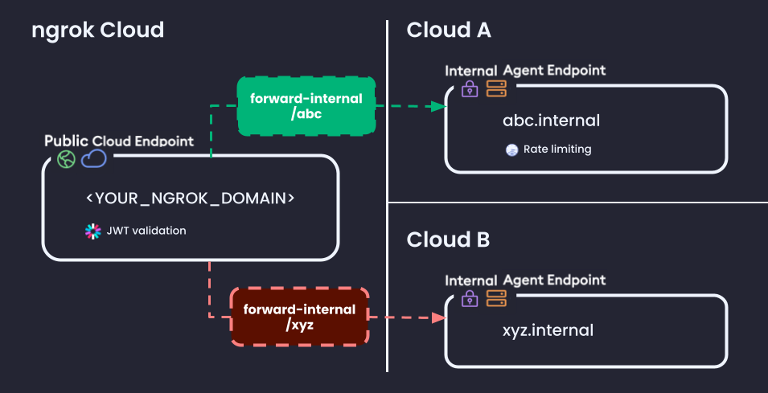

import TabItem from "@theme/TabItem";
import Tabs from "@theme/Tabs";

Whether because of an acquisition, an ask to make your cloud-native architecture
more redundant, or to access cloud-specific services, you need to make multitle API
services available from more than one cloud behind a single hostname, like `api.example.com`.

To help you sail through the challenges of any multicloud deployment, you're
looking for an API gateway platform that lets you:

- Use your existing Kubernetes clusters and networking
- Consistently apply security and traffic management policy in one place
- View API requests and responses on a single pane of glass
- Stop worrying about cloud-specific tools and implementations.

Enter ngrok's multicloud API gateway.

## What you'll learn

In this tutorial, you'll learn how to implement ngrok as a multicloud API
gateway in a Kubernetes environment with these broad steps:

1. Deploy the ngrok Kubernetes Operator to your clusters in multiple clouds.
2. Set up a single hostname, attached to a [Cloud Endpoint](/docs/universal-gateway/cloud-endpoints/) that routes traffic to services on multiple clouds based on pathname, an internal [Agent
   Endpoint](/docs/universal-gateway/agent-endpoints) then receives in your cluster.
3. Add traffic management rules, like JWT validation and rate limiting, to all
   or some of your API services.

In the end, you'll get a single hostname, like `api.example.com`, that routes to
API services on multiple clouds based on pathname—plus essential traffic
management policies like authentication and rate limiting. Your architecture
will look like:



## What you'll need

- **`kubectl` and Helm** installed on your local workstation.
- **Two or more cloud providers**.
  - We'll refer to them as `cloud A` and `cloud B`.
- **A Kubernetes cluster on each cloud**.
- **A reserved domain**, which you can get [in the ngrok
  dashboard](https://dashboard.ngrok.com/domains) or with the [ngrok
  API](/docs/api/resources/reserved-domains/#create-reserved-domain).
  - You can choose from an ngrok subdomain or bring your own [custom branded
    domain](/docs/guides/other-guides/how-to-set-up-a-custom-domain), like
    `https://api.example.com`.
  - We'll refer to this domain as `<YOUR_NGROK_DOMAIN>`.
- An [**Auth0
  account**](https://auth0.com/signup?place=header&type=button&text=sign%20up)
  (free is fine) for creating an API and generating JWTs.

## Deploy demo API services (optional)

If you want to quickly wire up a POC using ngrok, we recommend using our [demo
API service](https://github.com/ngrok-samples/api-demo), which responds with details
about your requests.

The two manifests below provision pods and resources for `abc-app` on cloud A
and `xyz-app` on cloud B, respectively, and configure the container's
environment variables to respond uniquely to "prove" you've actually gone multicloud.

<Tabs>
  <TabItem value="Cloud A: abc-app">

```yaml title="abc-app.yaml" mode=file
---
apiVersion: apps/v1
kind: Deployment
metadata:
  name: abc
spec:
  selector:
    matchLabels:
      app: abc
  template:
    metadata:
      labels:
        app: abc
    spec:
      containers:
        - name: abc
          image: joelatngrok/api-demo:latest
          ports:
            - containerPort: 4000
          env:
            - name: MESSAGE
              value: "Hello from `abc` on cloud A!"
---
apiVersion: v1
kind: Service
metadata:
  name: abc-service
spec:
  selector:
    app: abc
  ports:
    - port: 4000
      targetPort: 4000
```

  </TabItem>
  <TabItem value="Cloud B: xyz-app">

```yaml title="xyz-app.yaml" mode=file
---
apiVersion: apps/v1
kind: Deployment
metadata:
  name: xyz
spec:
  selector:
    matchLabels:
      app: xyz
  template:
    metadata:
      labels:
        app: xyz
    spec:
      containers:
        - name: xyz
          image: joelatngrok/api-demo:latest
          ports:
            - containerPort: 4000
          env:
            - name: MESSAGE
              value: "Hello from `xyz` on cloud B!"
---
apiVersion: v1
kind: Service
metadata:
  name: xyz-service
spec:
  selector:
    app: xyz
  ports:
    - port: 4000
      targetPort: 4000
```

  </TabItem>
</Tabs>

Apply these with `kubectl apply -f ...` into the respective cloud and cluster.

## Deploy the ngrok Kubernetes Operator

Add the ngrok Kubernetes Operator repo to Helm.

```shell
helm repo add ngrok https://charts.ngrok.com
helm repo update
```

Set up a few environment variables to help apply the ngrok Kubernetes Operator.

- `NGROK_AUTHTOKEN`: An ngrok authtoken—you can use either your [default
  authtoken](https://dashboard.ngrok.com/get-started/your-authtoken) or [create
  a new authtoken](https://dashboard.ngrok.com/authtokens) for this deployment.
- `NGROK_API_KEY`: An API key [created in the ngrok
  dashboard](https://dashboard.ngrok.com/api-keys) to associate with your
  deployment.

```shell
export NGROK_AUTHTOKEN=<AUTHTOKEN>
export NGROK_API_KEY=<API_KEY>
```

Install the ngrok Kubernetes Operator into a new `ngrok-operator` namespace.

```shell
helm install ngrok-operator ngrok/ngrok-operator \
  --namespace ngrok-operator \
  --create-namespace \
  --set credentials.apiKey=$NGROK_API_KEY \
  --set credentials.authtoken=$NGROK_AUTHTOKEN
```

Repeat the Operator installation for cloud B.

## Create internal agent endpoints

These endpoints are private to your account and can only receive traffic
forwarded with the `forward-internal` Traffic Policy action, which means they're
never publicly accessible.

The ngrok Kubernetes Operator comes with an `AgentEndpoint` CRD that helps you
quickly map specific upstream services to ngrok endponits.

If you're bringing your own API services instead of using the demo API, you'll
need to change the `url` and `upstream.url` fields based on your architecture.

<Tabs>
  <TabItem value="Cloud A: abc-app">

```yaml title="abc-app-endpoint.yaml" mode=file
apiVersion: ngrok.k8s.ngrok.com/v1alpha1
kind: AgentEndpoint
metadata:
  namespace: default
  name: abc-cloud-a
spec:
  url: https://abc-cloud-a.internal
  upstream:
    url: http://abc-service.default:4000
```

  </TabItem>
  <TabItem value="Cloud B: xyz-app">

```yaml title="xyz-app-endpoint.yaml" mode=file
apiVersion: ngrok.k8s.ngrok.com/v1alpha1
kind: AgentEndpoint
metadata:
  namespace: default
  name: xyz-cloud-b
spec:
  url: https://xyz-cloud-b.internal
  upstream:
    url: http://xyz-service.default:4000
```

  </TabItem>
</Tabs>

Apply these with `kubectl apply -f ...` into the respective cloud and cluster.

## Create a cloud endpoint

Cloud endpoints are persistent, always-on endpoints that you can manage with the
ngrok dashboard or API.

You centrally control your traffic management and security policy on your cloud
endpoint, which operates as the "front door" of your multicloud API gateway,
then forward traffic your API services in multiple clouds. That's much easier
than synchronizing policies using cloud-specific tools, since they're all
configured and managed in different ways.

<Tabs>
	<TabItem value="Dashboard">

    		Hop over to the [**Endpoints**
    		section](https://dashboard.ngrok.com/endpoints) of the ngrok dashboard and
    		click **+ New**.

    		Leave the **Binding** value **Public**, then enter the domain name you
    		reserved earlier. Click **Create Cloud Endpoint**.

    </TabItem>
    <TabItem value="API">

    		The `ngrok` CLI provides a helpful wrapper around the [ngrok
    		API](/docs/api), which you can use to create a cloud endpoint and
    		apply a file containing Traffic Policy rules.

    		Because every cloud endpoint must contain a Traffic Policy rule, create a
    		new file named `policy.yaml` on your local workstation with the following
    		YAML, which is temporary until you add proper routing.

    		```yaml title="policy.yaml" mode=traffic-policy
    		on_http_request:
    			- actions:
    					- type: custom-response
    						config:
    							content: 'Pong!'
    							status_code: 200
    		```

    		Create a cloud endpoint on `{YOUR_NGROK_DOMAIN}`, passing your
    		`policy.yaml` file as an option.

    	```shell
    	ngrok api endpoints create \
    	  --bindings public \
    	  --url https://<YOUR_NGROK_DOMAIN>
    		--traffic-policy "$(cat policy.yaml)"
    	```

    		You'll get a `201` response—save the value of `id`, as you'll need it
    		again later to continue configuring the Traffic Policy applied to your
    		cloud endpoint. We'll refer to it as `<CLOUD_ENDPOINT_ID>`.

    </TabItem>

</Tabs>

## Route traffic to your services

Your front door is ready, but it currently doesn't have any logic for routing
traffic to your API services in multiple clouds.

Enter our [Traffic Policy system](/docs/traffic-policy), which lets you filter
traffic based on its properties and take action as it passes through ngrok's
global network. Two important concepts of Traffic Policy to note:

- [Phases](/docs/traffic-policy/concepts/phases) are the distinct points in the lifecycle of
  a request where you can filter and take action. For this use case, we're using
  `on_http_request`, which activates when ngrok receives an HTTP request over an
  established connection.
- [Expressions](/docs/traffic-policy/concepts/expressions) define when to run
  your actions. They're written in [Common Expression
  Language](https://github.com/google/cel-spec), and must evaluate to `true` to
  run the corresponding action.

The rules below:

1. Filter for requests arriving on _only_ `https://<YOUR_NGROK_DOMAIN>/abc` and
   forward them to your internal agent endpoint in cloud A.
2. Filter for requsets arriving on _only_ `https://<YOUR_NGROK_DOMAIN>/xyz` and
   forward them to your internal agent endpoint in cloud B.

You can also [route by other
properties](/docs/traffic-policy/examples/route-requests), like subdomains and
headers.

<Tabs>
	<TabItem value="Dashboard">

    	Copy and paste the rules below into your cloud endpoint's Traffic Policy editor
    	in the dashboard. If you're bringing your own API services instead of using the
    	demo API, you'll need to change `/abc` and `/xyz` to match your services' paths
    	and the `url` for your internal agent endpoints.

    	```yaml mode=traffic-policy title="policy.yaml"
    	on_http_request:
    		- expressions:
    				- "req.url.path.startsWith('/abc')"
    			actions:
    				- type: forward-internal
    					config:
    						url: https://abc-cloud-a.internal
    		- expressions:
    				- "req.url.path.startsWith('/xyz')"
    			actions:
    				- type: forward-internal
    					config:
    						url: https://xyz-cloud-b.internal
    	```

    	Hit **Save** to lock in the new policy.

    </TabItem>
    <TabItem value="API">

    	Update your existing `policy.yaml` file with the YAML below. If you're
    	bringing your own API services instead of using the demo API, you'll need to
    	change `/abc` and `/xyz` to match your services' paths and the `url` for
    	your internal agent endpoints.

    	```yaml mode=traffic-policy title="policy.yaml"
    	on_http_request:
    		- expressions:
    				- "req.url.path.startsWith('/abc')"
    			actions:
    				- type: forward-internal
    					config:
    						url: https://abc-cloud-a.internal
    		- expressions:
    				- "req.url.path.startsWith('/xyz')"
    			actions:
    				- type: forward-internal
    					config:
    						url: https://xyz-cloud-b.internal
    	```

    	Update your cloud endpoint.

    	```shell
    	ngrok api endpoints update <CLOUD_ENDPOINT_ID> \
    		--traffic-policy "$(cat policy.yaml)"
    	```

    </TabItem>

</Tabs>

At this point, your multicloud API gateway is up and running! Give it a try,
won't you?

```shell
curl https://<YOUR_NGROK_DOMAIN>/abc
```

You should get a response like:

```
{"message":"Hello from `abc` on cloud A!","host":"<YOUR_NGROK_DOMAIN>","req_headers":{"host":"<YOUR_NGROK_DOMAIN>","user-agent":"curl/8.7.1","accept":"*/*","accept-encoding":"gzip"},"method":"GET","url":"/abc","time":"2025-03-04T01:10:25.812Z","status":200}
```

And when you run `curl https://<YOUR_NGROK_DOMAIN>/xyz`?

```
{"message":"Hello from `xyz` on cloud B!","host":"<YOUR_NGROK_DOMAIN>","req_headers":{"host":"<YOUR_NGROK_DOMAIN>","user-agent":"curl/8.7.1","accept":"*/*","accept-encoding":"gzip"},"method":"GET","url":"/xyz","time":"2025-03-04T01:10:25.812Z","status":200}
```

## Add traffic management policies

Your multicloud API gateway routes traffic, but doesn't yet do essential work
of an API gateway: offload all the non-functional requirements away from your
services.

One great feature of ngrok's building blocks of endpoints and Traffic Policy
rules is that they're _composable_—you can reuse them, chain them, and apply
them at multiple stages in the lifecycle of an API request.

With the shape you've already created, you can centrally manage certain policies,
like authentication, on your cloud endpoint, then compose additional rules onto
specific services.

### Validate JWTs on all APIs and requests

API authentication is too important not to apply consistently across all your
APIs and requests. That's where the always-on, _front door to all your routes_
quality of a cloud endpoint comes in handy—you can apply the [`jwt-validation`
action](/docs/traffic-policy/actions/jwt-validation) once for dependable AuthN
no matter how many services you end up deploying behind your multicloud API
gateway.

ngrok's JWT validation action helps you:

- Give your end users many ways to access your APIs.
- Ensure only requests containing the correct access token, specified by an
  `Authorization: Bearer ...` header, can access any of your APIs.
- Add claims to tokens for authorization and fine-grained access control where a
  specific token may only have access to a certain API (`service_access: abc`)
  or apply RBAC (`features: read`).
- Use a single credential for end users who need to access multiple upstream
  services.
- Offload all this logic from your API services and run it in ngrok's network.

You can use any OAuth provider for JWT validation, but but let's quickly cover the
process with Auth0.

- Log in to your [Auth0 tenant dashboard](https://manage.auth0.com/dashboard).
- Select **Applications > APIs**, then **+ Create API**.
- Name your API whatever you'd like.
- Replace the value of the Identifier field with `<YOUR_NGROK_DOMAIN>`.
- Leave the default values for **JSON Web Token (JWT) Profile** and **JSON Web
  Token Signing Algorithm**.
- Click **Create**.
- Navigate to your application and click on the **Test** tab, where you can find
  a signed, fully functional JWT and examples of how to programmatically
  generate more.

The rule below builds on top of the previous cloud endpoint policy to:

1. Reject requests missing a token with a `401 Unauthorized` error.
2. Reject requests with an invalid token with a `403 Forbidden` error.
3. Forward requests with a valid token to one of your internal agent endpoints
   based on the pathname.

You'll need to change the variables accordingly—if you're not sure where to find
this information, we have a full [integration
guide](/docs/integrations/auth0/jwt-action) with more details.

```yaml mode="traffic-policy" title="policy.yaml"
on_http_request:
  - actions:
      - type: jwt-validation
        config:
          issuer:
            allow_list:
              - value: "https://<YOUR_AUTH0_TENANT_ID>.<YOUR_AUTH0_REGION>.auth0.com/"
          audience:
            allow_list:
              - value: "https://<YOUR_NGROK_DOMAIN>"
          http:
            tokens:
              - type: "jwt"
                method: "header"
                name: "Authorization"
                prefix: "Bearer "
          jws:
            allowed_algorithms:
              - "RS256"
            keys:
              sources:
                additional_jkus:
                  - "https://<YOUR_AUTH0_TENANT_ID>.<YOUR_AUTH0_REGION>.auth0.com/.well-known/jwks.json"
  - expressions:
      - "req.url.path.startsWith('/abc')"
    actions:
      - type: forward-internal
        config:
          url: https://abc-cloud-a.internal
  - expressions:
      - "req.url.path.startsWith('/xyz')"
    actions:
      - type: forward-internal
        config:
          url: https://xyz.cloud-b.internal
```

Apply in either the dashboard or ngrok API.

### Rate limit specific API services

Let's say one of your services (like `abc-app`, if you're following along with
the demo service), needs additional protection from unintentional misuse and
malicious attacks.

The [`rate-limit` Traffic Policy
action](/docs/traffic-policy/actions/rate-limit) allows you to reject requests
with a `429` error code once a user or group have exceeded your customizable
threshold, and the `AgentEndpoint` CRD allows you to define a Traffic Policy for
just that endpoint.

The rule below builds on top of your `AgentEndpoint` CR from earlier to:

1. Allow up to `10` requests per IP in a `60s` window.
2. Reject requests that exceed the rate limiting capacity with a `429` error response.
3. Forward all other requests to the upstream API service at
   `http://abc-app-service.default:4000`.

```yaml title="abc-app-endpoint.yaml" mode="file"
apiVersion: ngrok.k8s.ngrok.com/v1alpha1
kind: AgentEndpoint
metadata:
  namespace: default
  name: abc-cloud-a
spec:
  url: https://abc-cloud-a.internal
  upstream:
    url: http://abc-service.default:4000
  trafficPolicy:
    inline:
      on_http_request:
        - actions:
            - type: rate-limit
              config:
                name: Only allow 10 requests per minute
                algorithm: sliding_window
                capacity: 10
                rate: 60s
                bucket_key:
                  - conn.client_ip
```

Apply the updated manifest with `kubectl apply -f ...`.

Ready to test your rate limit in action? Run the below command after replacing
`<YOUR_NGROK_DOMAIN>` and the path, if relevant.

```shell
for i in `seq 1 50`; do curl -X GET -w '%{http_code}' https://<YOUR_NGROK_DOMAIN>/abc ; done
```

You'll see a few normal responses until you hit the rate limit, and then you'll
see `429` errors. Run the same command on the `/xyz` path and you won't see the
same errors, since you've applied this policy only to the
`https://abc-cloud-a.internal` agent endpoint.

If you want all your APIs to have a consistent rate limiting strategy, you can
move the rule to your cloud endpoint above the `jwt-validation` action.

## What's next?

You've now brought your multicloud APIs online with ngrok's API gateway, which
also automatically gives you features like DDoS protection and global load
balancing. Plus, you've added global AuthN with JWTs and explored composing
Traffic Policy rules on multiple endpoints.

Not a bad start—and it probably wasn't nearly as tough as you thought it would
be, too.

That said, your journey into multicloud API gateway with ngrok is just
beginning. Next up, we recommend you:

1. Check out your [Traffic
   Inspector](https://dashboard.ngrok.com/observability/traffic-inspector)
   ([documentation](/docs/obs/traffic-inspection#ngrok-traffic-inspector) to
   observe, modify, and replay requests across your API gateway.
2. Explore other opportunities to manage and take action on API traffic in our
   [Traffic Policy documentation](/docs/traffic-policy).
