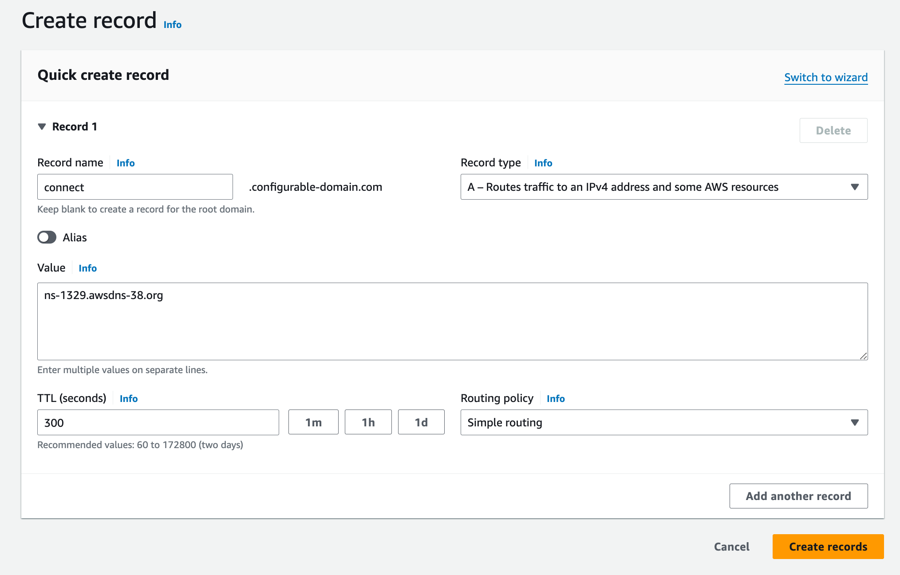
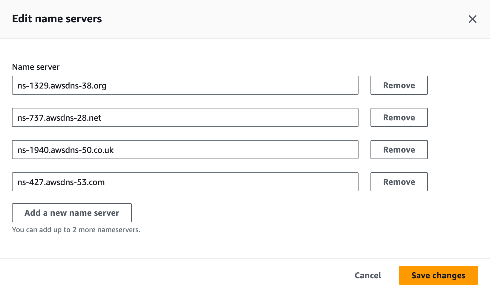
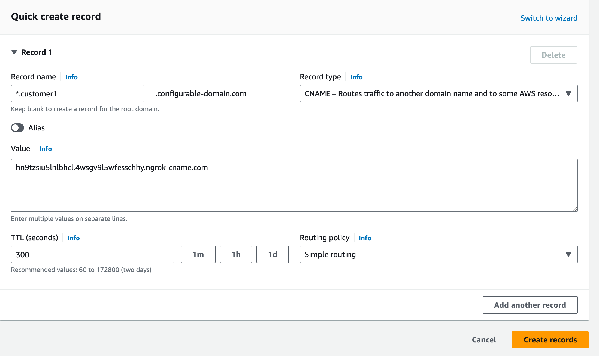
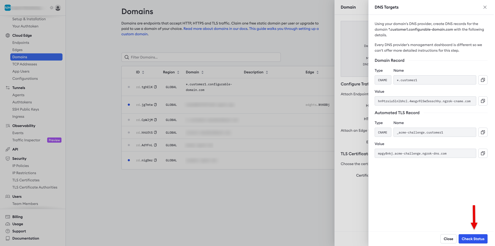
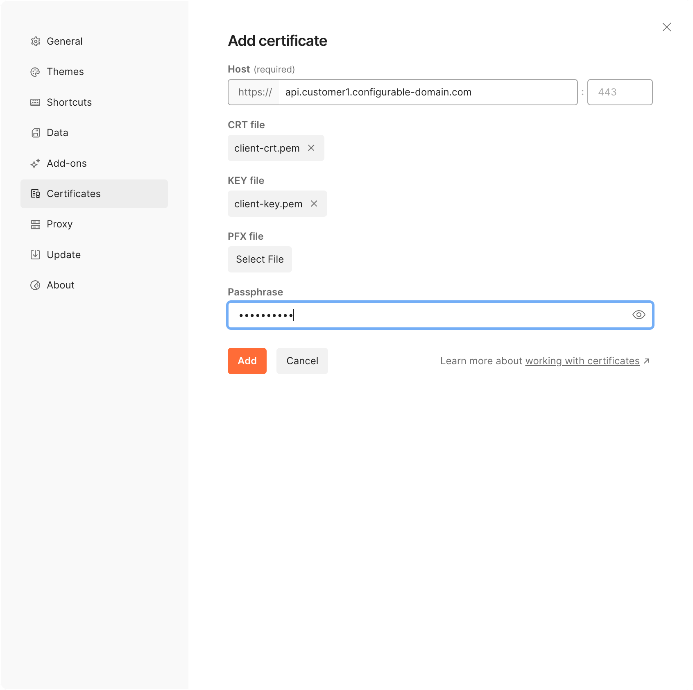

This guide provides step-by-step instructions for using ngrok as a device gateway.
This example shows you how to securely run the ngrok agent to access
to an API running on an IoT device. The connection will be end-to-end encrypted using mutual TLS (mTLS).

For a deeper understanding for how mTLS is implemented within ngrok, reference the [Mutual TLS module
page](/http/mutual-tls/).

## **Prerequisites**

A certificate authority (CA) is required for mTLS. The CA is responsible for issuing and digitally
signing certificates (client certificates). The CA will also be used to verify the authenticity of the
certificates.

1. CA certificate to be used by ngrok to verify the clients.
2. Client certificates signed by the CA used to access the endpoints.

Users are responsible for providing the CA and client certificates. ngrok will not generate them.
The CA certificate will be uploaded and hosted on the ngrok platform. The client certificates
will need to be distributed to any client/device that will need to access the API endpoints.

Most organizations will have their own certificate mangement infrastructure. You can
[generate test certificates](#generate-test-certificates) for reference/demo purposes during implementation.

## Install the ngrok agent

[Download](https://ngrok.com/download) the appropriate version and install it on your device.

## Get an ngrok API Key

[Create an ngrok API key](https://dashboard.ngrok.com/api/new) using the ngrok dashboard.
Make sure you save the API key before you leave the screen because it won't be displayed again.

## Configure a custom agent ingress address

Configuring a [custom agent ingress address](/agent/ingress/) allows you to provide your customers with
a dedicated URL to connect to the ngrok platform. Since your customers will connect using your subdomain,
they can safely block other ngrok domains to control the tunnels started in their network. You'll provide a
subdomain you own, such as `connect.{YOUR_DOMAIN}`, and delegate DNS (Domain Name Service) control of
that subdomain to ngrok.

### Create the agent ingress address

Use the ngrok API to create the custom agent address by running the command below,
substituting your own values for the variables:

```curl
curl \
-X POST \
-H "Authorization: Bearer {API_KEY}" \
-H "Content-Type: application/json" \
-H "Ngrok-Version: 2" \
-d '{"description":"{DESCRIPTION}","domain": “connect.{YOUR_DOMAIN}”}' \
https://api.ngrok.com/agent_ingresses

```

You should receive a `201` response similar to the following:

```json
{
	"id": "agin_2esRkfoq4frGvOVUmfhytlr2zS3",
	"uri": "/agent_ingresses/agin_2esRkfoq4frGvOVUmfhytlr2zS3",
	"description": "Custom ingress address",
	"domain": "connect.configurable-domain.com",
	"ns_targets": [
		"ns-1329.awsdns-38.org",
		"ns-737.awsdns-28.net",
		"ns-1940.awsdns-50.co.uk",
		"ns-427.awsdns-53.com"
	],
	"region_domains": [
		"tunnel.us.connect.configurable-domain.com",
		"tunnel.us-cal-1.connect.configurable-domain.com",
		"tunnel.eu.connect.configurable-domain.com",
		"tunnel.au.connect.configurable-domain.com",
		"tunnel.ap.connect.configurable-domain.com",
		"tunnel.jp.connect.configurable-domain.com",
		"tunnel.sa.connect.configurable-domain.com",
		"tunnel.in.connect.configurable-domain.com"
	],
	"created_at": "2024-04-09T19:37:23Z",
	"certificate_management_policy": null,
	"certificate_management_status": null
}
```

Save the values from the `ns_targets` property and the `region_domains`
property as you'll use them later.

### Update your DNS

Create an `NS` record in your DNS provider's registry for each `ns_targets` value from the
response above, using `connect` as the name for each entry. The screenshot is from AWS Route53, but
you can use any DNS provider you choose.



You should have four new records when you’re done.



You can run the following command to get the values you need if you didn't save the response.

```curlcurl \
-X GET \
-H "Authorization: Bearer {API_KEY}" \
-H "Ngrok-Version: 2" \
https://api.ngrok.com/agent_ingresses
```

## Create a custom wildcard domain

Next, create a custom [wildcard domain](/docs/network-edge/domains-and-tcp-addresses/#wildcard-domains), which will allow you to
create endpoints and receive traffic on any subdomain of your domain.

For example, you might create `*.customer1.{YOUR_DOMAIN}`. You would then be able to create endpoints
on `app.customer1.{YOUR_DOMAIN}` and `dev.customer1.{YOUR_DOMAIN}`. It can be helpful to create
a separate subdomain for each site you wish to connect to.

Run the following command, substituting your API key for `{API_KEY}` and your domain for `{YOUR_DOMAIN}`:

```curl
curl \
-X POST \
-H "Authorization: Bearer {API_KEY}" \
-H "Content-Type: application/json" \
-H "Ngrok-Version: 2" \
-d '{"domain":"*.customer1.{YOUR_DOMAIN}","region":"us"}' \
https://api.ngrok.com/reserved_domains
```

You should receive a `201` response similar to the following:

```json
{
	"id": "rd_2euR3S7Mt07gRC6NlVGcXtghElK",
	"uri": "https://api.ngrok.com/reserved_domains/rd_2euR3S7Mt07gRC6NlVGcXtghElK",
	"created_at": "2024-04-10T12:31:16Z",
	"domain": "*.customer1.configurable-domain.com",
	"region": "",
	"cname_target": "hn9tzsiu5lnlbhcl.4wsgv9l5wfesschhy.ngrok-cname.com",
	"http_endpoint_configuration": null,
	"https_endpoint_configuration": null,
	"certificate": null,
	"certificate_management_policy": {
		"authority": "letsencrypt",
		"private_key_type": "ecdsa"
	},
	"certificate_management_status": {
		"renews_at": null,
		"provisioning_job": {
			"error_code": null,
			"msg": "Managed certificate provisioning in progress.",
			"started_at": "2024-04-10T12:31:16Z",
			"retries_at": null
		}
	},
	"acme_challenge_cname_target": "mpgy8nkj.acme-challenge.ngrok-dns.com"
}
```

You'll need values from the response in the next section.

### Update DNS records

Next, add two `CNAME` records to your DNS provider's registry, providing values from the previous response.

First add a CNAME record for the wildcard subdomain you just created.



Then add another record for the
[ACME (Automated Certificate Management Environment)](https://venafi.com/blog/what-acme-protocol-and-how-has-it-changed-pki/)
validation. For the record, enter `acme_challenge_cname_target`, and use the value of the  
`acme_challenge_cname_target` property from from previous response for the value.

### Verify DNS

Use the ngrok dashboard to verify that you’ve configured DNS correctly.

1. Login to the [ngrok dashboard](https://dashboard.ngrok.com/).
2. Click **Domains** in the left-hand navigation menu.
3. Click on your wildcard domain under _Domain_.
4. Click **2 targets** next to _DNS Targets_ in the panel displayed on the right-hand side of the screen,
   as denoted by the arrow in the screenshot below.


5. Click **Check Status**, as denoted by the arrow in the screenshot below.



6. You should see a successful response similar to the screenshot below.


## Create a bot user

Now, you’ll create a bot user so that in the next section, you can create an agent authtoken independent of any user account. Recall from Chapter 2 that a bot user does not belong to a particular user account. Run the following command to create a new bot user, providing your API key and a description:

```
curl \
-X POST \
-H "Authorization: Bearer {API_KEY}" \
-H "Content-Type: application/json" \
-H "Ngrok-Version: 2" \
-d '{"name":"new bot user from API"}' \
https://api.ngrok.com/bot_users
```

You should receive a `201` response similar to the following:

```json
{
	"id": "bot_2fmwUXhnImKswMgZKCsx7cnbt2l",
	"uri": "https://api.ngrok.com/bot_users/bot_2fmwUXhnImKswMgZKCsx7cnbt2l",
	"name": "new bot user from API",
	"active": true,
	"created_at": "2024-04-29T19:39:36Z"
}
```

## Create the agent authtoken

You should start each agent using a separate authtoken, and that token should belong to a bot user.

To create an authtoken, login to the ngrok dashboard and click [**Authtokens**](https://dashboard.ngrok.com/tunnels/authtokens)
under _Tunnels_, then click **Add a Tunnel Authtoken**.
For **Owner**, select the bot user you use created, and select `bind:*.customer1.{YOUR_DOMAIN}` for the ACL Rules.
This ACL will allow an agent with the authtoken to create tunnels on any subdomain of `customer1.{YOUR_DOMAIN}`.


## Configure the ngrok agent API

You can use the ngrok [agent API](/docs/agent/api/) to start and stop tunnels remotely, collect and replay captured requests,
and collect stats and metrics.

The API runs on `localhost:4040` wherever the agent runs, but you can start an ngrok tunnel to make the API available
remotely.

> **Please note that tunnels started with the agent API do not persist in the event of an agent restart or network outage.**

### Update ngrok.yml

Create a tunnel definition in the ngrok.yml config file. You can then run the ngrok agent and start and
stop tunnels as needed using the ngrok agent API.

You'll need to modify the `ngrok.yml` config file before running the agent. You can modify the file that resides in the default location:

- **Linux:** `~/.config/ngrok/ngrok.yml`
- **MacOS (Darwin):** `~/Library/Application Support/ngrok/ngrok.yml`
- **Windows:** `%HOMEPATH%\AppData\Local\ngrok\ngrok.yml`

Rather than edit the default `ngrok.yml` config file, you can provide your customer with a separate config file.
This keeps your config separate from their existing `ngrok.yml` config file. You can then pass it as an argument when
you run the ngrok agent. ngrok merges all config files, and you won't need to modify your customer's config file.
This is useful when your customer already uses ngrok and you wish to use the existing
agent to serve the ngrok agent API.

Refer to the `region_domain` values you saved when you created the custom agent ingress address.
These are custom addresses for ngrok’s global [Points of Presence (POPs)](http://localhost:3000/docs/network-edge/#points-of-presence).
Support for [Global Server Load Balancing (GSLB)](https://ngrok.com/blog-post/gslb-global-server-load-balancing)
is not yet available when using a custom agent ingress address, so you’ll
need to specify the POP this agent should use to connect to the ngrok platform.

Add the following sections to the `ngrok.yml` config file, substituting the appropriate values for your environment,
including a subdomain to connect to the agent api, such as `agent.customer1.configurable-domain.com`:

```yaml
#config.yml

version: "2"
authtoken: { YOUR_AUTHTOKEN_WITH_ACL }
server_addr: { VALUE_FROM_REGION_DOMAINS }

tunnels:
  agent-api:
    proto: http
    domain: agent.customer1.{ YOUR_DOMAIN }
    addr: 4040
    inspect: false
```

### Start the agent to access the agent API

Now that you’ve updated the `ngrok.yml` config file, start the tunnel for the agent API by running the following
command wherever you installed the agent:

`ngrok start agent-api`

Note that “agent-api” is the name given to the tunnel in the `ngrok.yml` example config file. You can use any descriptive
name for this tunnel. In this case, you’re starting a tunnel to serve the ngrok agent API on `https://agent.customer1.{YOUR_DOMAIN}`.

If you wish to provide your customer with a custom `ngrok.yml` config file rather than modifying the one in the default
location, as mentioned previously, you can pass the path to the file when you start the tunnel:

`ngrok start agent-api –config /path/to/ngrok.yml`

You can pass multiple paths to config files, and ngrok will merge them before starting.

## Start tunnels to your device

You now have the ngrok agent running on a device in an external environment and can
use the agent API to start and stop the tunnels necessary to access the device's APIs.

To start a tunnel to connect to the device's API, run the following command,
substituting the appropriate values for your environment:

```curl
curl -H "Content-Type: application/json" \
-X POST https://agent.customer1.{YOUR_DOMAIN}/api/tunnels \
-d '{"name":"passthrough","proto":"tls","terminate_at": "agent", "addr":"{PORT}", "domain":"api.customer1.{YOUR_DOMAIN}"
```

The example below creates a tunnel on port 3000 and serves it at `api.customer1.configurable-domain.com`.
Because a previous step created the wildcard domain on `*.customer1.configurable-domain.com`, a tunnel can be started on
`api.customer1.configurable-domain.com` without reserving that subdomain.

```curl
curl -H "Content-Type: application/json" \
-X POST https://agent.customer1.configurable-domain.com/api/tunnels \
-d '{"name":"passthrough","proto":"tls","terminate_at": "agent", "addr":"3000", "domain":"api.customer1.configurable-domain.com",}'
```

## Add mutual TLS (mTLS)

At this point, you can access the device's API, but the connection is
unencrypted. Next you'll add mutual TLS (mTLS) authentication to the tunnel to allow ngrok to verify
the identity of the client and server.

When you start the tunnel, you can send additional properties in the payload to provide
the certificate authority (CA) private key, the signed server certificate, and the server’s
private key.

If you previously started a tunnel, stop it now. Then, to start a fully encrypted tunnel
with mTLS, run the following command, replacing the variables with the appropriate values
for your environment:

```curl
curl \
-H "Content-Type: application/json" -X  \
POST https://agent.customer1.{YOUR_DOMAIN}/api/tunnels \
-d '{"name":"passthrough","proto":"tls","terminate_at": "agent", "addr":"{PORT}", "domain":"api.customer1.{YOUR_DOMAIN}","mutual_tls_cas":"{PATH_TO_CA_PRIVATE_KEY}", "crt":"{PATH_TO_SIGNED_SERVER_CERT}", "key":"{PATH_TO_SERVER_PRIVATE_KEY}"
```

### Generate test certificates

The script below generates tests certificates, which may be useful during implementation or proof of concept.
You should provide certificates signed by an official Certificate Authority when running tunnels in production.

To generate certificates for testing, run the script below, substituting your wildcard domain for `{YOUR_WILDCARD_DOMAIN}`.
For the example above, you'd use `*.customer1.configurable-domain.com`.

```bash
#!/bin/sh

# Configure the common names for the CA, Server, and Client
CA_COMMON_NAME="{YOUR_WILDCARD_DOMAIN}"
SERVER_COMMON_NAME="{YOUR_WILDCARD_DOMAIN}"
CLIENT_COMMON_NAME="{YOUR_WILDCARD_DOMAIN}"

# Generate a Certificate Authority (CA)
echo "Generating keys for Certificate Authority (CA)..."
echo "You will be prompted for a pass phrase 4 times. Enter the same password each time. "
openssl req -new -x509 -days 9999 -keyout ca-key.pem -out ca-crt.pem -subj "/CN=$CA_COMMON_NAME"

# Generate a Server Certificate
echo "Generating a key for the server..."
openssl genrsa -out server-key.pem 4096

echo "Generating a Server Certificate Signing Request..."
openssl req -new -key server-key.pem -out server-csr.pem -subj "/CN=$SERVER_COMMON_NAME"

echo "Signing the server certificate with the CA..."
echo "You will be prompted for a pass phrase 4 times. Enter the same password each time. "
openssl x509 -req -days 9999 -in server-csr.pem -CA ca-crt.pem -CAkey ca-key.pem -CAcreateserial -out server-crt.pem

echo "Verifying the server certificate..."
openssl verify -CAfile ca-crt.pem server-crt.pem

# Generate a Client Certificate
echo "Generating a key for the client..."
openssl genrsa -out client-key.pem 4096

echo "Generating a Client Certificate Signing Request..."
openssl req -new -key client-key.pem -out client-csr.pem -subj "/CN=$CLIENT_COMMON_NAME"

echo "Signing the client certificate with the CA..."
echo "You will be prompted for a pass phrase 4 times. Enter the same password each time. "
openssl x509 -req -days 9999 -in client-csr.pem -CA ca-crt.pem -CAkey ca-key.pem -CAcreateserial -out client-crt.pem

echo "Verifying the client certificate..."
openssl verify -CAfile ca-crt.pem client-crt.pem

echo "mTLS certificate generation complete."
```

When the script completes, you should have the following new files:

- ca-crt.pem
- ca-crt.srl
- ca-key.pem
- client-crt.pem
- client-csr.pem
- client-key.pem
- server-crt.pem
- server-csr.pem
- server-key.pem

Some of these are intermediary files you can ignore.

Run the command below from the same directory where you generated the certificate files to
start a fully encrypted tunnel, substituting your domain for `{YOUR_DOMAIN}` and supplying a value
for `{PORT}`:

```curl
curl \
-H "Content-Type: application/json" -X  \
POST https://agent.customer1.{YOUR_DOMAIN}/api/tunnels \
-d '{"name":"passthrough","proto":"tls","terminate_at": "agent", "addr":"{PORT}", "domain":"api.customer1.{YOUR_DOMAIN}","mutual_tls_cas":"ca-crt.pem", "crt":"server-crt.pem", "key":"server-key.pem"}'
```

Please note that these certificates should be used for testing purposes only. You should
obtain certificates signed by a Certificate Authority for use in production.

## Access APIs on the device

You now have connectivity to your device's API and can access any endpoint of the API
running on the port you provided in the previous step. You’ll pass the client certificate
in each request to the API, and ngrok will terminate TLS once the request reaches the agent on the device.
ngrok will only forward the request to your customer’s network if it includes a valid client certificate
signed by a Certificate Authority that you’ve added to your ngrok account.

You can access your customer’s API using curl, passing the certificates:

```curl
curl \
--cacert {PATH/TO/CA/CERTIFICATE} \
--cert {PATH/TO/CLIENT/CERTIFICATE} \
--key {PATH/TO/CLIENT/KEY} \
https://{YOUR_SUBDOMAIN}/{API_ENDPOINT}
```

Note that curl will return an error if you pass a self-signed certificate.
If you’re using self-signed certificates during implementation, you can use
[Postman](https://www.postman.com/downloads/) to
connect to your device’s API.

To add a certificate to Postman:

1. Select **Settings** under Postman in the top menu.
2. Click **Certificates** in the left-hand navigation bar.
3. Click **Add Certificate**.
4. Enter the subdomain you configured to access your customer’s API, but do not include an endpoint, for **Host**. For example, `api.customer1.configurable-domain.com` for the previous example.
5. Add the client certificate for **CRT file**.
6. Add the client key for **Key file**.
7. Enter a **Passphrase** if you set one when you created the client certificate.
8. Click **Add** to save the files to your account.



You can now use Postman to make requests to your device’s API, and Postman will automatically
send the certificates you added whenever you access a URL on the domain.
Both the request and the response will be encrypted with TLS, so there’s no need to add any additional security policies.
