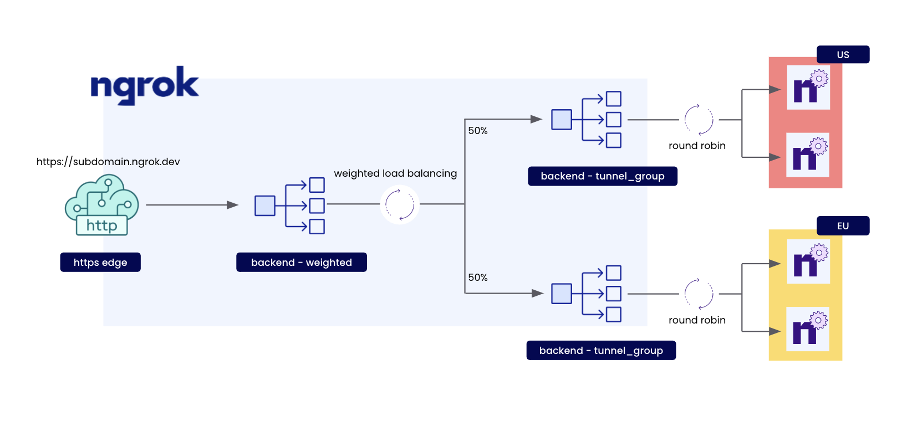

<!-- prettier-ignore -->
<!-- Imports -->

import TabItem from "@theme/TabItem";
import Tabs from "@theme/Tabs";

<!-- Guide -->

# How to do Weighted Round-Robin Load Balancing with ngrok Cloud Edges



The purpose of **Load balancing** is to improve application performance and reduce burden by distributing incoming traffic
across servers. This leads to faster response times for user-facing applications.

**Weighted Round-robin load balancing** while similar to [round-robin load balancing](how-to-round-robin-load-balance-with-ngrok-cloud-edges.mdx)
here you can assign a numeric weight to all of the applications behind the load balancer. Weights can be
assigned based on factors such as the application state, server’s processing power or total bandwidth.

## Prerequisites

To follow this guide, you will need:

1. An [ngrok Pro or Enterprise account](https://ngrok.com/pricing).
1. A local computer with `ngrok` installed [by following our installation guides](https://ngrok.com/download).

If you are going to be following along using **ngrok CLI**, you will need:

- An [ngrok API key](https://dashboard.ngrok.com/api) configured on your [ngrok agent](http://localhost:3000/docs/ngrok-agent/ngrok/#ngrok-api).

If you are going to be following along using **CURL**, you will need:

- An [ngrok API key](https://dashboard.ngrok.com/api) as an environment variable named `NGROK_API_KEY`.

## **Step 1** — Create a Reserved Domain

We're going to be using ngrok edges to load balance across multiple tunnels.

To start load balancing traffic with ngrok edges, you need to have a reserved domain.
Let’s reserve a subdomain on `ngrok.app`:

<Tabs groupId="guide">
<TabItem value="cli" label="ngrok CLI" default>

```bash
ngrok api reserved-domains create \
	--url ${NGROK_SUBDOMAIN}.ngrok.app
```

- Replace or set `NGROK_SUBDOMAIN` as the subdomain you'd like to use for this guide.

</TabItem>
<TabItem value="curl" label="CURL">

```bash
curl \
	-X POST https://api.ngrok.com/reserved_domains \
	-H "Authorization: Bearer ${NGROK_API_KEY}" \
	-H "Content-Type: application/json" \
	-H "Ngrok-Version: 2" \
	-d @- <<BODY
	{
		"name":"${NGROK_SUBDOMAIN}.ngrok.app",
	}
BODY
```

- Replace or set `NGROK_API_KEY` to your ngrok API key.
- Replace or set `NGROK_SUBDOMAIN` as the subdomain you'd like to use for this guide.

</TabItem>
</Tabs>

After running, you should see the following:

```json
200 OK
{
   "id":"rd_2MT5Bqt0UzU0mFQ0zr8m1UQWCfm",
   ...
}
```

When you have completed this step, you can move on to the next step.

## **Step 2** — Create a ngrok Cloud Edge

Now we can create a ngrok Cloud Edge that points to our
newly reserved domain on port `443`:

<Tabs groupId="guide">
<TabItem value="cli" label="ngrok CLI" default>

```bash
ngrok api edges https create \
	--description "my edge" \
	--hostports "${NGROK_SUBDOMAIN}.ngrok.app:443"
```

- Replace or set `NGROK_SUBDOMAIN` with the value used in the previous step.

</TabItem>

<TabItem value="curl" label="CURL">

```bash
curl \
	-X POST https://api.ngrok.com/edges/https \
	-H "Authorization: Bearer {NGROK_API_KEY}" \
	-H "Content-Type: application/json" \
	-H "Ngrok-Version: 2" \
	-d @- <<BODY
	{
		"description": "",
		"metadata": "{}",
		"hostports": ["{NGROK_SUBDOMAIN}.ngrok.app:443"]
	}
BODY
```

- Replace or set `NGROK_API_KEY` to your ngrok API key.
- Replace or set `NGROK_SUBDOMAIN` with the value used in the previous step.

</TabItem>
</Tabs>

After running, you should see:

```json
{
  "id": "edghts_2MT9nzunlKgQ0KRfmA5QK5iiI1J",
  ...
  "hostports": [
    "${NGROK_SUBDOMAIN}.ngrok.app:443"
  ],
  ...
}
```

Export the `id` value as a new environment variable named `NGROK_EDGE_ID`:

```bash
export NGROK_EDGE_ID={your_id_here}
```

Now that we have an edge, we can move onto the next step.

## **Step 3** — Create Tunnel Group Backends

Now that we have an edge we can begin to build the parts to do weighted load balancing.

Lets create two tunnel-group backends to do traffic management on our
edge.

### Create our first backend with label `region=us`:

<Tabs groupId="guide">
<TabItem value="cli" label="ngrok CLI" default>

```bash
ngrok api backends tunnel-group create \
	--labels region=us \
	--description "us tunnel group"
```

</TabItem>
<TabItem value="curl" label="CURL">

```bash
curl \
	-X POST https://api.ngrok.com/backends/tunnel_group \
	-H "Authorization: Bearer ${NGROK_API_KEY}" \
	-H "Content-Type: application/json" \
	-H "Ngrok-Version: 2" \
	-d @- <<BODY
	{
		"description": "us tunnel group",
		"metadata": "{}",
		"labels": {
				"region": "us"
		}
	}
BODY
```

- Replace or set `NGROK_API_KEY` to your ngrok API key.

</TabItem>
</Tabs>

You will get something back like:

```json
{
   "id":"bkdtg_2MT8j8IV1adEW9TbG5c9ypJwCHY",
   ...
}
```

Export the returned `id` as a variable:

```bash
export NGROK_US_BACKEND_ID={your_id_here}
```

### Create our second backend with label `region=eu`:

<Tabs groupId="guide">
<TabItem value="cli" label="ngrok CLI" default>

```bash
ngrok api backends tunnel-group create \
	--labels region=eu \
	--description "eu tunnel group"
```

</TabItem>
<TabItem value="curl" label="CURL">

```bash
curl \
	-X POST https://api.ngrok.com/backends/tunnel_group \
	-H "Authorization: Bearer ${NGROK_API_KEY}" \
	-H "Content-Type: application/json" \
	-H "Ngrok-Version: 2" \
	-d @- <<BODY
	{
		"description": "eu tunnel group",
		"metadata": "{}",
		"labels": {
			"group": "eu"
		}
	}
BODY
```

- Replace or set `NGROK_API_KEY` to your ngrok API key.

</TabItem>
</Tabs>

You will get something back like:

```json
{
   "id":"bkdtg_2MT8j8IV1adEW9TbG5c9ypJwCHY",
   ...
}
```

Export the returned `id` as a variable:

```bash
export NGROK_EU_BACKEND_ID={your_id_here}
```

Now that we have our tunnel-group backends, we can move onto the next step.

## **Step 4** - Create a Weighted Backend

Now that we have our two region tunnel groups we need to create a weighted backend to distribute incoming traffic on our edge between them:

<Tabs groupId="guide">
<TabItem value="cli" label="ngrok CLI" default>

```bash
ngrok api backends weighted create \
	--description "weighted round-robin guide" \
  --backends "${NGROK_US_BACKEND_ID}=50" \
  --backends "${NGROK_EU_BACKEND_ID}=50"
```

- Replace or set `NGROK_US_BACKEND_ID` to the id returned in step 3.
- Replace or set `NGROK_EU_BACKEND_ID` to the id returned in step 3.
- ℹ️ Backend weights can be any valid integer between `0` to `10000`

</TabItem>

<TabItem value="curl" label="CURL">

```bash
curl \
	-X POST https://api.ngrok.com/backends/weighted \
	-H "Authorization: Bearer {NGROK_API_KEY}" \
	-H "Content-Type: application/json" \
	-H "Ngrok-Version: 2" \
	-d @- <<BODY
	{
		"description": "weighted round-robin guide",
		"metadata": "{}",
		"backends": {
			"{NGROK_US_BACKEND_ID}": 50,
			"{NGROK_EU_BACKEND_ID}": 50
		}
	}
BODY
```

- Replace or set `NGROK_API_KEY` to your ngrok API key.
- Replace or set `NGROK_US_BACKEND_ID` to the id returned in step 3.
- Replace or set `NGROK_EU_BACKEND_ID` to the id returned in step 3.
- ℹ️ Backend weights can be any valid integer between `0` to `10000`

</TabItem>
</Tabs>

You should see the following output indicating we have created a new backend with our tunnel-groups weighted:

```json
{
   "id": "bkdwd_2MTK3Cp9rJ8CSDIy4K9blxYYEVH",
   ...
   "backends": {
      "bkdtg_2MT8j8IV1adEW9TbG5c9ypJwCHY": 50,
      "bkdtg_2MTDvvlnNPBcoj5LNJzWsc0TQIr": 50
   }
}
```

Export the returned `id` as a variable:

```bash
export NGROK_BACKEND_ID={your_id_here}
```

Now that we have the backend for our route, let's move on to the next step of creating our route.

## **Step 5** — Create a Catch-All Route

Now that we have an edge and our backend, we need a way to route incoming traffic across
our tunnels.

Let's create a catch-all route by using `path_prefix` matching on the path `/` that will handle all incoming traffic on our edge to our newly created backend:

<Tabs groupId="guide">
<TabItem value="cli" label="ngrok CLI" default>

```bash
ngrok api edges https-routes create ${NGROK_EDGE_ID} \
	--backend.backend-id ${NGROK_BACKEND_ID} \
	--match "/" \
	--match-type path_prefix
```

- Replace or set `NGROK_EDGE_ID` to the id returned in step 2.
- Replace or set `NGROK_BACKEND_ID` to the id returned in step 4.

</TabItem>

<TabItem value="curl" label="CURL">

```bash
curl \
	-X POST https://api.ngrok.com/edges/https/${NGROK_EDGE_ID}/routes \
	-H "Authorization: Bearer ${NGROK_API_KEY}" \
	-H "Content-Type: application/json" \
	-H "Ngrok-Version: 2" \
	-d @- <<BODY
	{
		"match_type":"path_prefix",
		"match":"/",
		"description":"",
		"backend": {
			"enabled": true,
			"backend_id": "${NGROK_BACKEND_ID}"
		},
		"metadata":"{}"
	}
BODY
```

- Replace or set `NGROK_EDGE_ID` to the id returned in step 2.
- Replace or set `NGROK_API_KEY` to your ngrok API key.
- Replace or set `NGROK_BACKEND_ID` to the id returned in step 4.

</TabItem>

</Tabs>

After running, you should get back a route with our edge and backend configured:

```json
{
   "edge_id":"edghts_2MT9nzunlKgQ0KRfmA5QK5iiI1J",
   "id":"edghtsrt_2MTB6f41P74iHbyijXV4VCFcDKm",
   ...
   "backend":{
      "enabled":true,
      "backend":{
         "id":"bkdwd_2MTK3Cp9rJ8CSDIy4K9blxYYEVH",
         "uri":"https://api.ngrok.com/backends/tunnel_group/bkdwd_2MTK3Cp9rJ8CSDIy4K9blxYYEVH"
      }
   },
   ...
}
```

Once you have followed the steps above, you can starting weighted load balanced tunnels on your ngrok Cloud Edge the next step.

## **Step 5** — Starting tunnels on your ngrok Cloud Edge

We have reached the point where we can now start to load balance our tunnels across the ngrok Cloud Edge by running `ngrok tunnel` with our tunnel group labels.

Let's start by running a tunnel on the label `region=us` with the region flag set to `us`:

```bash
ngrok tunnel --region us --label region=us 80
```

And start some tunnels on `region=eu` with the region flag set to `eu`:

```bash
ngrok tunnel --region eu --label region=eu 80
```

Now any traffic that flows through `${NGROK_SUBDOMAIN}.ngrok.app` will be distributed and round robin load balanced 50/50 across agents on both regions.

> 📝 To create more agents in a region re-run the commands above in a new terminal or machine.

## Conclusion

In this tutorial we went over how to setup and create ngrok Cloud Edge tunnel groups and weighted backends with multiple tunnel groups applied to a Cloud Edge route to do weighted load balancing across tunnels in multiple agent regions.
