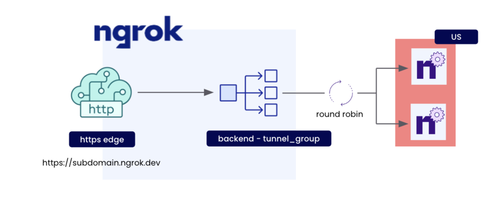

<!-- prettier-ignore -->
<!-- Imports -->

import TabItem from "@theme/TabItem";
import Tabs from "@theme/Tabs";

<!-- Guide -->



The purpose of **Load balancing** is to improve application performance and reduce burden by distributing incoming
traffic across servers. This leads to faster response times for user-facing applications.

**Round-robin load balancing** is a simple method to distribute client requests among a group of services. To do this,
the load balancer goes through the list of servers and sends each request to the next server in the list, starting
again from the beginning after reaching the end of the list.

## Prerequisites

To follow this guide, you will need:

1. An [ngrok Pro or Enterprise account](https://ngrok.com/pricing).
1. A local computer with `ngrok` installed [by following our installation guides](https://ngrok.com/download).

If you are going to be following along using **ngrok CLI**, you will need:

- An [ngrok API key](https://dashboard.ngrok.com/api) configured on your [ngrok agent](http://localhost:3000/docs/ngrok-agent/ngrok/#ngrok-api).

If you are going to be following along using **CURL**, you will need:

- An [ngrok API key](https://dashboard.ngrok.com/api) as an environment variable named `NGROK_API_KEY`.

## **Step 1** — Create a Reserved Domain

We're going to be using ngrok edges to load balance across multiple tunnels.

To start load balancing traffic with ngrok edges, you need to have a reserved domain.
Let’s reserve a subdomain on `ngrok.app`:

<Tabs groupId="guide">
<TabItem value="cli" label="ngrok CLI" default>

```bash
ngrok api reserved-domains create \
	--url ${NGROK_SUBDOMAIN}.ngrok.app
```

- Replace or set `NGROK_SUBDOMAIN` as the subdomain you'd like to use for this guide.

</TabItem>
<TabItem value="curl" label="CURL">

```bash
curl \
	-X POST https://api.ngrok.com/reserved_domains \
	-H "Authorization: Bearer ${NGROK_API_KEY}" \
	-H "Content-Type: application/json" \
	-H "Ngrok-Version: 2" \
	-d @- <<BODY
	{
		"name":"${NGROK_SUBDOMAIN}.ngrok.app",
	}
BODY
```

- Replace or set `NGROK_API_KEY` to your ngrok API key.
- Replace or set `NGROK_SUBDOMAIN` as the subdomain you'd like to use for this guide.

</TabItem>

</Tabs>

After running, you should see the following:

```json
200 OK
{
   "id":"rd_2MT5Bqt0UzU0mFQ0zr8m1UQWCfm",
   ...
}
```

When you have completed this step, you can move on to the next step.

## **Step 2** — Create a ngrok Cloud Edge

Now we can create a ngrok Cloud Edge that points to our
newly reserved domain on port `443`:

<Tabs groupId="guide">
<TabItem value="cli" label="ngrok CLI" default>

```bash
ngrok api edges https create \
	--description "my edge" \
	--hostports "${NGROK_SUBDOMAIN}.ngrok.app:443"
```

- Replace or set `NGROK_SUBDOMAIN` with the value used in the previous step.

</TabItem>
<TabItem value="curl" label="CURL">

```bash
curl \
	-X POST https://api.ngrok.com/edges/https \
	-H "Authorization: Bearer ${NGROK_API_KEY}" \
	-H "Content-Type: application/json" \
	-H "Ngrok-Version: 2" \
	-d @- <<BODY
	{
		"description": "",
		"metadata": "{}",
		"hostports": ["${NGROK_SUBDOMAIN}.ngrok.app:443"]
	}
BODY
```

- Replace or set `NGROK_API_KEY` to your ngrok API key.
- Replace or set `NGROK_SUBDOMAIN` with the value used in the previous step.

</TabItem>

  </Tabs>

After running, you should see:

```json
{
  "id": "edghts_2MT9nzunlKgQ0KRfmA5QK5iiI1J",
  ...
  "hostports": [
    "${NGROK_SUBDOMAIN}.ngrok.app:443"
  ],
  ...
}
```

Export the `id` value as a new environment variable named `NGROK_EDGE_ID`:

```bash
export NGROK_EDGE_ID=your-edge-id
```

Now that we have an edge, we can move onto the next step.

## **Step 3** — Create a Tunnel Group Backend

Now that we have an edge we can begin to build the parts to load balance.
Lets create a tunnel-group backend to do traffic management on our
edge with a label named `region=us`:

<Tabs groupId="guide">
<TabItem value="cli" label="ngrok CLI" default>

```bash
ngrok api backends tunnel-group create \
	--labels region=us \
	--description "us tunnel group"
```

</TabItem>
<TabItem value="curl" label="CURL">

```bash
curl \
	-X POST https://api.ngrok.com/backends/tunnel_group \
	-H "Authorization: Bearer ${NGROK_API_KEY}" \
	-H "Content-Type: application/json" \
	-H "Ngrok-Version: 2" \
	-d @- <<BODY
	{
		"description": "us tunnel group",
		"metadata": "{}",
		"labels": {
				"region": "us"
		}
	}
BODY
```

- Replace or set `NGROK_API_KEY` to your ngrok API key.

</TabItem>

  </Tabs>

After running, you should see:

```json
{
   "id":"bkdtg_2MT8j8IV1adEW9TbG5c9ypJwCHY",
   ...
   "labels":{
      "region":"us"
   },
   "tunnels":[]
}
```

Export the `id` value as a new environment variable named `NGROK_BACKEND_ID`:

```bash
export NGROK_BACKEND_ID=your-tunnel-group-id
```

Now that we have a tunnel-group backend, we can move onto the next step.

## **Step 4** — Create a Catch-All Route

Now that we have an edge and a backend, we need a way to route incoming traffic across
tunnels.

Let's create a catch-all route by using `path_prefix` matching on the path `/` that will handle all incoming traffic on our edge to our newly created backend:

<Tabs groupId="guide">
<TabItem value="cli" label="ngrok CLI" default>

```bash
ngrok api edges https-routes create ${NGROK_EDGE_ID} \
	--backend.backend-id ${NGROK_BACKEND_ID} \
	--match "/" \
	--match-type path_prefix
```

- Replace or set `NGROK_EDGE_ID` to the id returned in step 2.
- Replace or set `NGROK_BACKEND_ID` to the id returned in step 3.

</TabItem>
<TabItem value="curl" label="CURL">

```bash
curl \
	-X POST https://api.ngrok.com/edges/https/${NGROK_EDGE_ID}/routes \
	-H "Authorization: Bearer ${NGROK_API_KEY}" \
	-H "Content-Type: application/json" \
	-H "Ngrok-Version: 2" \
	-d @- <<BODY
	{
		"match_type":"path_prefix",
		"match":"/",
		"description":"",
		"backend": {
			"enabled": true,
			"backend_id": "${NGROK_BACKEND_ID}"
		},
		"metadata":"{}"
	}
BODY
```

- Replace or set `NGROK_EDGE_ID` to the id returned in step 2.
- Replace or set `NGROK_API_KEY` to your ngrok API key.
- Replace or set `NGROK_BACKEND_ID` to the id returned in step 3.

</TabItem>

  </Tabs>

After running, you should get back a route with our edge and backend configured:

```json
{
   "edge_id":"edghts_2MT9nzunlKgQ0KRfmA5QK5iiI1J",
   "id":"edghtsrt_2MTB6f41P74iHbyijXV4VCFcDKm",
   ...
   "backend":{
      "enabled":true,
      "backend":{
         "id":"bkdtg_2MUbdZZ5pveqjETbhn2Gyu9mu3d",
         "uri":"https://api.ngrok.com/backends/tunnel_group/bkdtg_2MUbdZZ5pveqjETbhn2Gyu9mu3d"
      }
   },
   ...
}
```

Once you have followed the steps above, you can move onto load balancing traffic across your ngrok Cloud Edge the next step.

## **Step 5** — Run multiple agents on your ngrok Cloud Edge

We have reached the point where we can now start to load balance our agents across the ngrok Cloud Edge by running `ngrok tunnel` with our edge label:

```bash
ngrok tunnel --label region=us 80
```

Now all traffic flowing through `${YOUR_SUBDOMAIN}.ngrok.app` will be round-robin load balanced across all tunnels created with this label.

## Conclusion

In this tutorial we went over how to setup and create ngrok Cloud Edges to round-robin load balance ngrok traffic to your application.
