## Introduction

This guide explains how to monitor your API or web app with ngrok by viewing traffic reports, using error request replays, and exporting logs and events to an external dashboard.

Whether you're an existing ngrok user looking to make your API more robust or a new user wondering whether ngrok meets your needs, this tutorial will demonstrate monitoring in detail.

:::note
I use the terms "API" and "app" interchangeably in this article, as ngrok can monitor any web server.
:::

## Prerequisites

To follow along with this tutorial, you need:

- **An ngrok account:** A free account is sufficient. If you don't have one, [sign up here](https://dashboard.ngrok.com/signup).
- **A simple app that runs locally using [Docker](https://docs.docker.com/get-started/get-docker):** Even if you have an existing API you want to monitor, you can use the sample app in this guide to avoid making changes to your real one.

## Create an example API to monitor

Let's create the simplest possible app to monitor.

:::note
If you already have an app running on ngrok, you can skip to the [traffic inspector](#traffic-inspector) section.
:::

The TypeScript code below runs a web server that randomly returns a success or a failure to any request it receives.

- Save the code to a file called `server.ts`.

```js
const randomServerName = Math.floor(Math.random() * 900 + 100).toString();

Deno.serve({'hostname': '0.0.0.0', 'port': 80 }, handler);

async function handler(request: Request): Promise<Response> {
  if (Math.random() > 0.5) {
    const msg = 'Server ' + randomServerName + ' at time ' + Date.now() + ' has success response to request at ' + request.url;
    console.log(msg);
    return new Response(msg, { status: 200 });
  }
  const msg = 'Server ' + randomServerName + ' at time ' + Date.now() + ' has error response to request at ' + request.url;
  console.log(msg);
  return new Response(msg, { status: 500 });
}
```

- In the location where you saved the file, open your terminal and run the command below to start the API.

```sh
docker network create ngrokTest

docker run --platform=linux/amd64 --rm -p 7777:80 --network=ngrokTest -v ".:/app" -w "/app" --name="api" denoland/deno:alpine-2.1.3 sh -c  "deno run --allow-net --unstable-detect-cjs ./server.ts"
```

This command runs the Docker image for Deno, exposing the API locally on port 7777, names the Docker container `api`, and removes the container upon exiting with `--rm`. You can now browse to http://localhost:7777 to test the app.

:::note
The app uses a named network, `ngrokTest`, so that in the next section, you can start the ngrok agent on the same network as the app.
:::

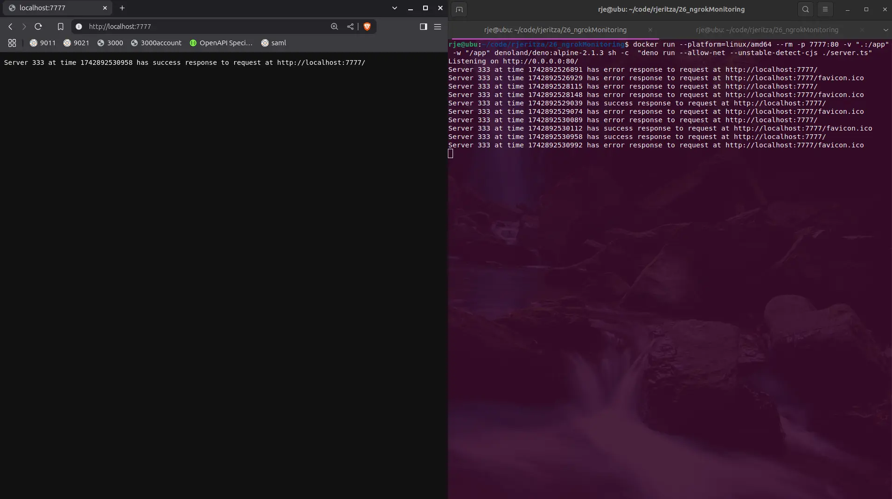

## Publish your app with ngrok

Now that the app is running locally, you can expose it on a public URL, using the [Docker image for the ngrok agent](https://hub.docker.com/r/ngrok/ngrok).

Replace the authentication token in the command below with your token from the [ngrok dashboard](https://dashboard.ngrok.com/get-started/your-authtoken), and run the command in a new terminal.

```sh
docker run -it --rm --platform=linux/amd64 --network=ngrokTest -e NGROK_AUTHTOKEN=Y0urS3cr3tK3y ngrok/ngrok:3.22.0-alpine-amd64 http http://api
```

This command starts the ngrok agent locally and connects it to the app running on container `api`.

Browse to the URL labeled `Forwarding`, which should look like this in your terminal:`https://eb45-79-127-145-72.ngrok-free.app`.

You can now see your request going from the browser to the ngrok agent you're running in one terminal window and then to the Deno API in your other terminal window.

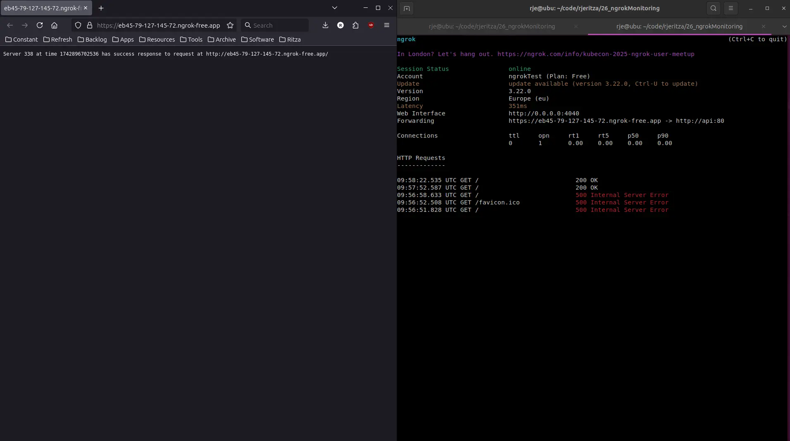

## Monitor your app

You can monitor web servers in two ways in ngrok, with the Traffic Inspector and with Events.

The traffic inspector is a filterable list of your API's requests and responses, available on the ngrok dashboard.  The traffic inspector is useful for viewing error details and for replaying requests to test new policies and bug fixes. The inspector is a manual way to monitor your app. Request data is kept for three days (or for 90 days as a paid extra).

An event is the data that ngrok provides about a request. This data is then exported to a dedicated monitoring platform. Events offer an automated means of monitoring your app. Events are also the only way for your team to get automatic error alerts (notifications) instead of constantly having to check for errors on a dashboard.

At the time of writing, ngrok only allows you to export events to AWS, Azure, and DataDog. We do not support event exports to OpenTelemetry or custom URLs, such as self-hosted servers, so you have to use a paid cloud service. You can't perform custom processing or use Elastic, Prometheus, Splunk, or alternative monitoring apps.

## Use the traffic inspector

Browse to the ngrok [traffic inspector](https://dashboard.ngrok.com/traffic-inspector) on your ngrok account dashboard.

The list of recent requests provides you with basic information, such as the time, origin, destination, duration, and response code of calls to your app. You can filter requests by these fields, for instance, to show only server error responses and not successes.

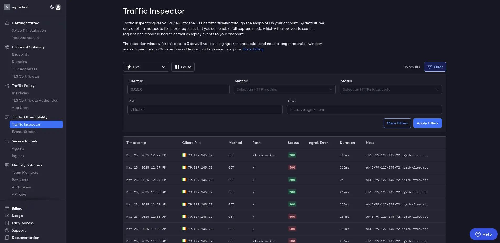

:::note
Requests made to the app at http://localhost:7777 will not be displayed in the inspector. Only requests that pass through the ngrok endpoint, and therefore the ngrok agent running in Docker, will be known to ngrok.
:::

To see more details about a request or to replay it, you need to enable full capture, which permits ngrok to store up to 10 KB of your request data.

Click a request in the traffic inspector list, then click **Enable full capture** in the sidebar.

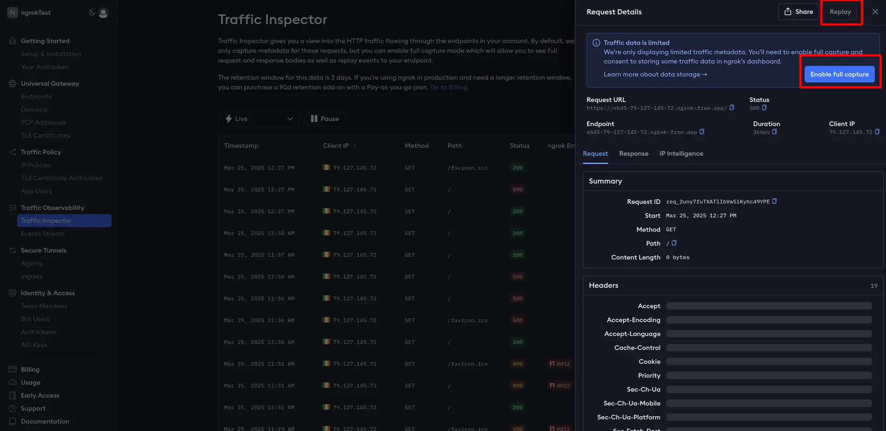

This button takes you to your account settings, where you can enable full capture under **Observability**.

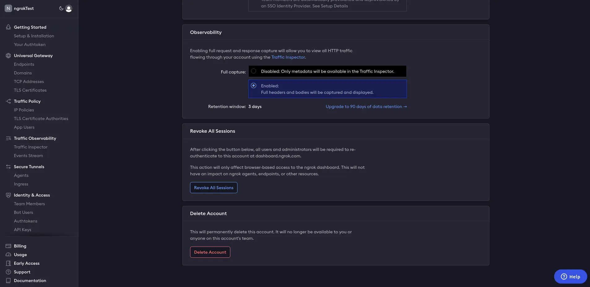

Then, return to your published API URL and refresh the browser page a few times to send fresh requests through ngrok.

In the ngrok traffic inspector, click on the event at the top of the list.

The event should now show all the request and response details and content. If the full capture details don't appear, you may need to restart your ngrok agent in the terminal.

Click the **Replay** button and notice that the request is resent from the ngrok host.

Due to a bug, you currently can't replay a request with a free ngrok account, despite the feature appearing available. Replay only works for paid accounts. This [bug](https://github.com/ngrok/ngrok-docs/issues/1247) may be fixed by the time you read this guide.

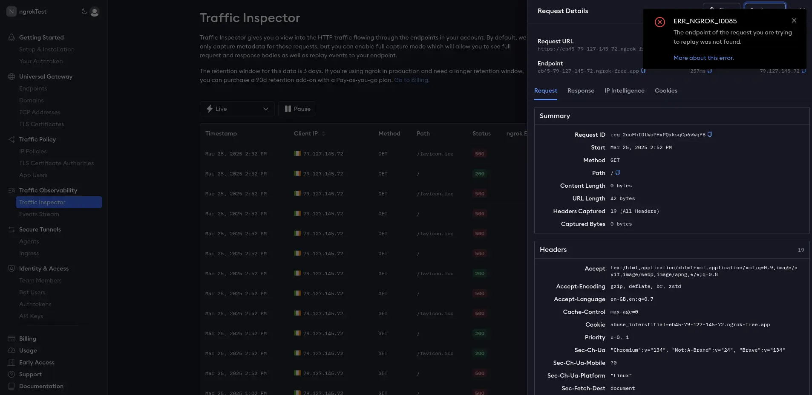

You can also replay a request with changes to alter any of the headers or POST data.

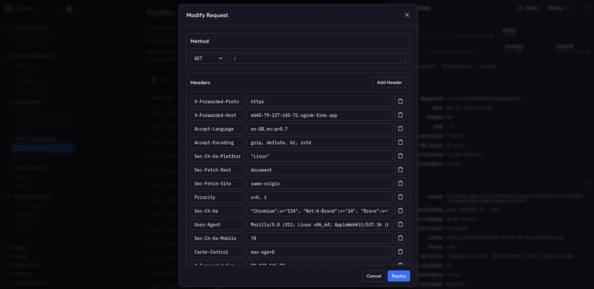

Replaying requests is useful for debugging. For example, you could find the request that caused an error in your app, deploy a fix for the app, and replay the request to confirm you’ve fixed the issue.

### Traffic policy example

You can also replay requests to test new [traffic policies](https://ngrok.com/docs/traffic-policy). ngrok applies the traffic policy rules in effect at the current time of replay, which may be different from the rules that were in effect when the original request was received.

You can use policies to request passwords, block malicious traffic, route requests, rewrite URLs, and respond with custom content. If you use a custom permanent domain name (called a [cloud endpoint](https://ngrok.com/docs/universal-gateway/cloud-endpoints)) on ngrok, you can set a policy for every agent that uses that domain. Otherwise, for temporary [agent points](https://ngrok.com/docs/universal-gateway/agent-endpoints), you can set a traffic policy inside each agent individually.

Let's look at rate limiting as an example of a traffic policy. Rate limiting is one of the many [traffic policy actions](https://ngrok.com/docs/traffic-policy/actions/rate-limit) available. At this stage of the guide, you could send unlimited requests to the test app you've created. Let's change that to allow only one request a minute.

In order to test policies, you need to be able to re-use the same URL, which isn't possible if you keep using the temporary URLs that ngrok generates each time you restart an agent. So let's create a permanent URL.

Browse to the **Domains** page in the ngrok sidebar. If you're using a free account, register for your free domain, like `massive-pelican-arguably.ngrok-free.app`. If you're using a paid account, create a new domain for this test.

Next, you need to stop and restart the ngrok container using a traffic policy.

Stop the ngrok Docker container in the terminal with <kbd>ctrl+c</kbd>.

Create a file named `policy.yml` with the code below.

```yml
on_http_request:
  - actions:
      - type: rate-limit
        config:
          name: 1 request per minute
          algorithm: sliding_window
          capacity: 1
          rate: 1m
          bucket_key:
            - req.headers['host']
```

Run the agent again with the command below. Replace the authentication token and the URL with your token and URL (using `https`, not `http`).

```sh
docker run -it --rm --platform=linux/amd64 --network=ngrokTest -v ".:/app" -w "/app" -e NGROK_AUTHTOKEN=Y0urS3cr3t ngrok/ngrok:3.22.0-alpine-amd64 http http://api --traffic-policy-file policy.yml --url https://massive-pelican-arguably.ngrok-free.app
```

Browse to the app URL and refresh the page a few times. Notice that the page stops responding.

On the ngrok traffic inspector page, note that the error code **429** (rate limit) was returned and that the duration of the request was instant and caused no load on your app.

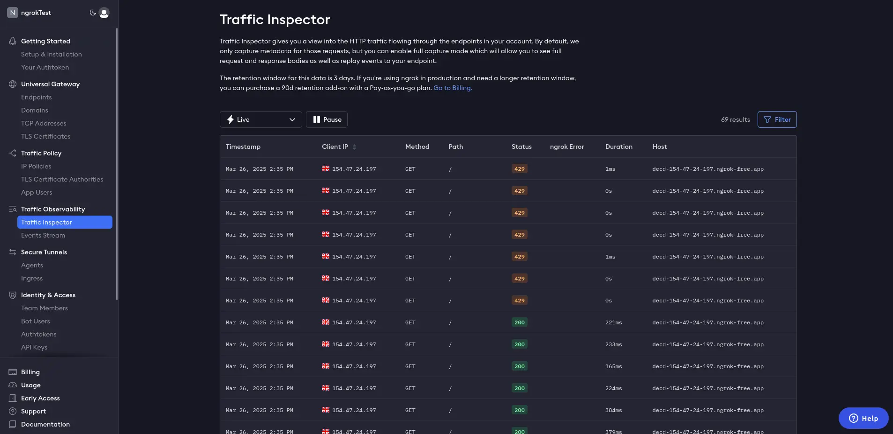

Edit the `policy.yml` file and change `capacity` to `10`, then restart the ngrok container.

In the traffic inspector, click on one of the **429** events, then click **Replay**. Note that the request now responds without error because the rate limit has been increased.

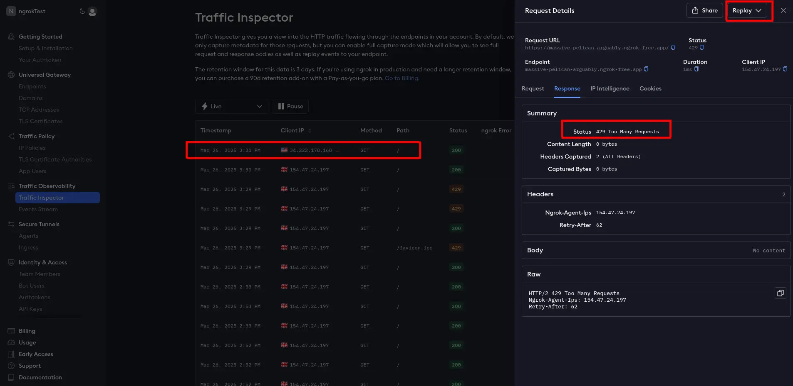

## Monitor events

In this section, you'll learn how to export ngrok [events](https://ngrok.com/docs/obs/events) to the Datadog monitoring service.

There are two [types of events](https://ngrok.com/docs/obs/events/reference): standard traffic events (requests to your API) and audit events (changes to secret keys and URLs). For this simple example, you'll monitor a traffic event.

Before adding an event subscription, you need somewhere to send events.

Sign up for a free [Datadog](https://www.datadoghq.com) trial account.

You can enter placeholder information for all the Datadog registration fields except your email address, which you need to confirm. You also can't skip the third step of the signup process, in which you create a Datadog agent somewhere.

In Step 3 of the Datadog signup, click on **Docker** in the sidebar. Copy and paste the given command into a terminal and run it.

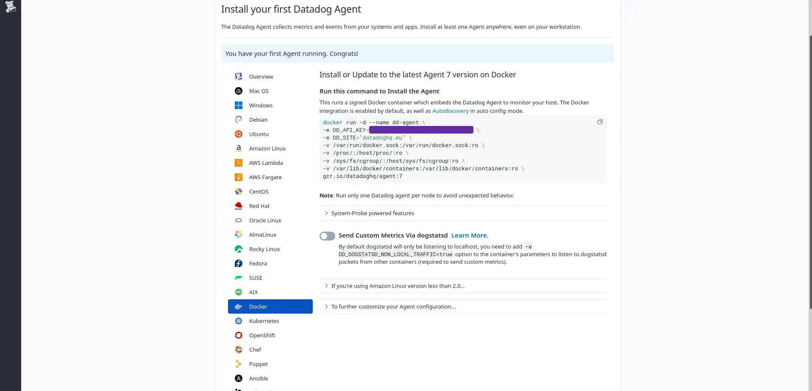

Once the Datadog site notices your agent is running, click **Finish** at the bottom of the page.

You now no longer need the agent running locally and can remove the DataDog container with the command below.

```sh
docker stop dd-agent
docker remove dd-agent
docker image rm gcr.io/datadoghq/agent:7
```

Note which Datadog site you're using by following the instructions in the [guide to getting started with Datadog sites](https://docs.datadoghq.com/getting_started/site/#access-the-datadog-site).

Take note of your Datadog API key, which you can access by clicking your username at the bottom left of the sidebar and clicking **API Keys** in the menu that opens.

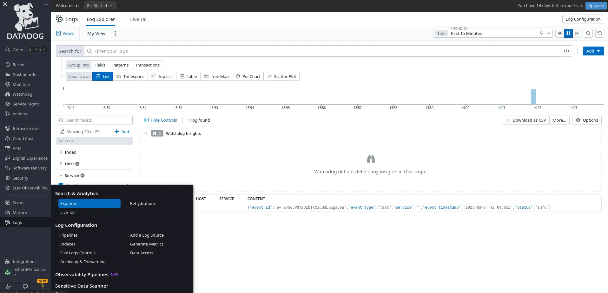

In the ngrok navigation panel, browse to the [**Events Stream**](https://dashboard.ngrok.com/event-subscriptions) and add a new subscription.

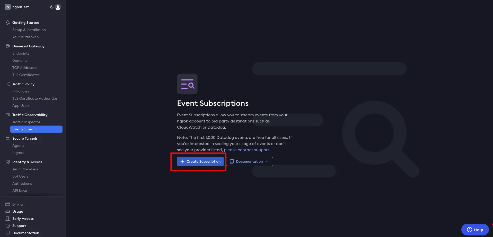

In the **New Event Subscription** sidebar, enter `traffic` as the **Description** and then **Add** a new source (event type). Choose **`http_request_complete`**.


Add Datadog as a destination, add the Datadog site and API key you noted earlier, and send a test event.

Open the Datadog site and browse to the **Log Explorer** page from the navigation panel. Enable logs. You should see that the event from ngrok has appeared.

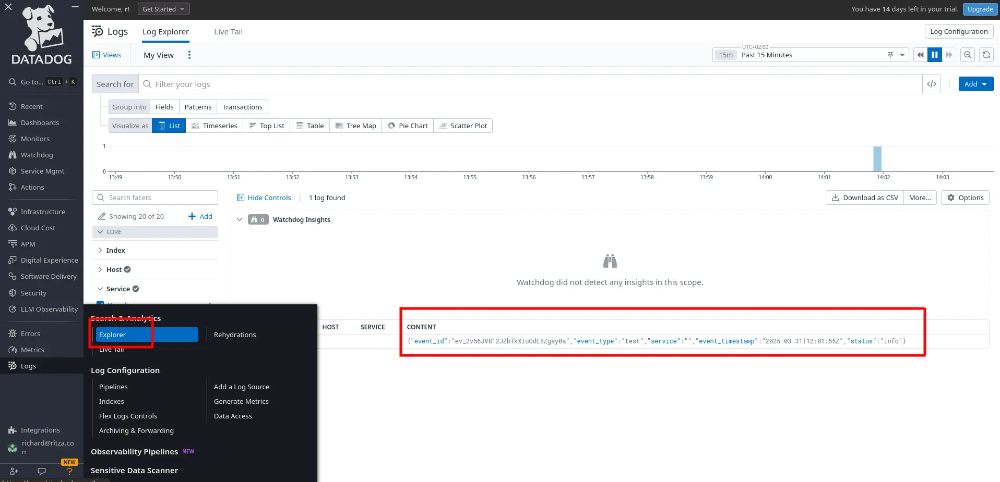

In ngrok, click **Done** and **Save**.

Refresh your ngrok app page a few times so that new requests are logged in Datadog, some with OK responses and some with errors.

## Create a dashboard

Now that events are being sent to Datadog, you can set up visualizations and notifications to allow your support team to monitor your API's performance.

In the Datadog site, browse to the **Dashboards > Dashboard List** page from the navigation panel. Click the **ngrok HTTP Events** item to view the default dashboard.

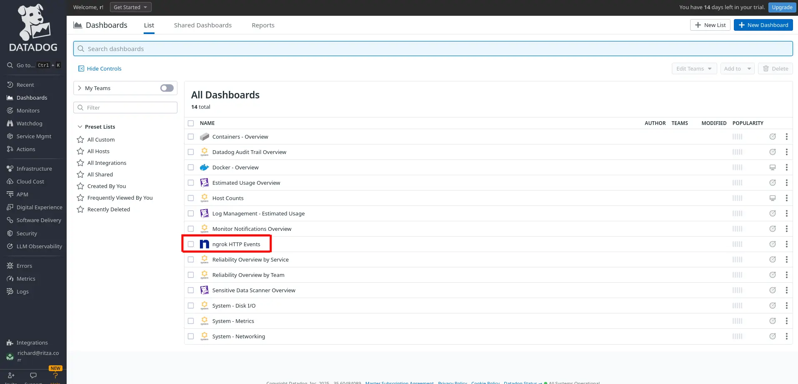

To add a new widget to the dashboard, you need to clone the default dashboard.

Click **Clone** at the top right of the page.

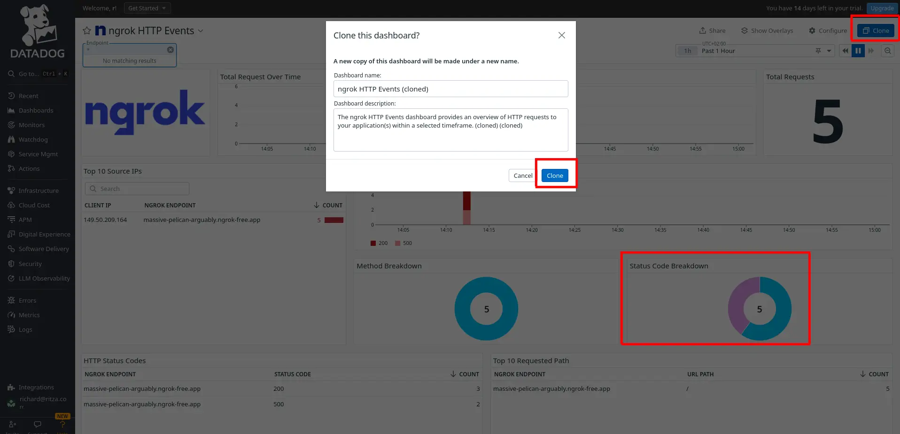

In the cloned dashboard, click **Add widget** and complete the steps as follows.

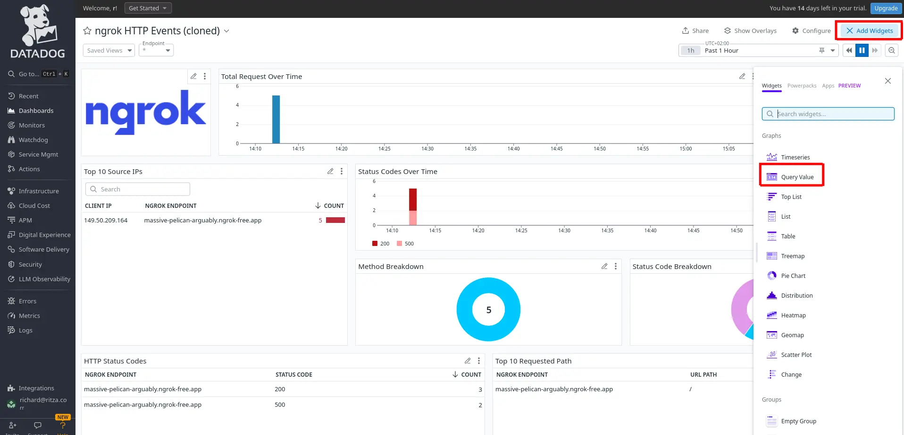

- **Step 1:** Choose **Query value** as your visualization.
- **Step 2:** Change **Metrics** to **Logs** (ngrok does not export metrics) and enter the log filter, `@http.status_code:500`, so that Datadog only counts errors
- **Step 3:** Set the time preference to **Past 1 Hour**.
- **Step 4:** Name the widget `Errors in the last hour`.

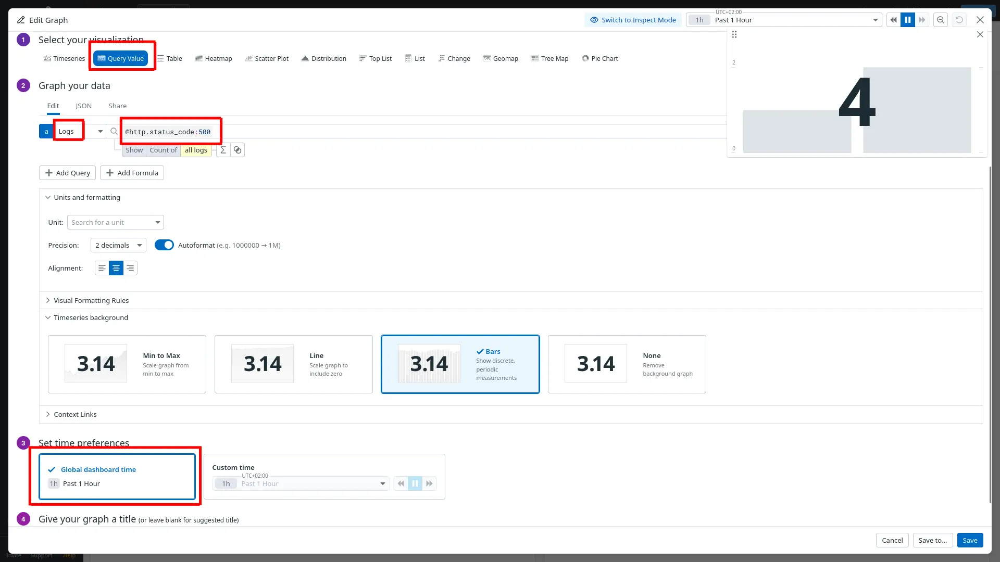

Your new widget will be available in the dashboard, allowing your support staff to see instantly whether any errors have occurred in your API.

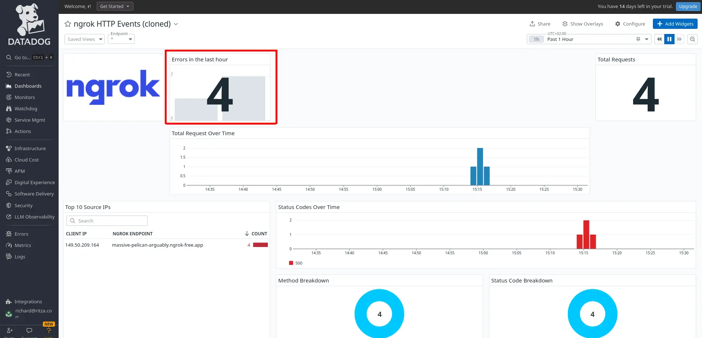

If you want to create widgets for other log information, you can see which fields are available by reading the JSON of any event you click on in the log inspector.

## Create a notification

To complete your monitoring system, you need to set up an alert that is pushed to your email or mobile app when an error occurs by adding a webhook integration to Datadog. Webhooks provide a way for you to send POST requests to https://ntfy.sh, a free notification service.

In Datadog, browse to **Integrations > Add integration > Webhooks**.

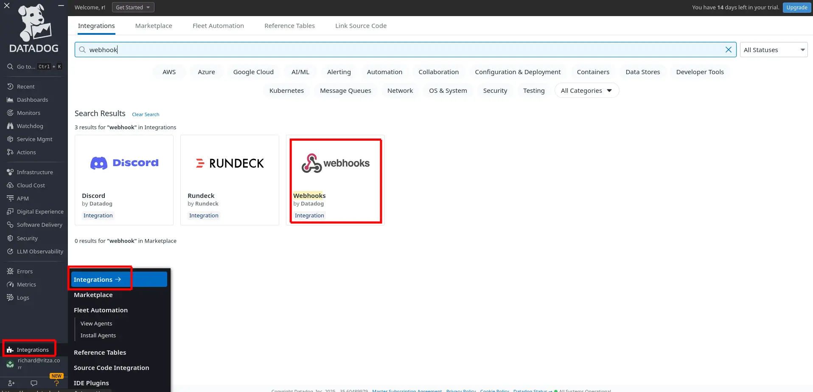

Under **Webhooks**, at the bottom of the configuration page, click **New**. Set the **Name** to `ntfy`, the **URL** to `https://ntfy.sh/ngrokTest`, and the **Payload** to **Blank**. Click **Save**.

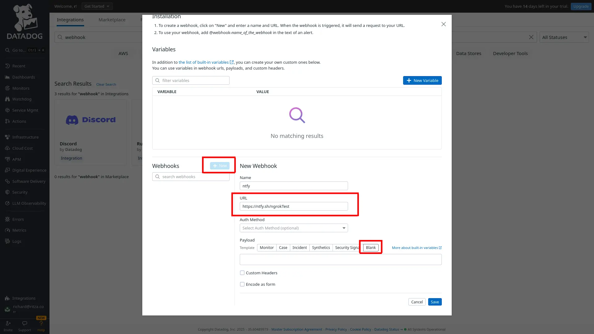

In the ngrok navigation panel, browse to the **Monitors > New monitor**. Choose **Logs**.

In the monitor configuration, choose **Query** for your monitor scope, set the search query to `@http.status_code:500`, the time to the **last 1 hour**, and the notification message to `@webhook-ntfy Your API has errors. Investigate at https://app.datadoghq.eu/dashboard.`.

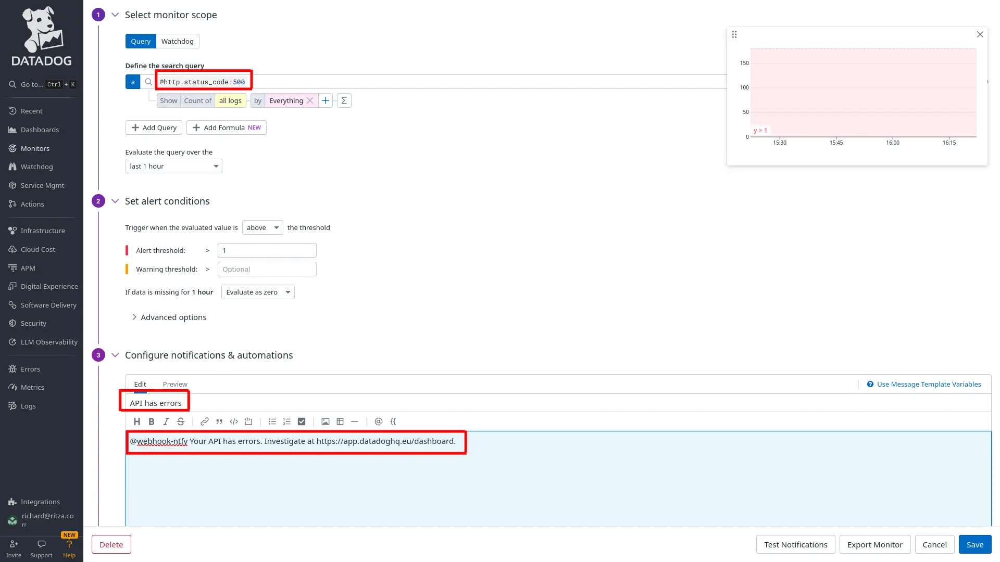

It's important that the `@webhook` name matches the webhook integration you created earlier. If the names don't match, the notification won't arrive.

Browse to the [the ngrok test channel on the ntfy website](https://ntfy.sh/ngrokTest).

Click **Test notifications** at the bottom of the Datadog page and send an alert with **Run tests**.

Notice that the alert appears on the ntfy page. You can install ntfy as a mobile app so that you are always aware of whether your API has errors.

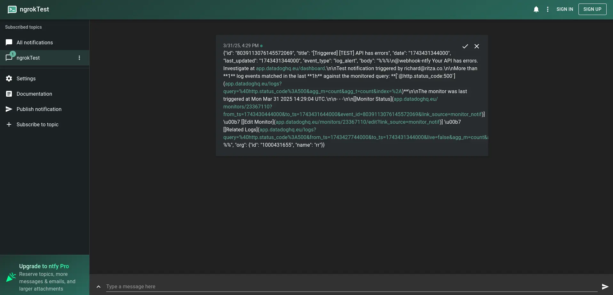

Save the monitor. Now, after a delay and once you've refreshed the ngrok endpoint for your app, you will receive a notification if an error occurs.

If you want to use a different notification system to ntfy, consider using email, Slack, Discord, WhatsApp, Threema, or Webhook.site.

## Further reading

You now know how to use ngrok to provide any public web app or API with Docker, how to monitor requests to the app in ngrok directly, how to export data to Datadog, and how to create dashboards and alerts.

To learn more about any of these concepts, consult the following:

- The [Get Docker](https://docs.docker.com/get-started/get-docker) guide
- The guide to [getting started with Docker for ngrok](https://dashboard.ngrok.com/get-started/setup/docker)
- The complete [Docker ngrok agent](https://ngrok.com/docs/using-ngrok-with/docker) documentation
- The [ngrok agent points](https://ngrok.com/docs/universal-gateway/agent-endpoints) documentation
- The [ngrok traffic policies](https://ngrok.com/docs/traffic-policy) documentation
- The [ngrok traffic policy actions](https://ngrok.com/docs/traffic-policy/actions/rate-limit) documentation
- The [ngrok cloud endpoints](https://ngrok.com/docs/universal-gateway/cloud-endpoints) documentation
- The [ngrok agent endpoints](https://ngrok.com/docs/universal-gateway/agent-endpoints) documentation
- The [ngrok events](https://ngrok.com/docs/obs/events) documentation
- [Datadog](https://www.datadoghq.com)
- [ntfy](https://ntfy.sh)
