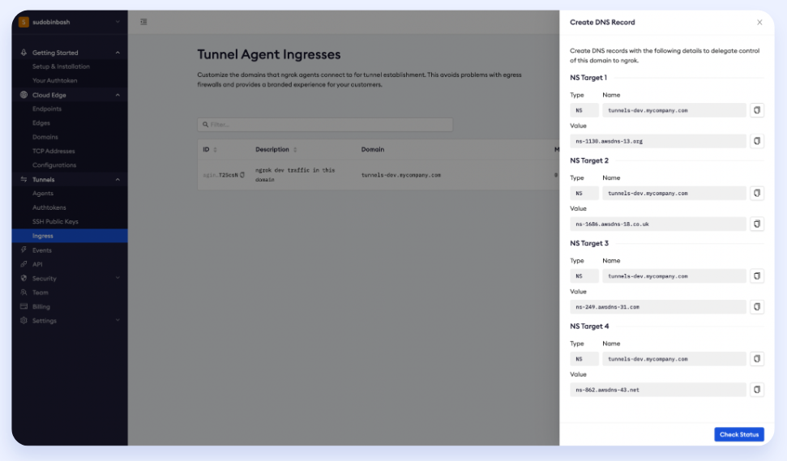

# Best security practices for developer productivity

:::note
This guide describes the best practices and features organizations can apply to consistently secure developers using ngrok while leveraging their existing security investments.
For a printed version, please [download the PDF](pathname:///other/best_practices_dev_security.pdf).

:::

## Table of contents

import TOCInline from '@theme/TOCInline';

<TOCInline toc={toc} />

## Introduction

ngrok is the leading way to make apps available on the internet, trusted by five million developers and recommended by category leaders — such as Twilio, GitHub, Okta, Microsoft, Zoom, and Shopify — for enabling remote access to apps and APIs running on localhost.

While developers use ngrok for productivity, organizations must ensure security controls — such as single sign-on, MFA, network security, auditing, and shadow IT policies — are consistently applied across all networks — including ngrok communications.

This guide describes the best practices and features organizations can apply to consistently secure developers using ngrok while leveraging their existing security investments.

### Why developers use ngrok?

Developers use ngrok to increase their productivity while building and validating software in two ways:

- **Exposing localhost apps to the internet for user access and collaboration**: In this use-case, developers expose localhost apps for public access so other peers — i.e., product designers, product managers, contractors, and users — can review and validate their work.
- **Exposing local environments, APIs, and webhooks for SaaS services and API clients**: In this use-case, developers expose webhooks and APIs running on localhost for integration tests with SaaS services — i.e., Slack & MS Team bots, Twilio webhook listeners, Zoom apps — and APIs clients — i.e., mobile apps, desktop apps, B2B services.

By enabling public access to their localhost apps/APIs, developers eliminate the repetitive tasks and time spent packaging and deploying their apps while testing and tweaking their apps for production usage, saving up to 90% time on each integrated test and review cycle:

### How does ngrok secure remote access?

While most developers begin and end their ngrok usage with simple connectivity, ngrok makes it easy to secure your network traffic by providing configurable modules for authentication, encryption, and network policies:

Leveraging and combining edge components allows you to meet your security requirements fast and without rearchitecting your services.

## Secure developer productivity

Many organizations allow developers to use ngrok at an individual level. In this deployment model, each developer owns and manage their ngrok tenants and decide which ngrok policies to use:

_Each developer manages their ngrok tenant with different levels of security_

This leads to three challenges:

- **Security inconsistency**: Each developer applies ngrok security based on their own needs and discretion, making security controls inconsistent.
- **No reuse of security investments**: Developers don't have access and bandwidth to appropriately leverage your company's security investments — such as MFA, SSO, and SIEM systems.
- **Difficulty for security oversight**: Security teams have multiple tenants to monitor and secure to keep developers productive and safe.

By following the best practices, organizations manage the ngrok usage in a single tenant, leveraging their security stack and the security team expertise while keeping developer developers happy and productive:

## Best practices

### 1. Elect a tenant for team usage

To implement security best practices consistently and enable security operations at scale, We recommend using a unified tenant for the team, with a limited number of administrators.

The process of electing and setting up a single tenant involves the following steps:

1. Subscribe to the team tenant and sign up as an administrator
1. Create administrative accounts for your security and management teams
1. Invite developers to use ngrok with limited access

Developers will receive an invitation in their emails to the unified tenant. On sign-in, developers can enter the setup command to reassociate their ngrok agent with your team tenant without reinstalling the ngrok agent:

_The process of onboarding ngrok users on the new tenant_

### 2. Add authentication to public-facing URLs

With OAuth and SAML SSO, you can leverage your company's identity solution (SSO/MFA) or social providers to restrict access to tunnels. ngrok enforces the authentication at the edge and block unauthorized calls before they reach your developer's apps, providing authentication, authorization, and auditing events while preventing reconnaissance campaigns and DDoS attacks to your developer apps.

ngrok lets you configure authentication in different ways:

#### Enterprise Authentication and MFA

Use any SAML or OIDC-compliant provider — such as Okta, Microsoft Azure AD or AD FS, Ping, and Auth0 — to control access to tunneled URLs. This integration leverages the strong authentication mechanisms and policies defined in your identity solution, such as Okta Verify, ThreatInsights, and FastPass, Azure Conditional Access, PingID's MFA, WebAuthn, and Yubikeys.

_Using Okta authentication to restrict access to ngrok tunnels_

#### Social Authentication

In addition to enterprise identity, you can use social providers — such as GitHub and Google — for authentication. Social identity providers deliver a lightweight option for securing contractors or temp workers without onboarding them in your enterprise SSO solution:

_Using GitHub for authentication_

To ensure only specific individuals or organizations are accessing your tunnels, restrict the social authentication based on the user email address or email domain:

_Restricting GitHub auth to john@contractor.com and users with the email ending in @acme-services.com and @acme-consulting.com_

### 3. Secure webhook communications

By using webhook verification, you can ensure only legitimate webhook calls are sent to your tunnels. The setup is available from the ngrok CLI — using the `--verify-webhook` argument — admin dashboard, and terraform provider.

#### Webhook Verification

_Configuring Webhook verification for PagerDuty_

With webhook verification, ngrok authenticates webhook request authenticity and message integrity at the edge. As a result, unauthorized calls are blocked even before they even reach your developer's apps, providing authentication and integrity while preventing reconnaissance campaigns and DDoS attacks. To learn more, check our [webhook verification](https://ngrok.com/docs/cloud-edge/modules/webhook/) docs and documentation of providers such as [GitHub](https://ngrok.com/docs/integrations/github/webhooks/), [Okta](https://ngrok.com/docs/integrations/okta/webhooks/), and [Twilio](https://ngrok.com/docs/integrations/twilio/webhooks/).

### 4. Enable IP Policies

IP Policies allow companies to restrict access to ngrok based on IPs on all ngrok network communications, including:

- Public access to your developer apps
- The ngrok Dashboard (Admin UI)
- The ngrok APIs (includes the ngrok REST APIs, Admin SDKs, and Terraform Provider)
- Where ngrok agents are launched (includes the ngrok agent and docker container)

An ngrok tenant can have multiple policies set for different communications. Each policy may contain multiple deny and allow rules to specific IPv4 and IPv6 addresses:

_Restricting access to approved IPs_

#### Combining IP Policies and other security controls

IP Policies can be combined with other security controls — such as network, identity, authentication, and device security — for a multi-layered security approach. Examples:

- Combining **IP Policies and SSO/MFA** helps ensure that **only authenticated users on approved networks** can access ngrok tunnels.
- Combining **IP Policies and webhook verification** helps ensure that **only webhook calls from expected IPs** — i.e., [Brex](https://developer.brex.com/docs/webhooks/#ip-whitelisting), [Castle](https://docs.castle.io/docs/webhooks#allowlisting-castle-ips), and [Zoom](https://developers.zoom.us/docs/api/rest/webhook-reference/#ip-addresses), **authenticated and with message integrity** can reach your developer environment.

### 5. Enforce and restrict ngrok agents with ACLs

After implementing access control, webhook security, and IP restrictions, companies must ensure developers launch only tunnels that adhere to security-defined policies. This enforcement can be achieved by using tunnel authtokens with ACLs.

Tunnel authtokens are the secret key used by ngrok agents to connect to the edge and enable remote access. By using ACLs at the authtoken level, security administrators can make sure tunnels are launched only if bound to specific policies, delivering consistent security:

_Using ACLs to restrict access to specific edges configurations and domains_

### 6. Track and block unauthorized tunnel activity

To ensure ngrok tunnels leverage right security policies, many organizations want to identify and block the use of independent ngrok accounts — using free plans and without the enterprise security controls — inside their networks. Organizations can accomplish that by defining custom ingress domains within ngrok while blocking free ngrok traffic.

With custom ingress domains, ngrok customers can define their own URLs for ngrok tunnel traffic within their networks — i.e., `tunnels-dev.mycompany.com`. This definition ensures that sanctioned ngrok traffic uses a dedicated URL, known and approved by IT. Any non-sanctioned traffic on `tunnel.ngrok.com` or `connect.ngrok-agent.com` can be blocked by the firewall at the URL level, without causing outages on approved tunnels:

_Defining a custom ingress: Picking an address_

_Defining a custom ingress: Configurations for your DNS server_

### 7. Add SSO and MFA to the admin UI

With Dashboard SSO, you can restrict access to the ngrok administrative interface only for users authenticated in your identity providers — such as Okta, Azure AD, Ping, AD FS, and Auth0. The ngrok dashboard SSO works with any SAML provider, and can be used with your identity provider MFA — i.e., Windows Hello, Okta Verify, FIDO, and PingID — to ensure two-factor authentication (2FA) in compliance with your security requirements.

## Conclusion

Developers use ngrok to increase productivity, exposing localhost apps/APIs for people, SaaS services, and API clients for collaboration and testing during development.

By following the best practices in this document, you can secure ngrok usage by leveraging your security stack and team's expertise, while keeping developer developers happy and productive.

## Learn more

- To learn more about ngrok’s capabilities: [https://ngrok.com/product](https://ngrok.com/product)
- To explore configuration options, visit [https://ngrok.com/docs](https://ngrok.com/docs)
