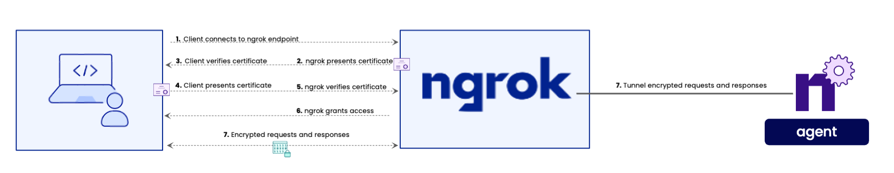

import ConfigExample from "/src/components/ConfigExample.tsx";

Mutual TLS Authentication (mTLS) is a network security protocol that ensures both the client _and_ server authenticate each other using digital certificates, providing encrypted and trusted communication between both parties. This is in contrast to standard TLS, where only the server is authenticated by the client.

By verifying the clients, the server owner is able to restrict access only to verified clients, strengthening security.



This guide will walk you through enabling mTLS on your ngrok hosted endpoints using [the `terminate-tls` Traffic Policy action](/docs/traffic-policy/actions/terminate-tls/).

## **Prerequisites**

A certificate authority (CA) is required for mTLS. The CA is responsible for issuing and digitally signing certificates (client certificates). The CA will also be used to verify the authenticity of the certificates.

1. CA certificate to be used by ngrok to verify the clients
2. Client certificates signed by the CA used to access the endpoints

Users are responsible for providing the CA and client certificates, ngrok will not generate them. The CA certificate will be uploaded and hosted on the ngrok SaaS platform. The client certificates will need to be distributed to any client/device that will need to access the endpoint.

Most organizations will have their own certificate mangement infrastructure, examples are provided below for creating the CA and client certificates. These examples of certificate creation are optional, and provided for reference/demo purposes.

## 1. Generate Certificates

We will create a new CA that will be used to sign the client certificate. This allows you to generate multiple client certificates that are trusted by the CA if needed.

```bash
# 1. Generate CA private key (ca.key)
openssl genpkey -algorithm RSA -out ca.key -pkeyopt rsa_keygen_bits:2048

# 2. Generate CA certificate (ca.crt)
openssl req -x509 -new -nodes -key ca.key -sha256 -days 365 -out ca.crt -subj "/CN=ExampleCA"

# 3. Generate client private key (client.key)
openssl genpkey -algorithm RSA -out client.key -pkeyopt rsa_keygen_bits:2048

# 4. Generate client certificate signing request (CSR) (client.csr)
openssl req -new -key client.key -out client.csr -subj "/CN=ExampleClient"

# 5. Generate client certificate (client.crt)
openssl x509 -req -in client.csr -CA ca.crt -CAkey ca.key -CAcreateserial -out client.crt -days 365 -sha256
```

These commands will result in five new files: `ca.key`, `ca.crt`, `client.key`, `client.csr`, and `client.key`. You will use the contents of `ca.crt` in your traffic policy to validate requests via `curl` which will use `client.key` and `client.crt`.

## 2. Create a Traffic Policy

Using the CA certificate generated in the previous step, you can specify the `mutual_tls_certificate_authorities` field in a traffic policy to trust the CA that issued the client certificate.

<ConfigExample
	snippetText={null}
	showLineNumbers={true}
	jsonMetastring="{5-12}"
	yamlMetastring="{4-10}"
	config={{
		on_tcp_connect: [
			{
				actions: [
					{
						type: "terminate-tls",
						config: {
							mutual_tls_certificate_authorities: [
								"-----BEGIN CERTIFICATE-----\n... certificate ...\n-----END CERTIFICATE-----",
							],
						},
					},
				],
			},
		],
	}}
/>

You may also optionally [upload the CA certificate](https://dashboard.ngrok.com/tls-cert-authorities) in the ngrok dashboard and use its ID in the `mutual_tls_certificate_authorities` array.

## 3. Start an endpoint with the Traffic Policy

```bash
ngrok http 8080 --url terminate-tls-example.ngrok.app --traffic-policy-file /path/to/policy.yml
```

## 4. Make a Request

Now you can make a request to the endpoint with the `--cert` and `--key` flags to specify the client certificate and private key.

```bash
curl --cert client.crt --key client.key https://terminate-tls-example.ngrok.app
```
