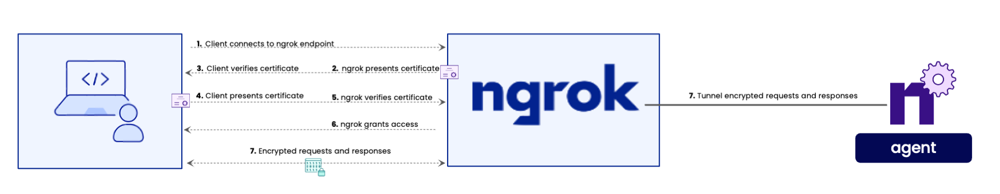

Mutual TLS Authentication (mTLS) is a method for providing security to sensitive applications in a zero trust security posture. This additional layer of security provides confidence by validating the identity of both the client and server before any transfer of data. In a majority of the TLS connections being made everyday, the client will verify the identity of the server confirming that the correct server is being accessed. For example, when accessing https://ngrok.com/docs, you will receive a certificate correctly identifying the server as ngrok.com.

mTLS adds an additional flow to the previous TLS server verification steps. The client will still verify the server's identity, but now the server will in turn also verify the identity of the client. By verifying the clients, the server owner is able to restrict access only to verified clients strengthening security.


This document will provide a quick start guide for how to enable mTLS on your ngrok hosted endpoints. For a deeper understanding for how mTLS is implemented within ngrok, reference the [Mutual TLS module page](https://ngrok.com/docs/cloud-edge/modules/mutual-tls/).

## **Prerequisites**

A certificate authority (CA) is required for mTLS. The CA is responsible for issuing and digitally signing certificates (client certificates). The CA will also be used to verify the authenticity of the certificates.

1. CA certificate to be used by ngrok to verify the clients
2. Client certificates signed by the CA used to access the endpoints

Users are responsible for providing the CA and client certificates, ngrok will not generate them. The CA certificate will be uploaded and hosted on the ngrok SaaS platform. The client certificates will need to be distributed to any client/device that will need to access the endpoint.

Most organizations will have their own certificate mangement infrastructure, examples are provided below for creating the CA and client certificates. These examples of certificate creation are optional, and provided for reference/demo purposes.

### Example - Create the CA

Generate the CA private key, providing a strong passphrase is desirable.<br></br>

```bash
openssl genrsa -aes256 -out ca.key 4096
```

Now we'll generate the CA certificate. Feel free to leave attribute fields blank by entering a period `.`. It's recommended to specify the CommonName, this will be used to identify the certificate authority.<br></br>

```bash
openssl req -new -x509 -sha256 -days 365 -key ca.key -out ca.crt
```

### Example - Create a Client Certificate

Generate the client private key<br></br>

```bash
openssl genrsa -out ngrokclient.key 2048
```

Create a signing request for the client private key. Feel free to leave attribute fields blank by entering a period `.`. It's recommended to specify the CommonName, this will be used to identify the client certificate.<br></br>

```bash
openssl req -new -key ngrokclient.key -out ngrokclient.csr
```

Use the CA certificate to sign the request and generate the client certificate<br></br>

```bash
openssl \
   x509 -req -days 365 -sha256 -in  ngrokclient.csr \
   -CA ca.crt -CAkey ca.key -set_serial 0x"$(openssl rand -hex 16)" -out ngrokclient.crt
```

## **Enable mTLS**

With the prerequisites being met, let's see how simple it is to enable mTLS with ngrok. Examples for using either the Agent CLI or ngrok Cloud Edges are provided below.

### Agent CLI

Specify the CA certificate when starting the tunnel.<br></br>

```bash
ngrok http 80 --mutual-tls-cas ca.crt
```

The command starts a ngrok HTTPs endpoint forwarding traffic to port 80 on your localhost. The specified CA cert is uploaded to the ngrok SaaS platform securing the endpoint with mTLS protection. When the agent is stopped, the endpoint is removed and the uploaded CA cert will be purged from ngrok.

### Cloud Edges

If using the Cloud Edges product, we'll need to upload the CA certificate creating a [Certificate Authority](https://ngrok.com/docs/api/resources/certificate-authorities/) object that will be referenced by the Cloud Edge mTLS module.
From within the [ngrok dashboard](https://dashboard.ngrok.com) follow the next steps.

#### Upload CA cert

- Navigate to [**Security** --> **TLS Certfiicate Authorities**](https://dashboard.ngrok.com/security/tls/cert-authorities) and click + Add a Certificate Authority.
- Upload or Paste in the contents of the CA certificate and click Continue.

#### Enable mTLS on Edge

- From within the [ngrok dashboard](https://dashboard.ngrok.com), navigate to [**Cloud Edge** --> **Edges**](https://dashboard.ngrok.com/cloud-edge/edges) and select your existing Edge or click on + New Edge to create either a HTTPs or TLS edge.
- Within the Edges configuration, select the **Mutual TLS** module and click **Begin Setup**
- Click **Attach Authority**, select the previously uploaded CA, click **Attach 1 Certificate Authority** and then click **Save**.

## **Testing mTLS**

To test that mTLS is working correctly, first try to access without specifying your client cert. A certificate error will be returned denying access to the endpoint.<br></br>

```bash
curl https://<your_ngrok_endpoint>/
```

Now let's specify the client certificate and key when accessing the site. This will be successful verifying that your endpoint is protected with mTLS.<br></br>

```bash
curl --cert ngrokclient.crt --key ngrokclient.key https://<your_ngrok_endpoint>/
```

## **Conclusion**

mTLS is an extremely effective way to control who/what is able to access your endpoints. Utilizing the ngrok platform vastly simplifies the implementation of mTLS providing enhanced security for your endpoints in seconds.
