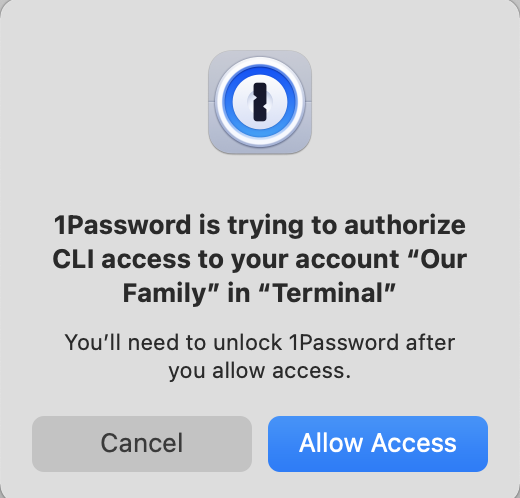
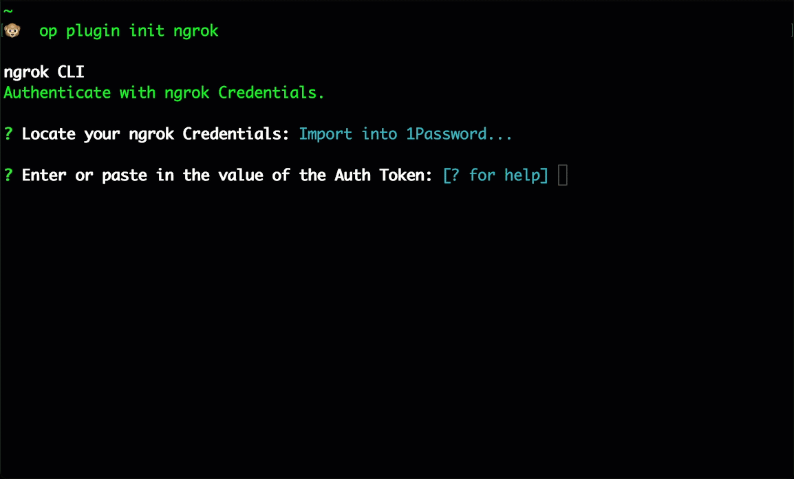

# 1Password CLI Integration for ngrok

------------


:::tip TL;DR

To activate the 1Password ngrok shell plugin:
1. [Sign up for 1Password](https://1password.com/sign-up/)
1. Install and sign in to [1Password](https://support.1password.com/get-the-apps/) on your machine
1. Install the [1Password CLI](https://app-updates.agilebits.com/product_history/CLI2) on your machine
1. [Integrate the 1Password CLI with the 1Password desktop app](https://developer.1password.com/docs/cli/app-integration)
1. Import your ngrok credentials into 1Password
1. Launch ngrok

:::

This guide covers how to set up the 1Password CLI with the ngrok shell extension to store and access your ngrok credentials via 1Password. This combination gives you the speed and simplicity of ngrok protected by the power of 1Password’s vault.

By integrating ngrok with 1Password, you can:

* *Store your credentials in exactly one place*, limiting the risk of not updating environments after resetting tokens
* *Share credentials between environments securely*, eliminating the risk of copy and pasting credentials in other tools or reusing credentials between multiple projects accidentally
* *Switch between credentials as necessary* to test with different ngrok configurations, feature sets, or even accounts

Prerequisites:

* A 1Password account
* [1Password desktop app](https://support.1password.com/get-the-apps/) installed on your machine (v8 or later)
* [1Password CLI](https://app-updates.agilebits.com/product_history/CLI2) installed on your machine (v2.14.0 or later)
* [ngrok](https://ngrok.com/download) installed on your machine
* Basic familiarity with the command line

Tip: One of the easiest mistakes is failing to connect the App to the CLI. In the 1Password App, go to Settings > Developer and select “Connect with the 1Password CLI” 

## **Step 1**: Initialize the 1Password ngrok shell plugin
To configure the ngrok shell extension, open a terminal and run this command:

```bash
op plugin init ngrok
```

If you are logged into the 1Password app, you will be presented with a permission request:



Otherwise you will be forced to authenticate and then will be presented with this request. Choose “Allow Access” and you will be presented with a command line option:


For initialization, select “Import into 1Password,” copy and paste your ngrok authtoken into the command line, and hit enter. Next, give it a memorable name. Finally, choose when you want to use it. The entire configuration looks like:



## **Step 2**: Clean up up your ngrok.yml file

Now that your credentials are safely in your 1Password vault, you can remove them from your local environment. Use your text editor to update .ngrok2/ngrok.yml and remove the authtoken value:

```bash
vim .ngrok2/ngrok.yml
```

You can delete the entire authtoken line right now but to test safely, you can alternatively prefix the line with a pound sign (#). Either way, ngrok will no longer find and use that value.

## **Step 3**: Start your tunnel

Now that we have our environment configured, we start our tunnel. 1Password will intercept the request, determine which credential to use, and start a tunnel as we requested. 


By following this guide, you have successfully integrated the 1Password CLI with ngrok, allowing you to securely manage your ngrok credentials and even choose between multiple credentials at runtime to demonstrate and test under different configurations.