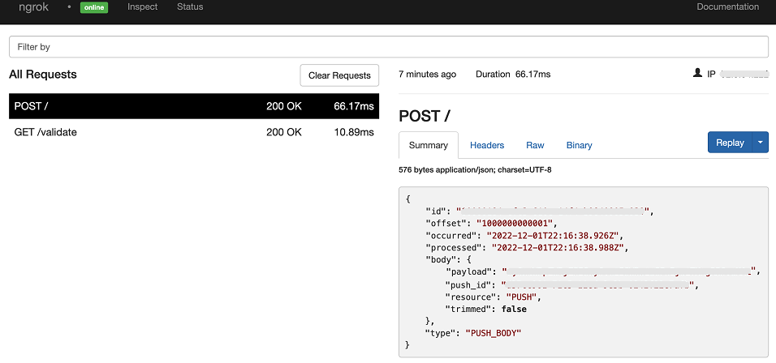

# Airship Webhooks
------------


:::tip TL;DR

To integrate Airship webhooks with ngrok:
1. [Launch your local webhook.](#start-your-app) `npm start`
1. [Launch ngrok.](#start-ngrok) `ngrok http 3000`
1. [Configure Airship webhooks with your ngrok URL.](#setup-webhook)
1. **Bonus!** [Use ngrok like a PRO.](#security)

:::


This guide covers how to use ngrok to integrate your localhost app with Airship by using Webhooks.
You can configure an open channel to develiver notifications tto any device through webhooks.

By integrating ngrok with Airship, you can:

- **Develop and test Airship webhooks locally**, eliminating the time in deploying your development code to a public environment and setting it up in HTTPS.
- **Inspect and troubleshoot requests from Airship** in real-time via the inspection UI and API.
- **Modify and Replay Airship Webhook requests** with a single click and without spending time reproducing events manually in your Airship account.
- **Secure your app with Frame.io validation provided by ngrok**. Invalid requests are blocked by ngrok before reaching your app.


## **Step 1**: Start your app {#start-your-app}

For this tutorial, we'll use the [sample NodeJS app available on GitHub](https://github.com/ngrok/ngrok-webhook-nodejs-sample). 

To install this sample, run the following commands in a terminal:

```bash
git clone https://github.com/ngrok/ngrok-webhook-nodejs-sample.git
cd ngrok-webhook-nodejs-sample
npm install
```

This will get the project installed locally.

Now you can launch the app by running the following command: 

```bash
npm start
```

The app runs by default on port 3000. 

You can validate that the app is up and running by visiting http://localhost:3000. The application logs request headers and body in the terminal and responds with a message in the browser.


## **Step 2**: Launch ngrok {#start-ngrok}

Once your app is running successfully on localhost, let's get it on the internet securely using ngrok! 

1. If you're not an ngrok user yet, just [sign up for ngrok for free](https://ngrok.com/signup).

1. [Download the ngrok agent](https://ngrok.com/download).

1. Go to the [ngrok dashboard](https://dashboard.ngrok.com) and copy your Authtoken. <br />
    **Tip:** The ngrok agent uses the auth token to log into your account when you start a tunnel.
    
1. Start ngrok by running the following command:
    ```bash
    ngrok http 3000
    ```

1. ngrok will display a URL where your localhost application is exposed to the internet (copy this URL for use with Airship).
    


## **Step 3**: Integrate Airship {#setup-webhook}

To register a webhook on your Airship account follow the instructions below:

1. Access [Airship](https://www.airship.com/) and sign in using your Airship account.

1. On the **App Projects** page, click on one of your projects.

1. On the top menu, click **Settings**, click **Open Channels** under the **Channels** section, and then click **Configure new Open Channel**.

1. Enter `My Local Webhook` in the **Display Name** field, enter `MyLocalWebhook` in the **Name** field, and enter the URL provided by the ngrok agent to expose your application to the internet in the **Webhook URL** field (i.e. `https://1a2b-3c4d-5e6f-7g8h-9i0j.sa.ngrok.io`).
    

1. Click **Save**.


### Run Webhooks with Airship and ngrok

Airship sends different request body contents depending on the event that is being triggered.
You can trigger new calls from Airship to your application by following the instructions below.

1. Access your Airship application from the [Applications](https://go.airship.com/apps/) page.

1. On the top menu, click **Messages**, click **Messages Overview**, and then click the **+** icon on the top right corner of the page.

1. On the **What would you like to create** page, click the **Message** tile.

1. On the **Who will receive your message** page, select **My Local Webhook** as the channel and select the users.

1. Click **Content** on the top menu, click **Custom Message**, and enter any text in the **Alert Text** field.

1. Click **Delivery** on the top menu and click **Send now**.

1. Click **Review & Send** on the top menu and click **Send Message**.

    Confirm your localhost app receives event notifications and logs both headers and body in the terminal.


### Inspecting requests

When you launch the ngrok agent on your local machine, you can see two links: one for the tunnel to your app (it ends up in `ngrok.io` unless you're using custom domains) and a local URL for the Web Interface (a.k.a **Request Inspector**).

The Request Inspector shows all the requests made through your ngrok tunnel to your localhost app. When you click on a request, you can see details of both the request and the response.

Seeing requests is an excellent way of validating the data sent to and retrieved by your app via the ngrok tunnel. That alone can save you some time dissecting and logging HTTP request and response headers, methods, bodies, and response codes within your app just to confirm you are getting what you expect.

To inspect Airship's webhooks call, launch the ngrok web interface (i.e. `http://127.0.0.1:4040`), and then click one of the requests sent by Airship.

From the results, review the response body, header, and other details:




### Replaying requests

The ngrok Request Inspector provides a replay function that you can use to test your code without the need to trigger new events from Airship. To replay a request:

1. In the ngrok inspection interface (i.e. `http://localhost:4040`), select a request from Airship.

1. Click **Replay** to execute the same request to your application or select **Replay with modifications** to modify the content of the original request before sending the request.

1. If you choose to **Replay with modifications**, you can modify any content from the original request. For example, you can modify the **device_type** field inside the body of the request.

1. Click **Replay**.

Verify that your local application receives the request and logs the corresponding information to the terminal.


## **Bonus**: Secure webhook requests {#security}

The ngrok signature webhook verification feature allows ngrok to assert that requests from your Frame.io webhook are the only traffic allowed to make calls to your localhost app.

**Note:** This ngrok feature requires a Pro or Enterprise license.

This is a quick step to add extra protection to your application.

1. Access your Airship application from the [Applications](https://go.airship.com/apps/) page.

1. On the top menu, click **Settings**, click **Open Channels** under the **Channels** section, and then click **Edit** in the **My Local Webhook** tile.

1. Select **Signature** in the **Authentication** field, enter `12345` in the **Secret Key** field, and then click **Update**.

1. Restart your ngrok agent by running the command, replacing `{your webhook secret}` with the value of the **Secret Key** field:
    ```bash
    ngrok http 3000 --verify-webhook airship --verify-webhook-secret {your webhook secret}
    ```

1. Access your [Airship](https://www.airship.com) application and create a new message.

Verify that your local application receives the request and logs information to the terminal.
