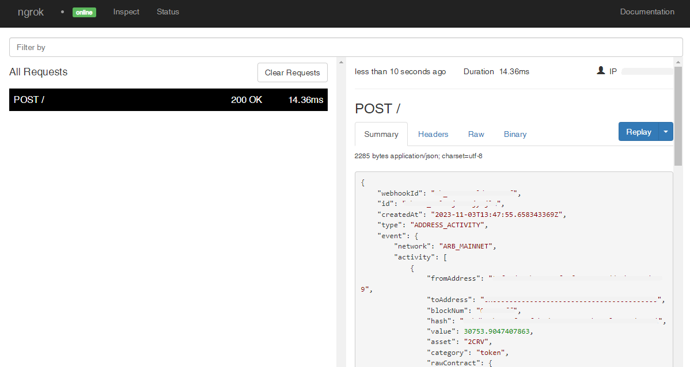

# Alchemy Webhooks

---

:::tip TL;DR

To integrate Alchemy webhooks with ngrok:

1. [Launch your local webhook.](#start-your-app) `npm start`
1. [Launch ngrok.](#start-ngrok) `ngrok http 3000`
1. [Configure Alchemy webhooks with your ngrok URL.](#setup-webhook)
1. [Secure your webhook requests with verification.](#security)

:::

This guide covers how to use ngrok to integrate your localhost app with Alchemy by using Webhooks.
Alchemy webhooks can be used to notify an external application whenever specific events occur in your Alchemy account.

By integrating ngrok with Alchemy, you can:

- **Develop and test Alchemy webhooks locally**, eliminating the time in deploying your development code to a public environment and setting it up in HTTPS.
- **Inspect and troubleshoot requests from Alchemy** in real time via the inspection UI and API.
- **Modify and Replay Alchemy Webhook requests** with a single click and without spending time reproducing events manually in your Alchemy account.
- **Secure your app with Alchemy validation provided by ngrok**. Invalid requests are blocked by ngrok before reaching your app.

## **Step 1**: Start your app {#start-your-app}

For this tutorial, we'll use the [sample NodeJS app available on GitHub](https://github.com/ngrok/ngrok-webhook-nodejs-sample).

To install this sample, run the following commands in a terminal:

```bash
git clone https://github.com/ngrok/ngrok-webhook-nodejs-sample.git
cd ngrok-webhook-nodejs-sample
npm install
```

This will get the project installed locally.

Now you can launch the app by running the following command:

```bash
npm start
```

The app runs by default on port 3000.

You can validate that the app is up and running by visiting http://localhost:3000. The application logs request headers and body in the terminal and responds with a message in the browser.

## **Step 2**: Launch ngrok {#start-ngrok}

Once your app is running successfully on localhost, let's get it on the internet securely using ngrok!

1. If you're not an ngrok user yet, just [sign up for ngrok for free](https://ngrok.com/signup).

1. [Download the ngrok agent](https://ngrok.com/download).

1. Go to the [ngrok dashboard](https://dashboard.ngrok.com) and copy your Authtoken. <br />
   **Tip:** The ngrok agent uses the auth token to log into your account when you start a tunnel.
1. Start ngrok by running the following command:

   ```bash
   ngrok http 3000
   ```

1. ngrok will display a URL where your localhost application is exposed to the internet (copy this URL for use with Alchemy).
   

## **Step 3**: Integrate Alchemy {#setup-webhook}

To register a webhook on your Alchemy account follow the instructions below:

1. Access the [Alchemy dashboard](https://dashboard.alchemy.com/) and sign in using your Alchemy account.

1. On the left menu, click the **Data** icon and then click **Webhooks**.

1. On the **Webhooks** page, click **Create Webhook** for one of the types presented on the screen.
   In this tutorial, click **Create Webhook** for the **Address Activity** type.

1. Select the **Chain** and the **Network** you want to monitor activities and then enter the URL provided by the ngrok agent to expose your application to the internet in the **WEBHOOK URL** field (i.e. `https://1a2b-3c4d-5e6f-7g8h-9i0j.sa.ngrok.io`).
   

1. Click **Test Webhook** and verify your localhost application receives a notification event.

1. Enter your wallet address in the **Ethereum Address** field and then click **Create Webhook**.

### Run Webhooks with Alchemy and ngrok

Alchemy sends different request body contents depending on the type of webhook.

In this example, because you chose the **Address Activity** webhook, you need to receive or send tokens to your address.

To test your webhook, follow the steps below:

1. Access the [Alchemy dashboard](https://dashboard.alchemy.com/) and sign in using your Alchemy account.

1. On the left menu, click the **Data** icon and then click **Webhooks**.

1. On the **Webhooks** page, scroll down to the **Address Activity** section, click the 3 dots for the webhook you registered, and then click **Send Test Notification**.

   Confirm your localhost app receives the test event notification and logs both headers and body in the terminal.

### Inspecting requests

When you launch the ngrok agent on your local machine, you can see two links:

- The URL to your app (it ends with `ngrok-free.app` for free accounts or `ngrok.app` for paid accounts when not using custom domains)
- A local URL for the Web Interface (a.k.a **Request Inspector**).

The Request Inspector shows all the requests made through your ngrok tunnel to your localhost app. When you click on a request, you can see details of both the request and the response.

Seeing requests is an excellent way of validating the data sent to and retrieved by your app via the ngrok tunnel. That alone can save you some time dissecting and logging HTTP request and response headers, methods, bodies, and response codes within your app just to confirm you are getting what you expect.

To inspect Alchemy's webhooks call, launch the ngrok web interface (i.e. `http://127.0.0.1:4040`), and then click one of the requests sent by Alchemy.

From the results, review the response body, header, and other details:



### Replaying requests

The ngrok Request Inspector provides a replay function that you can use to test your code without the need to trigger new events from Alchemy. To replay a request:

1. In the ngrok inspection interface (i.e. `http://localhost:4040`), select a request from Alchemy.

1. Click **Replay** to execute the same request to your application or select **Replay with modifications** to modify the content of the original request before sending the request.

1. If you choose to **Replay with modifications**, you can modify any content from the original request. For example, you can modify the **id** field inside the body of the request.

1. Click **Replay**.

Verify that your local application receives the request and logs the corresponding information to the terminal.

## Secure webhook requests {#security}

The ngrok signature webhook verification feature allows ngrok to assert that requests from your Alchemy webhook are the only traffic allowed to make calls to your localhost app.

**Note:** This ngrok feature is limited to 500 validations per month on free ngrok accounts. For unlimited, upgrade to Pro or Enterprise.

This is a quick step to add extra protection to your application.

1. Access the [Alchemy dashboard](https://dashboard.alchemy.com/) and sign in using your Alchemy account.

1. On the left menu, click the **Data** icon and then click **Webhooks**.

1. On the **Webhooks** page, scroll down to the **Address Activity** section, click the 3 dots for the webhook you registered, and then click **Signing Key**.

1. On the pop-up, copy the value of the **Signing key** field and click **Close**.

1. Restart your ngrok agent by running the command, replacing `{your signing key}` with the value you have copied before:

   ```bash
   ngrok http 3000 --verify-webhook alchemy --verify-webhook-secret {your signing key}
   ```

**Note**: After restarting the ngrok agent, the address of the agent will be modified.
Because Alchemy doesn't allow you to edit your webhook registration,
it's recommended that you create a domain on your ngrok account, and run the agent using the following parameter `--url myexample.ngrok.dev`

1. Access the [Alchemy dashboard](https://dashboard.alchemy.com/) and test the webhook endpoint or create an event by using the Alchemy SDK.

Verify that your local application receives the request and logs information to the terminal.
