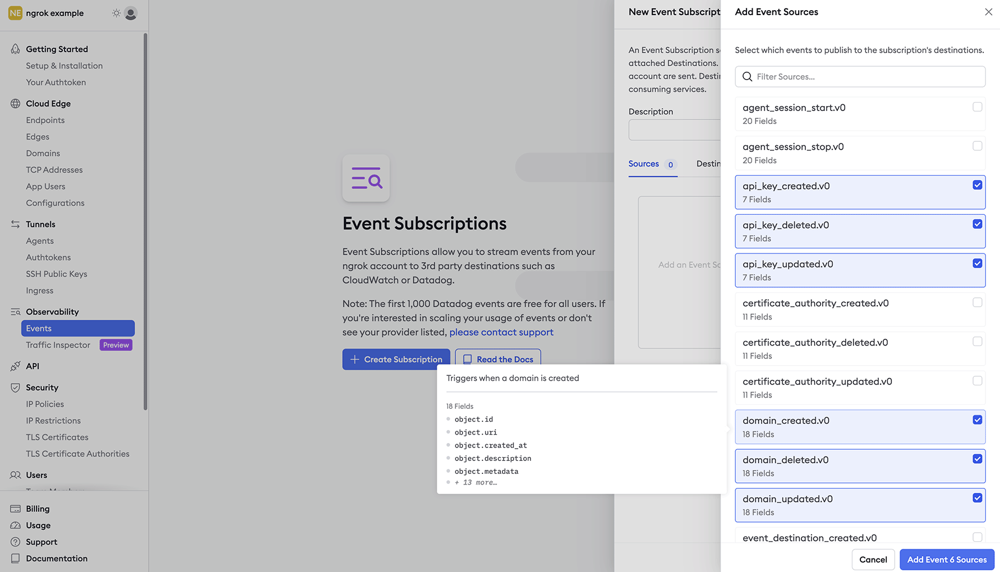
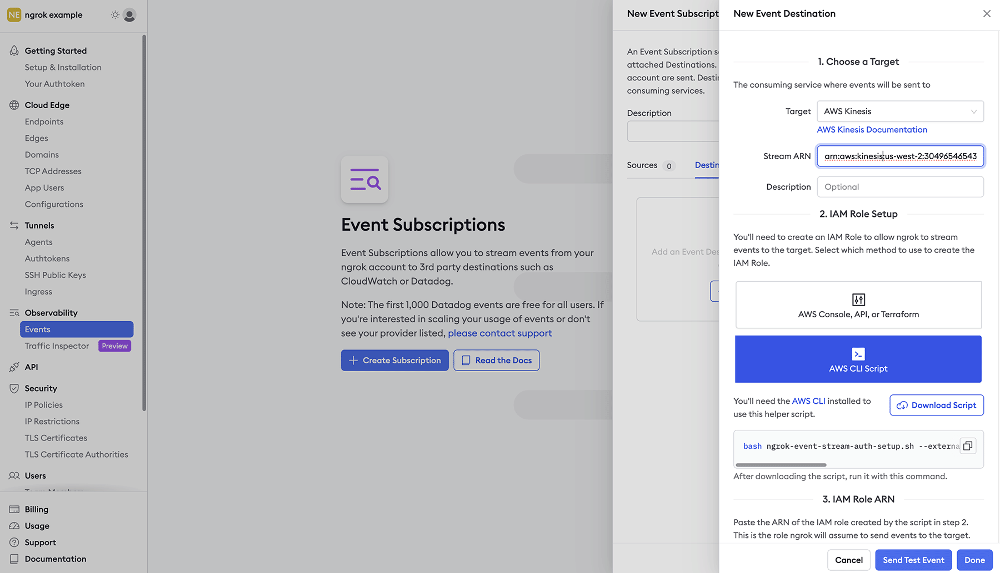

# AWS Kinesis Event Destination

---

:::tip TL;DR

To send ngrok events to Kinesis:

1. [Obtain Kinesis Data Stream ARN.](#obtain-kinesis-arn)
1. [Create Event Subscription.](#create-event-subscription)
1. [Create Event Destination.](#create-destination)

:::

This guide covers how to send ngrok events including network traffic logs into AWS Kinesis.
Some essential use-cases for ngrok events include providing a history of changes within an account, per request visibility for active monitoring/troubleshooting and security traffic inspection or SIEM usage.

By integrating ngrok with Kinesis, you can:

- **Quickly identify application issues** in real-time using ngrok request events using Kinesis data processing.
- **Historically audit changes occurring within an account**. Be able to historically audit changes within an account.
- **Profile usage of your service** by using Kinesis queries and real-time data analytics.
- **Identify security issues** by using ngrok request events.

## **Step 1**: Obtain Kinesis Data Stream ARN {#obtain-kinesis-arn}

For ngrok to successfully send events into Kinesis we'll require a data stream ARN. To either create or retrieve the ARN, reference the following link [AWS Kinesis Data Stream documentation](https://docs.aws.amazon.com/streams/latest/dev/tutorial-stock-data-kplkcl-create-stream.html).

## **Step 2**: Create an Event Subscription {#create-event-subscription}

1. Using a browser, go to the [ngrok dashboard](https://dashboard.ngrok.com) and navigate to **Events** on the left hand navigation and select **Create Subscription**.

   

2. Within the Event Subscription configuration, provide a description for the event and within the sources tab select **Add Source** to pick and choose which events you would like to send to Kinesis.

Once complete, select **Add Event Sources** to confirm your selections.

## **Step 3**: Create Event Destination {#create-destination}

To send the events to Kinesis we'll need to assign an Event Destination to the Event Subscription.

1. Within the Event Subscription configuration Destination Tab, select **Add Destination.**

1. Choose AWS Kinesis as the target and fill in the correct information.

   - **Stream ARN**
   - **Description** - Optional

1. **Create IAM Role** - An IAM role is required to allow ngrok to stream logs into Kinesis. Using the information provided by your preferred method of creation, either **API** or **CLI Script**, create the IAM role and provide the role ARN.

4. Once all required inputs have values, select **Send Test Event** and you should be presented with a Success message. Select **Done** and the Kinesis Event Destination setup is complete.

