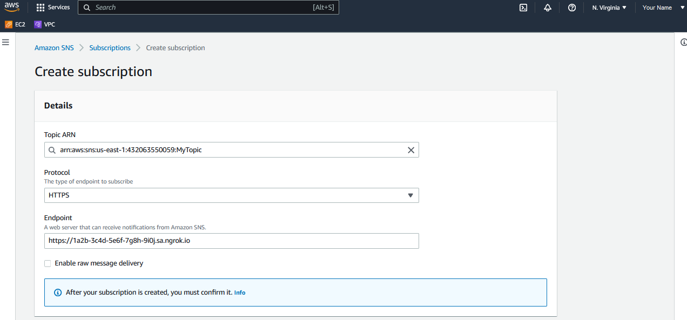
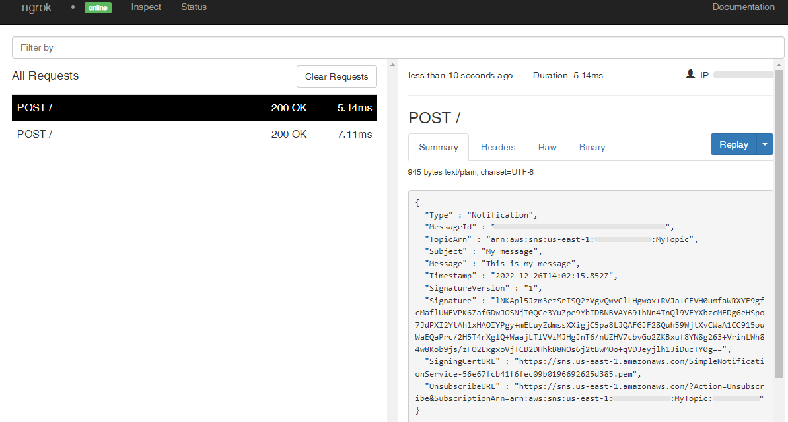

# Amazon SNS Webhooks

---

:::tip TL;DR

To integrate Amazon SNS webhooks with ngrok:

1. [Launch your local webhook.](#start-your-app) `npm start`
1. [Launch ngrok.](#start-ngrok) `ngrok http 3000`
1. [Configure Amazon SNS webhooks with your ngrok URL.](#setup-webhook)
1. [Secure your webhook requests with verification.](#security)

:::

This guide covers how to use ngrok to integrate your localhost app with Amazon SNS by using Webhooks.
Amazon SNS webhooks can be used to notify an external application whenever a message is published to a topic.

By integrating ngrok with Amazon SNS, you can:

- **Develop and test Amazon SNS webhooks locally**, eliminating the time in deploying your development code to a public environment and setting it up in HTTPS.
- **Inspect and troubleshoot requests from Amazon SNS** in real-time via the inspection UI and API.
- **Modify and Replay Amazon SNS Webhook requests** with a single click and without spending time reproducing notifications manually in your Amazon SNS topic.
- **Secure your app with Amazon SNS validation provided by ngrok**. Invalid requests are blocked by ngrok before reaching your app.

## **Step 1**: Start your app {#start-your-app}

For this tutorial, we'll use the [sample NodeJS app available on GitHub](https://github.com/ngrok/ngrok-webhook-nodejs-sample).

To install this sample, run the following commands in a terminal:

```bash
git clone https://github.com/ngrok/ngrok-webhook-nodejs-sample.git
cd ngrok-webhook-nodejs-sample
npm install
```

This will get the project installed locally.

Now you can launch the app by running the following command:

```bash
npm start
```

The app runs by default on port 3000.

You can validate that the app is up and running by visiting http://localhost:3000. The application logs request headers and body in the terminal and responds with a message in the browser.

## **Step 2**: Launch ngrok {#start-ngrok}

Once your app is running successfully on localhost, let's get it on the internet securely using ngrok!

1. If you're not an ngrok user yet, just [sign up for ngrok for free](https://ngrok.com/signup).

1. [Download the ngrok agent](https://ngrok.com/download).

1. Go to the [ngrok dashboard](https://dashboard.ngrok.com) and copy your Authtoken. <br />
   **Tip:** The ngrok agent uses the auth token to log into your account when you start a tunnel.
1. Start ngrok by running the following command:

   ```bash
   ngrok http 3000
   ```

1. ngrok will display a URL where your localhost application is exposed to the internet (copy this URL for use with Amazon SNS).
   

## **Step 3**: Integrate Amazon SNS {#setup-webhook}

To register a webhook on your Amazon SNS topic follow the instructions below.

1. Access [Amazon Cloud Service](https://aws.amazon.com/) and sign in using your Amazon account.

1. On the AWS dashboard, enter `sns` in the search bar and then click the **Simple Notification Service** link that appears in the list.

1. On the Amazon SNS **Dashboard** page, click **Topics** on the left menu, and then click **Create topic**.

1. On the **Create topic** page, click the **Standard** tile, enter `MyTopic` in the **Name** field, and then click **Create topic**.

1. Click **Subscriptions** on the left menu and then click **Create subscription**.

1. On the **Create subscription** page, select your topic in the **Topic ARN** field, select **HTTPS** in the **Protocol** field, and enter the URL provided by the ngrok agent to expose your application to the internet in the **Endpoint** field (i.e. `https://1a2b-3c4d-5e6f-7g8h-9i0j.sa.ngrok.io`).
   

1. Click **Create subscription**.

1. Confirm your localhost app receives a **SubscriptionConfirmation** notification and logs both headers and body in the terminal.

1. Copy the value of the **SubscribeURL** field from the body of the request.

1. On the Amazon SNS **Subscriptions** page, select the **Pending confirmation** subscription from the list, click **Confirm subscription**, enter the value of the **SubscribeURL** in the **url** field, and then click **Confirm subscription**.

   You should receive a message that says **Subscription was confirmed successfully**.

### Run Webhooks with Amazon SNS and ngrok

Any message published to the Amazon SNS topic triggers your HTTPS subscription. To publish a message to the SNS topic manually, follow the steps below:

1. On the AWS dashboard, enter `sns` in the search bar and then click the **Simple Notification Service** link that appears in the list.

1. On the Amazon SNS **Dashboard**, click **Topics** on the left menu, and then click the topic you previously associated with the Lambda function.

1. On the topic page, click **Publish message**, enter `My message` in the **Subject** field, enter `This is my message` in the **Message body to send to the endpoint** field, and then click **Publish message**.

   Confirm your localhost app receives a notification and logs both headers and body in the terminal.

### Inspecting requests

When you launch the ngrok agent on your local machine, you can see two links:

- The URL to your app (it ends with `ngrok-free.app` for free accounts or `ngrok.app` for paid accounts when not using custom domains)
- A local URL for the Web Interface (a.k.a **Request Inspector**).

The Request Inspector shows all the requests made through your ngrok tunnel to your localhost app. When you click on a request, you can see details of both the request and the response.

Seeing requests is an excellent way of validating the data sent to and retrieved by your app via the ngrok tunnel. That alone can save you some time dissecting and logging HTTP request and response headers, methods, bodies, and response codes within your app just to confirm you are getting what you expect.

To inspect Amazon SNS's webhooks call, launch the ngrok web interface (i.e. `http://127.0.0.1:4040`), and then click one of the requests sent by Amazon.

From the results, review the response body, header, and other details:



### Replaying requests

The ngrok Request Inspector provides a replay function that you can use to test your code without the need to trigger new messages from Amazon SNS topics. To replay a request:

1. In the ngrok inspection interface (i.e. `http://localhost:4040`), select a request from Amazon SNS.

1. Click **Replay** to execute the same request to your application or select **Replay with modifications** to modify the content of the original request before sending the request.

1. If you choose to **Replay with modifications**, you can modify any content from the original request. For example, you can modify the **Message** field inside the body of the request.

1. Click **Replay**.

Verify that your local application receives the request and logs the corresponding information to the terminal.

## Secure webhook requests {#security}

The ngrok signature webhook verification feature allows ngrok to assert that requests from your Amazon SNS topic are the only traffic allowed to make calls to your localhost app.

**Note:** This ngrok feature is limited to 500 validations per month on free ngrok accounts. For unlimited, upgrade to Pro or Enterprise.

This is a quick step to add extra protection to your application.

1. Access [Amazon Cloud Service](https://aws.amazon.com/), sign in using your Amazon account, and access the Amazon SNS **Dashboard** page.

1. Click **Topics** on the left menu, click your topic and copy the value of the **Topic owner** field.

1. Restart your ngrok agent by running the command, replacing `{Topic owner}` with the value you copied before:

   ```bash
   ngrok http 3000 --verify-webhook sns --verify-webhook-secret {Topic owner}
   ```

1. Access [Amazon Cloud Service](https://aws.amazon.com/), sign in using your Amazon account, access the Amazon SNS **Dashboard** page, and publish a new message to your topic.

Verify that your local application receives the request and logs information to the terminal.
