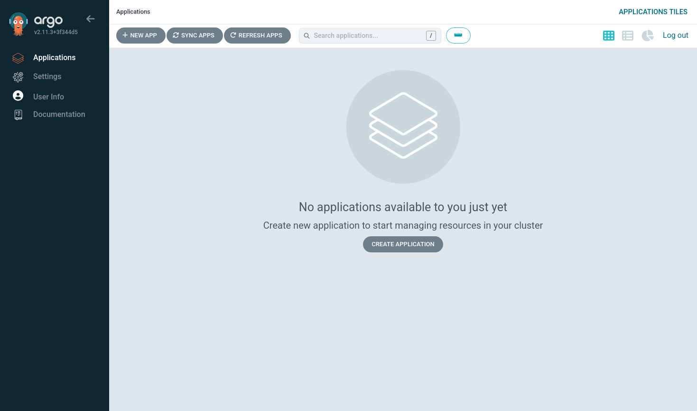
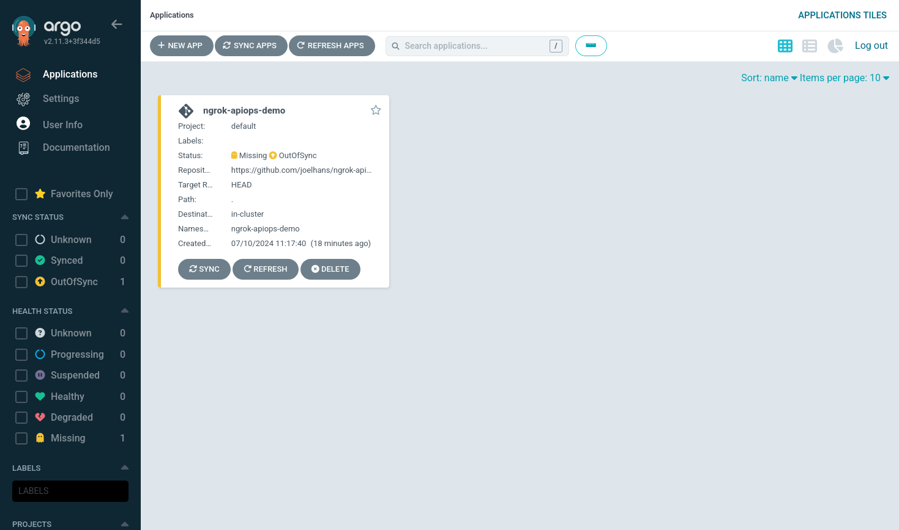
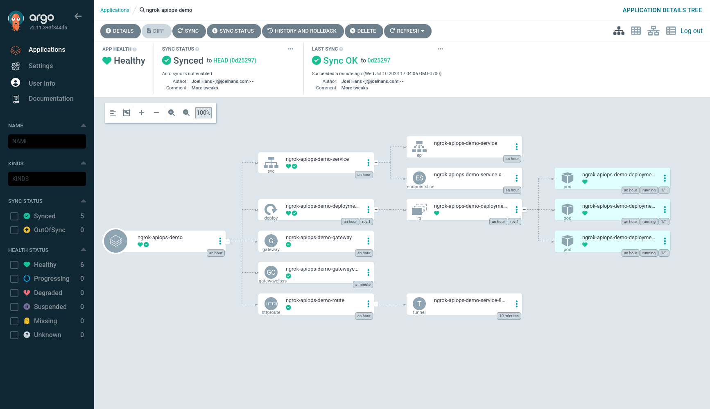
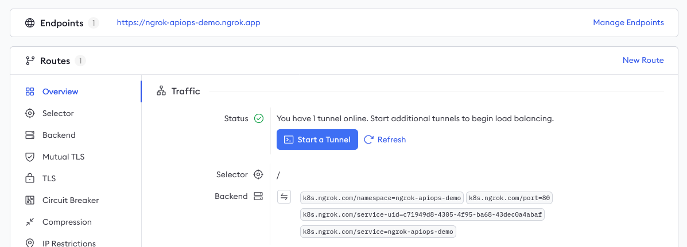
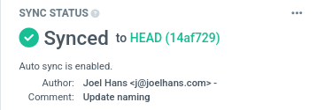
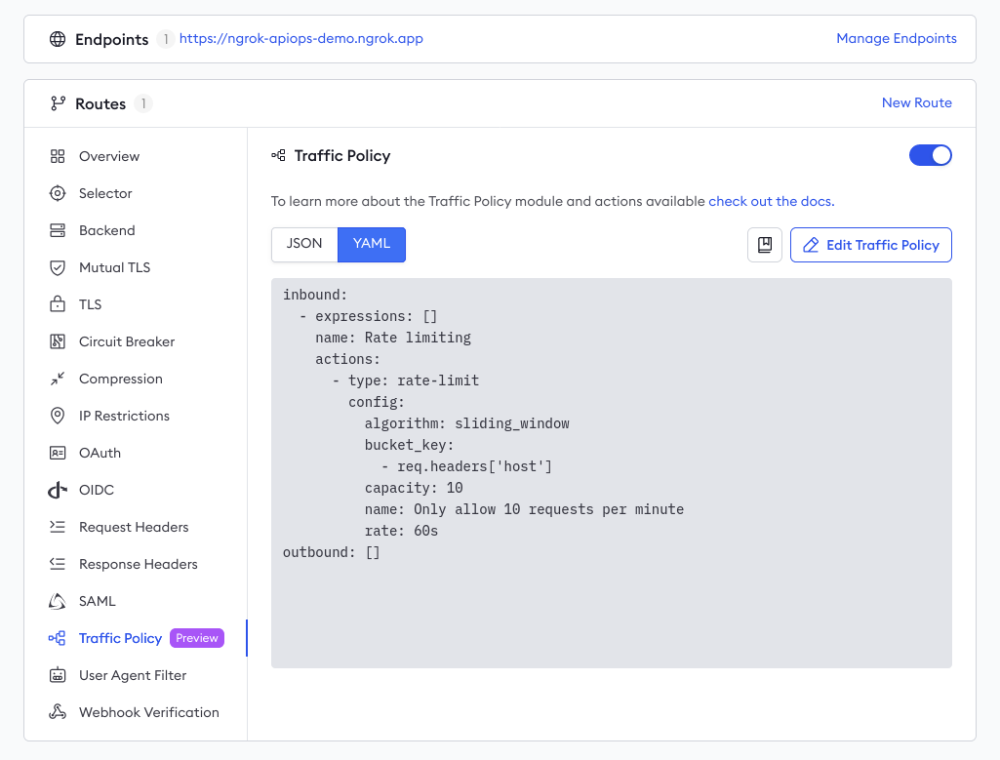

# Deploy a production API and gateway with APIOps using Argo CD and ngrok

:::tip TL;DR

To use the ngrok Kubernetes Operator alongside Argo CD for production-ready APIOps:

1. [Deploy the ngrok Kubernetes Operator](#deploy-ngrok-kubernetes-operator)
1. [Deploy Argo CD](#deploy-argo-cd)
1. [Set up the demo API](#set-up-demo-api)
1. [Deploy your demo API with Argo CD](#deploy-demo-api)
1. [Enable APIOps in Argo CD](#enable-apiops-in-argo-cd)
1. [Configure your API gateway with traffic policies](#configure-api-gateway-traffic-policies)

:::

Using this guide, you'll deploy a demo API to a Kubernetes cluster using an APIOps workflow. This process consolidates the backend API service, Kubernetes configurations, and API policy definitions into a single repository that defines the _desired state_ of your deployment.

Here is what you'll be building with:

- ngrok's out-of-the-box [**API Gateway**](https://ngrok.com/use-cases/api-gateway), which instantly tunnels production API traffic through the globally available ngrok network without requiring additional infrastructure or complex configurations.
- The ngrok [**Kubernetes Operator**](https://github.com/ngrok/kubernetes-ingress-controller/), which adds secure public ingress and middleware execution to Kubernetes deployments with declarative CRDs.
- The new [**Kubernetes Gateway API**](https://kubernetes.io/docs/concepts/services-networking/gateway/), a role-oriented mechanism for provisioning load-balancing infrastructure and routing traffic, with fantastic support for [developer-defined](https://ngrok.com/blog-post/developer-defined-golden-path-kubernetes-gateway-api) paths to deploying production APIs.
- [**Argo CD**](https://argo-cd.readthedocs.io/en/stable/), a declarative, GitOps continuous delivery tool for Kubernetes that lets you version-control all your definitions, configurations, and environments&mdash;even an API gateway.

:::caution This how-to guide requires:

1. An [ngrok account](https://ngrok.com/signup) at any tier.
2. An existing remote or local Kubernetes cluster _OR_ [minikube](https://minikube.sigs.k8s.io/docs/start/) to create a
   new demo cluster locally, which will be referred to as `[YOUR-CLUSTER]`.
3. [Argo CD](https://argo-cd.readthedocs.io/en/stable/cli_installation/) installed locally.
4. [kubectl](https://kubernetes.io/docs/tasks/tools/install-kubectl/) installed locally.
5. [Helm 3.0.0+](https://helm.sh/docs/intro/install/) installed locally.

:::

## **Step 1**: Deploy the ngrok Kubernetes Operator {#deploy-ngrok-kubernetes-operator}

Start by deploying the [ngrok Kubernetes Operator](https://github.com/ngrok/kubernetes-ingress-controller) to your Kubernetes cluster. This will operate as your production-grade API gateway.

1. Add the Helm repository:

   ```bash
   helm repo add ngrok https://charts.ngrok.com
   ```

1. Install the latest Gateway API CRDs to your cluster:

   ```bash
   kubectl apply -f https://github.com/kubernetes-sigs/gateway-api/releases/download/v1.1.0/standard-install.yaml
   ```

1. Set up the `AUTHTOKEN` and `API_KEY` exports, which allows Helm to install the Ingress Controller using your ngrok credentials. Find your `AUTHTOKEN` under [**Your Authtoken**](https://dashboard.ngrok.com/get-started/your-authtoken) in the ngrok dashboard.

   To create a new API key, navigate to the [**API** section](https://dashboard.ngrok.com/api) of the ngrok dashboard, click the **New API Key** button, change the description or owner, and click the **Add API Key** button. Copy the API key token shown in the modal window before closing it, as the ngrok dashboard will not show you the token again.

   ```bash
   export NGROK_AUTHTOKEN=[YOUR-AUTHTOKEN]
   export NGROK_API_KEY=[YOUR-API-KEY]
   ```

1. Install the ngrok Ingress Controller with Helm under a new `ngrok-ingress-controller` namespace, using the `useExperimentalGatewayApi=true` option.

   ```bash
   helm install ngrok-ingress-controller ngrok/kubernetes-ingress-controller \
     --namespace apiops-demo \
     --create-namespace \
     --set credentials.apiKey=$NGROK_API_KEY \
     --set credentials.authtoken=$NGROK_AUTHTOKEN \
     --set useExperimentalGatewayApi=true
   ```

1. Verify you have deployed the ngrok Kubernetes Operator successfully via a single running pod.

   ```bash
   kubectl get pods --namespace apiops-demo

   NAME                                                              READY   STATUS    RESTARTS   AGE
   ngrok-ingress-controller-kubernetes-ingress-controller-man2fg5p   1/1     Running   0          2m23s
   ```

## **Step 2**: Deploy Argo CD {#deploy-argo-cd}

Next, set up Argo CD on your cluster to enable GitOps.

1. Create a namespace for Argo CD:

   ```bash
   kubectl create namespace argocd
   ```

1. Apply Argo CD's default manifest to your Kubernetes cluster.

   ```bash
   kubectl apply -n argocd -f https://raw.githubusercontent.com/argoproj/argo-cd/stable/manifests/install.yaml
   ```

1. Verify you have deployed Argo CD successfully via a single running pod.

   ```bash
   kubectl get pods --namespace argocd

   NAME                                               READY   STATUS    RESTARTS   AGE
   argocd-application-controller-0                    1/1     Running   0          44s
   argocd-applicationset-controller-65bb5ff89-lcmbk   1/1     Running   0          45s
   argocd-dex-server-6f898cbd9-slg8h                  1/1     Running   0          45s
   argocd-notifications-controller-64bc7c9f7-dgnfm    1/1     Running   0          45s
   argocd-redis-5df55f45b7-2sf62                      1/1     Running   0          45s
   argocd-repo-server-74d5f58dc5-dgbnr                0/1     Running   0          45s
   argocd-server-5b86767ddb-57xlj                     0/1     Running   0          44s
   ```

1. Log into the Argo CD web UI, first by creating a new port-forwarding session.

   ```bash
   kubectl port-forward svc/argocd-server -n argocd 8080:443
   ```

   When you navigate to `http://[YOUR-CLUSTER]:8080`, you'll first see a warning about self-signed certificates, which you can accept to proceed. Finally, Argo CD prompts you to login with a username and password. The username is `admin`, and you can retrieve the automatically-generated administrator password with the following:

   ```bash
   argocd admin initial-password -n argocd
   ```

   Once logged in, you'll have access to the Argo CD UI.

   

1. Finally, log in to Argo CD via the CLI to enable administration.

   ```bash
   argocd login [YOUR-CLUSTER]:8080
   ```

## **Step 3**: Set up the demo API {#set-up-demo-api}

Next, you need to set up the Git repository for the API you'll deploy behind your ngrok API gateway. GitOps (and thus APIOps) requires declarative and version-controlled configuration, and that includes the hostname for your deployment. You can't simply clone the demo API repository and apply it to your cluster, as the ngrok-supplied hostname will already be in use.

:::note

If you're curious about the fundamentals of using the ngrok Kubernetes Operator with the Kubernetes Gateway API, such as how to set up your `GatewayClass`, `Gateway`, and `HTTPRoute`, check out our [getting started guide](/docs/k8s/getting-started-gwapi.mdx).

:::

If you have an existing API and GitOps configuration, you're more than welcome to [skip to step 4](#deploy-demo-api) while adopting the Argo CD CLI commands to your Git repository.

1. Create a new ngrok static domain. Navigate to the [**Domains** section](https://dashboard.ngrok.com/cloud-edge/domains) of the ngrok dashboard and click **Create Domain** or **New Domain**. This static domain, which will look like `example.ngrok.app`, will be your `NGROK_DOMAIN` for the remainder of this guide.

1. Fork the repository for the demo API at [ngrok-samples/apiops-demo](https://github.com/ngrok-samples/apiops-demo).

1. In your fork, open `gateway.yaml` and replace the values of lines 18 and 37 with the ngrok domain you just created (e.g. `one-two-three.ngrok.app`).

1. Add, commit, and push these changes to your fork.

## **Step 4**: Deploy your demo API with Argo CD {#deploy-demo-api}

Now that your demo API is forked and properly configured on GitHub, you can connect it to Argo CD to sync, reconcile, and deploy.

1. Register the demo app with Argo CD, replacing `[YOUR-GITHUB-USERNAME]` to point to your fork of the demo API repository.

   ```bash
   argocd app create apiops-demo \
     --repo https://github.com/[YOUR-GITHUB-USERNAME]/apiops-demo.git \
     --path . \
     --dest-server https://kubernetes.default.svc \
     --dest-namespace apiops-demo
   ```

   Refresh the Argo CD UI to see your app. Take note of the **Missing** and **OutOfSync** status report—they are not errors, but rather reflect the fact that Argo CD doesn't automatically sync and deploy a newly registered app.

   

   You can still click on the app to view additional details about the deployment _and_ the Git repository on which it is based.

1. Use the Argo CD CLI to perform a manual first sync of your registered app against your Git repository.

   ```bash
   argocd app sync apiops-demo
   ```

   Refresh the UI to see that your demo API is properly synced and deployed.

   

   You can also navigate to the **Edges** view of your [ngrok dashboard](https://dashboard.ngrok.com/cloud-edge/edges), then click on the Edge associated with the ngrok domain you created earlier, to see that the ngrok Kubernetes Operator pushed its definitions to the ngrok Edge via secure tunnel.

   

   Finally, you can `curl` your deployed API, with ngrok's API gateway functionality handling ingress and TLS automatically on your behalf. You'll only see `null` in response, but it's still proof your demo API is working as expected.

   ```bash
   curl \
     -X GET \
     -H "Content-Type: application/json" \
     https://[YOUR-NGROK-DOMAIN]/legend
   ```

## **Step 5**: Enable APIOps in Argo CD {#enable-apiops-in-argo-cd}

A fundamental component of GitOps, and thus APIOps, is that because your Git repository contains the latest version of your desired state, your deployment toolkit should automatically update the production deployment without any manual processes.

1. Enable [auto sync](https://argo-cd.readthedocs.io/en/stable/user-guide/auto_sync/) of your app the Git repository that stores your desired state.

   ```
   argocd app set apiops-demo --sync-policy automated
   ```

   You can confirm this change in the Argo CD UI:

   

   :::note
   The default polling interval, at which Argo CD looks for changes to the desired state in your Git repo, is 3 minutes. You can alter this behavior with the [`timeout.reconciliation` value](https://argo-cd.readthedocs.io/en/stable/faq/#how-often-does-argo-cd-check-for-changes-to-my-git-or-helm-repository) in Argo CD's configuration.
   :::

1. Optionally, you can test auto sync by editing the number of replicas of the demo API deployed in your cluster. In your Git repository, open the` deployment.yaml` file and edit the `replicas` value:

   ```yaml
   spec:
     replicas: 5
   ```

   To push these changes to your production cluster, add, commit, and push them to your Git repository.

   ```bash
   git add .
   git commit -m "Increase replicas to 5"
   git push origin main
   ```

   Argo CD will soon poll your repository, identify changes, and reconcile the deployed state to increase the number of replicas.

   

## **Step 6**: Configure your API gateway with traffic policies {#configure-api-gateway-traffic-policies}

The ngrok team [recently rolled out support](https://ngrok.com/blog-post/policy-support-in-gateway-api) for using the [Traffic Policy module](/docs/http/traffic-policy/index.mdx) alongside the Kubernetes Gateway API. This allows you to place all your Traffic Policy actions into a single `NgrokTrafficPolicy` CRD, controlling your ngrok-powered API gateway with an APIOps workflow with version-controlled and declarative manifests.

The project comes with a basic example of such a Traffic Policy—[see `traffic-policy.yaml` for details](https://github.com/ngrok-samples/apiops-demo/blob/main/traffic-policy.yaml)—but because rate limiting is typically the first order of business in protecing any API from abuse, let's walk through that process.

1. In your fork of the demo API project, create a new file called `rate-limiting.yaml`. Open the file and add the following YAML:

   ```yaml
   kind: NgrokTrafficPolicy
   apiVersion: ngrok.k8s.ngrok.com/v1alpha1
   metadata:
     name: traffic-policy-rate-limiting
   spec:
     policy:
       inbound:
         - name: "Rate limiting"
           actions:
             - type: "rate-limit"
               config:
                 name: "Only allow 10 requests per minute"
                 algorithm: "sliding_window"
                 capacity: 10
                 rate: "60s"
                 bucket_key:
                   - "req.headers['host']"
   ```

   This example policy includes a low limit for demonstration purposes, but you can change the `capacity` value to your needs in production.

1. Next, insert the highlight YAML below into the `HTTPRoute` in your `deployment.yaml`.

   This defines a [filter](https://gateway-api.sigs.k8s.io/api-types/httproute/#filters-optional), which must be processes during the request or response lifecycle, allowing you to inject policy into all traffic arriving to your API through your ngrok API gateway.

   ```yaml
   ---
   apiVersion: gateway.networking.k8s.io/v1
   kind: HTTPRoute
   metadata:
     name: apiops-demo-route
     namespace: apiops-demo
   spec:
     parentRefs:
       - kind: Gateway
         name: apiops-demo-gateway
         namespace: apiops-demo
     hostnames:
       - "apiops-demo.ngrok.app"
     rules:
       - matches:
           - path:
               type: PathPrefix
               value: /
         #highlight-start
         filters:
           - type: ExtensionRef
             extensionRef:
               group: ngrok.k8s.ngrok.com
               kind: NgrokTrafficPolicy
               name: "traffic-policy-rate-limiting"
         #highlight-end
         backendRefs:
           - name: apiops-demo-service
             port: 80
             kind: Service
   ```

1. Add, commit, and push this change to your Git repository. Argo CD will auto sync this latest commit then reconcile the deployed state with those changes to the `NgrokTrafficPolicy` CRD and `HTTPRoute`.

   Once the Kubernetes Operator picks up those changes, it will push definitions to your ngrok Edge—you can verify those changes directly in your [ngrok dashboard](https://dashboard.ngrok.com/cloud-edge/edges/):

   

1. Optionally, test your new rate limiting policy by `curl`-ing your API in a quick loop.

   ```bash
   for i in `seq 1 50`; do \
     curl -s -o /dev/null \
       -w "\n%{http_code}" \
       -X GET https://apiops-demo.ngrok.app/legend ; \
   done
   ```

   You should see [`429` response codes](https://developer.mozilla.org/en-US/docs/Web/HTTP/Status/429) as your ngrok API gateway rate-limits your IP address.

## What's next?

You've now built a proof of concept for deploying an API to production using ngrok and Argo CD. You can use this combination to deploy real-world API behind a production-grade gateway with no arcane configurations or expensive external infrastructure.

In a real-world deployment, you would also integrate your Git repository with a proper CI/CD pipeline, which would run tests for security, governance, and code quality. By only merging changes that pass your CI/CD pipeline, you can better guarantee the production-readiness of your API.

If you're looking for more Traffic Policy opportunities, check out our [guide to integrate with Auth0](https://ngrok.com/docs/integrations/auth0/jwt-action/) for JWT-based authentication. Our [library of "drop-in" examples](https://ngrok.com/blog-post/api-gateway-policy-management-examples) contains additional use cases like blocking traffic from specific countries, deprecating API versions, [event logging](/docs/obs/index.mdx), and more. The [Traffic Policy docs](/docs/http/traffic-policy/index.mdx) also contains an exhaustive list of actions and syntax reference.
