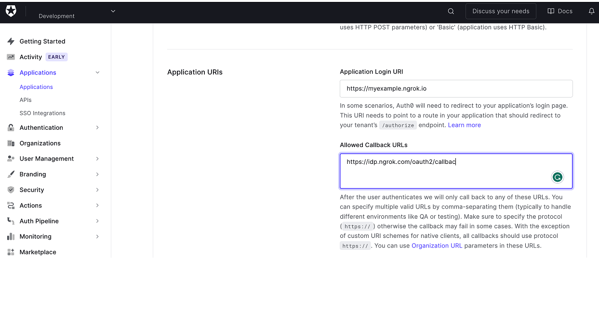
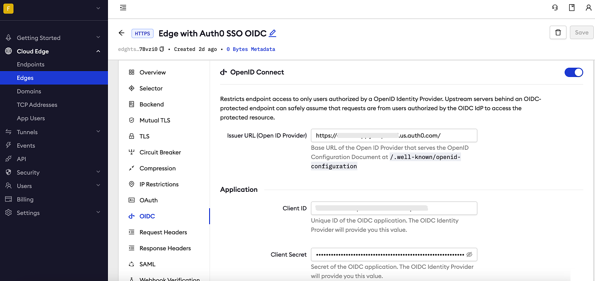

# Auth0 SSO (OpenID Connect)

:::tip TL;DR

To secure access to ngrok with Auth0 Single Sign-On using OpenID Connect:

1. [Configure Auth0 SSO](#configure-Auth0)
1. [Configure ngrok](#configure-ngrok)
1. [Test access to ngrok with Auth0 SSO](#test-sso)

:::

This article details how to configure Auth0 as the primary Identity Provider for ngrok tunnels.
By integrating Auth0 SSO with ngrok, you can:

- **Restrict access to ngrok tunnels** only to users authenticated via Auth0
- **Use Auth0 security policies and MFA authenticators**.
- **Use Auth0's Dashboard to facilitate access to ngrok apps**.

## Supported Features

The ngrok integration with Auth0 supports:

- **SP-Initiated SSO**: In this mode, users access ngrok edges and tunnels and are redirected to Auth0 for authentication.

## Requirements

To configure ngrok tunnels with Auth0, you must have:

- an Auth0 account with administrative rights to create apps
- an ngrok enterprise account with an access token or admin access to configure edges with OpenID Connect.

## Configuration Steps

To integrate ngrok with Auth0 SSO, you will need to:

1. Configure Auth0 with the ngrok app
1. Configure ngrok with the SSO settings provided by Auth0

## **Step 1**: Configure Auth0 {#configure-Auth0}

### Add the ngrok App in Auth0

1. Access the [Auth0 Dashboard](https://manage.auth0.com/dashboard/), and sign in using your Auth0 account.

1. On the left menu, click **Applications**, click **Applications**, and then click **Create Application**.

1. On the **Create application** popup, enter `ngrok oidc` in the **name** field, click the **Single Page Web Applications** tile, and then click **Create**.

1. On the **ngrok oidc** page, click the **Settings** tab and make note of the **Domain**, **Client ID**, and **Client Secret** values.

1. Enter `https://idp.ngrok.com/oauth2/callback` in the **Allowed Callback URLs** field, and enter the URL provided by the ngrok agent to expose your application to the internet in the **Application Login URI** field (i.e. `https://myexample.ngrok.dev`).
   

1. Click **Save Changes**.

### Grant access to Auth0 users

Auth0 allows administrators to restrict access to SSO apps — such as ngrok — via user group assignments. By default, apps created in Auth0 have no group assignments — in other words, nobody can use Auth0 SSO to access ngrok until you assign a group to the app.

To assign Auth0 groups to the ngrok app:

1. On the [Auth0 Dashboard](https://manage.auth0.com/dashboard/), click **User Management** on the left menu, click **Users**, and then click **Create User**.

1. Enter an email address in the **Email** field, provide a **Password**, and then click **Create**.

## **Step 2**: Configure ngrok {#configure-ngrok}

ngrok can leverage Auth0 SSO in two ways:

- From the ngrok CLI (using the `--oidc` parameter)
- From the ngrok dashboard

### **Option 1**: ngrok CLI

> **Note:** For this tutorial, we assume you have an app running locally (i.e., on localhost:3000) with the ngrok client installed.

1. Launch a terminal

1. Enter the following command to launch an ngrok tunnel with Auth0 SSO:

   ```bash
   ngrok http 3000 --oidc=AUTH0_OAUTH_URL \
   --oidc-client-id=Auth0_CLIENT_ID \
   --oidc-client-secret=Auth0_CLIENT_SECRET \
   ```

   **Note**: Replace the following with values:

   - Auth0_OAUTH_URL: The domain value you copied from Auth0, in the form of an URL (i.e. `https://dev-abcd1234.us.auth0.com/`).
   - Auth0_CLIENT_ID: The client id you copied from Auth0.
   - Auth0_CLIENT_SECRET: The client secret you copied from Auth0.

   Alternatively, add the `--url YOUR_DOMAIN` argument to get your custom URL, replacing `YOUR_DOMAIN` with your URL of preference.

1. Copy the URL available next to **Forwarding** (for example, `https://Auth0-sso-test.ngrok.dev`).

1. Skip to **Step 3**

### **Option 2**: ngrok Edge

To configure an edge with Auth0:

1. Access the [ngrok Dashboard](https://dashboard.ngrok.com/) and sign in using your ngrok account.

1. On the left menu, click **Cloud Edge** and then click **Edges**.

1. If you don't have an edge already set to add Auth0 SSO, create a test edge:

   - Click **+ New Edge**.
   - Click **Create HTTPS Edge**.
   - Click the **pencil icon** next to "no description", enter `Edge with Auth0 SSO OIDC` as the edge name, and click **Save**.

1. On the edge settings menu, click **OIDC**.

1. Click **Begin setup** and enter the following values into the fields:
   

   - **Issuer URL**: The domain value you copied from Auth0, in the form of a URL (i.e. `https://dev-abcd1234.us.auth0.com/`).
   - **Client ID**: The client id you copied from Auth0.
   - **Client Secret**: The client secret you copied from Auth0.

1. Click **Save** at the top, and then click the left arrow to go back to the **Edges** page.

1. Launch a tunnel connected to your Auth0 edge:

:::tip Note
For this step, we assume you have an app running locally (i.e. on localhost:3000) with the ngrok client installed.
:::

1.  Click **Start a tunnel**.

1.  Click the **copy icon** next to the tunnel command.
    

1.  Launch a tunnel:

    - Launch a terminal.
    - Paste the command but replace `http://localhost:80` with your localhost app address (i.e., `http://localhost:3000`).
    - Click **Enter** and an ngrok tunnel associated with your edge configuration will launch.

1.  To confirm that the tunnel is connected to your edge:

    - Return to the ngrok dashboard
    - Close the **Start a tunnel** and the **Tunnel group** tabs
    - Refresh the test edge page. Under traffic, you will see the message _You have 1 tunnel online. Start additional tunnels to begin load balancing._
      

1.  In the test edge, copy the **endpoint URL**. (You use this URL to test the Auth0 Authentication)
    

## Step 3: Test the integration {#test-sso}

1. In your browser, launch an incognito window.

1. Access your ngrok tunnel (i.e., `https://auth0-sso-test.ngrok.io` or using the copied endpoint URL).

1. You should be prompted to log in with your Auth0 credentials.

1. After logging in, you should be able to see your web app.
