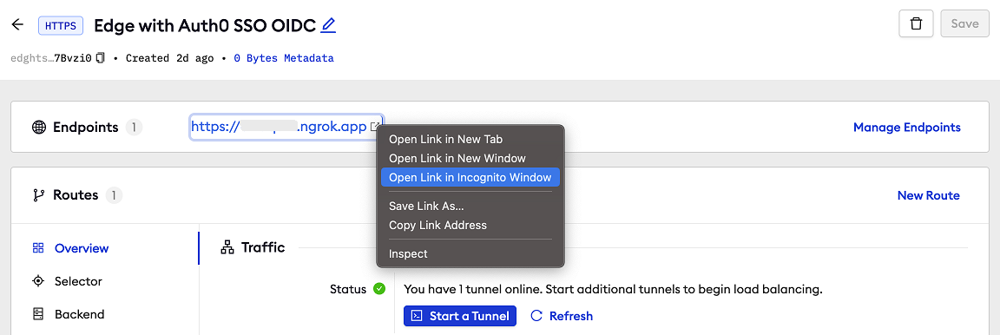

# Auth0 SSO (SAML)
------------

:::tip TL;DR

To secure access to ngrok with Auth0 Single Sign-On using SAML:
1. [Configure Auth0 SSO](#configure-Auth0)
1. [Configure ngrok](#configure-ngrok)
1. [Test access to ngrok with Auth0 SSO](#test-sso)

:::

This article details how to configure Auth0 as the primary Identity Provider for ngrok tunnels.
By integrating Auth0 SSO with ngrok, you can:

- **Restrict access to ngrok tunnels** only to users authenticated via Auth0
- **Use Auth0 security policies and MFA authenticators**.
- **Use Auth0's Dashboard to facilitate access to ngrok apps**.

## Requirements

To configure ngrok tunnels with Auth0, you must have:

- an Auth0 account with administrative rights to create apps
- an ngrok enterprise account with an access token or admin access to configure edges with SAML.

## Configuration Steps

To integrate ngrok with Auth0 SSO, you will need to:

1. Configure Auth0 with the ngrok app
1. Configure ngrok with the SSO settings provided by Auth0

## **Step 1**: Configure Auth0 {#configure-Auth0}

1. Access the [Auth0 Console](https://console.Auth0.com/), and sign in using your Auth0 administrator account.

1. On the left menu, click **SSO**, click **Get Started** or **+ Add New Application**, and then click **Custom SAML App**.

1. On the **New Application** popup, enter `ngrok saml` in the **Display Label** field.

1. Click the **SSO** tab, enter `https://ngrok-Auth0` in the **IdP Entity ID** field, enter temporary values (i.e., `https://temporary`) in both the **SP Entity ID** and the **ACS URL** fields, and then click **activate**.

### **Step 2**: Download the IdP metadata {#idp-metadata}

1. On the **SSO** page of the [Auth0 Console](https://console.Auth0.com/), click your **Custom SAML App**, click the **SSO** tab, click **Export Metadata**, and then save the XML file on your desktop.

### **Step 3**: Configure ngrok {#configure-ngrok}

To configure an edge with Auth0:

1. Access the [ngrok Dashboard](https://dashboard.ngrok.com/) and sign in using your ngrok account.

1. On the left menu, click **Cloud Edge** and then click **Edges**.

1. If you don't have an edge already set to add Auth0 SSO, create a test edge:
    * Click **+ New Edge**.
    * Click **Create HTTPS Edge**.
    * Click the **pencil icon** next to "no description", enter `Edge with Auth0 SSO SAML` as the edge name, and click **Save**.

1. On the edge settings menu, click **SAML**.

1. On the **SAML** page, click **Begin setup**, click **Upload XML**, and then open the XML metadata file you downloaded from Auth0 (See [Download the IdP metadata](#idp-metadata)).
    

1. Click **Save** at the top.

### **Step 4**: Download the SP metadata {#sp-metadata}

1. On the **SAML** page of your [ngrok edge](https://dashboard.ngrok.com/cloud-edge/edges), click the three dots close to the **SP Metadata** field, click **Download XML File**, and then save the XML file on your desktop.

### **Step 5**: Link Auth0 with ngrok {#sp-metadata}

1. Access the [Auth0 Console](https://console.Auth0.com/), click **SSO**, click your **Custom SAML App**, click the **SSO** tab, click **Upload Metadata**, and then open the XML metadata file you downloaded from ngrok (See [Download the SP metadata](#sp-metadata)).
    

1. Click **Save**.

### **Step 6**: Start a Tunnel {#start-tunnel}

1. Access the [ngrok edges page](https://dashboard.ngrok.com/cloud-edge/edges), click your edge, and then click **Start a tunnel**.

    :::tip Note 
    For this step, we assume you have an app running locally (i.e. on localhost:3000) with the ngrok client installed.
    :::

1. Click the **copy icon** next to the tunnel command.
    

1. Launch a tunnel:
    * Launch a terminal.
    * Paste the command but replace `http://localhost:80` with your localhost app address (i.e., `http://localhost:3000`).
    * Click **Enter** and an ngrok tunnel associated with your edge configuration will launch.

1. To confirm that the tunnel is connected to your edge:
    * Return to the ngrok dashboard
    * Close the **Start a tunnel** and the **Tunnel group** tabs
    * Refresh the test edge page. Under traffic, You will see the message _You have 1 tunnel online. Start additional tunnels to begin load balancing._
    

1. In the test edge, copy the **endpoint URL**. (You use this URL to test the Auth0 Authentication)
    

## Grant access to Auth0 users {#users}

Auth0 allows administrators to restrict access to SSO apps — such as ngrok — via user group assignments. By default, apps created in Auth0 have no group assignments — in other words, nobody can use Auth0 SSO to access ngrok until you assign a group to the app.

To assign Auth0 groups to the ngrok app:

1. On the left menu of the [Auth0 Console](https://console.Auth0.com/), click **SOO** and click the ngrok custom SAML app you created.

1. On the app popup, click the **User Groups** tab, click the checkbox of the **All Users** group, and then click **Save**.
    **Tip**: Make sure to add Auth0 users to this group when you create or manage users that need access to the ngrok app.

## Test the integration {#test-sso}

1. In your browser, launch an incognito window.

1. Access your ngrok tunnel (i.e., `https://Auth0-sso-test.ngrok.io` or using the copied endpoint URL).

1. You should be prompted to log in with your Auth0 credentials.

1. After logging in, you should be able to see your web app.

