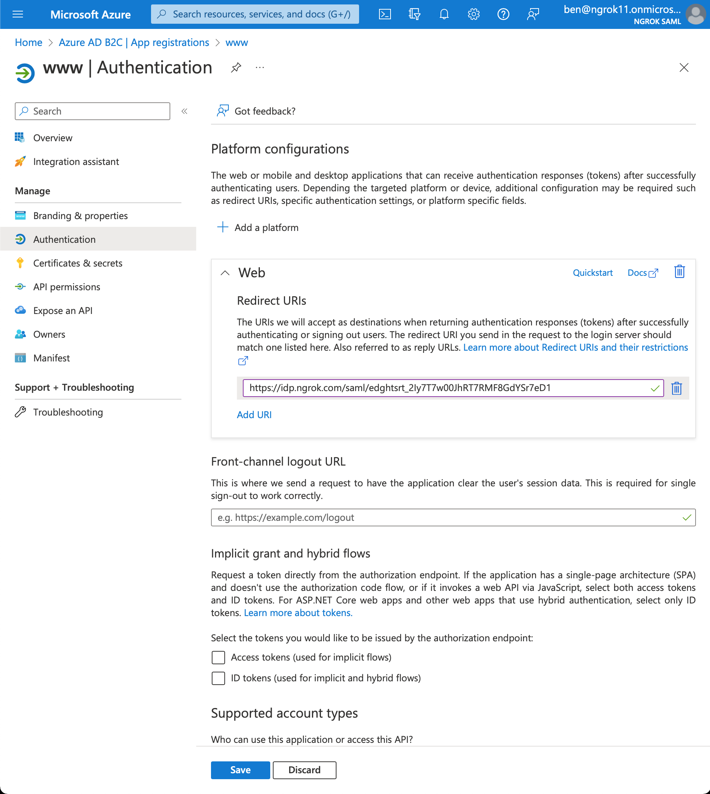
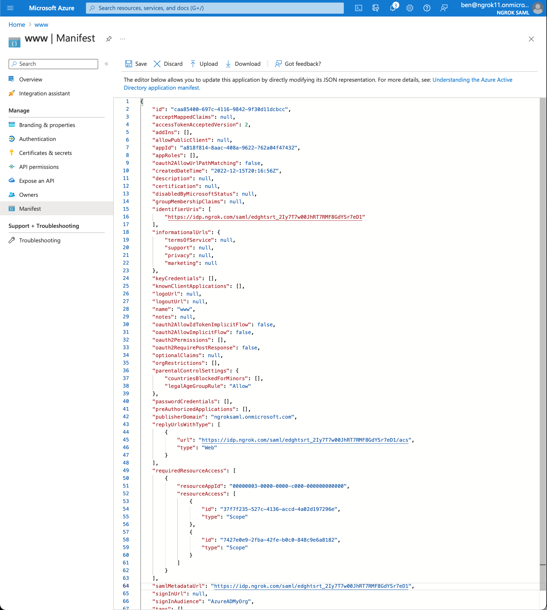
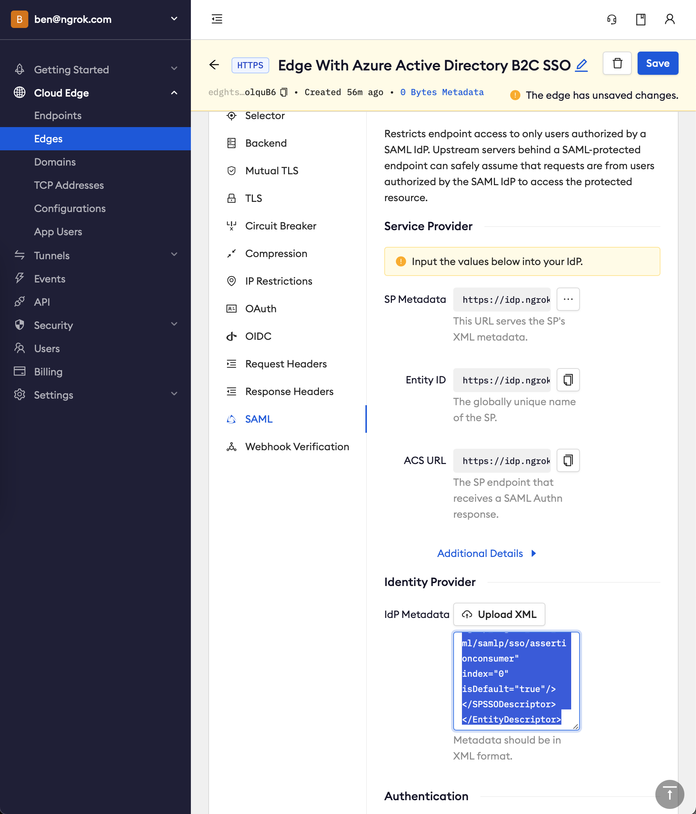
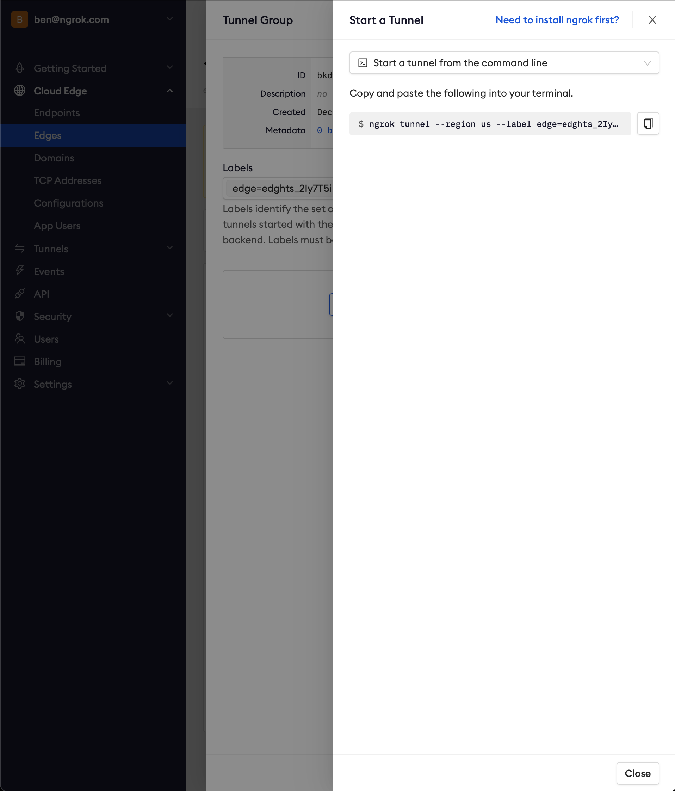
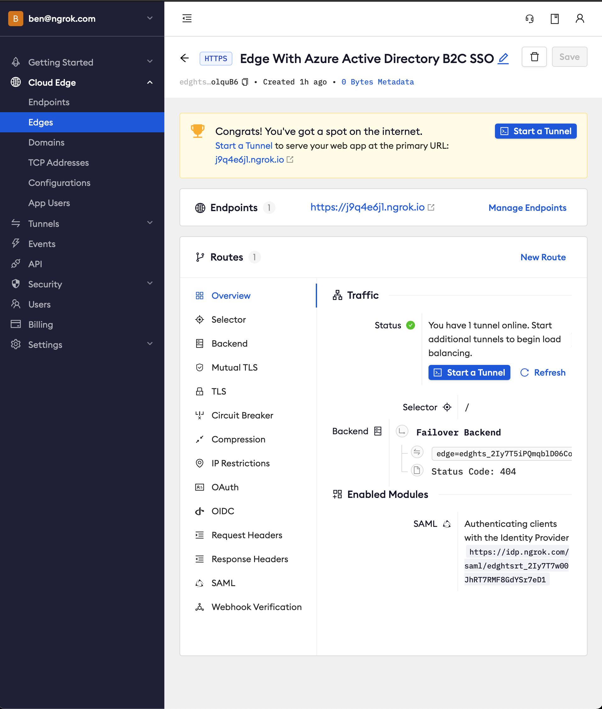

# Azure Active Directory B2C SSO (SAML)

---

:::tip TL;DR
To have ngrok enforce Single Sign-On using SAML with Azure Active Directory B2C (Azure AD B2C):

1. [Create an ngrok Edge](#create-edge)
1. [Configure Azure AD B2C custom policies](#create-policies)
1. [Create an Azure AD B2C SAML application](#create-app)
1. [Update the ngrok Edge with the IdP metadata](#update-ngrok-edge)
1. [Test your integration](#test-integration)
1. [Bonus: Update your Azure AD B2C custom policies to support the password reset flow](#bonus)

:::

This article details how to configure Azure AD B2C as an Identity Provider for your ngrok Edge. By integrating Azure AD B2C with ngrok, you can:

- Restrict access to ngrok tunnels to only users who authenticated via Azure AD B2C
- Allow users to authenticate via a local account or federated accounts via Azure AD B2C

## Requirements

To configure ngrok tunnels with Azure AD B2C, you must have:

- an [ngrok Enterprise Account](https://ngrok.com/pricing) with an authtoken or admin access to configure edges with SAML
- a Microsoft Azure account with access to an Azure AD B2C tenant
- an understanding of Azure AD B2C [custom policies](https://learn.microsoft.com/en-us/azure/active-directory-b2c/custom-policy-overview)

## Step 1: Create an ngrok Edge {#create-edge}

1.  Go to the [ngrok dashboard](https://dashboard.ngrok.com)
1.  Click **Cloud Edge** > **Edges**
1.  Create an Edge:

    1. Click **New Edge**
    1. Click **HTTPS Edge**
    1. Click the **Pencil Icon** next to "no description". Enter _Edge With Azure Active Directory B2C SSO_ as the Edge name and click **Save**

1.  Configure the SAML module for this Edge:

    1. On the Routes section, click **SAML**
    1. Click **Begin setup**
    1. In the Identity Provider section, copy the following XML as a placeholder into the input box

    ```xml
    <EntityDescriptor xmlns="urn:oasis:names:tc:SAML:2.0:metadata"></EntityDescriptor>
    ```

    

    1. Click **Save**

    1. Note that ngrok has now generated values for the fields in the Service Provider section. We will use these to configure Azure AD B2C later

## Step 2: Configure Azure AD B2C custom policies {#create-policies}

1. Follow the directions based on the [Azure docs](https://learn.microsoft.com/en-us/azure/active-directory-b2c/tutorial-create-user-flows?pivots=b2c-custom-policy)

1. Some hints

   1. For a SAML application, you need to configure custom policies as it is not possible to use the user flows, as noted elsewhere in the [Azure docs](https://learn.microsoft.com/en-us/azure/active-directory-b2c/saml-service-provider?tabs=macos&pivots=b2c-user-flow#register-your-saml-application-in-azure-ad-b2c)
   1. A couple resources to make the process of following these steps easier: you can follow along the docs with the templates shared in [Azure AD B2C custom policy starterpack](https://github.com/Azure-Samples/active-directory-b2c-custom-policy-starterpack), or you can to use the [IEF Setup App](https://b2ciefsetupapp.azurewebsites.net) to automate these steps
   1. To keep things simple, use the `LocalAccounts` starter pack. This means users will sign up and log in as users in your Azure AD B2C tenant vs. with another identity provider This means you can skip configuring Facebook as an identity provider. If you are using the IEF Setup App, click the checkbox for `Remove Facebook references` before you deploy the starter pack
   1. Skip the steps of `Register a web application` and `Enable ID token implicit grant` unless you'd like to test this now. We will register a SAML application and test it later

## Step 3: Create an Azure AD B2C SAML application {#create-app}

1. Follow the directions based on the [Azure docs](https://learn.microsoft.com/en-us/azure/active-directory-b2c/saml-service-provider?tabs=windows&pivots=b2c-custom-policy)

1. Some hints

   1. Update your previously created custom policies to use SAML. You can either update the files in the starterpack repo, or you can download the XML files for your existing policies from the [Identity Experience Framework page](https://portal.azure.com/#view/Microsoft_AAD_B2CAdmin/CustomPoliciesMenuBlade/~/overview/tenantId/ngroksaml.onmicrosoft.com)
   1. If you are using the `LocalAccounts` starter pack, remember to adjust the orchestration step order value to `4` as noted in these docs
   1. Use the following mapping of Azure AD B2C configuration properties to ngrok generated values (found in your Edge's SAML configuration in the Service Provider section) to configure your application

   | Azure AD B2C      | ngrok         |
   | ----------------- | ------------- |
   | `RedirectURI`     | `ACS URL`     |
   | `identifierUri`   | `EntityID`    |
   | `samlMetadataUrl` | `SP Metadata` |

   

   

## Step 4: Update the ngrok Edge with the IdP metadata {#update-ngrok-edge}

1. Back in the ngrok dashboard for your Edge's SAML configuration, copy and paste the XML found at the IdP Saml Metadata URL in the Identity Provider section, replacing the previously set placeholder value. Note the IdP Metadata URL follows this format: `https://<tenant-name>.b2clogin.com/<tenant-name>.onmicrosoft.com/<policy-name>/Samlp/metadata`.

   

1. Click **Save**

## Step 5: Test the integration {#test-integration}

:::tip Note
For this step, we assume you have an app running locally (i.e. on localhost:3000) with the ngrok client installed.
:::

1. Launch a tunnel connected to your configured Edge

1. On your Edge's page, in the Routes section, click **Start a tunnel**

   

1. Copy the tunnel command

   

1. Launch a terminal and paste the command, replacing `http://localhost:80` with your local web app address (e.g., `http://localhost:3000`)

1. Hit **Enter** to launch the tunnel

1. Confirm that the tunnel is connected to your edge

   1. Return to the ngrok dashboard
   1. Close the **Start a tunnel** and the **Tunnel group** drawers
   1. Refresh the Edge page
   1. In the Routes section > Traffic section you will see the message _You have 1 tunnel online. Start additional tunnels to begin load balancing._

   

1. Copy the ngrok url on the Endpoints section

1. Access your Edge application

   1. In your browser, launch an incognito window
   1. Access your ngrok tunnel via your copied URL
   1. You should be prompted to log in or sign up

   

   4. After login, you should be able to see the application

## Bonus: Update your Azure AD B2C custom policies to support the password reset flow {#bonus}

1. From the test, you may notice that the `Forgot your password?` link doesn't work. You will need to embed the password reset flow as part of your sign up / sign in custom policy for local accounts, as the `LocalAccounts` starter pack did not include this flow as part of the sign up / sign in policy. Here is [sample code from Azure AD B2C](https://github.com/azure-ad-b2c/samples/tree/master/policies/embedded-password-reset) on how to configure this
