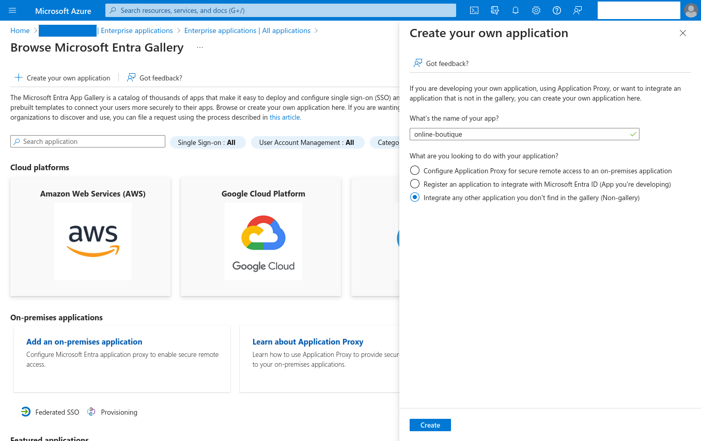

# Ingress to applications managed by Azure AD (Microsoft Entra ID) in Kubernetes

:::tip TL;DR

To use the ngrok Ingress Controller for Kubernetes with Azure AD:

1. [Create a cluster and deploy an example app](#create-cluster-deploy-example-app)
2. [Add the ngrok Kubernetes ingress controller](#add-the-ngrok-kubernetes-ingress-controller)
3. [Create an enterprise app in Microsoft Entra ID](#create-an-enterprise-app)
4. ***TK***

:::

The [ngrok Ingress Controller for Kubernetes](https://ngrok.com/blog-post/ngrok-k8s) is the official controller for adding secure public ingress and middleware execution to your Kubernetes applications with ngrok's Cloud Edge. With ngrok, you can manage and secure traffic to your applications at every stage of the development lifecycle while also benefitting from simpler configurations, security, and edge acceleration.

Microsoft Azure Active Directory (AD)—now known as [Micosoft Entra ID](https://www.microsoft.com/en-us/security/business/identity-access/microsoft-entra-id) (see the tip below)—is an identity and access management platform that helps administrators and DevOps engineers safeguard their organization's multicloud environment with strong authentication and unified identity management, whether they operate in Azure cloud or on-premises.

:::note

In October 2023, Microsoft Azure Active Directory (AD) was [renamed Microsoft Entra ID](https://learn.microsoft.com/en-us/entra/fundamentals/new-name) to "communicate the multicloud, multiplatform functionality" and "alleviate confusion with Windows Server Active Directory." This name change changes nothing about the product or its capabilities. We have used **Azure AD** up to this point due to the recency of the change, but will use **Entra ID** for the remainder.

:::

***TK NOTE ON HOW THEY INTEGRATE***

With this guide, you'll ***TK RESULT***

:::caution This tutorial requires:

1. An [ngrok account](https://ngrok.com/signup).
2. A Microsoft Azure account with access to an existing Entra ID tenant, or the ability to create a new tenant with an Entra ID P1 or P2 license.
3. A Kubernetes cluster either locally in a public cloud.

:::

## **Step 1**: Create a cluster and deploy an example app {#create-cluster-deploy-example-app}

This guide requires a deploy some application on Kubernetes cluster, either locally in a public cloud, to provide an endpoint for ngrok's secure tunnel. You can use any cluster and any application, but for the sake of demonstration, we'll create a local Kubernetes cluster with minikube and deploy the [Online Boutique](https://github.com/GoogleCloudPlatform/microservices-demo) example app.

If you already have a cluster and application, you can skip ahead to [Step 2: Add the ngrok Kubernetes ingress controller](#add-the-ngrok-kubernetes-ingress-controller).

1. Download the `GoogleCloudPlatform/microservices-demo` project to your local workstation and navigate into the new directory.

  ```bash
  git clone https://github.com/GoogleCloudPlatform/microservices-demo
  cd microservices-demo
  ```

1. Create a new minikube cluster.

  ```bash
  minikube start -p boutique-shop
  ```

1. Apply the manifests for the Online Boutique.

  ```bash
  kubectl apply -f ./release/kubernetes-manifests.yaml
  ```

## **Step 2**: Add the ngrok Kubernetes ingress controller {#add-the-ngrok-kubernetes-ingress-controller}

Next, you'll configure and deploy the [ngrok Kubernetes Ingress
Controller](https://github.com/ngrok/kubernetes-ingress-controller) to 

1. Add the ngrok Helm repository if you haven't already.

  ```bash
  helm repo add ngrok https://ngrok.github.io/kubernetes-ingress-controller
  ```

1. Create a ngrok static subdomain for ingress if you don't have one already. Navigate to the [**Domains** section](https://dashboard.ngrok.com/cloud-edge/domains) of the ngrok dashboard and click **Create Domain** or **New Domain**. This static subdomain will be your `NGROK_DOMAIN` for the remainder of this guide.

  By creating a subdomain on the ngrok network, you provide a public route to accept HTTP, HTTPS, and TLS traffic.

1. Set up the `AUTHTOKEN` and `API_KEY` exports, which allows Helm to install the Ingress Controller using your ngrok credentials. Find your `AUTHTOKEN` under [**Your Authtoken**](https://dashboard.ngrok.com/get-started/your-authtoken) in the ngrok dashboard.

  To create a new API key, navigate to the [**API** section](https://dashboard.ngrok.com/api) of the ngrok dashboard, click the **New API Key** button, change the description or owner, and click the **Add API Key** button. Copy the API key token shown in the modal window before closing it, as the ngrok dashboard will not show you the token again.

  ```bash
  export NGROK_AUTHTOKEN=[YOUR-AUTHTOKEN]
  export NGROK_API_KEY=[YOUR-API-KEY]
  ```

1. Install the ngrok Kubernetes Ingress Controller with Helm.

  ```bash
  helm install ngrok-ingress-controller ngrok/kubernetes-ingress-controller \
    --set credentials.apiKey=$NGROK_API_KEY \
    --set credentials.authtoken=$NGROK_AUTHTOKEN
  ```

1. Verify the health of your new Ingress Controller pod.

  ```bash
  kubectl get pods -l 'app.kubernetes.io/name=kubernetes-ingress-controller'

  NAME                                                              READY   STATUS    RESTARTS   AGE
  ngrok-ingress-controller-kubernetes-ingress-controller-man2fg5p   1/1     Running   0          2m23s
  ```

1. Create a new `boutique-ingress.yml` file, which defines how the ngrok Kubernetes Ingress Controller should route traffic on your `NGROK_DOMAIN` to your Online Boutique app.

  :::tip
   
   Make sure you edit line `9` of the manifest below, which contains the `NGROK_DOMAIN` variable, with the ngrok subdomain you already created. It should look something like `one-two-three.ngrok-free.app`.

   Naturally, if you are adding the ngrok Kubernetes Ingress Controller to a different app, you will need also change the `metadata.name`, `service.name`, and `service.port.number` values to match your deployment's details. See the [controller docs](https://github.com/ngrok/kubernetes-ingress-controller/tree/main/docs) for additional details.

  :::

  ```yaml
  apiVersion: networking.k8s.io/v1
  kind: Ingress
  metadata:
    name: boutique-ingress
    namespace: default
  spec:
    ingressClassName: ngrok
    rules:
      - host: NGROK_DOMAIN
        http:
          paths:
            - path: /
              pathType: Prefix
              backend:
                service:
                  name: frontend
                  port:
                    number: 80
  ```

1. Apply the `boutique-ingress.yaml` manifest you just created.

  ```bash
  kubectl apply -f boutique-ingress.yaml
  ```

  Give your cluster a few moments to launch the necessary resources and for ngrok's Cloud Edge to pick up the new tunnel.

  :::tip

  If you see an error when applying the manifest, double-check that you've updated the `NGROK_DOMAIN` value and re-apply.

  :::

1. Access your app, with ingress now handled by ngrok, by navigating to your ngrok domain, e.g. `https://one-two-three.ngrok-free.app`, in your browser.

  

## **Step 3**: 

***TK SETTING UP YOUR EDGE***

## **Step 4**: Create an enterprise app in Microsoft Entra ID {#create-an-enterprise-app}

With your ngrok Edge established and ready for SAML, you can now configure Microsoft Entra ID to operate as your authentication provider.

1. Access your [Entra ID tenant](https://portal.azure.com/#view/Microsoft_AAD_IAM/ActiveDirectoryMenuBlade/~/Overview) in the Azure console.

2. Click **Enterprise applications** in the left-hand sidebar, then **+ New application**, and finally **+ Create your own application**. Give your app a name—in this case, `boutique` will work nicely, and make sure you've selected the **Integrate any other application you don't find in the gallery (Non-gallery)** option.

  

3. Click **Create** to build your enterprise app, which will take you to its Overview dashboard.

4. To provide specific users or groups access to your app, click **Assign users and groups** and follow the steps.

5. Click **Set up single sign on** to allow users to sign in to your app using their Microsoft Entra credentials, then choose **SAML** as your single sign-on protocol.

  


## What's next?

***TK***

Learn more about the ngrok Ingress Controller, or contribute, by checking out the [GitHub
repository](https://github.com/ngrok/kubernetes-ingress-controller) and the [project-specific
documentation](https://github.com/ngrok/kubernetes-ingress-controller/tree/main/docs).
