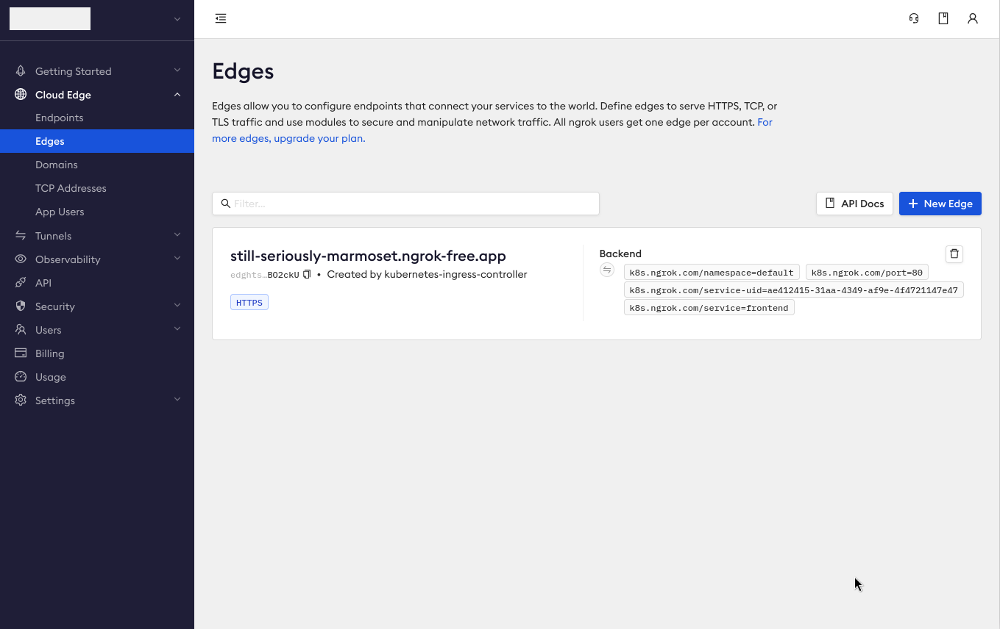
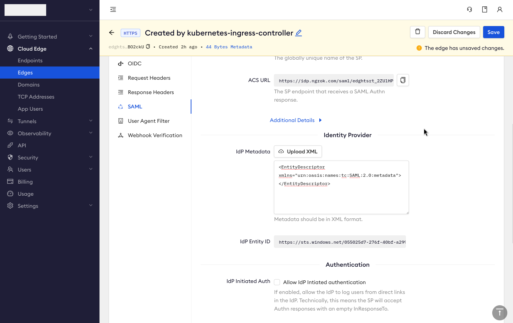
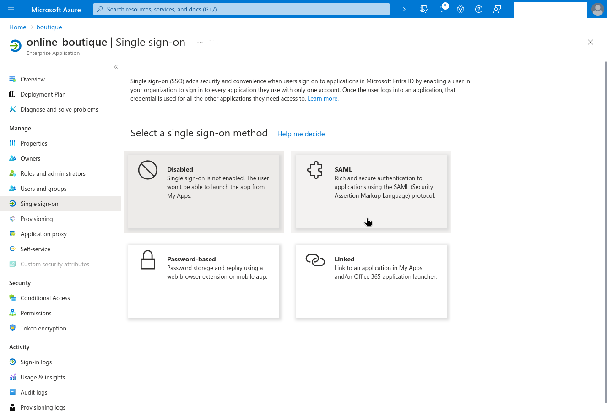
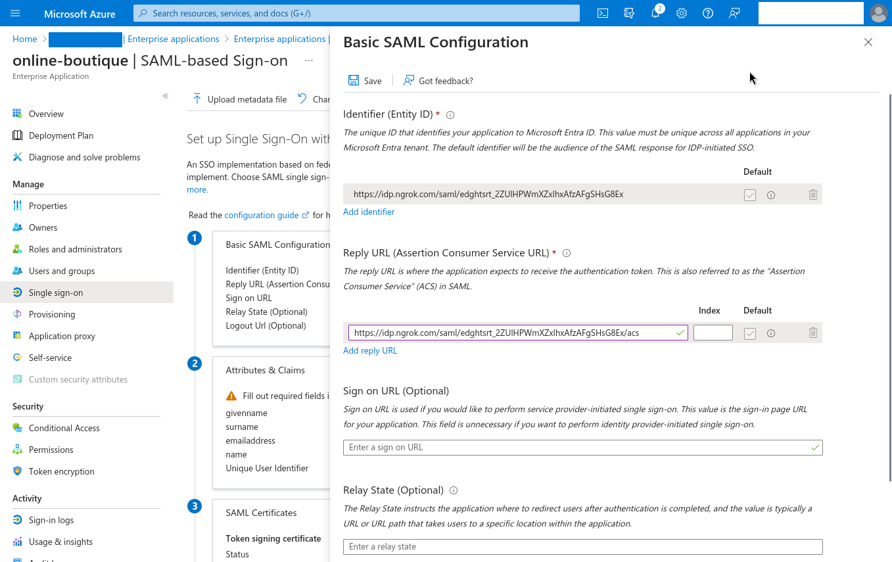
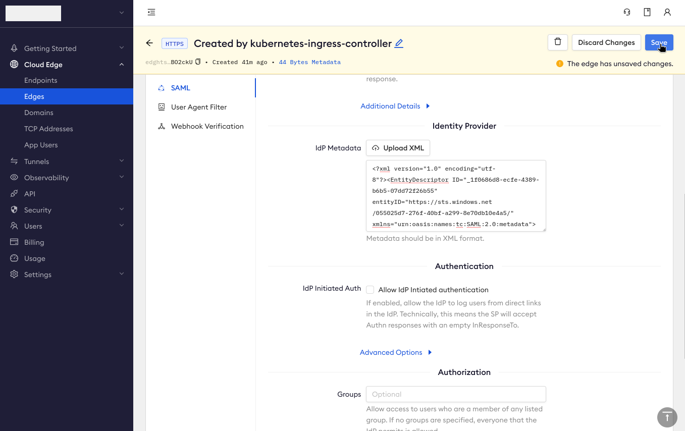

# Ingress to apps secured by Azure AD (Microsoft Entra ID) in Kubernetes

:::tip TL;DR

To use the ngrok Kubernetes Ingress Controller with Azure AD (Microsoft Entra ID):

1. [Create a cluster and deploy an example app](#create-cluster-deploy-example-app)
2. [Add the ngrok Kubernetes ingress controller](#add-the-ngrok-kubernetes-ingress-controller)
3. [Update your ngrok Edge to enable SAML](#update-your-ngrok-edge-to-enable-SAML)
4. [Create an enterprise app in Microsoft Entra ID](#create-an-enterprise-app)
5. [Finish adding Microsoft Entra ID authorization to your ngrok Edge](#finish-adding-entra-ID-authorization-ngrok-edge)
6. [Test authorization to your app using Microsoft Entra ID](#test-authorization-using-microsoft-entra-id)
   :::

The [ngrok Kubernetes Ingress Controller](https://ngrok.com/blog-post/ngrok-k8s) is ngrok's official controller for adding secure public ingress and middleware execution to your Kubernetes apps with ngrok's Cloud Edge. With ngrok, you can manage and secure traffic to your apps at every stage of the development lifecycle while also benefitting from simpler configurations, security, and edge acceleration.

Microsoft Azure Active Directory (AD)—now known as [Microsoft Entra ID](https://www.microsoft.com/en-us/security/business/identity-access/microsoft-entra-id) (see the tip below)—is an identity and access management platform that helps administrators and DevOps engineers safeguard their organization's multicloud environment with strong authentication and unified identity management, whether they operate in Azure cloud or on-premises.

:::note

In October 2023, Microsoft Azure Active Directory (AD) was [renamed Microsoft Entra ID](https://learn.microsoft.com/en-us/entra/fundamentals/new-name) to "communicate the multicloud, multiplatform functionality" and "alleviate confusion with Windows Server Active Directory." This name change changes nothing about the product or its capabilities. We have used **Azure AD** up to this point due to the recency of the change, but will use **Entra ID** for the remainder.

:::

The ngrok Kubernetes Ingress Controller and Entra ID integrate by letting you not only route public traffic to an app deployed on a Kubernetes cluster, but also restrict access only to users who you have authorized through Entra ID.

With this guide, you'll (optionally) create a new Kubernetes cluster and example deployment and install the ngrok Kubernetes Ingress Controller to securely route traffic through the [ngrok Cloud Edge](https://ngrok.com/product/cloud-edge). You'll then use the ngrok dashboard to enable Security Assertion Markup Language (SAML), using Entra ID as your identity provider, to authorize specific users with a single sign-on experience.

:::caution This tutorial requires:

1. An [ngrok account](https://ngrok.com/signup) at the [**pay-as-you-go** or **custom**](https://ngrok.com/pricing) tiers.
2. A Microsoft Azure account with access to an existing Entra ID tenant or the ability to create a new tenant with an Entra ID P1 or P2 license.
3. A Kubernetes cluster, either locally or in a public cloud, with an app you'd like to be publicly accessible to specific users.

:::

## **Step 1**: Create a cluster and deploy an example app {#create-cluster-deploy-example-app}

This guide requires you to deploy _some_ app on _any_ Kubernetes cluster, either locally or in a public cloud, to provide an endpoint for ngrok's secure tunnel. You can use any cluster and any app, but for demonstration, we'll create a local Kubernetes cluster with [minikube](https://minikube.sigs.k8s.io/docs/) and deploy the [Online Boutique](https://github.com/GoogleCloudPlatform/microservices-demo) example.

If you already have a cluster and app, skip to [Step 2: Add the ngrok Kubernetes ingress controller](#add-the-ngrok-kubernetes-ingress-controller).

1. Download the `GoogleCloudPlatform/microservices-demo` project to your local workstation and navigate into the new directory.

   ```bash
   git clone https://github.com/GoogleCloudPlatform/microservices-demo
   cd microservices-demo
   ```

1. Create a new minikube cluster.

   ```bash
   minikube start -p online-boutique
   ```

1. Apply the manifests for the Online Boutique.

   ```bash
   kubectl apply -f ./release/kubernetes-manifests.yaml
   ```

## **Step 2**: Add the ngrok Kubernetes ingress controller {#add-the-ngrok-kubernetes-ingress-controller}

Next, you'll configure and deploy the [ngrok Kubernetes Ingress Controller](https://github.com/ngrok/kubernetes-ingress-controller) to expose your app to the public internet through the ngrok Cloud Edge.

1. Add the ngrok Helm repository if you haven't already.

   ```bash
   helm repo add ngrok https://charts.ngrok.com
   ```

1. Create a ngrok static subdomain for ingress if you don't have one already. Navigate to the [**Domains** section](https://dashboard.ngrok.com/cloud-edge/domains) of the ngrok dashboard and click **Create Domain** or **New Domain**. This static subdomain will be your `NGROK_DOMAIN` for the remainder of this guide.

   Creating a subdomain on the ngrok network provides a public route to accept HTTP, HTTPS, and TLS traffic.

1. Set up the `AUTHTOKEN` and `API_KEY` exports, which allows Helm to install the Ingress Controller using your ngrok credentials. Find your `AUTHTOKEN` under [**Your Authtoken**](https://dashboard.ngrok.com/get-started/your-authtoken) in the ngrok dashboard.

   To create a new API key, navigate to the [**API** section](https://dashboard.ngrok.com/api) of the ngrok dashboard, click the **New API Key** button, change the description or owner, and click the **Add API Key** button. Copy the API key token shown in the modal window before closing it, as the ngrok dashboard will not show you the token again.

   ```bash
   export NGROK_AUTHTOKEN=[YOUR-AUTHTOKEN]
   export NGROK_API_KEY=[YOUR-API-KEY]
   ```

1. Install the ngrok Kubernetes Ingress Controller with Helm.

   ```bash
   helm install ngrok-ingress-controller ngrok/kubernetes-ingress-controller \
     --namespace ngrok-ingress-controller \
     --create-namespace \
     --set credentials.apiKey=$NGROK_API_KEY \
     --set credentials.authtoken=$NGROK_AUTHTOKEN
   ```

1. Verify the health of your new Ingress Controller pod.

   ```bash
   kubectl get pods -l 'app.kubernetes.io/name=kubernetes-ingress-controller'

   NAME                                                              READY   STATUS    RESTARTS   AGE
   ngrok-ingress-controller-kubernetes-ingress-controller-man2fg5p   1/1     Running   0          2m23s
   ```

1. Create a new `boutique-ingress.yml` file, which defines how the ngrok Kubernetes Ingress Controller should route traffic on your `NGROK_DOMAIN` to your Online Boutique app.

   :::tip

   Make sure you edit line `9` of the manifest below, which contains the `NGROK_DOMAIN` variable, with the ngrok subdomain you already created. It should look something like `one-two-three.ngrok.app`.

   If you are adding the ngrok Kubernetes Ingress Controller to a different deployment, you will need also change the `metadata.name`, `service.name`, and `service.port.number` values to match your app's configuration. See the [controller docs](https://github.com/ngrok/kubernetes-ingress-controller/tree/main/docs) for additional details on `spec` settings and common overrides.

   :::

   ```yaml
   apiVersion: networking.k8s.io/v1
   kind: Ingress
   metadata:
     name: boutique-ingress
     namespace: default
   spec:
     ingressClassName: ngrok
     rules:
       - host: NGROK_DOMAIN
         http:
           paths:
             - path: /
               pathType: Prefix
               backend:
                 service:
                   name: frontend
                   port:
                     number: 80
   ```

1. Apply the `boutique-ingress.yaml` manifest you just created.

   ```bash
   kubectl apply -f boutique-ingress.yaml
   ```

   Give your cluster a few moments to launch the necessary resources and for ngrok's Cloud Edge to pick up the new tunnel.

   :::tip

   If you see an error when applying the manifest, double-check that you've updated the `NGROK_DOMAIN` value and re-apply.

   :::

1. Access your app, with ingress now handled by ngrok, by navigating to your ngrok domain, e.g. `https://one-two-three.ngrok.app`, in your browser.

## **Step 3**: Update your ngrok Edge to enable SAML {#update-your-ngrok-edge-to-enable-SAML}

Your Kubernetes-based app is now publicly accessible through the ngrok Cloud Edge—to restrict access to only authorized users with proper Entra ID credentials, you first need to enable SAML on your Edge.

1. Navigate to the [**Edges** section](https://dashboard.ngrok.com/cloud-edge/edges) of the ngrok dashboard and click on the Edge created by the ngrok Kubernetes Ingress Controller. The domain name should match your `NGROK_DOMAIN`, and you should see **Created by kubernetes-ingress-controller** in the edge's description.

   

1. From the Overview, click **Add SAML**, then **Begin setup**.

1. In the **IdP Metadata** textbox, add the following:

   ```xml
   <EntityDescriptor xmlns="urn:oasis:names:tc:SAML:2.0:metadata"></EntityDescriptor>
   ```

1. Click **Save**, at which point ngrok will update your SAML configuration with **SP Metadata**, **Entity ID**, and **ACS URL** values—you'll need these in the next step.



## **Step 4**: Create an enterprise app in Microsoft Entra ID {#create-an-enterprise-app}

With SAML configured on your ngrok Edge, you can now configure Microsoft Entra ID to operate as your identity provider, often called **IdP**.

1. Access your [Entra ID tenant](https://portal.azure.com/#view/Microsoft_AAD_IAM/ActiveDirectoryMenuBlade/~/Overview) in the Azure console.

1. Click **Enterprise applications** in the left-hand sidebar, then **+ New application**, and finally **+ Create your own application**. Give your app a name—for our example, `online-boutique` will work nicely, and make sure you've selected the **Integrate any other application you don't find in the gallery (Non-gallery)** option.

   

1. Click **Create** to build your enterprise app, which will take you to its Overview dashboard.

1. To provide specific users or groups access to your app, click **Assign users and groups** and follow the steps before heading back to the **Overview**.

1. Click **Set up single sign on** to allow users to sign in to your app using their Microsoft Entra credentials, then choose **SAML** as your single sign-on protocol.

   

1. Click **Edit** in the **Basic SAML Configuration** box. Copy the **Entity ID** from ngrok into the **Identifier (Entity ID)** field, and the **ACS URL** from ngrok into the **Reply URL (Assertion Consumer Service URL)** field. Click **Save** before you close the modal.

   

1. In the **SAML Certificates** box, download the **Federation Metadata XML**.

## **Step 5**: Finish adding Entra ID authorization to your ngrok Edge {#finish-adding-entra-ID-authorization-ngrok-edge}

Time to head back to your ngrok dashboard to finish the SAML configuration.

1. Update the **IdP Metadata** field by clicking **Upload XML** and choosing the `.xml` file you just downloaded.

   

1. Click **Save**.

## **Step 6**: Test authorization to your app using Microsoft Entra ID {#test-authorization-using-microsoft-entra-id}

You've finished integrating the ngrok Kubernetes Ingress Controller and Microsoft Entra ID! Your app, whether the Online Boutique used throughout this guide or a custom deployment, is now publicly accessible only to those authorized with their Entra ID credentials. Time to test how it works:

1. Open an incognito/private window in your browser, or a different browser than you've used so far, and navigate again to your `NGROK_DOMAIN`. You should see a single sign-on screen from Microsoft.

   

2. Enter credentials for a Microsoft account you assigned, either as an individual user or a group, to your enterprise application in Entra ID during [step 4](#create-an-enterprise-app).

   Behind the scenes, ngrok requests your identity provider, Microsoft Entra ID, for authentication. Once you sign in, or are already logged in, Entra ID then returns a SAML assertion to ngrok, telling ngrok your authentication is confirmed and you have authorization to access the app.

   Entra ID will then redirect you back to your app!

## What's next?

You've now integrated the ngrok Kubernetes Ingress Controller with Microsoft Entra ID to restrict access to your app to only authenticated users. With ngrok operating as middleware, handling both ingress to your Kubernetes cluster and the handshake with an Entra ID as an identity provider, you can deploy and secure new apps in a multi-cloud environment using your existing Microsoft/Azure identity and access management settings.

From an end user perspective, they only need to sign in once, using their Microsoft credentials, to authenticate themselves and access any number of applications you manage using Entra ID.

From here, you have a few options:

### Clean up

If you created a local cluster with Minikube to launch the Online Boutique demo app, you can delete the cluster entirely:

```bash
minikube delete -p online-boutique
```

ngrok will delete your Edge automatically. To restore your previous authorization settings, head back to [Microsoft Entra ID](https://portal.azure.com/#view/Microsoft_AAD_IAM/ActiveDirectoryMenuBlade/~/Overview) to delete your enterprise application.

### Extend your ngrok Kubernetes Ingress Controller and Microsoft Entra ID integration

ngrok can manage multiple routes on a single Edge, allowing you to configure [name-based virtual hosting](https://github.com/ngrok/kubernetes-ingress-controller/blob/main/docs/user-guide/ingress-to-edge-relationship.md#name-based-virtual-hosting) or [route
modules](https://github.com/ngrok/kubernetes-ingress-controller/blob/main/docs/user-guide/route-modules.md) to secure multiple apps with a single sign-on experience.

[Custom domains](https://github.com/ngrok/kubernetes-ingress-controller/blob/main/docs/user-guide/custom-domain.md) and a [circuit breaker](/docs/http/circuit-breaker/) are also good next steps to make your integration production-ready.

Learn more about the ngrok Ingress Controller, or contribute, by checking out the [GitHub
repository](https://github.com/ngrok/kubernetes-ingress-controller) and the [project-specific
documentation](https://github.com/ngrok/kubernetes-ingress-controller/tree/main/docs).
