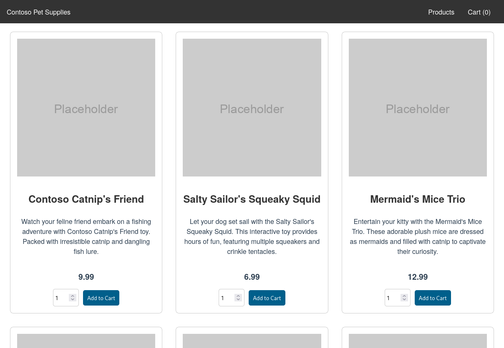

# Ingress to apps deployed on Azure Kubernetes Service (AKS)

:::tip TL;DR

To use the ngrok Kubernetes Ingress Controller with Azure Kubernetes Service (AKS):

1. [Create your cluster in AKS](#create-your-cluster-in-AKS)
2. [Install the ngrok Ingress Controller](#install-the-ngrok-kubernetes-ingress-controller)
3. [Deploy a demo microservices app](#deploy-a-demo-microservices-app)
4. [Add ngrok-based ingress to your demo app](#add-ngrok-based-ingress-to-your-demo-app)
5. [Add OAuth authentication to your demo app](#add-oauth-authentication-to-your-demo-app)

:::

In this guide, you'll launch a new cluster with [Azure Kubernetes Service (AKS)](https://azure.microsoft.com/en-us/products/kubernetes-service) and a demo app. You'll then add the ngrok Kubernetes Ingress Controller to route public traffic directly to your demo app through an encrypted, feature-rich tunnel for a complete proof of concept.

In the end, you'll have learned enough to deploy your next production-ready Kubernetes app with AKS, with the ngrok Kubernetes Ingress Controller giving you access to additional features, like observability and resiliency, with no extra configuration complexity.

Here is what you'll be building with:

- The [ngrok Kubernetes Ingress Controller](https://ngrok.com/blog-post/ngrok-k8s): ngrok's official controller for adding secure public ingress and middleware execution to your Kubernetes apps with ngrok's Cloud Edge. With ngrok, you can manage and secure traffic to your apps at every stage of the development lifecycle while also benefitting from simpler configurations, security, and edge acceleration.
- Azure Kubernetes Service (AKS): A managed Kubernetes environment from Microsoft. AKS simplifies the deployment, health monitoring, and maintenance of cloud native applications, whether you deploy them in Azure, in on-premises data centers, or at the edge. With [40 regions](https://azure.microsoft.com/en-us/explore/global-infrastructure/products-by-region/?products=kubernetes-service), you should be able to deploy a cluster close to your customers.

:::caution This how-to requires:

1. An [ngrok account](https://ngrok.com/signup) at the [**pay-as-you-go** or **custom**](https://ngrok.com/pricing) tiers.
2. An [Azure account](https://azure.microsoft.com/en-us/pricing/purchase-options/pay-as-you-go) with permissions to create new Kubernetes clusters.
3. [kubectl](https://kubernetes.io/docs/tasks/tools/install-kubectl/) installed locally.
4. [Helm 3.0.0+](https://helm.sh/docs/intro/install/) installed locally.

:::

## **Step 1**: Create your cluster in AKS {#create-your-cluster-in-AKS}

Start by creating a new managed Kubernetes cluster in AKS. If you already have one, you can skip to [Step 2: Install the ngrok Ingress Controller](#install-the-ngrok-kubernetes-ingress-controller).

1. Go to the [Kubernetes services](https://portal.azure.com/#view/HubsExtension/BrowseResource/resourceType/Microsoft.ContainerService%2FmanagedClusters) section in your Azure console and click **Create**&rarr;**Create a Kubernetes cluster**.

1. Configure your new cluster with the wizard. The default options are generally safe bets, but there are a few you might want to look at depending on your requirements and budget:

   - Cluster present configuration: You can choose a production-ready deployment, a dev/test deployment, and others.
   - Region: The data center where AKS will deploy your cluster—pick a region geographically close to your primary customers and/or your organization.
   - AKS pricing tier: The **Free** tier works great with less than 10 nodes, and you can always upgrade to the production tier after deployment.

1. Click **Review + create** and wait for Azure to validate your configuration. If you see a **Validation failed.** warning, check out the errors—they're likely related to [quota limits](https://learn.microsoft.com/en-us/azure/quotas/regional-quota-requests). When it's ready, click **Create**. Grab a cup of coffee—deployment will take a while.

1. When AKS completes the deployment, click **Go to deployment**, then **Connect**, which will show you options for connecting to your new cluster with kubectl. Follow the instructions to use the Cloud shell or Azure CLI, then double-check AKS has successfully deployed your cluster's underlying services:

   ```bash
   kubectl get deployments --all-namespaces=true
   NAMESPACE         NAME                      READY   UP-TO-DATE   AVAILABLE   AGE
   calico-system     calico-kube-controllers   1/1     1            1           5m
   calico-system     calico-typha              1/1     1            1           5m
   kube-system       ama-metrics               1/1     1            1           5m
   kube-system       ama-metrics-ksm           1/1     1            1           5m
   kube-system       coredns                   2/2     2            2           5m
   kube-system       coredns-autoscaler        1/1     1            1           5m
   kube-system       konnectivity-agent        2/2     2            2           5m
   kube-system       metrics-server            2/2     2            2           5m
   tigera-operator   tigera-operator           1/1     1            1           5m
   ```

## **Step 2**: Install the ngrok Kubernetes Ingress Controller {#install-the-ngrok-kubernetes-ingress-controller}

We recommend installing the [ngrok Kubernetes Ingress
Controller](https://github.com/ngrok/kubernetes-ingress-controller) before your end-user apps to separate the steps around infrastructure vs. app configuration.

1. Create an ngrok static subdomain for ingress if you don't have one already. Navigate to the [**Domains**
   section](https://dashboard.ngrok.com/cloud-edge/domains) of the ngrok dashboard and click **Create Domain** or **New
   Domain**. This static subdomain will be your `NGROK_DOMAIN` for the remainder of this guide.

1. Add the ngrok Helm repository if you haven't already.

   ```bash
   helm repo add ngrok https://charts.ngrok.com
   ```

1. Set up the `AUTHTOKEN` and `API_KEY` exports, which allows Helm to install the Ingress Controller using your ngrok credentials. Find your `AUTHTOKEN` under [**Your Authtoken**](https://dashboard.ngrok.com/get-started/your-authtoken) in the ngrok dashboard.

   To create a new API key, navigate to the [**API** section](https://dashboard.ngrok.com/api) of the ngrok dashboard, click the **New API Key** button, change the description or owner, and click the **Add API Key** button. Copy the API key token shown in the modal window before closing, as the ngrok dashboard will not show you the token again.

   ```bash
   export NGROK_AUTHTOKEN=[YOUR-AUTHTOKEN]
   export NGROK_API_KEY=[YOUR-API-KEY]
   ```

1. Install the ngrok Ingress Controller with Helm under a new `ngrok-ingress-controller` namespace.

   ```bash
   helm install ngrok-ingress-controller ngrok/kubernetes-ingress-controller \
     --namespace ngrok-ingress-controller \
     --create-namespace \
     --set credentials.apiKey=$NGROK_API_KEY \
     --set credentials.authtoken=$NGROK_AUTHTOKEN
   ```

1. Verify you have successfully installed the ngrok Ingress Controller and that pods are healthy.

   ```bash
   kubectl get pods -l 'app.kubernetes.io/name=kubernetes-ingress-controller' --namespace ngrok-ingress-controller

   NAME                                                              READY   STATUS    RESTARTS   AGE
   ngrok-ingress-controller-kubernetes-ingress-controller-man2fg5p   1/1     Running   0          27s
   ```

## **Step 3**: Deploy a demo microservices app {#deploy-a-demo-microservices-app}

To showcase how this integration works, you'll deploy the [AKS Store](https://github.com/Azure-Samples/azure-voting-app-redis) app, which uses a microservices architecture to connect frontend UI to API-like services, passing data to RabbitMQ and MongoDB in the backend. To showcase the features of AKS, you'll deploy this demo app directly in the Azure Portal.

:::tip

If you prefer the CLI, save the YAML below to a `.yaml` file on your local workstation and deploy with `kubectl apply -f ...`.

:::

1. Click **Create**&rarr;**Apply a YAML**.

1. Copy and paste the YAML below into the editor.

   ```yaml showLineNumbers
   apiVersion: apps/v1
   kind: Deployment
   metadata:
     name: rabbitmq
   spec:
     replicas: 1
     selector:
       matchLabels:
         app: rabbitmq
     template:
       metadata:
         labels:
           app: rabbitmq
       spec:
         nodeSelector:
           "kubernetes.io/os": linux
         containers:
           - name: rabbitmq
             image: mcr.microsoft.com/mirror/docker/library/rabbitmq:3.10-management-alpine
             ports:
               - containerPort: 5672
                 name: rabbitmq-amqp
               - containerPort: 15672
                 name: rabbitmq-http
             env:
               - name: RABBITMQ_DEFAULT_USER
                 value: "username"
               - name: RABBITMQ_DEFAULT_PASS
                 value: "password"
             resources:
               requests:
                 cpu: 10m
                 memory: 128Mi
               limits:
                 cpu: 250m
                 memory: 256Mi
             volumeMounts:
               - name: rabbitmq-enabled-plugins
                 mountPath: /etc/rabbitmq/enabled_plugins
                 subPath: enabled_plugins
         volumes:
           - name: rabbitmq-enabled-plugins
             configMap:
               name: rabbitmq-enabled-plugins
               items:
                 - key: rabbitmq_enabled_plugins
                   path: enabled_plugins
   ---
   apiVersion: v1
   data:
     rabbitmq_enabled_plugins: |
       [rabbitmq_management,rabbitmq_prometheus,rabbitmq_amqp1_0].
   kind: ConfigMap
   metadata:
     name: rabbitmq-enabled-plugins
   ---
   apiVersion: v1
   kind: Service
   metadata:
     name: rabbitmq
   spec:
     selector:
       app: rabbitmq
     ports:
       - name: rabbitmq-amqp
         port: 5672
         targetPort: 5672
       - name: rabbitmq-http
         port: 15672
         targetPort: 15672
     type: ClusterIP
   ---
   apiVersion: apps/v1
   kind: Deployment
   metadata:
     name: order-service
   spec:
     replicas: 1
     selector:
       matchLabels:
         app: order-service
     template:
       metadata:
         labels:
           app: order-service
       spec:
         nodeSelector:
           "kubernetes.io/os": linux
         containers:
           - name: order-service
             image: ghcr.io/azure-samples/aks-store-demo/order-service:latest
             ports:
               - containerPort: 3000
             env:
               - name: ORDER_QUEUE_HOSTNAME
                 value: "rabbitmq"
               - name: ORDER_QUEUE_PORT
                 value: "5672"
               - name: ORDER_QUEUE_USERNAME
                 value: "username"
               - name: ORDER_QUEUE_PASSWORD
                 value: "password"
               - name: ORDER_QUEUE_NAME
                 value: "orders"
               - name: FASTIFY_ADDRESS
                 value: "0.0.0.0"
             resources:
               requests:
                 cpu: 1m
                 memory: 50Mi
               limits:
                 cpu: 75m
                 memory: 128Mi
         initContainers:
           - name: wait-for-rabbitmq
             image: busybox
             command:
               [
                 "sh",
                 "-c",
                 "until nc -zv rabbitmq 5672; do echo waiting for rabbitmq; sleep 2; done;",
               ]
             resources:
               requests:
                 cpu: 1m
                 memory: 50Mi
               limits:
                 cpu: 75m
                 memory: 128Mi
   ---
   apiVersion: v1
   kind: Service
   metadata:
     name: order-service
   spec:
     type: ClusterIP
     ports:
       - name: http
         port: 3000
         targetPort: 3000
     selector:
       app: order-service
   ---
   apiVersion: apps/v1
   kind: Deployment
   metadata:
     name: product-service
   spec:
     replicas: 1
     selector:
       matchLabels:
         app: product-service
     template:
       metadata:
         labels:
           app: product-service
       spec:
         nodeSelector:
           "kubernetes.io/os": linux
         containers:
           - name: product-service
             image: ghcr.io/azure-samples/aks-store-demo/product-service:latest
             ports:
               - containerPort: 3002
             resources:
               requests:
                 cpu: 1m
                 memory: 1Mi
               limits:
                 cpu: 1m
                 memory: 7Mi
   ---
   apiVersion: v1
   kind: Service
   metadata:
     name: product-service
   spec:
     type: ClusterIP
     ports:
       - name: http
         port: 3002
         targetPort: 3002
     selector:
       app: product-service
   ---
   apiVersion: apps/v1
   kind: Deployment
   metadata:
     name: store-front
   spec:
     replicas: 1
     selector:
       matchLabels:
         app: store-front
     template:
       metadata:
         labels:
           app: store-front
       spec:
         nodeSelector:
           "kubernetes.io/os": linux
         containers:
           - name: store-front
             image: ghcr.io/azure-samples/aks-store-demo/store-front:latest
             ports:
               - containerPort: 8080
                 name: store-front
             env:
               - name: VUE_APP_ORDER_SERVICE_URL
                 value: "http://order-service:3000/"
               - name: VUE_APP_PRODUCT_SERVICE_URL
                 value: "http://product-service:3002/"
             resources:
               requests:
                 cpu: 1m
                 memory: 200Mi
               limits:
                 cpu: 1000m
                 memory: 512Mi
   ---
   apiVersion: v1
   kind: Service
   metadata:
     name: store-front
   spec:
     ports:
       - port: 80
         targetPort: 8080
     selector:
       app: store-front
     type: LoadBalancer
   ```

1. Click **Add** to deploy the demo app. To double-check services deployed successfully, click on **Workloads** in the Azure Portal and look for `store-front`, `rabbitmq`, `product-service`, and `order-service` in the `default` namespace. If you prefer the CLI, you can run `kubectl get pods` for the same information.

## **Step 4**: Add ngrok-based ingress to your demo app {#add-ngrok-based-ingress-to-your-demo-app}

Next, you'll configure and deploy the [ngrok Kubernetes Ingress Controller](https://github.com/ngrok/kubernetes-ingress-controller) to expose your demo app to the public internet through the ngrok Cloud Edge.

1. In the Azure Portal, click **Create&rarr;Apply a YAML**.

1. Copy and paste the YAML below into the editor. This manifest defines how the ngrok Kubernetes Ingress Controller should route traffic arriving on `NGROK_DOMAIN` to the `store-front` service on port `80`, which you deployed in the previous step.

   :::tip

   Make sure you edit line `9` of the YAML below, which contains the `NGROK_DOMAIN` variable, with the ngrok subdomain you created in the second step.

   :::

   ```yaml showLineNumbers
   apiVersion: networking.k8s.io/v1
   kind: Ingress
   metadata:
     name: store-ingress
   spec:
     ingressClassName: ngrok
     rules:
       # highlight-start
       - host: NGROK_DOMAIN
         # highlight-end
         http:
           paths:
             - path: /
               pathType: Prefix
               backend:
                 service:
                   name: store-front
                   port:
                     number: 80
   ```

1. Click **Add** to deploy the ingress configuration.

   You can check on the status of the ingress deployment in the Azure Portal at **Services and ingresses**&rarr;**Ingresses**. You should see the `store-ingress` name and your ngrok subdomain. If you need to edit your ingress configuration in the future, click on the ingress item and then the **YAML** tab.

1. Navigate to your ngrok subdomain, e.g. `https://NGROK_DOMAIN.ngrok.app`, in your browser to see the demo app in action. Behind the scenes, ngrok's Cloud Edge routed your request into the ngrok Kubernetes Ingress Controller, which then passed it to the `store-front` service.

   

## **Step 5**: Add OAuth authentication to your demo app {#add-oauth-authentication-to-your-demo-app}

Now that your demo app is publicly accessible through the ngrok Cloud Edge, you can quickly layer on [additional capabilities](https://ngrok.com/docs/http/), like authentication, without configuring and deploying complex infrastructure. Let's see how that works for restricting access to individual Google accounts or any Google account under a specific domain name.

1. Apply a new YAML definition to your cluster with the YAML below, replacing `YOUR_DOMAIN.TLD` with the domain name you'd like to authenticate visitors against.

   ```yaml showLineNumbers
   kind: NgrokModuleSet
   apiVersion: ingress.k8s.ngrok.com/v1alpha1
   metadata:
     name: ngrok-managed-google-oauth
     namespace: ngrok-ingress-controller
   modules:
     oauth:
       google:
         emailDomains:
           - YOUR_DOMAIN.TLD
   ```

1. Edit your ingress definition to connect your ngrok Kubernetes Ingress Controller with the `NgrokModuleSet` configuration you just deployed for OAuth.

   In the Azure Portal, click **Services and ingresses**&rarr;**Ingresses**, then `store-ingress`, then the **YAML** tab. Add the highlighted YAML below, then validate and save your changes.

   ```yaml showLineNumbers
   apiVersion: networking.k8s.io/v1
   kind: Ingress
   metadata:
     name: store-ingress
     namespace: ngrok-ingress-controller
   # highlight-start
   annotations:
     k8s.ngrok.com/modules: ngrok-managed-google-oauth
   # highlight-end
   spec:
     ingressClassName: ngrok
     rules:
       - host: NGROK_DOMAIN
         http:
           paths:
             - path: /
               pathType: Prefix
               backend:
                 service:
                   name: store-front
                   port:
                     number: 80
   ```

1. Reload your demo app in your browser to see a request to sign in via Google. If the account's domain name matches yours, they'll be given authorization to access your app—otherwise, they'll be redirected to an error page.

## What's next?

You've now used the open source ngrok Kubernetes Ingress Controller to add public ingress to a demo app on a cluster managed in AKS without having to worry about complex Kubernetes networking configurations. Because ngrok abstracts ingress and middleware execution to its Cloud Edge, you can follow a similar process to route public traffic to your next production-ready app.

You can also extend the integration with additional [route modules](https://github.com/ngrok/kubernetes-ingress-controller/blob/main/docs/user-guide/route-modules.md), like circuit breakers, compression, or edit headers before they are sent to your app. Additional deployment options include [name-based virtual hosting](https://github.com/ngrok/kubernetes-ingress-controller/blob/main/docs/user-guide/ingress-to-edge-relationship.md#name-based-virtual-hosting), which lets you deploy and manage any number of Kubernetes clusters and apps in AKS, then create unique ngrok edge domains, like `foo1.bar.com` and `foo2.bar.com`, to direct traffic to the respective services.

Learn more about the ngrok Ingress Controller, or contribute to its ongoing development, by checking out the [GitHub repository](https://github.com/ngrok/kubernetes-ingress-controller) and the [project-specific documentation](https://github.com/ngrok/kubernetes-ingress-controller/tree/main/docs).
