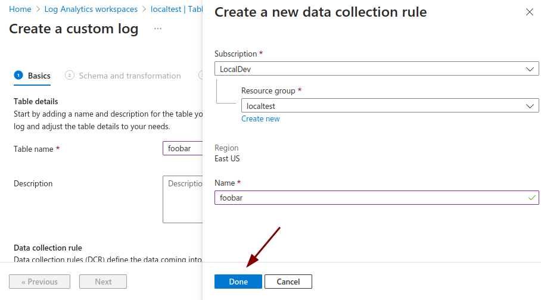

# Azure Logs Ingestion Event Destination

:::tip TL;DR

To send ngrok events to Azure using the Azure Logs Ingestion API:

1. [Create a Log Analytics Workspace](#log-analytics-workspace)
1. [Create a Data Collection Endpoint](#data-collection-endpoint)
1. [Create a DCR-based Custom Table in the Workspace](#data-collection-rule)
1. [Create a Microsoft Entra Application](#entra-application)
1. [Assign IAM permissions to the Application for the DCR](#dcr-iam)
1. [Gather necessary data for Event Destination](#event-destination-data)
1. [Create the Event Destination](#event-destination)

:::

This guide covers how to send ngrok events including network traffic logs into Azure via the Logs Ingestion API.

This is useful if you want to keep an audit log of configuration changes within your ngrok
account, record all traffic to your endpoints for active monitoring/troubleshooting, or leveraging it as a SIEM for security inspections.

By integrating ngrok with Azure, you can:

- **Quickly identify application issues** in real-time using ngrok request events using Azure logs processing.
- **Historically audit changes occurring within an account**. Be able to historically audit changes within an account.
- **Profile usage of your service** by using logs queries and real-time data analytics.
- **Identify security issues** by using ngrok events.

## **Step 1**: Create a Log Analytics Workspace {#log-analytics-workspace}

These steps were adapted from the [Create a Logs Analytics Workspace docs from Microsoft](https://learn.microsoft.com/en-us/azure/azure-monitor/logs/quick-create-workspace).

1. Using a browser, log into your [Azure portal](https://portal.azure.com).

2. Navigate to the search bar and type in **Log Analytics Workspaces**

3. Click on the **Services** entry (not the Marketplace entry).


4. Click **Create** on the top bar Log Analytics Workspace page.

5. Follow the wizard to create your Log Analytics Workspace, filling in the necessary region information, name, and resource group, before clicking **Review + Create**. These values can be anything you like and do not impact ngrok's ability to send logs to your Azure account.

6. Click **Create** at the bottom of the review step to finally provision the Log Analytics Workspace.


You now have a **Log Analytics Workspace**, which will be the home for your data collection endpoint, tables, and rules.

## **Step 2**: Create a Data Collection Endpoint {#data-collection-endpoint}

These steps were adapted from the [Create a data collection endpoint](https://learn.microsoft.com/en-us/azure/azure-monitor/essentials/data-collection-endpoint-overview#create-a-data-collection-endpoint) docs from Microsoft.

1. Navigate to the search bar and type in **Data Collection Endpoints**

2. Click on the **Services** entry.


3. Click **Create** on the top bar Data Collection Endpoints page.

4. Follow the wizard to create your Data Collection Endpoint, filling in the necessary region information, name, and resource group, before clicking **Review + Create**. These fields can be anything you like and to not impact ngrok's ability to send logs to your Azure account.

5. Click **Create** at the bottom of the review step to provision the Data Collection Endpoint.


You now have a **Data Collection Endpoint**, which is the network accessible service that ngrok connects via to send events into Azure.

## **Step 3**: Create a DCR-based Custom Table in the Workspace {#data-collection-rule}

These steps were adapted from the [Create a new table in Log Analytics workspace](https://learn.microsoft.com/en-us/azure/azure-monitor/logs/tutorial-logs-ingestion-portal?source=recommendations#create-new-table-in-log-analytics-workspace) docs from Microsoft.

1. Navigate to the **Log Analytics Workspaces** list once again.

2. Click the workspace you created previously in [**Step 1**](#log-analytics-workspace).

3. Navigate to **Settings -> Tables** in the sidebar menu of the selected workspace.

4. Click **Create** on the top bar, and select **New custom log (DCR-based)**.


5. Populate the table name with a name of your choice and the DCE field with the existing DCE you created in [**Step 2**](#data-collection-endpoint).

6. Click **Create a new data collection rule** underneath the Data collection rule field, which opens a drawer. Fill out the resource group and name, before clicking **Done** on the drawer.



7. Click **Next** in the table creation wizard.

8. Upload the following json file using the wizard. After uploading, you will notice a warning header "TimeGenerated field is not found in the sample provided" which is expected.

```json
{
	"event_id": "ev_2iKcXvmLJoZojWzrCuLbstBCle0",
	"event_type": "test",
	"event_timestamp": "2024-06-24T15:25:52Z",
	"object": {}
}
```

:::tip Not to worry!
You will notice a warning header "TimeGenerated field is not found in the sample provided"; this is expected.

We will remedy this by using the **Transformation Editor**.
:::

9. Click the **Transformation editor** button on the top bar of the wizard, which will open a drawer.

10. Paste in the following transformation and click **Run**.

```
source
| extend TimeGenerated = event_timestamp
```


11. Click **Apply**.

12. Click **Next**.

13. Click **Create**.


You now have a **Data Collection Rule** properly configured for ngrok events, alongside a table where the data will be stored.

## **Step 4**: Create a Microsoft Entra Application {#entra-application}

These steps were adapted from the [Create a Microsoft Entra Application](https://learn.microsoft.com/en-us/azure/azure-monitor/logs/tutorial-logs-ingestion-portal?source=recommendations#create-microsoft-entra-application) docs from Microsoft.

1. Navigate to the search bar and type in **Entra ID**.

2. Select the **Microsoft Entra ID** under **Services**, not the Marketplace item.


3. Navigate to **Manage -> App registrations** on the sidebar.

4. Click **New registration**

5. Name the application **ngrok-events** or something similar to clarify its use; this entity will be what ngrok uses to authenticate with your data collection endpoint.

6. Select the first radio option, **Accounts in this organizational directory only** for the account type

7. Click **Register**


You have now created an **Entra ID App Registration**, which is a service user construct that grants roles/access to services like ngrok.

## **Step 5**: Assign IAM permissions to the Application for the DCR {#dcr-iam}

These steps were adapted from the [Assign permissions to the DCR](https://learn.microsoft.com/en-us/azure/azure-monitor/logs/tutorial-logs-ingestion-portal?source=recommendations#assign-permissions-to-the-dcr) docs from Microsoft.

1. Navigate to the search bar and type in **Data collection rules**.

2. Select the **Data collection rules** option under **Services**.

3. Click on the Data collection rule created in [**Step 3**](#data-collection-rule).

4. Click **Access control (IAM)** on the sidebar.

5. Click **Add** on the top bar.

6. Click **Add role assignment**.

7. Search for **Monitoring** in the search bar underneath **Job function roles**.

8. Click on **Monitoring Metrics Publisher**.


9. Click **Next**, advancing to Members.

10. Click **Select members**.

11. Search for the app registration you created in [**Step 4**](#entra-application).

12. Click on the service principal and click **Select**.

13. Click **Review + assign**.

14. Click **Review + assign** again, confirming the role assignment.


You have now granted access for the ngrok application to ingest logs into the DCR, which is the final step before we can create an Event Destination.

## **Step 6**: Gather necessary data for Event Destination {#event-destination-data}

In order to create an event destination in your ngrok Dashboard, we will need to gather the following information from what we just created in Azure:

- the Tenant ID
- the Application's Client ID
- the Application's Client Secret
- the DCR immutable ID
- the DCR stream name
- the DCE log ingestion URI

1. To gather the first three fields, we will navigate back to **Entra ID**. Search for **Entra** in the top search bar and select the **Entra ID** service.

2. Navigate to **Manage -> App registrations** in the sidebar, and select the application you created in [**Step 4**](#entra-application).

3. Copy the **Application (client) ID** and **Directory (tenant) ID** from the Overview Page.


4. Navigate to **Manage -> Certificates & secrets** in the sidebar.

5. Click **New client secret**.

6. Fill in the description and expiry date with the desired values, before clicking **Add**.

7. Copy the secret value provided by Azure - **this value will no longer be available once you navigate away**.


8. To gather the DCR persistent ID and stream name, navigate to **Data collection rules** using the top search bar.

9. Select the Data collection rule you created in [**Step 3**](#data-collection-rule).

10. In the **Overview** tab, copy the **Immutable Id** value.


11. Navigate to **Configuration -> Data sources** in the sidebar.

12. Copy the **Data source** name, which should start with **Custom\_** and end with **\_CL**. This is the **DCR stream name**.


13. Finally, navigate to **Data collection endpoints** in the top search bar.

14. Select the Data collection endpoint you created in [**Step 2**](#data-collection-endpoint).

15. In the **Overview** tab, copy the **Logs Ingestion URI**.

You now have all the required data to create an event destination with ngrok!

## **Step 7**: Create the new Event Destination in ngrok {#create-event-destination}

At this point, you can choose to create the event destination [through the ngrok Dashboard](#create-via-dashboard) or via [the ngrok API](#create-via-ngrok-api).

### Creating through the ngrok Dashboard {#create-via-dashboard}

1. Log into the ngrok Dashboard and navigate to [**Observability > Events**](https://dashboard.ngrok.com/observability/event-subscriptions).

1. Create a **new Event Subscription** through the plus sign in the top left or open an existing one.

1. After adding one or more sources, select the **Destinations** tab and **Add Destination**

1. Select the **Azure Logs Ingestion API** option

1. Fill in the fields based on the values you collected in **Step 6**.

1. Click **Send Test Event** and look for an example event in your Azure Account. It may take a minute to show up due to propagation delays.

1. Click **Done** and save the new Event Subscription.

### Creating via the ngrok API {#create-via-ngrok-api}

1. Create an API key with ngrok. You can do this via the [ngrok dashboard](https://dashboard.ngrok.com/api).

2. Using your Rest API tool of choice (cURL, Postman, etc.), you will run the following API calls.

3. To create the Azure logs ingestion event destination, run the following call:

```bash
curl --location 'https://api.ngrok.com/event_destinations' \
--header 'Accept: application/json' \
--header 'Ngrok-Version: 2' \
--header 'Content-Type: application/json' \
--header 'Authorization: Bearer {API_KEY}' \
--data '{
    "format": "json",
    "target": {
        "azure_logs_ingestion": {
            "tenant_id":     "{TENANT_ID}",
		      "client_id":     "{CLIENT_ID}",
		      "client_secret": "{CLIENT_SECRET}",

		      "logs_ingestion_uri":          "{DCE_LOGS_INGESTION_URI}",
		      "data_collection_rule_id":     "{DCR_RULE_ID}",
		      "data_collection_stream_name": "{DCR_STREAM_NAME}"
         }
    }
}'
```

Copy the returned event destination ID.

```json
{
	"id": "ed_12345", // THIS ONE
	"created_at": "...",
	"format": "json",
	"target": {
		"firehose": null,
		"kinesis": null,
		"cloudwatch_logs": null,
		"datadog": null,
		"azure_logs_ingestion": {
			"tenant_id": "...",
			"client_id": "...",
			"client_secret": "",
			"logs_ingestion_uri": "...",
			"data_collection_rule_id": "...",
			"data_collection_stream_name": "..."
		}
	},
	"uri": "https://api.ngrok.com.lan/event_destinations/ed_2iQktWaNCyWVNjFYWGkdzhrbvF5"
}
```

4. To create an event subscription using the previously created event destination, run the following call

```bash
curl \
-X POST \
-H "Authorization: Bearer {API_KEY}" \
-H "Content-Type: application/json" \
-H "Ngrok-Version: 2" \
-d '{
   "description":"ip policy creations",
   "destination_ids":["{EVENT_DESTINATION_ID}"],
   "sources":[
      {"type":"ip_policy_created.v0"},
      {"type":"{MORE_EVENT_TYPES}"}
   ]
}' \
https://api.ngrok.com/event_subscriptions
```

After getting a 200 response, your event destination is successfully configured and subscribed to the set of events types you desire.
