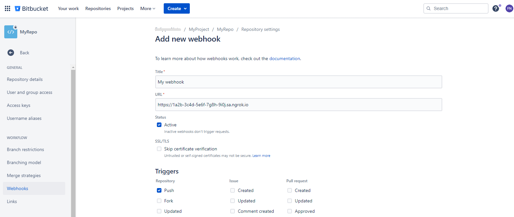
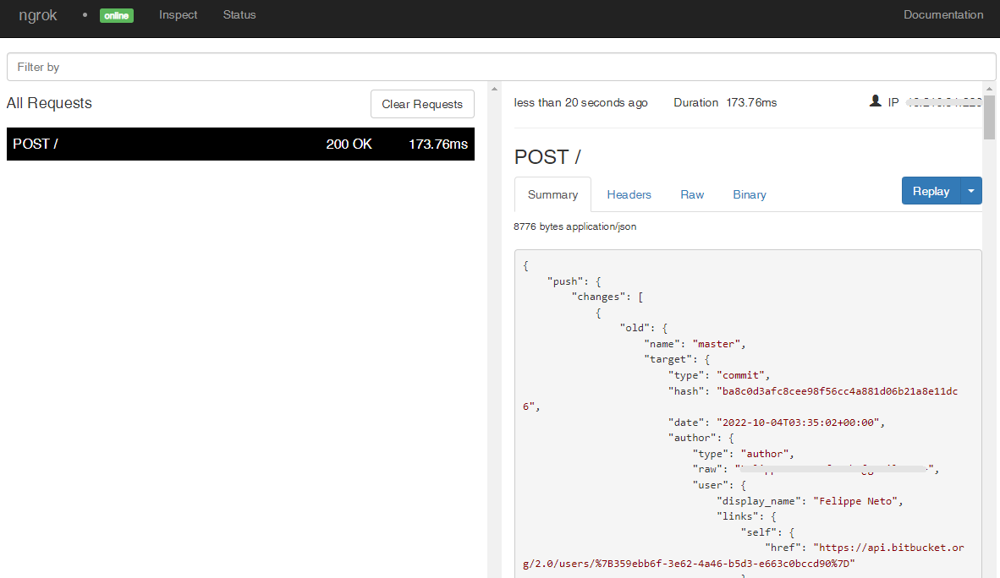

# Bitbucket Repository Webhooks

---

:::tip TL;DR

To integrate Bitbucket webhooks with ngrok:

1. [Launch your local webhook.](#start-your-app) `npm start`
1. [Launch ngrok.](#start-ngrok) `ngrok http 3000`
1. [Configure Bitbucket webhooks with your ngrok URL.](#setup-webhook)
1. [Secure your webhook requests with verification.](#security)

:::

This guide covers how to use ngrok to integrate your localhost app with Bitbucket to allow Bitbucket to send notifications to your app anytime an event takes place in a Bitbucket repository.

By integrating ngrok with Bitbucket, you can:

- **Develop and test Bitbucket webhooks locally**, eliminating the time in deploying your development code to a public environment and setting it up in HTTPS.
- **Inspect and troubleshoot requests from Bitbucket** in real-time via the inspection UI and API.
- **Modify and Replay Bitbucket Webhook requests** with a single click and without spending time reproducing events manually in your Bitbucket account.

## **Step 1**: Start your app {#start-your-app}

For this tutorial, we'll use the [sample NodeJS app available on GitHub](https://github.com/ngrok/ngrok-webhook-nodejs-sample).

To install this sample, run the following commands in a terminal:

```bash
git clone https://github.com/ngrok/ngrok-webhook-nodejs-sample.git
cd ngrok-webhook-nodejs-sample
npm install
```

This will get the project installed locally.

Now you can launch the app by running the following command:

```bash
npm start
```

The app runs by default on port 3000.

You can validate that the app is up and running by visiting http://localhost:3000. The application logs request headers and body in the terminal and responds with a message in the browser.

## **Step 2**: Launch ngrok {#start-ngrok}

Once your app is running successfully on localhost, let's get it on the internet securely using ngrok!

1. If you're not an ngrok user yet, just [sign up for ngrok for free](https://ngrok.com/signup).
1. [Download the ngrok agent](https://ngrok.com/download).
1. Go to the [ngrok dashboard](https://dashboard.ngrok.com) and copy your Authtoken. <br />
   **Tip:** The ngrok agent uses the auth token to log into your account when you start a tunnel.
1. Start ngrok by running the following command:

   ```bash
   ngrok http 3000
   ```

1. ngrok will display a URL where your localhost application is exposed to the internet (copy this URL for use with Bitbucket).
   

## **Step 3**: Integrate Bitbucket {#setup-webhook}

Bitbucket can trigger webhook calls to external applications whenever events happen in a repository. To register for such events, follow the instructions below:

1. Access [Bitbucket](https://bitbucket.com/) and sign in using your Bitbucket account.

1. Click **Repositories** on the top menu and click the name of a repository from the repository list.
   **Tip:** If you don't have a repository, create a new empty one.

1. In the repository page, click **Repository settings** from the left menu and then click **Webhooks**.

1. On the **Webhooks** page, click **Add webhook**.

1. On the **Add new webhook** page, enter a **Title** for your webhook and in the **URL** field enter the URL provided by the ngrok agent to expose your application to the internet (i.e., `https://1a2b-3c4d-5e6f-7g8h-9i0j.sa.ngrok.io`).
   

1. Mark the **Push** checkbox under the **Triggers** section and then click **Save** at the bottom of the page.

### Run Webhooks with Bitbucket and ngrok

Because you've selected the **Push** event as the trigger for your webhook, Bitbucket will submit a post request to your application through ngrok whenever you push content to your repository.
**Note:** Different messages are sent to your application depending on the trigger event you choose.

Follow the instructions below to add some content to your repository:

1. Click the name of your repository at the top of the left menu.

1. On the project's page, click **...** and then click **Add file**.

1. In the **Source** page, enter a name for the file in the **Filename** field, and enter the following content to the file in the textbox:
   `This is my new file content`.

1. Click **Commit**, and then click **Commit** in the Commit changes popup.

   Confirm your localhost app receives the push event notification and logs both headers and body to the terminal.

Alternatively, clone your repository locally, add some content, commit, and then push the content to your repostiory on Bitbucket:
`bash
    git add .; git commit -m "my first commit"; git push
    `

### Inspecting requests

When you launch the ngrok agent on your local machine, you can see two links:

- The URL to your app (it ends with `ngrok-free.app` for free accounts or `ngrok.app` for paid accounts when not using custom domains)
- A local URL for the Web Interface (a.k.a **Request Inspector**).

The Request Inspector shows all the requests made through your ngrok tunnel to your localhost app. When you click on a request, you can see details of both the request and the response.

Seeing requests is an excellent way of validating the data sent to and retrieved by your app via the ngrok tunnel. That alone can save you some time dissecting and logging HTTP request and response headers, methods, bodies, and response codes within your app just to confirm you are getting what you expect.

To inspect Bitbucket's event requests, launch the ngrok web interface (i.e. `http://127.0.0.1:4040`), and then click one of the requests sent by Bitbucket.

From the results, review the response body, header, and other details:



### Replaying requests

The ngrok Request Inspector provides a replay function that you can use to test your code without retriggering new events from Bitbucket. To replay a request:

1. In the ngrok inspection interface (i.e., `http://localhost:4040`), select a request from Bitbucket.

1. Click **Replay** to execute the same request to your application or select **Replay with modifications** to modify the content of the original request before sending the request.

1. If you choose to **Replay with modifications**, you can modify any content from the original request. Optionally, modify the request header with different content. For example, modify the **X-Bitbucket-Event** header with the value **MyCustomPush**.

1. If you choose to **Replay with modifications**, you can modify any content from the original request. For example, you can modify the **user_name** field in the body request.

1. Click **Replay**.

Verify that your local application receives the request and logs the corresponding information to the terminal.

## Secure webhook requests {#security}

THe following are quick steps to add extra protection to your application.

- If you are running Bitbucket Cloud, use ngrok IP Restrictions to allow ingress access for a list of IP addresses.

  **Note:** This feature requires ngrok Pro or Enterprise plan.

  1. You can find a list of CloudFront IP Addresses used by Bitbucket Cloud in the [Bitbucket Support documents](https://support.atlassian.com/bitbucket-cloud/docs/what-are-the-bitbucket-cloud-ip-addresses-i-should-use-to-configure-my-corporate-firewall/).

  1. Go to the [ngrok dashboard](https://dashboard.ngrok.com), sign in, click **Security** in the left menu, and then click **IP Restrictions**.

  1. In the **Agent** section, click **Attach IP Policies**, click **New IP Policy**, and then click **Add Rule**.

  1. In the **Add Rule** section, click **Allow** and then enter the CIDR that covers the IP Address from Bitbucket (i.e `123.456.789.1/32`) in the **CIDR** field.

  1. Enter a **Description** for both the rule and the policy, click **Save**, and then click **Attach IP Policy**.

  1. On the **IP Restrictions** page, click **Save**.

- If you are running Bitbucket Server, ngrok signature webhook verification feature to allow ngrok to assert that requests from your Bitbucket webhook are the only traffic allowed to make calls to your localhost app.

  **Note:** This ngrok feature is limited to 500 validations per month on free ngrok accounts. For unlimited, upgrade to Pro or Enterprise.

  1. Access your Bitbucket repository, navigate through the interface to the webhook page, and then edit the webhook.

  1. In the **Authentication** section, select **Secret token** as the method, and then enter a value for the secret token.

  1. Restart your ngrok agent by running the command, replacing `{your secret token}` with the value you entered before:

  ```bash
  ngrok http 3000 --verify-webhook bitbucket --verify-webhook-secret {your secret token}
  ```

  1. Access your repository, add a new file and then commit the file.

  Verify that your local application receives the request and logs information to the terminal.
