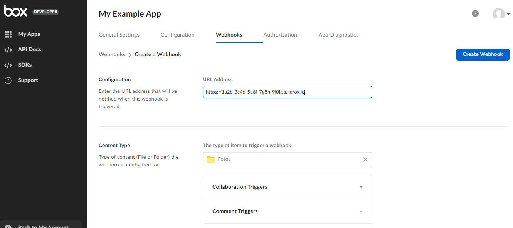
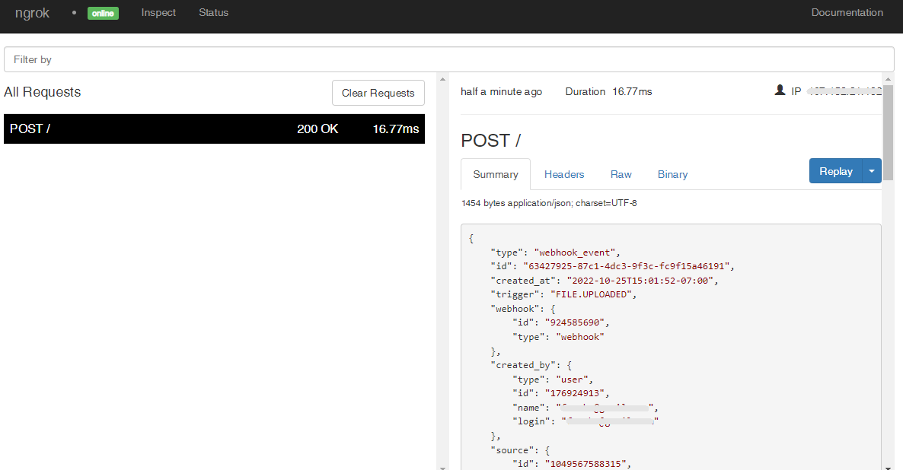

# Box Webhooks

---

:::tip TL;DR

To integrate Box webhooks with ngrok:

1. [Launch your local webhook.](#start-your-app) `npm start`
1. [Launch ngrok.](#start-ngrok) `ngrok http 3000`
1. [Configure Box webhooks with your ngrok URL.](#setup-webhook)
1. [Secure your webhook requests with verification.](#security)

:::

This guide covers how to use ngrok to integrate your localhost app with Box by using Webhooks.
Box webhooks can be used to notify an external application whenever specific events occur in your Box account.

By integrating ngrok with Box, you can:

- **Develop and test Box webhooks locally**, eliminating the time in deploying your development code to a public environment and setting it up in HTTPS.
- **Inspect and troubleshoot requests from Box** in real-time via the inspection UI and API.
- **Modify and Replay Box Webhook requests** with a single click and without spending time reproducing events manually in your Box account.
- **Secure your app with Box validation provided by ngrok**. Invalid requests are blocked by ngrok before reaching your app.

## **Step 1**: Start your app {#start-your-app}

For this tutorial, we'll use the [sample NodeJS app available on GitHub](https://github.com/ngrok/ngrok-webhook-nodejs-sample).

To install this sample, run the following commands in a terminal:

```bash
git clone https://github.com/ngrok/ngrok-webhook-nodejs-sample.git
cd ngrok-webhook-nodejs-sample
npm install
```

This will get the project installed locally.

Now you can launch the app by running the following command:

```bash
npm start
```

The app runs by default on port 3000.

You can validate that the app is up and running by visiting http://localhost:3000. The application logs request headers and body in the terminal and responds with a message in the browser.

## **Step 2**: Launch ngrok {#start-ngrok}

Once your app is running successfully on localhost, let's get it on the internet securely using ngrok!

1. If you're not an ngrok user yet, just [sign up for ngrok for free](https://ngrok.com/signup).

1. [Download the ngrok agent](https://ngrok.com/download).

1. Go to the [ngrok dashboard](https://dashboard.ngrok.com) and copy your Authtoken. <br />
   **Tip:** The ngrok agent uses the auth token to log into your account when you start a tunnel.
1. Start ngrok by running the following command:

   ```bash
   ngrok http 3000
   ```

1. ngrok will display a URL where your localhost application is exposed to the internet (copy this URL for use with Box).
   

## **Step 3**: Integrate Box {#setup-webhook}

To register a webhook on your Box account follow the instructions below:

1. Access [Box](https://box.com/), sign in using your Box account, and then click **Dev Console** on the left menu.

1. On the **Box Developer** console, click **Create New App**, and then click **Custom App**.

1. On the **Custom App** popup, click **Server Authentication (with JWT)**, enter a name for the app in the **App name** field, and then click **Create App**.

1. On the app's page, click the **Configuration** tab, mark the **Manage Webhooks** checkbox under **Developer Actions**, and then click **Save Changes**.

1. Click the **Authorization** tab, click **Review and Submit**, enter `Requesting Access` in the **App Description** field, and then click **Submit**.

1. Access [Box Admin Console](https://app.box.com/master), click **Apps** on the left menu, click the **Custom App Manager** tab, click **View** on your app, click **Authorize**, and then click **Authorize**.

1. Back to the [Box Developer Console](https://app.box.com/developers/console), click your app name, click the **Webhook** tab, click **Create Webhook**, and then click **V2**.

1. On the **Create a Webhook** page, enter the URL provided by the ngrok agent to expose your application to the internet in the **URL Address** field (i.e. `https://1a2b-3c4d-5e6f-7g8h-9i0j.sa.ngrok.io`).
   

1. Click **Choose an item** for the **Content Type** section, select a folder from your box account, and then click **Choose**.

1. Click **File Triggers**, mark the **File Uploaded** checkbox, and then click **Create Webhook**.

### Run Webhooks with Box and ngrok

Because you registered your webhook with the **File Uploaded** trigger, Box sends a notification to your application whenever you upload files to a folder.

1. Access [Box](https://box.com/), sign in using your Box account, and then upload a file from your desktop to the folder you selected during the webhook registration. See [Integrate Box](#setup-webhook).

After the file upload process is completed, Box sends a post request to your application.

Confirm your localhost app receives the **FILE.UPLOADED** event notification and logs both headers and body in the terminal.

### Inspecting requests

When you launch the ngrok agent on your local machine, you can see two links:

- The URL to your app (it ends with `ngrok-free.app` for free accounts or `ngrok.app` for paid accounts when not using custom domains)
- A local URL for the Web Interface (a.k.a **Request Inspector**).

The Request Inspector shows all the requests made through your ngrok tunnel to your localhost app. When you click on a request, you can see details of both the request and the response.

Seeing requests is an excellent way of validating the data sent to and retrieved by your app via the ngrok tunnel. That alone can save you some time dissecting and logging HTTP request and response headers, methods, bodies, and response codes within your app just to confirm you are getting what you expect.

To inspect Box's webhooks call, launch the ngrok web interface (i.e. `http://127.0.0.1:4040`) and then click one of the requests sent by Box.

From the results, review the response body, header, and other details:



### Replaying requests

The ngrok Request Inspector provides a replay function that you can use to test your code without the need to trigger new events from Box. To replay a request:

1. In the ngrok inspection interface (i.e. `http://localhost:4040`), select a request from Box.

1. Click **Replay** to execute the same request to your application or select **Replay with modifications** to modify the content of the original request before sending the request.

1. If you choose to **Replay with modifications**, you can modify any content from the original request. For example, you can modify the **created_at** field inside the body of the request.

1. Click **Replay**.

Verify that your local application receives the request and logs the corresponding information to the terminal.

## Secure webhook requests {#security}

The ngrok signature webhook verification feature allows ngrok to assert that requests from your Box webhook are the only traffic allowed to make calls to your localhost app.

**Note:** This ngrok feature is limited to 500 validations per month on free ngrok accounts. For unlimited, upgrade to Pro or Enterprise.

This is a quick step to add extra protection to your application.

1. Access [Box Developer Console](https://app.box.com/developers/console), click your app name, click the **Webhook** tab, and then click **Manage Signature Keys**.

1. On the **Manage Signature Keys** page, click **Generate Key** in the **Primary Key** section and then click **COPY** to copy the value of the generated primary key.

1. Restart your ngrok agent by running the command, replacing `{your primary key}` with the value you have copied before:

   ```bash
   ngrok http 3000 --verify-webhook BOX --verify-webhook-secret {your primary key}
   ```

1. Access [Box](https://box.com/), sign in using your Box account, and then upload a file from your desktop to the folder you selected during the webhook registration. See [Integrate Box](#setup-webhook).

   Verify that your local application receives the request and logs information to the terminal.
