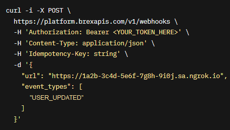

# Brex Webhooks

---

:::tip TL;DR

To integrate Brex webhooks with ngrok:

1. [Launch your local webhook.](#start-your-app) `npm start`
1. [Launch ngrok.](#start-ngrok) `ngrok http 3000`
1. [Configure Brex webhooks with your ngrok URL.](#setup-webhook)
1. [Secure your webhook requests with verification.](#security)

:::

This guide covers how to use ngrok to integrate your localhost app with Brex by using Webhooks.
Brex webhooks can be used to notify an external application whenever specific events occur in your Brex account.

By integrating ngrok with Brex, you can:

- **Develop and test Brex webhooks locally**, eliminating the time in deploying your development code to a public environment and setting it up in HTTPS.
- **Inspect and troubleshoot requests from Brex** in real-time via the inspection UI and API.
- **Modify and Replay Brex Webhook requests** with a single click and without spending time reproducing events manually in your Brex account.
- **Secure your app with Brex validation provided by ngrok**. Invalid requests are blocked by ngrok before reaching your app.

## **Step 1**: Start your app {#start-your-app}

For this tutorial, we'll use the [sample NodeJS app available on GitHub](https://github.com/ngrok/ngrok-webhook-nodejs-sample).

To install this sample, run the following commands in a terminal:

```bash
git clone https://github.com/ngrok/ngrok-webhook-nodejs-sample.git
cd ngrok-webhook-nodejs-sample
npm install
```

This will get the project installed locally.

Now you can launch the app by running the following command:

```bash
npm start
```

The app runs by default on port 3000.

You can validate that the app is up and running by visiting http://localhost:3000. The application logs request headers and body in the terminal and responds with a message in the browser.

## **Step 2**: Launch ngrok {#start-ngrok}

Once your app is running successfully on localhost, let's get it on the internet securely using ngrok!

1. If you're not an ngrok user yet, just [sign up for ngrok for free](https://ngrok.com/signup).

1. [Download the ngrok agent](https://ngrok.com/download).

1. Go to the [ngrok dashboard](https://dashboard.ngrok.com) and copy your Authtoken. <br />
   **Tip:** The ngrok agent uses the auth token to log into your account when you start a tunnel.
1. Start ngrok by running the following command:

   ```bash
   ngrok http 3000
   ```

1. ngrok will display a URL where your localhost application is exposed to the internet (copy this URL for use with Brex).
   

## **Step 3**: Integrate Brex {#setup-webhook}

To register a webhook on your Brex account follow the instructions below:

1. Access the [Brex Dashboard](https://dashboard.brex.com) and sign in using your Brex account.

1. On the left menu, click **Settings** and then click **Create Token**.

1. On the **Create an API token** page, enter a name for your token in the **Token Name** field, select **Write** for the **Referrals** and **Users** scopes, and then click **Create Token**.

1. On the next page, click **Allow access** to allow the API to access your Brex account.

1. The following page shows a token value. Copy this value and then click **Done**.

1. Use a desktop terminal to execute the following command:

   ```bash
   curl -i -X POST https://platform.brexapis.com/v1/webhooks -H 'Authorization: Bearer YOUR_TOKEN_HERE' -H 'Content-Type: application/json' -H 'Idempotency-Key: string' -d '{"YOUR_NGROK_URL": "string","event_types": ["USER_UPDATED"]}'
   ```

   **Note**: Replace `YOUR_TOKEN_HERE` with the token value you copied before, and `YOUR_NGROK_URL` with the URL provided by the ngrok agent to expose your application to the internet (i.e. `https://1a2b-3c4d-5e6f-7g8h-9i0j.sa.ngrok.io`).

   

1. Brex API responds with HTTP status 200 and a JSON containing the `"status": "ACTIVE"` attribute/value pair.

### Run Webhooks with Brex and ngrok

You can trigger new calls from Brex to your application by following the instructions below.

1. Access the [Brex Dashboard](https://dashboard.brex.com) and sign in using your Brex account.

1. On the left menu, click **Team**, click **User**, and then click **Invite user**.

1. On the **New user** page, enter the requested information, select the role for this user as **employee**, and then click **Send invite**.

   Confirm your localhost app receives event notifications related to the workflow you started and logs both headers and body in the terminal.

   **Note**: If Brex doesn't send the notification to your localhost app, access the email account of the user you created on Brex, open the Brex invitation email, and then accept the invitation by clicking **Create account**.

### Inspecting requests

When you launch the ngrok agent on your local machine, you can see two links:

- The URL to your app (it ends with `ngrok-free.app` for free accounts or `ngrok.app` for paid accounts when not using custom domains)
- A local URL for the Web Interface (a.k.a **Request Inspector**).

The Request Inspector shows all the requests made through your ngrok tunnel to your localhost app. When you click on a request, you can see details of both the request and the response.

Seeing requests is an excellent way of validating the data sent to and retrieved by your app via the ngrok tunnel. That alone can save you some time dissecting and logging HTTP request and response headers, methods, bodies, and response codes within your app just to confirm you are getting what you expect.

To inspect Brex's webhooks call, launch the ngrok web interface (i.e. `http://127.0.0.1:4040`) and then click one of the requests sent by Brex.

### Replaying requests

The ngrok Request Inspector provides a replay function that you can use to test your code without the need to trigger new events from Brex. To replay a request:

1. In the ngrok inspection interface (i.e. `http://localhost:4040`), select a request from Brex.

1. Click **Replay** to execute the same request to your application or select **Replay with modifications** to modify the content of the original request before sending the request.

1. If you choose to **Replay with modifications**, you can modify any content from the original request. For example, you can modify the **name** field inside the body of the request.

1. Click **Replay**.

Verify that your local application receives the request and logs the corresponding information to the terminal.

## Secure webhook requests {#security}

The ngrok signature webhook verification feature allows ngrok to assert that requests from your Brex webhook are the only traffic allowed to make calls to your localhost app.

**Note:** This ngrok feature is limited to 500 validations per month on free ngrok accounts. For unlimited, upgrade to Pro or Enterprise.

This is a quick step to add extra protection to your application.

1. Use a desktop terminal to execute the following command:

   ```bash
   curl -i -X GET https://platform.brexapis.com/v1/webhooks/secrets -H 'Authorization: Bearer YOUR_TOKEN_HERE'
   ```

   **Note**: Replace `YOUR_TOKEN_HERE` with the token value you copied before. See [Integrate ngrok and Brex](#setup-webhook).

1. Brex API responds with HTTP status 200 and a JSON containing the `"secret": "<webhook_secret>"` attribute/value pair.

1. Restart your ngrok agent by running the command, replacing `{webhook_secret}` with the value of the **secret** attribute you received before:

   ```bash
   ngrok http 3000 --verify-webhook BREX --verify-webhook-secret {webhook_secret}
   ```

1. Access the [Brex Dashboard](https://dashboard.brex.com), sign in using your Brex account, and create a new user. See [Run Webhooks with Brex and ngrok](#run-webhook).

   Verify that your local application receives the request and logs information to the terminal after you create the new user and the invitation is accepted.
