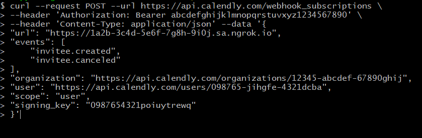
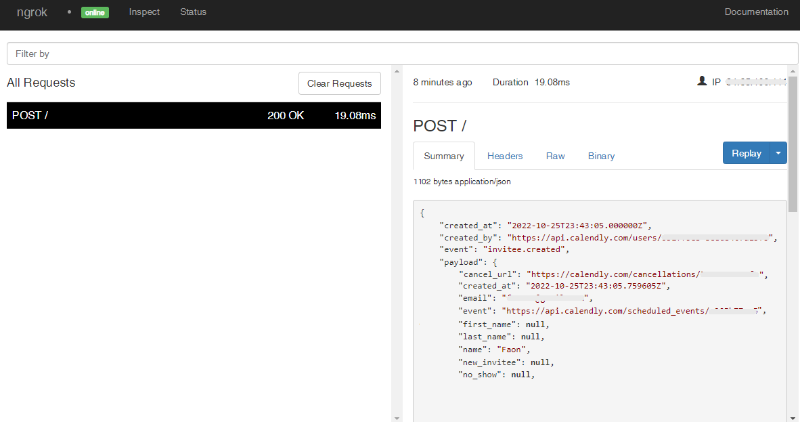

# Calendly Webhooks

---

:::tip TL;DR

To integrate Calendly webhooks with ngrok:

1. [Launch your local webhook.](#start-your-app) `npm start`
1. [Launch ngrok.](#start-ngrok) `ngrok http 3000`
1. [Configure Calendly webhooks with your ngrok URL.](#setup-webhook)
1. [Secure your webhook requests with verification.](#security)

:::

This guide covers how to use ngrok to integrate your localhost app with Calendly by using Webhooks.
Calendly webhooks can be used to notify an external application whenever specific events occur in your Calendly account.

By integrating ngrok with Calendly, you can:

- **Develop and test Calendly webhooks locally**, eliminating the time in deploying your development code to a public environment and setting it up in HTTPS.
- **Inspect and troubleshoot requests from Calendly** in real-time via the inspection UI and API.
- **Modify and Replay Calendly Webhook requests** with a single click and without spending time reproducing events manually in your Calendly account.
- **Secure your app with Calendly validation provided by ngrok**. Invalid requests are blocked by ngrok before reaching your app.

## **Step 1**: Start your app {#start-your-app}

For this tutorial, we'll use the [sample NodeJS app available on GitHub](https://github.com/ngrok/ngrok-webhook-nodejs-sample).

To install this sample, run the following commands in a terminal:

```bash
git clone https://github.com/ngrok/ngrok-webhook-nodejs-sample.git
cd ngrok-webhook-nodejs-sample
npm install
```

This will get the project installed locally.

Now you can launch the app by running the following command:

```bash
npm start
```

The app runs by default on port 3000.

You can validate that the app is up and running by visiting http://localhost:3000. The application logs request headers and body in the terminal and responds with a message in the browser.

## **Step 2**: Launch ngrok {#start-ngrok}

Once your app is running successfully on localhost, let's get it on the internet securely using ngrok!

1. If you're not an ngrok user yet, just [sign up for ngrok for free](https://ngrok.com/signup).

1. [Download the ngrok agent](https://ngrok.com/download).

1. Go to the [ngrok dashboard](https://dashboard.ngrok.com) and copy your Authtoken. <br />
   **Tip:** The ngrok agent uses the auth token to log into your account when you start a tunnel.
1. Start ngrok by running the following command:

   ```bash
   ngrok http 3000
   ```

1. ngrok will display a URL where your localhost application is exposed to the internet (copy this URL for use with Calendly).
   

## **Step 3**: Integrate Calendly {#setup-webhook}

To register a webhook on your Calendly account follow the instructions below:

1. Access [Calendly](https://calendly.com/) and sign in using your Calendly account.

1. On the **My Calendly** page, click **Integrations** on the top menu.

1. On the **All integrations** page, click the **API and webhooks** tile and then click **Get a token** under the **Personal access tokens** section.

1. On the **Before you begin** popup, click **Continue**, enter a name for the token in the **Choose a name for this token** field, click **Create token**, click **Copy token**, and then click **Close**.
   **Tip**: Make note of the token value.

1. On the **Your personal access tokens** page, scroll down and click **Copy Key** in the **API Key** section.
   **Tip**: Make note of the key value.

1. Open a terminal window and run the following command to gather information about your account:

   ```bash
   curl --request GET --url https://api.calendly.com/users/me \
   --header 'authorization: Bearer TOKEN'
   ```

   **Note**: Replace the value TOKEN in the command with the token value you copied before.

1. The terminal logs the response of the previous command. Copy the value of the **current_organization** field and the **uri** field.

1. In the terminal window, run the following command to register the webhook:

   ```bash
   curl --request POST --url https://api.calendly.com/webhook_subscriptions \
   --header 'Authorization: Bearer TOKEN' \
   --header 'Content-Type: application/json' --data '{
   "url": "URL",
   "events": [
       "invitee.created",
       "invitee.canceled"
   ],
   "organization": "ORGANIZATION_URL",
   "user": "USER_URL",
   "scope": "user",
   "signing_key": "KEY"
   }'
   ```

   **Note**: Replace the following with values copied on previous steps:

   - URL: the URL provided by the ngrok agent to expose your application to the internet (i.e. `https://1a2b-3c4d-5e6f-7g8h-9i0j.sa.ngrok.io`).
   - TOKEN: the Calendly token.
   - ORGANIZATION_URL: The **current_organization** field you copied before.
   - USER_URL: The **uri** field you copied before.
   - KEY: the key you copied before.

   

1. Make sure the response of the previous command contains a **resource** attribute with the information you provided.

### Run Webhooks with Calendly and ngrok

Use your Calendly link to schedule a meeting with you.
**Note** If you don't know your Calendly link, access [Calendly](https://calendly.com/), click **Account** on the top right corner of the page, click **Share Your Link**, and then copy your link.

1. In your Calendly link, click **30 Minutes Meeting**, select a date, and then click **Confirm**.

1. In the **Enter Details** page, enter your name and email in the corresponding fields, and then click **Schedule Event**.

   Confirm your localhost app receives the **invitee.created** event notification and logs both headers and body in the terminal.

### Inspecting requests

When you launch the ngrok agent on your local machine, you can see two links:

- The URL to your app (it ends with `ngrok-free.app` for free accounts or `ngrok.app` for paid accounts when not using custom domains)
- A local URL for the Web Interface (a.k.a **Request Inspector**).

The Request Inspector shows all the requests made through your ngrok tunnel to your localhost app. When you click on a request, you can see details of both the request and the response.

Seeing requests is an excellent way of validating the data sent to and retrieved by your app via the ngrok tunnel. That alone can save you some time dissecting and logging HTTP request and response headers, methods, bodies, and response codes within your app just to confirm you are getting what you expect.

To inspect Calendly's webhooks call, launch the ngrok web interface (i.e. `http://127.0.0.1:4040`) and then click one of the requests sent by Calendly.

From the results, review the response body, header, and other details:



### Replaying requests

The ngrok Request Inspector provides a replay function that you can use to test your code without the need to trigger new events from Calendly. To replay a request:

1. In the ngrok inspection interface (i.e. `http://localhost:4040`), select a request from Calendly.

1. Click **Replay** to execute the same request to your application or select **Replay with modifications** to modify the content of the original request before sending the request.

1. If you choose to **Replay with modifications**, you can modify any content from the original request. For example, you can modify the **created_at** field inside the body of the request.

1. Click **Replay**.

Verify that your local application receives the request and logs the corresponding information to the terminal.

## Secure webhook requests {#security}

The ngrok signature webhook verification feature allows ngrok to assert that requests from your Calendly webhook are the only traffic allowed to make calls to your localhost app.

**Note:** This ngrok feature is limited to 500 validations per month on free ngrok accounts. For unlimited, upgrade to Pro or Enterprise.

This is a quick step to add extra protection to your application.

1. Access [Calendly](https://calendly.com/) and sign in using your Calendly account.

1. On the **My Calendly** page, click **Integrations** on the top menu.

1. On the **All integrations** page, click the **API and webhooks** tile.

1. On the **Your personal access tokens** page, scroll down and click **Copy Key** in the **API Key** section.
   **Tip**: This is the same value you used to register your webhook. See [Integrate Calendly] (#setup-webhook).

1. Restart your ngrok agent by running the command, replacing `{your key}` with the value you have copied before:

   ```bash
   ngrok http 3000 --verify-webhook CALENDLY --verify-webhook-secret {your key}
   ```

1. Access your Calendly link, click **30 Minutes Meeting**, select a date, and then click **Confirm**.

1. In the **Enter Details** page, enter your name and email in the corresponding fields, and then click **Schedule Event**.

   Confirm your localhost app receives the **invitee.created** event notification and logs both headers and body in the terminal.
