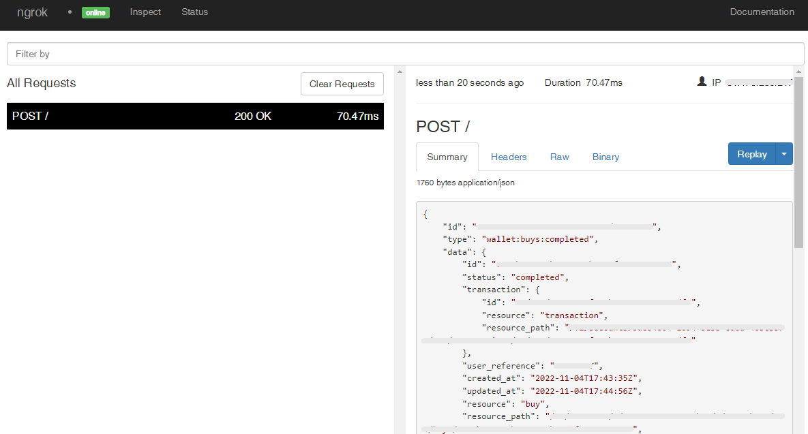

# Coinbase Webhooks

---

:::tip TL;DR

To integrate Coinbase webhooks with ngrok:

1. [Launch your local webhook.](#start-your-app) `npm start`
1. [Launch ngrok.](#start-ngrok) `ngrok http 3000`
1. [Configure Coinbase webhooks with your ngrok URL.](#setup-webhook)
1. [Secure your webhook requests with verification.](#security)

:::

This guide covers how to use ngrok to integrate your localhost app with Coinbase by using Webhooks.
Coinbase webhooks can be used to notify an external application whenever specific events occur in your Coinbase account.

By integrating ngrok with Coinbase, you can:

- **Develop and test Coinbase webhooks locally**, eliminating the time in deploying your development code to a public environment and setting it up in HTTPS.
- **Inspect and troubleshoot requests from Coinbase** in real-time via the inspection UI and API.
- **Modify and Replay Coinbase Webhook requests** with a single click and without spending time reproducing events manually in your Coinbase account.
- **Secure your app with Coinbase validation provided by ngrok**. Invalid requests are blocked by ngrok before reaching your app.

## **Step 1**: Start your app {#start-your-app}

For this tutorial, we'll use the [sample NodeJS app available on GitHub](https://github.com/ngrok/ngrok-webhook-nodejs-sample).

To install this sample, run the following commands in a terminal:

```bash
git clone https://github.com/ngrok/ngrok-webhook-nodejs-sample.git
cd ngrok-webhook-nodejs-sample
npm install
```

This will get the project installed locally.

Now you can launch the app by running the following command:

```bash
npm start
```

The app runs by default on port 3000.

You can validate that the app is up and running by visiting http://localhost:3000. The application logs request headers and body in the terminal and responds with a message in the browser.

## **Step 2**: Launch ngrok {#start-ngrok}

Once your app is running successfully on localhost, let's get it on the internet securely using ngrok!

1. If you're not an ngrok user yet, just [sign up for ngrok for free](https://ngrok.com/signup).

1. [Download the ngrok agent](https://ngrok.com/download).

1. Go to the [ngrok dashboard](https://dashboard.ngrok.com) and copy your Authtoken. <br />
   **Tip:** The ngrok agent uses the auth token to log into your account when you start a tunnel.
1. Start ngrok by running the following command:

   ```bash
   ngrok http 3000
   ```

1. ngrok will display a URL where your localhost application is exposed to the internet (copy this URL for use with Coinbase).
   

## **Step 3**: Integrate Coinbase {#setup-webhook}

To register a webhook on your Coinbase account follow the instructions below:

1. Access the [Coinbase homepage](https://www.coinbase.com/) and sign in using your Coinbase account.

1. On the **Home** page, click your avatar icon on the top right corner of the page and then click **Settings**.

1. On the **Settings** page, click the **API** tab and then click **New API Key**.

1. On the **New API Key** popup, click **all** under the **Accounts** section, click **Select all** under the **Permissions** section, and enter the URL provided by the ngrok agent to expose your application to the internet in the **Notification URL** field (i.e. `https://1a2b-3c4d-5e6f-7g8h-9i0j.sa.ngrok.io`).
   

1. Cilck **Create**, and then copy the value of the **API Key** and **API Secret** that appear on the **API Key details** popup.

### Run Webhooks with Coinbase and ngrok

Coinbase sends different request body contents depending on the event that is being triggered.
You can trigger new calls from Coinbase to your application by following the instructions below.

1. Access the [Coinbase homepage](https://www.coinbase.com/), sign in using your Coinbase account, and then click **Trade** on the left menu.

1. On the **Trade** page, click **Simple** on the top menu, and then click **Buy** to buy one of the assets that appear on the screen.

1. On the **Buy** popup, enter the monetary amount, click **Preview Buy**, and then click **Buy now**.

   Confirm your localhost app receives the create-project event notification and logs both headers and body in the terminal.

### Inspecting requests

When you launch the ngrok agent on your local machine, you can see two links:

- The URL to your app (it ends with `ngrok-free.app` for free accounts or `ngrok.app` for paid accounts when not using custom domains)
- A local URL for the Web Interface (a.k.a **Request Inspector**).

The Request Inspector shows all the requests made through your ngrok tunnel to your localhost app. When you click on a request, you can see details of both the request and the response.

Seeing requests is an excellent way of validating the data sent to and retrieved by your app via the ngrok tunnel. That alone can save you some time dissecting and logging HTTP request and response headers, methods, bodies, and response codes within your app just to confirm you are getting what you expect.

To inspect Coinbase's webhooks call, launch the ngrok web interface (i.e. `http://127.0.0.1:4040`), and then click one of the requests sent by Coinbase.

From the results, review the response body, header, and other details:



### Replaying requests

The ngrok Request Inspector provides a replay function that you can use to test your code without the need to trigger new events from Coinbase. To replay a request:

1. In the ngrok inspection interface (i.e. `http://localhost:4040`), select a request from Coinbase.

1. Click **Replay** to execute the same request to your application or select **Replay with modifications** to modify the content of the original request before sending the request.

1. If you choose to **Replay with modifications**, you can modify any content from the original request. For example, you can modify the **amount** field inside the body of the request.

1. Click **Replay**.

Verify that your local application receives the request and logs the corresponding information to the terminal.

## Secure webhook requests {#security}

The ngrok signature webhook verification feature allows ngrok to assert that requests from your Coinbase webhook are the only traffic allowed to make calls to your localhost app.

**Note:** This ngrok feature is limited to 500 validations per month on free ngrok accounts. For unlimited, upgrade to Pro or Enterprise.

This is a quick step to add extra protection to your application.

1. Restart your ngrok agent by replacing `{your api secret}` with the value you copied during the webhook registration and running the following command:

   ```bash
   ngrok http 3000 --verify-webhook coinbase --verify-webhook-secret {your api secret}
   ```

1. Access [Coinbase](https://www.coinbase.com/) and buy an asset.

Verify that your local application receives the request and logs information to the terminal.
