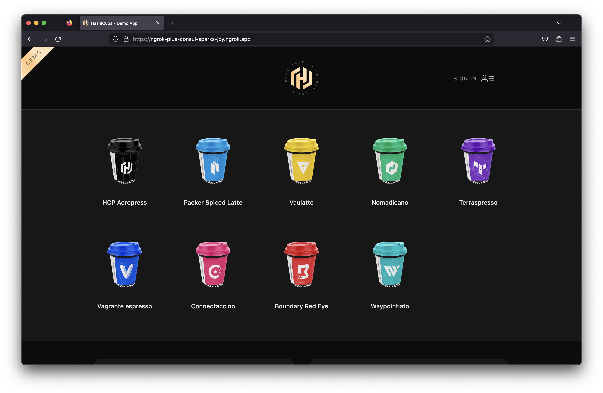
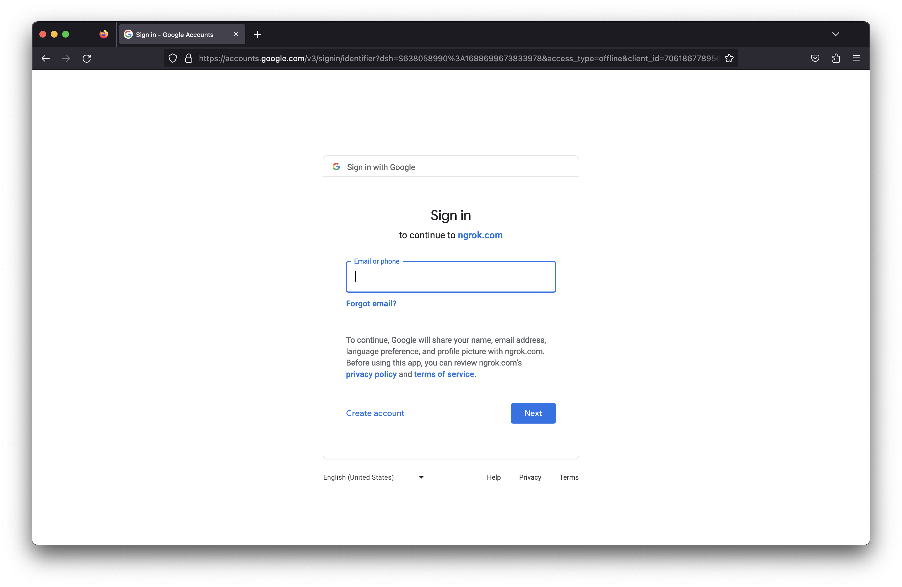

# Ingress to services in a Consul Service Mesh on Kubernetes

:::tip TL;DR
To use the ngrok Ingress Controller with Consul in a local demo environment:

1. [Set up a local Consul Service Mesh on Kubernetes](#set-up-a-consul-service-mesh-on-kubernetes)
1. [Install the ngrok Ingress Controller](#install-the-ngrok-ingress-controller)
1. [Install a sample application](#install-a-sample-application)
1. [Configure Public Ingress for the sample application](#configure-public-ingress-for-the-sample-application)
1. [Secure the app with OAuth](#add-oauth-protection-to-the-app)

:::

## Introduction

The [ngrok Ingress Controller for Kubernetes](https://github.com/ngrok/kubernetes-ingress-controller) is our official open-source controller for adding public and secure ingress traffic to your k8s services. It works on any cloud, local, or on-prem Kubernetes cluster to provide ingress to your services no matter the network configuration, as long as it has outbound access to the ngrok service. This allows ngrok to be portable and work seamlessly across any type of infrastructure.

[Consul](https://www.consul.io/) is a secure and resilient service mesh that provides service discovery, configuration, and segmentation functionality. Consul Connect provides service-to-service connection authorization and encryption using mutual TLS, automatically enabling TLS for all Connect services. Consul can be used with Kubernetes to provide a service mesh for your Kubernetes cluster.

Together, Consul provides a robust and secure way for Services within a cluster to communicate, while ngrok can seamlessly and securely provide public ingress to those services. This guide will walk you through setting up a Consul Service Mesh on Kubernetes and then using the ngrok Ingress Controller to provide ingress to your services to illustrate how they can work together.

:::caution This tutorial requires:

1. An [ngrok account](https://ngrok.com/signup).
1. [kubectl](https://kubernetes.io/docs/tasks/tools/install-kubectl/)
1. [Helm 3.0.0+](https://helm.sh/docs/intro/install/)
1. A remote or local Kubernetes cluster with Consul installed _OR_ [minikube](https://minikube.sigs.k8s.io/docs/start/) to set up a demo cluster locally.

:::

## **Step 1**: Set up a local Consul Service Mesh on Kubernetes {#set-up-a-consul-service-mesh-on-kubernetes}

For this guide, we'll need access to a remote or local Kubernetes cluster with Consul installed. If you have an existing cluster with Consul set up, you can skip this step and proceed to [Step 2: Install the ngrok Ingress Controller](#install-the-ngrok-ingress-controller).

If you don't have one set up, we'll set up a local Minikube cluster and install Consul now.

1. Create a local cluster with minikube

```bash
minikube start --profile dc1 --memory 4096 --kubernetes-version=v1.22.0
```

1. Create a file called `values.yaml` with the following contents:

```yaml
# Contains values that affect multiple components of the chart.
global:
  # The main enabled/disabled setting.
  # If true, servers, clients, Consul DNS and the Consul UI will be enabled.
  enabled: true
  # The prefix used for all resources created in the Helm chart.
  name: consul
  # The name of the data center that the agents should register as.
  data center: dc1
  # Enables TLS across the cluster to verify authenticity of the Consul servers and clients.
  tls:
    enabled: true
  # Enables ACLs across the cluster to secure access to data and APIs.
  acls:
    # If true, automatically manage ACL tokens and policies for all Consul components.
    manageSystemACLs: true
# Configures values that configure the Consul server cluster.
server:
  enabled: true
  # The number of server agents to run. This determines the fault tolerance of the cluster.
  replicas: 1
# Contains values that configure the Consul UI.
ui:
  enabled: true
  # Registers a Kubernetes Service for the Consul UI as a NodePort.
  service:
    type: NodePort
# Configures and installs the automatic Consul Connect sidecar injector.
connectInject:
  enabled: true
```

1. Install the Consul Helm chart

```bash
helm repo add hashicorp https://helm.releases.hashicorp.com

helm install --values values.yaml consul hashicorp/consul --create-namespace --namespace consul --version "1.0.0"
```

:::caution Depending on your computer, this can take some time for the pods to become healthy. You can watch the status of the pods with `kubectl get pods --namespace consul -w`

1. Verify Consul is installed and all its pods are healthy

```bash
kubectl get pods --namespace consul
NAME                                           READY   STATUS    RESTARTS        AGE
consul-connect-injector-6f67d58f8d-2lw6l       1/1     Running   0               17m
consul-server-0                                1/1     Running   0               17m
consul-webhook-cert-manager-5bb6f965c8-pjqms   1/1     Running   0               17m
```

We now have a Kubernetes cluster with a Consul service mesh installed.

:::note
These steps are based on Consul's Tutorial [Consul Service Discovery and Service Mesh on Minikube](https://developer.hashicorp.com/consul/tutorials/kubernetes/kubernetes-minikube)
:::

## **Step 2**: Install the ngrok Ingress Controller {#install-the-ngrok-ingress-controller}

Now that we have a Kubernetes cluster with Consul installed, we can install the ngrok Ingress Controller to provide ingress to our services. We'll use Helm to install the ngrok Ingress Controller into our cluster and use pod annotations to enable the Consul Connect sidecar injector. This will allow us to use Consul Connect to secure the traffic between the ngrok Ingress Controller and our services.

1. First, we need to create a Kubernetes Service for the ngrok Ingress Controller. Consul relies on this to name our services to declare Service Intention `source` and `destination` values. We'll create a Kubernetes Service for the ngrok Ingress Controller in the `consul` namespace.

```yaml
apiVersion: v1
kind: Service
metadata:
  name: ngrok-ingress-controller
  namespace: consul
spec:
  ports:
    - name: http
      port: 80
      protocol: TCP
      targetPort: 80
  selector:
    app.kubernetes.io/name: kubernetes-ingress-controller
```

1. Add the ngrok Ingress Controller Helm repo
   ```bash
   helm repo add ngrok https://charts.ngrok.com
   ```
1. Set your environment variables with your ngrok credentials. Replace `[AUTHTOKEN]` and `[API_KEY]` with your Authtoken and API key for your account.
   ```bash
   export NGROK_AUTHTOKEN=[AUTHTOKEN]
   export NGROK_API_KEY=[API_KEY]
   ```
1. Install the ngrok Ingress Controller

Next, we'll install the ngrok Ingress Controller into our cluster. We want the controller pods to be in the Consul service mesh in order to proxy traffic to our other services. We'll use pod annotations to enable the Consul Connect sidecar injector and allow outbound traffic to use the Consul mesh. Consul documents how to set these 2 annotations in the [Configure Ingress Controllers for Consul on Kubernetes](https://developer.hashicorp.com/consul/docs/k8s/connect/ingress-controllers) doc.

    ```yaml
    # This annotation is required to enable the Consul Connect sidecar injector
    consul.hashicorp.com/connect-inject: "true"
    # This is the CIDR of your Kubernetes API: `kubectl get svc kubernetes --output jsonpath='{.spec.clusterIP}'
    consul.hashicorp.com/transparent-proxy-exclude-outbound-cidrs: "10.96.0.1/32"
    ```

```bash
helm install ngrok-ingress-controller ngrok/kubernetes-ingress-controller \
  --namespace consul \
  --set fullnameOverride=ngrok-ingress-controller \
  --set credentials.apiKey=$NGROK_API_KEY \
  --set credentials.authtoken=$NGROK_AUTHTOKEN \
  --set-string podAnnotations.consul\\.hashicorp\\.com/connect-inject=true \
  --set podAnnotations."consul\.hashicorp\.com/transparent-proxy-exclude-outbound-cidrs"="YOUR KUBERNETES API CIDR"
```

:::note

- HashiCorp's docs also mention the annotation `consul.hashicorp.com/transparent-proxy-exclude-inbound-ports`. This is not applicable to the ngrok Ingress Controller as we create an outbound connection for Ingress rather than exposing ports.
- The `--set-string` flag allows the pod annotation to escape the `.` character in the annotation name while ensuring the value `true` is a boolean and not a string.
- In a production environment, or anywhere you wish to use Infrastructure as Code and source control your Helm configurations, you can set up your credentials following this [guide](https://github.com/ngrok/kubernetes-ingress-controller/blob/main/docs/deployment-guide/credentials.md).

:::

5. Verify the ngrok Ingress Controller is installed and all its pods are healthy

```bash
kubectl get pods -l 'app.kubernetes.io/name=kubernetes-ingress-controller' -n consul
NAME                                                READY   STATUS    RESTARTS      AGE
ngrok-ingress-controller-manager-5b796c88f7-k7v6z   2/2     Running   1 (64s ago)   67s
```

## **Step 3**: Install a Sample Application {#install-a-sample-application}

Now let's install a sample application to try out our service mesh and Ingress Controller combination. We'll use the [HashiCups Demo Application](https://github.com/hashicorp-demoapp) HashiCorp uses for demos and guides such as in their [Getting Started with Consul Service Mesh for Kubernetes](https://developer.hashicorp.com/consul/tutorials/kubernetes-features/service-mesh-deploy) guide. This application is a simple e-commerce application that allows users to order coffee cups.
The application has a `frontend` and public API services that are also backed by a private API and database. These communicate with each other through the Consul service mesh. This comes with nginx installed as a proxy for the `frontend` and Public API services. We'll replace this with ngrok to provide public access and other features.

:::tip For this demo, everything will be installed in the `consul` namespace.

The ngrok Ingress Controller can send traffic to services across different namespaces, but [Consul Service Intentions](https://developer.hashicorp.com/consul/docs/connect/config-entries/service-intentions) across namespaces [require an enterprise account](https://developer.hashicorp.com/consul/docs/connect/config-entries/service-intentions#sources-namespace). For now, we'll keep everything in the same namespace.
:::

1. Clone the [HashiCorp Learning Consul repo](https://github.com/hashicorp/learn-consul-kubernetes). This has multiple great example applications for learning about Consul and Kubernetes. We'll use the HashiCups application for this guide.

```bash
git clone https://github.com/hashicorp/learn-consul-kubernetes
```

1. Install the HashiCups sample app in the `consul` namespace. This app consists of multiple Services and Deployments that make a tiered application. We'll install all of them from this folder and then modify things from there.

```bash
kubectl apply -f learn-consul-kubernetes/service-mesh/deploy/hashicups -n consul
```

1. Remove the existing [Service Intentions](https://developer.hashicorp.com/consul/docs/connect/config-entries/service-intentions) for the `public-api` and `frontend` services and add our own.

Consul has the concept of [Service Intentions](https://developer.hashicorp.com/consul/docs/connect/config-entries/service-intentions). In short, they are a programmatic way to configure the Consul Service mesh to allow or deny traffic between services.

HashiCups comes with `nginx` installed with intentions to the `frontend` and `public-api` services. We'll remove these and add our own intentions to allow traffic from the ngrok Ingress Controller to the `frontend` and `public-api` services.

```bash
kubectl delete serviceintentions public-api -n consul
kubectl delete serviceintentions frontend -n consul
```

1. Create Service Intention from ngrok to HashiCups and the public-api

```yaml
apiVersion: consul.hashicorp.com/v1alpha1
kind: ServiceIntentions
metadata:
  name: ngrok-consul-frontend
  namespace: consul
spec:
  destination:
    name: frontend
  sources:
    - action: allow
      name: ngrok-ingress-controller
```

```yaml
apiVersion: consul.hashicorp.com/v1alpha1
kind: ServiceIntentions
metadata:
  name: ngrok-consul-api
  namespace: consul
spec:
  sources:
    - name: frontend
      action: allow
    - name: ngrok-ingress-controller
      action: allow
  destination:
    name: public-api
```

## **Step 4**: Configure Public Ingress for the sample application {#configure-public-ingress-for-the-sample-application}

Now that the ngrok Ingress Controller can communicate with the `frontend` service and `public-api` service through the Consul Service Mesh via Service Intentions, we can create an ingress to route traffic to the app. We'll create ingress objects to route traffic to the `frontend` service and the `public-api` service.

:::caution Update This First!
Update the line `host: $NGROK_DOMAIN_NAME` in the ingress object below to your ngrok domain name. For a free account, select something unique that is a subdomain of `ngrok.app`. For example, `host: my-unique-hashicups.ngrok.app`.
:::

```yaml
apiVersion: networking.k8s.io/v1
kind: Ingress
metadata:
  name: ingress-consul
  namespace: consul
spec:
  ingressClassName: ngrok
  rules:
    - host: $NGROK_DOMAIN_NAME
      http:
        paths:
          - path: /
            pathType: Prefix
            backend:
              service:
                name: frontend
                port:
                  number: 3000
          - path: /api
            pathType: Prefix
            backend:
              service:
                name: public-api
                port:
                  number: 8080
```

:::tip This ingress object:

- Uses the `ngrok` ingress class
- The host is the ngrok domain name you selected that is static
- There is a route for `/` that routes to the `frontend` service on port `3000`
- There is a route for `/api` that routes to the `public-api` service on port `8080`

:::

Open your `$NGROK_DOMAIN_NAME` domain in your browser and see the HashiCups application!



## **Step 5**: Add OAuth Protection to the App {#add-oauth-protection-to-the-app}

Now that we have the HashiCups application running, we can add OAuth protection to it. We'll use the OAuth module of the ngrok Ingress Controller to add OAuth protection to the app. This will allow us to use Google OAuth to protect the app.

1. Create an [NgrokModuleSet](https://github.com/ngrok/kubernetes-ingress-controller/blob/main/docs/user-guide/route-modules.md)

The NgrokModuleSet is a custom resource that allows you to configure the modules of the ngrok Ingress Controller. We'll create one to configure the OAuth module. Create the following `NgrokModuleSet`

```yaml
kind: NgrokModuleSet
apiVersion: ingress.k8s.ngrok.com/v1alpha1
metadata:
  name: oauth-module
  namespace: consul
modules:
  oauth:
    google:
      emailAddresses:
        # Replace with your email address
        - my-email@my-domain.com
      # Or specify a list of domains instead of individual email addresses
      # emailDomains:
      # - my-domain.com
```

:::tip Ngrok vs User Managed OAuth Application

This example uses the ngrok Managed OAuth Application for simplicity. To use your own Managed OAuth Application, you can try [Creating a custom Google OAuth application](https://ngrok.com/docs/cloud-edge/modules/oauth/google/) or use an existing one.
You can then create a Kubernetes Secret with the `clientId` and `clientSecret` and reference the secret in your module set like this [example](https://github.com/ngrok/kubernetes-ingress-controller/blob/main/docs/user-guide/route-modules.md#user-managed-oauth-application).
:::

1. Add the module to the ingress

Now that we have the module set created, we can add it to the ingress. We'll add an annotation to the ingress to add the module set to it.

```bash
kubectl annotate ingress ingress-consul k8s.ngrok.com/modules=oauth-module -n consul
```

This applies the OAuth module to each route on our ingress object. Navigate to your HashiCups app at `$NGROK_DOMAIN_NAME` and you'll see the Google OAuth screen.



Sign into your account and you'll be redirected to the HashiCups app! Now only you can order from HashiCups from anywhere!
