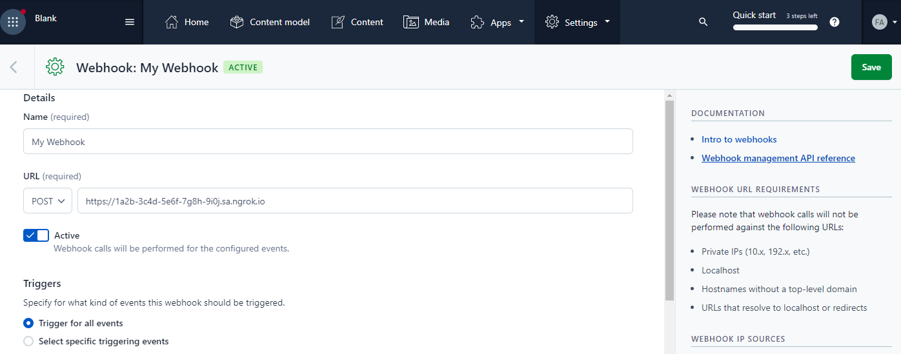
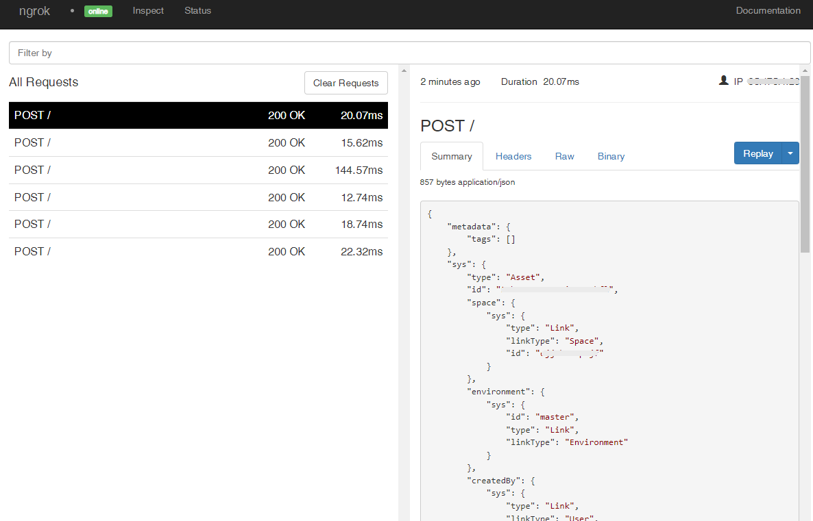

# Contentful Webhooks
------------

:::tip TL;DR

To integrate Contentful webhooks with ngrok:
1. [Launch your local webhook.](#start-your-app) `npm start`
1. [Launch ngrok.](#start-ngrok) `ngrok http 3000`
1. [Configure Contentful webhooks with your ngrok URL.](#setup-webhook)

:::


This guide covers how to use ngrok to integrate your localhost app with Contentful by using Webhooks.
Contentful webhooks can be used to notify an external application whenever specific events occur in your Contentful account. 

By integrating ngrok with Contentful, you can:

- **Develop and test Contentful webhooks locally**, eliminating the time in deploying your development code to a public environment and setting it up in HTTPS.
- **Inspect and troubleshoot requests from Contentful** in real-time via the inspection UI and API.
- **Modify and Replay Contentful Webhook requests** with a single click and without spending time reproducing events manually in your Contentful account.


## **Step 1**: Start your app {#start-your-app}

For this tutorial, we'll use the [sample NodeJS app available on GitHub](https://github.com/ngrok/ngrok-webhook-nodejs-sample). 

To install this sample, run the following commands in a terminal:

```bash
git clone https://github.com/ngrok/ngrok-webhook-nodejs-sample.git
cd ngrok-webhook-nodejs-sample
npm install
```

This will get the project installed locally.

Now you can launch the app by running the following command: 

```bash
npm start
```

The app runs by default on port 3000. 

You can validate that the app is up and running by visiting http://localhost:3000. The application logs request headers and body in the terminal and responds with a message in the browser.


## **Step 2**: Launch ngrok {#start-ngrok}

Once your app is running successfully on localhost, let's get it on the internet securely using ngrok! 

1. If you're not an ngrok user yet, just [sign up for ngrok for free](https://ngrok.com/signup).

1. [Download the ngrok agent](https://ngrok.com/download).

1. Go to the [ngrok dashboard](https://dashboard.ngrok.com) and copy your Authtoken. <br />
    **Tip:** The ngrok agent uses the auth token to log into your account when you start a tunnel.
    
1. Start ngrok by running the following command:
    ```bash
    ngrok http 3000
    ```

1. ngrok will display a URL where your localhost application is exposed to the internet (copy this URL for use with Contentful).
    


## **Step 3**: Integrate Contentful {#setup-webhook}

To register a webhook on your Contentful account follow the instructions below:

1. Access the [Contentful site](https://contentful.com/) and sign in using your Contentful account.

1. On the home page, click **Settings** on the top meu, click **Webhooks**, and then click **Add Webhook**.

1. On the **Webhook** page, enter a name in the **Name** field and enter the URL provided by the ngrok agent to expose your application to the internet in the **URL** field (i.e. `https://1a2b-3c4d-5e6f-7g8h-9i0j.sa.ngrok.io`).
    

1. Make sure the **Active** switch is selected and **Trigger for all events** is selected under the **Triggers** section.

1. Select **application/json** as the **Content type** value and then click **Save**.


### Run Webhooks with Contentful and ngrok

Contentful sends different request body contents depending on the event that is being triggered.
You can select specific triggering events during the webhook configuration.

To trigger Contentful calls to your application follow the instructions below:

1. Access the [Contentful site](https://contentful.com/) and sign in using your Contentful account.

1. On the home page, click **Media** on the top meu, click **Add Asset**, and then click **Single asset**.

1. On the **Asset** page, drag and drop an image from your desktop to the **File** area, and then click **Publish**.

   Confirm your localhost app receives two event notifications and logs both headers and body in the terminal.

Optionally, you can verify the log of the webhook call in Contentful:

1. On the home page the [Contentful site](https://contentful.com/), click **Settings** on the top meu, click **Webhooks**, click the name of your webhook, and then click the **Activity log** tab.

    


### Inspecting requests

When you launch the ngrok agent on your local machine, you can see two links: 

* The URL to your app (it ends with `ngrok-free.app` for free accounts or `ngrok.app` for paid accounts when not using custom domains)
* A local URL for the Web Interface (a.k.a **Request Inspector**).

The Request Inspector shows all the requests made through your ngrok tunnel to your localhost app. When you click on a request, you can see details of both the request and the response.

Seeing requests is an excellent way of validating the data sent to and retrieved by your app via the ngrok tunnel. That alone can save you some time dissecting and logging HTTP request and response headers, methods, bodies, and response codes within your app just to confirm you are getting what you expect.

To inspect Contentful's webhooks call, launch the ngrok web interface (i.e. `http://127.0.0.1:4040`) and then click one of the requests sent by Contentful.

From the results, review the response body, header, and other details:




### Replaying requests

The ngrok Request Inspector provides a replay function that you can use to test your code without the need to trigger new events from Contentful. To replay a request:

1. In the ngrok inspection interface (i.e. `http://localhost:4040`), select a request from Contentful.

1. Click **Replay** to execute the same request to your application or select **Replay with modifications** to modify the content of the original request before sending the request.

1. If you choose to **Replay with modifications**, you can modify any content from the original request. For example, you can modify the **sys > type** field inside the body of the request.

1. Click **Replay**.

Verify that your local application receives the request and logs the corresponding information to the terminal.

