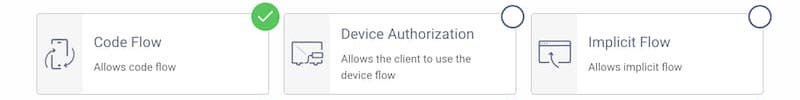
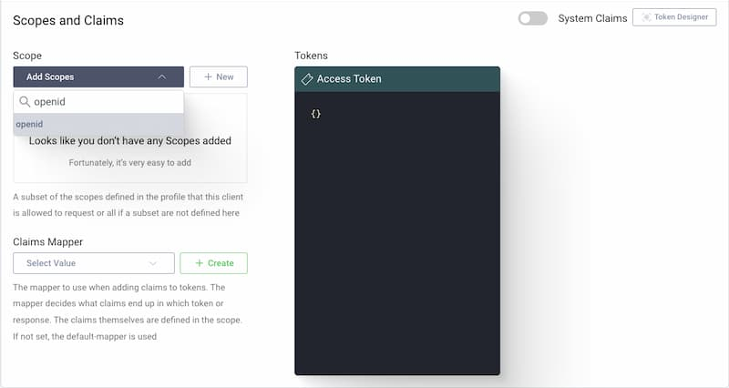
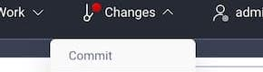
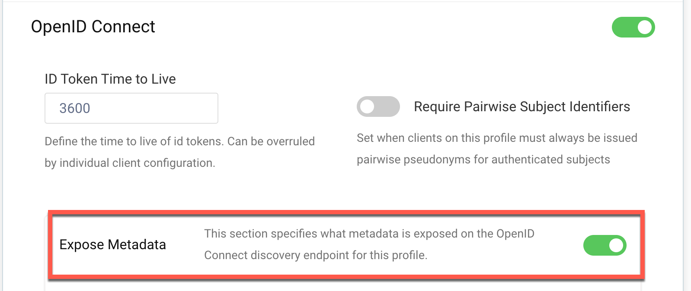
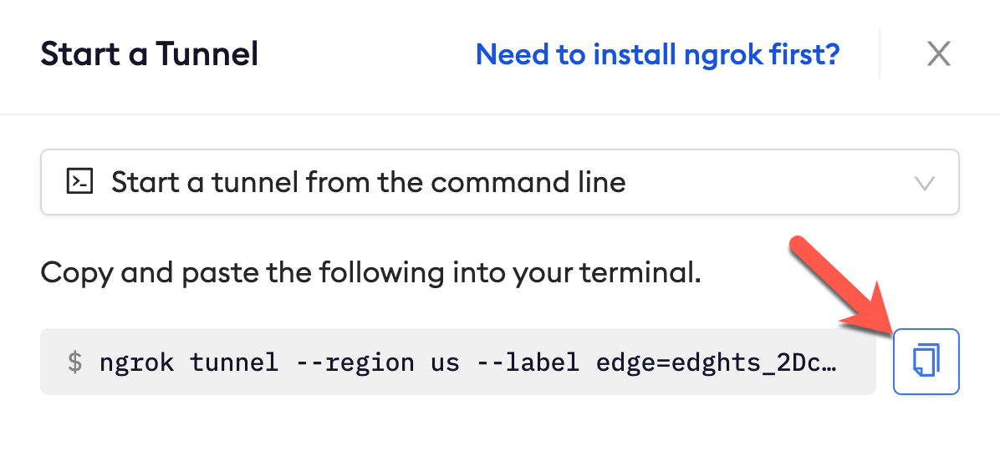

# Curity SSO (OpenID Connect)
------------

:::tip TL;DR

To secure access to ngrok with Curity Single Sign-On using OpenID Connect:
1. [Configure Curity SSO](#configure-Curity)
1. [Configure ngrok](#configure-ngrok)
1. [Test access to ngrok with Curity SSO](#test-sso)

:::

This article details how to configure Curity as the primary Identity Provider for ngrok tunnels.
By integrating Curity SSO with ngrok, you can:

- **Restrict access to ngrok tunnels** to only users who authenticated via Curity
- **Use Curity security policies, MFA authenticators** — including BankId, SITHS, and WebAuthn — **to control access to ngrok tunnels**.
- **Use Curity's Dashboard to facilitate access to ngrok apps**.

## Requirements

To configure ngrok tunnels with Curity, you must have:

- an Curity account with administrative rights to create clients
- an ngrok enterprise account with an access token or admin access to configure edges with OpenID Connect.


## Configuration Steps

To integrate ngrok with Curity SSO, you will need to:

1. Configure Curity with the ngrok app
1. Configure ngrok with the SSO settings provided by Curity

## **Step 1**: Configure Curity {#configure-Curity}

### Add an openid client in Curity

#### New Client

Give the client an ID (eg. `www` for a website client).


#### Capabilities

Scroll down to the **Capabilities** section and click **Add capabilities**.


Select the **Code Flow** capability and click **Next**.



#### Redirect URL

The redirect URI is back at the client. If you don't know what you will use just enter `http://localhost/callback` for now. This can be changed later. This tutorial will manually run the flow so localhost is fine. If you plan to use [OAuth Tools](https://oauth.tools/?utm_source=curity.io&utm_medium=Link&utm_content={props.utmContent}) for testing purposes, add the appropriate redirect URIs from the OAuth.tools dropdown menu.


#### Client Authentication

For client authentication select `secret` and enter a secret. Make sure to remember it since it cannot be retrieved later again (but can be reset).


#### User Authentication

For user authentication select the authenticator created in the [authenticator tutorial](https://curity.io/resources/learn/username-password-authenticator/).


#### Add the openid Scope

To be able to run the OpenID Code flow, add the `openid` scope to the client. In the section **Scope and Claims** simply select `openid` from the list of scopes in the dropdown menu.



#### Commit

Make sure to remember to commit the changes in the **Changes -> Commit** menu.

### Add authentication to the client 
The Curity Identity Server provides an authenticator called `html-form` that is suitable for setting up a login with username and password. It uses a Credential Manager to verify the credentials, which in turn uses a data-source.

#### Add an Authenticator 
Open the Authentication profile by clicking the **Profiles** button in the top bar. Click the **Authentication Service** box to open the **General** page of the profile.


#### Select Authenticators

Select the **Authenticators** page in the sidebar menu of the Authentication Service.


#### Add new Authenticator

Click **New Authenticator** on the authenticator page, and type the name `username-password`. Select the `HTML-Form` Authenticator type in the grid of authenticators and click next.


#### Configure Credential Manager and Account Manager

The HTML Form authenticator needs a Credential Manager in order to verify credentials and optionally an Account Manager for user registration. Select the `default-account-manager` as account manager and `default-credential-manager` as credential manager.


#### Commit the Changes

Commit the changes via the **Changes** menu.




### Expose the metadata url 

ngrok makes a call to the `/.well-known/openid-configuration` endpoint at Curity to pull configuation data specific to your Authorization Server.

#### Navigate to Token Service4

Open the Token Service profile by clicking the **Profiles** button in the top bar. Click the **Token Service** box to open the **General** page of the profile.

#### Configure the OpenID settings

Scroll down to the **OpenID Connect** section and enable the `Expose Metadata` toggle.


#### Commit the Changes

Commit the changes via the **Changes** menu.


## **Step 2**: Configure ngrok {#configure-ngrok}

ngrok can leverage Curity SSO in two ways:

- From the ngrok CLI (using the `--oidc` parameter)
- From the ngrok dashboard

### **Option 1**: ngrok CLI

> **Note:** For this tutorial, we assume you have an app running locally (i.e., on localhost:3000) with the ngrok client installed.

1. Launch a terminal
1. Enter the following command to launch an ngrok tunnel with Curity SSO. Replace `<curity_url>` with your Curity issuer address (i.e., https://acme.com/oauth/v2/oauth-anonymous) and the `<curity_client_id>` and `<curity_client_secret>` with the respective values copied from the ngrok app registered at Curity:

    ```bash
    ngrok http 3000 --oidc=<curity_url> \
    --oidc-client-id=<curity_client_id> \
    --oidc-client-secret=<curity_client_secret> \
    --subdomain=curity-sso-test
    ```

1. Skip to **Step 3**

### **Option 2**: ngrok Edge

To configure an edge with Curity:

1. Go to dashboard.ngrok.com.
1. Click **Cloud Edge** > **Edges**
1. If you don't have an edge already set to add Curity SSO, create a test edge:
    * Click **New Edge**
    * Click **HTTPS Edge**
    * Click the **pencil icon** next to "no description". Enter _Edge with Curity SSO_ as the edge name and click **Save**.
1. On the edge settings, click **OIDC**. 
1. Click **Begin setup** and enter the following:

    

    * **Issuer URL**: Your Curity issuer url (i.e. https://acme.com/oauth/v2/oauth-anonymous). 
    * **Client ID**: The name of the client from Curity 
    * **Client Secret**: The client secret copied from Curity

1. Click **Save**.

1. Launch a tunnel connected to your Curity edge:

    :::tip Note 
    For this step, we assume you have an app running locally (i.e. on localhost:3000) with the ngrok client installed.
    :::

    1. Click **Start a tunnel**.
    1. Click the **copy icon** next to the tunnel command.

        

    1. Launch a tunnel:
        * Launch a terminal 
        * Paste the command. Replace http://localhost:80 with your local web app addess (i.e., http://localhost:3000)
        * hit **Enter**. an ngrok tunnel associated to your edge configuration is launched.
    1. To confirm that the tunnel is connected to your edge:
        * Return to the ngrok dashboard
        * Close the **Start a tunnel** and the **Tunnel group** tabs
        * Refresh the test edge page. Under traffic, You will see the message _You have 1 tunnel online. Start additional tunnels to begin load balancing_

        

1. In the test edge, copy the **endpoint URL**. (you will use this url to test the Curity Authentication)
    

## Step 3: Test the integration {#test-sso}

1. In your browser, launch an incognito window.
1. Access your ngrok tunnel (i.e., https://curity-sso-test.ngrok.io or using a copied URL).
1. You should be prompted to log in with your Curity credentials.
1. After login, you should be able to see your web app.

