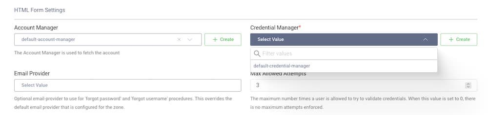
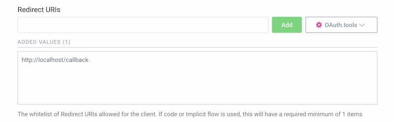

# Curity Identity Server (OpenID Connect)

:::tip TL;DR

To secure access to ngrok with Curity Identity Server using OpenID Connect:

1. [Configure Curity Identity Server](#configure-Curity-auth)
1. [Configure ngrok](#configure-ngrok)
1. [Test access to ngrok with Curity Identity Server](#test-sso)

:::

This article details how to configure Curity as the primary Identity Provider for ngrok tunnels.
By integrating Curity Identity Server with ngrok, you can:

- **Restrict access to ngrok tunnels** to only users who authenticated via Curity
- **Use Curity security policies, MFA authenticators** — including BankId, SITHS, and WebAuthn — **to control access to ngrok tunnels**.
- **Use Curity's Dashboard to facilitate access to ngrok apps**.

## Requirements

To configure ngrok tunnels with Curity, you must have:

- an Curity account with administrative rights to create clients
- an [ngrok Enterprise Account](https://ngrok.com/pricing) with an authtoken or admin access to configure edges with OpenID Connect.

## Configuration Steps

To integrate ngrok with Curity Identity Server, you will need to:

1. Configure Curity with the ngrok app
1. Configure ngrok with the SSO settings provided by Curity

## **Step 1**: Configure Curity Authentication {#configure-Curity-auth}

The Curity Identity Server provides an authenticator called `html-form` that is suitable for setting up a login with username and password. It uses a Credential Manager to verify the credentials, which in turn uses a data-source. There any many options for stronger authentication than username and password. A list of possible authentication methods is available [here](https://curity.io/product/authentication-service/ways-to-authenticate/).

### Add Authentication

1. #### Add an Authenticator

   1. Navigate to Profiles > Authentication Service > Authenticators.
   1. Click **New Authenticator** on the authenticator page and give it a name.
   1. Select the `HTML-Form` Authenticator type in the grid of authenticators and click **Next**.
   1. Under **HTML Form Settings**, select the `default-account-manager` as account manager and `default-credential-manager` as credential manager.
      

2. #### Commit the changes

   1. Commit the changes via the **Changes** menu.

      

## **Step 2**: Configure Curity for OIDC {#configure-Curity-oidc}

### Add an openid client in Curity

1. #### Add New Client

   1. Navigate to **Profiles** > **Token Service** > **Clients** and click **+ New Client**.
   1. Give the client an ID (eg. `www` for a website client) and click **Create**.

2. #### Add Capabilities

   1. Scroll down to the **Capabilities** section and click **Add capabilities**.
   1. Select the **Code Flow** capability and click **Next**.

      

   1. Enter `http://localhost/callback` as a **Redirect URI** and click **Add**.
      
   1. Click **Next**.
   1. On the **Client Authentication** screen, select **secret**.
   1. Click **Generate** to generate a new secret.
      
      1. Copy the **secret** since it cannot be retrieved later again (but can be reset).
   1. On the **User Authentication** screen, select the `HTML-form` authenticator created in **[Step 1](#configure-Curity-auth)**.
   1. Click **Done**.
   1. Scroll down on the newly created client page to **Scopes and Claims**.
   1. Select `openid` from the list of scopes in the dropdown menu.
      

3. #### Expose the metadata url

   ngrok makes a call to the `/.well-known/openid-configuration` endpoint at Curity to pull configuration data specific to your Authorization Server.

   1. Navigate to **Profiles** > **Token Service** > **General** page.
   1. Scroll down to the **OpenID Connect** section and enable the `Expose Metadata` toggle.
      

4. #### Commit the changes

   1. Commit the changes via the **Changes** menu.

      

## **Step 3**: Configure ngrok {#configure-ngrok}

ngrok can leverage Curity Identity Server in two ways:

- From the ngrok CLI (using the `--oidc` parameter)
- From the ngrok dashboard

### **Option 1**: ngrok CLI

> **Note:** For this tutorial, we assume you have an app running locally (i.e., on localhost:3000) with the ngrok client installed.

1. Launch a terminal
1. Enter the following command to launch an ngrok tunnel with Curity Identity Server. Replace `<curity_url>` with your Curity issuer address (i.e., https://acme.com/oauth/v2/oauth-anonymous) and the `<curity_client_id>` and `<curity_client_secret>` with the respective values copied from the ngrok app registered at Curity:

   ```bash
   ngrok http 3000 --oidc=<curity_url> \
   --oidc-client-id=<curity_client_id> \
   --oidc-client-secret=<curity_client_secret> \
   --url=curity-sso-test.ngrok.dev
   ```

1. [Skip to **Step 4**: ](#test-sso) Test the integration

### **Option 2**: ngrok Edge

To configure an edge with Curity:

1. Go to dashboard.ngrok.com.
1. Click **Cloud Edge** > **Edges**
1. If you don't have an edge already set to add Curity Identity Server, create a test edge:
   - Click **New Edge**
   - Click **HTTPS Edge**
   - Click the **pencil icon** next to "no description". Enter _Edge with Curity Identity Server_ as the edge name and click **Save**.
1. On the edge settings, click **OIDC**.
1. Click **Begin setup** and enter the following:

   

   - **Issuer URL**: Your Curity issuer url (i.e. https://acme.com/oauth/v2/oauth-anonymous).
   - **Client ID**: The name of the client from Curity
   - **Client Secret**: The client secret copied from Curity

1. Click **Save**.

1. Launch a tunnel connected to your Curity edge:

:::tip Note
For this step, we assume you have an app running locally (i.e. on localhost:3000) with the ngrok client installed.
:::

1.  Click **Start a tunnel**.
1.  Click the **copy icon** next to the tunnel command.

    

1.  Launch a tunnel:
    - Launch a terminal
    - Paste the command. Replace http://localhost:80 with your local web app address (i.e., http://localhost:3000)
    - hit **Enter**. an ngrok tunnel associated to your edge configuration is launched.
1.  To confirm that the tunnel is connected to your edge:

    - Return to the ngrok dashboard
    - Close the **Start a tunnel** and the **Tunnel group** tabs
    - Refresh the test edge page. Under traffic, You will see the message _You have 1 tunnel online. Start additional tunnels to begin load balancing_

    

1.  In the test edge, copy the **endpoint URL**. (you will use this url to test the Curity Authentication)
    

## **Step 4**: Test the integration {#test-sso}

1. In your browser, launch an incognito window.
1. Access your ngrok tunnel (i.e., https://curity-sso-test.ngrok.io or using a copied URL).
1. You should be prompted to log in with your Curity credentials.
1. After login, you should be able to see your web app.
