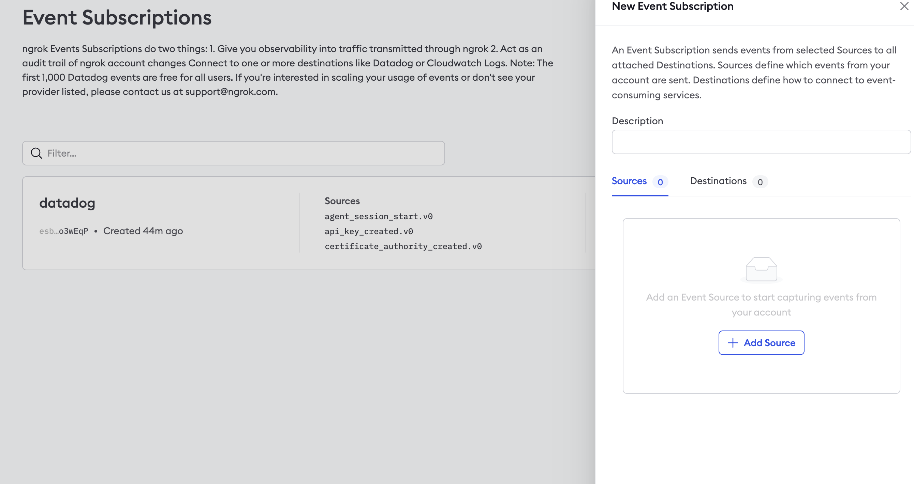
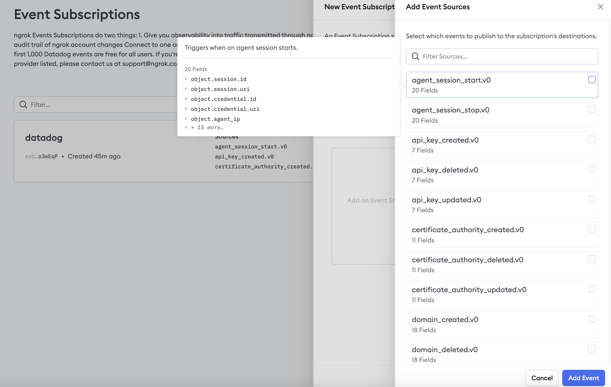
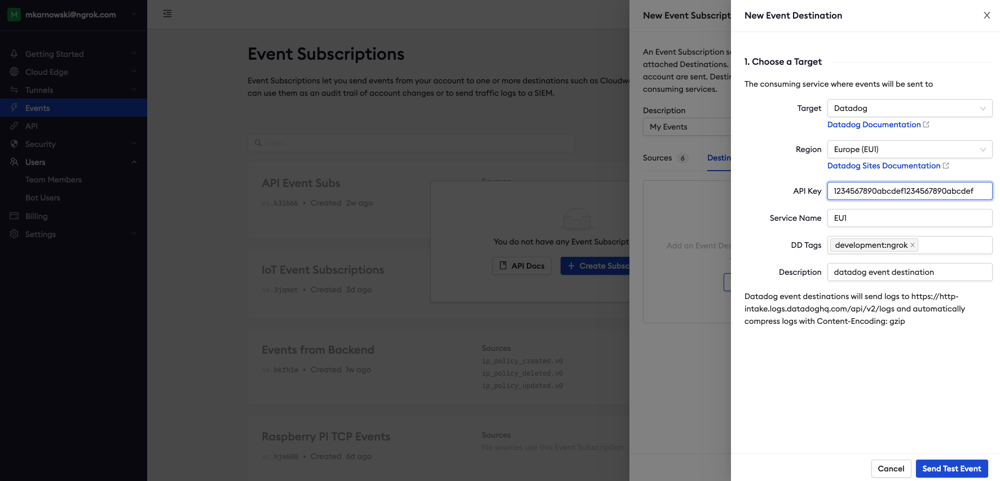
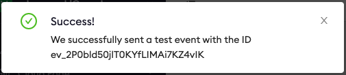

# Datadog Event Destination

:::tip TL;DR

To send ngrok events to Datadog:

1. [Get prerequisite information](#prerequisites)
1. [Create Event Subscription](#create-event-subscription)
1. [Create Event Destination](#create-destination)

:::

This guide covers how to send ngrok events including network traffic logs into Datadog.
You may want to keep an audit log of configuration changes within your ngrok
account, record all traffic to your endpoints for active monitoring/troubleshooting, or
you may use Datadog as a SIEM and want to use it for security inspections.

By integrating ngrok with Datadog, you can:

- **Quickly identify application issues** in real-time using ngrok Traffic Events in conjunction with Datadog ML based monitoring.
- **Historically audit changes occurring within an account**. Be able to historically audit changes within an account.
- **Visualize usage of your service** by using Datadog queries and analytic charts.
- **Identify security issues** by using ngrok events and Datadog SIEM.

ngrok will send logs to the [Datadog Logs
API](https://docs.datadoghq.com/api/latest/logs/#send-logs) and automatically compress
them with gzip. ngrok does not support the events or metrics APIs at this time.

## **Step 1**: Get prequisite information: {#prerequisites}

- Familiarize yourself with the ngrok [events](/docs/obs/reference) and select the ones you want to send to Datadog
- Verify which [Datadog site](https://docs.datadoghq.com/getting_started/site/#access-the-datadog-site) you are using
- Accquire a Datadog API key. To either create or retrieve the API key, reference the following link [Datadog API documentation](https://docs.datadoghq.com/account_management/api-app-keys/#add-an-api-key-or-client-token).

## **Step 2**: Create an Event Subscription {#create-event-subscription}

1. Using a browser, go to the [ngrok dashboard](https://dashboard.ngrok.com) and navigate
   to **Events Streams** under the **Traffic Observability** section on the left hand navigation and select **Create Subscription**.

   

2. Within the Event Subscription configuration, provide a description for the event and within the sources tab select **Add Source** to pick and choose which events you would like to send to Datadog.

Once complete, select **Add Event Sources** to confirm your selections.

## **Step 3**: Create Event Destination {#create-destination}

To send the events to Datadog we'll need to assign an Event Destination to the Event Subscription.

1. Within the Event Subscription configuration Destination Tab, select **Add Destination.**

1. Choose Datadog as the target and fill in the correct information being mindful of **which Datadog site your data resides in**. Target, Region and API Key values are required, all other values are optional.

   - **Service Name** will be added as a key-value pair to the event payload as **service:value**.  
   - **DD Tags** values will be added as tags to the event data being sent to be utilized within Datadog.

3. Once all required inputs have values, select **Send Test Event** and you should be presented with a Success message. Select **Done** and the Datadog Event Destination setup is complete.

:::note TROUBLESHOOTING

If instead of a Success message you receive a 403 error, double-check your API key and
validate that you have selected the correct Datadog site.

:::
