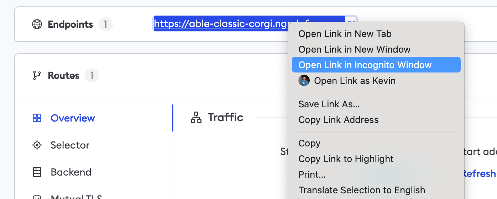

# Descope SSO (OpenID Connect)

:::tip TL;DR

To secure access to your ngrok endpoints with Descope Single Sign-On (SSO) using OpenID Connect (OIDC):

1. [Configure Descope SSO](#configure-Descope)
1. [Configure ngrok](#configure-ngrok)
1. [Test access to ngrok with Descope SSO](#test-sso)

:::

This article details how to configure Descope as the primary Identity Provider for your ngrok endpoints.
By integrating Descope SSO with ngrok, you can:

- **Restrict access to ngrok endpoints** only to users authenticated via Descope
- **Use Descope security policies and MFA authenticators**.
- **Use the Descope Console to facilitate access to ngrok apps**.

## Supported Features

The ngrok integration with Descope supports:

- **SP-Initiated SSO**: In this mode, users access ngrok endpoints and are redirected to Descope for authentication.

## Requirements

To configure ngrok endpoints with Descope, you must have:

- A Descope account with administrative rights to a Descope Project
- An ngrok enterprise account with an access token or admin access to configure edges with OpenID Connect.

## Configuration Steps

To integrate ngrok with Descope SSO, you will need to:

1. Configure Descope with the ngrok app
1. Configure ngrok with the SSO settings provided by Descope

## **Step 1**: Configure Descope {#configure-Descope}

### Add the ngrok App in Descope

1. Open the [Descope Console](https://app.descope.com).

1. On the left menu, click **Applications**, and then click **+ Application** in the top right corner.

1. In the popup window, enter `ngrok` in the **Name** field, make sure that `OIDC` is selected under **Authentication protocol**, and then click **Create**.

1. On the **ngrok** application page, make a note of the **Issuer** URL.

1. **Optional** if you wish to change the [Auth Hosting URL](https://docs.descope.com/knowledgebase/general/authhostingapp/#usage), to use a different flow for ngrok SSO you can change that on this page, and click **Save**.

### Create a Client Secret in Descope

1. Go to [Access Keys](https://app.descope.com/accesskeys) in the Descope Console.

1. Click **+ Access Key** in the top right corner.

1. In the popup window, enter `ngrok` in the **Name** field, change the **Expiration** time to whatever you prefer, and then click **Generate Key**.

1. Once the **Access Key** has been created, make a note of it for later.

## **Step 2**: Configure ngrok {#configure-ngrok}

ngrok can leverage Descope SSO in two ways:

- From the ngrok CLI (using the `--oidc` parameter)
- From the ngrok dashboard

### **Option 1**: ngrok CLI

> **Note:** For this tutorial, we assume you have an app running locally (i.e., on localhost:3000) with the ngrok client installed.

1. Launch a terminal

1. Enter the following command to launch an ngrok tunnel with Descope SSO:

   ```bash
   ngrok http 3000 --oidc=DESCOPE_ISSUER_URL \
   --oidc-client-id=DESCOPE_CLIENT_ID \
   --oidc-client-secret=DESCOPE_CLIENT_SECRET \
   ```

   **Note**: Replace the following with values:

   - `DESCOPE_ISSUER_URL`: This is your Issuer URL that you copied from the **Applications** page earlier.
   - `DESCOPE_CLIENT_ID`: This is your Descope Project ID, which can be found under [Project Settings](https://app.descope.com/settings/project).
   - `DESCOPE_CLIENT_SECRET`: The is the Descope Access Key that you created from earlier.

   Alternatively, add the `--url YOUR_DOMAIN` argument to get your custom URL, replacing `YOUR_DOMAIN` with your URL of preference.

1. Copy the URL available next to **Forwarding** (for example, `https://descope-sso-test.ngrok.dev`).

1. Skip to **Step 3**

### **Option 2**: ngrok Edge

To configure an edge with Descope:

1. Access the [ngrok Dashboard](https://dashboard.ngrok.com/) and sign in using your ngrok account.

1. On the left menu, click **Cloud Edge** and then click **Edges**.

1. If you don't have an edge already set to add Descope SSO, create a test edge:

   - Click **+ New Edge**.
   - Click **Create HTTPS Edge**.
   - Click the **pencil icon** next to "no description", enter `Edge with Descope SSO OIDC` as the edge name, and click **Save**.

1. On the edge settings menu, click **OIDC**.

1. Click **Begin setup** and enter the following values into the fields:
   

   - **Issuer URL**: This is your Issuer URL that you copied from the **Applications** page earlier.
   - **Client ID**: The client id you copied from Descope.
   - **Client Secret**: The client secret you copied from Descope.

1. Click **Save** at the top, and then click the left arrow to go back to the **Edges** page.

1. Launch a tunnel connected to your Descope edge:

:::tip Note
For this step, we assume you have an app running locally (i.e. on localhost:3000) with the ngrok client installed.
:::

1.  Click **Start a tunnel**.

1.  Click the **copy icon** next to the tunnel command.
    

1.  Launch a tunnel:

    - Launch a terminal.
    - Paste the command but replace `http://localhost:80` with your localhost app address (i.e., `http://localhost:3000`).
    - Click **Enter** and an ngrok tunnel associated with your edge configuration will launch.

1.  To confirm that the tunnel is connected to your edge:

    - Return to the ngrok dashboard
    - Close the **Start a tunnel** and the **Tunnel group** tabs
    - Refresh the test edge page. Under traffic, you will see the message _You have 1 tunnel online. Start additional tunnels to begin load balancing._
      

1.  In the test edge, copy the **endpoint URL**. (You use this URL to test the Descope Authentication)
    

## Step 3: Test the integration {#test-sso}

1. In your browser, launch an incognito window.

1. Access your ngrok endpoint (i.e., `https://descope-sso-test.ngrok.io` or using the copied URL).

1. You should be prompted to log in with Descope.

1. After logging in, you should be able to see your web app.
