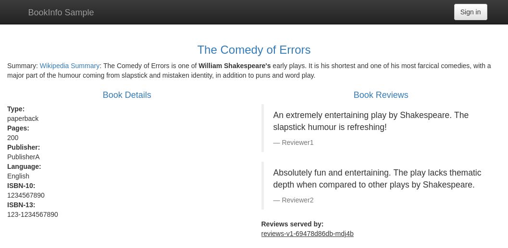
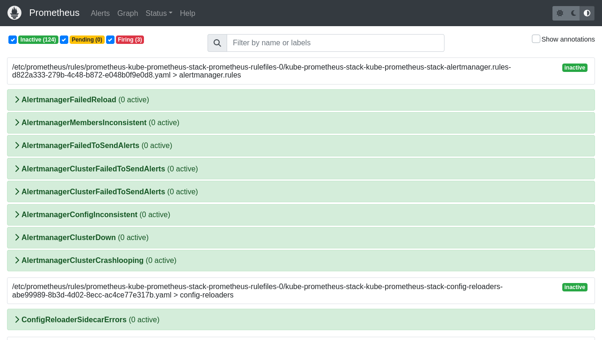

import TrafficPolicyGoogleOauth from '../../../examples/k8s/trafficpolicy/example.mdx';

Using this guide, you'll launch a new cluster on [DigitalOcean](https://digitalocean.com) and use the DigitalOcean Marketplace to provision the [ngrok Kubernetes Operator](https://marketplace.digitalocean.com/apps/ngrok-ingress-controller) to securely ingress public traffic to a demo app.

In the end, you'll have learned enough to deploy your next production-ready Kubernetes app with Rafay, with the ngrok Kubernetes Operator giving you access to additional features, like observability and resiliency, with no extra configuration complexity.

Here is what you'll be building with:

- **The [ngrok Kubernetes Operator](https://ngrok.com/blog-post/ngrok-k8s)**: ngrok's official controller for adding secure public ingress and middleware execution to your Kubernetes apps with ngrok's cloud service. With ngrok, you can manage and secure app traffic at every stage of the development lifecycle while benefiting from simpler configurations, security, and edge acceleration.
- **DigitalOcean**: DigitalOcean is a cloud service provider focused on developers, startups, and small-to-midsize businesses. With reliable monthly rates for less than hyperscalers like AWS, DigitalOcean's Kubernetes solution is a great fit for internal development teams building or scaling up new platforms without massive infrastructure build-out or expense.

## What you'll need

- A [DigitalOcean account](https://cloud.digitalocean.com/registrations/new).
- An [ngrok account](https://ngrok.com/signup).
- [kubectl](https://kubernetes.io/docs/tasks/tools/install-kubectl/) and [Helm
  3.0.0+](https://helm.sh/docs/intro/install/) installed on your local
  workstation.
- The [ngrok Kubernetes Operator](/docs/k8s/) installed on
  your cluster.
- A reserved domain, which you can get in the ngrok
  [dashboard](https://dashboard.ngrok.com/domains) or with the [ngrok
  API](https://ngrok.com/docs/api/resources/reserved-domains/).
  - You can choose from an ngrok subdomain or bring your own custom branded
    domain, like `https://api.example.com`.
  - We'll refer to this domain as `<NGROK_DOMAIN>`.

## Provision a new cluster on DigitalOcean with `doctl` {#provision-a-new-cluster}

In this guide, we'll stick with the CLI as much as possible to showcase how tightly the ngrok Kubernetes Operator can integrate with DigitalOcean and how you might automate these steps in the future.

1. With `doctl` installed remotely, scope out the node sizes/specs, which will directly affect your [monthly pricing](https://www.digitalocean.com/pricing/kubernetes), with the following:

   ```bash
   doctl kubernetes options sizes
   ```

1. Provision your cluster with the command below, replacing `NODE_SIZE` and `CLUSTER_NAME` with your chosen size and a relevant name.

   ```bash
   doctl kubernetes clusters create --size NODE_SIZE CLUSTER_NAME
   ```

   ```bash
   ...
   Notice: Successfully kicked off addon job.
   ID                                      Name        Region    Version        Auto Upgrade    Status     Node Pools
   d62a17ca-32e0-4d8b-9260-2d0d1c582939    ngrokker    nyc1      1.29.1-do.0    false           running    ngrokker-default-pool
   ```

1. Now you can install the ngrok Kubernetes Operator to provide ingress to our services.

   Check out our [Operator installation doc](/docs/k8s/installation/helm/) for details on how to use Helm to install with your ngrok credentials.

   Your new Kubernetes cluster, managed by DigitalOcean, is all set up—and with the ngrok Kubernetes Operator installed with a single option on the CLI.

## Deploy an example app on your DigitalOcean-managed cluster {#deploy-an-example-app}

Let's explore how you can add apps or services to your DigitalOcean-managed Kubernetes cluster. DigitalOcean has a repository of [sample Kubernetes apps](https://github.com/digitalocean/kubernetes-sample-apps/tree/master/bookinfo-example), including the [Bookinfo](https://github.com/digitalocean/kubernetes-sample-apps/tree/master/bookinfo-example) app, which we'll use.

1. Clone the repository to your local workstation and `cd` into the new directory:

   ```bash
   git clone https://github.com/digitalocean/kubernetes-sample-apps.git
   cd kubernetes-sample-apps
   ```

1. Deploy the Bookinfo app to your cluster:

   ```bash
   kubectl apply -k bookinfo-example/kustomize
   ```

   You should see your cluster create a handful of new services, then verify everything is running correctly with `kubectl get all -n bookinfo`.

## Configure the ngrok Kubernetes Operator {#configure-the-ngrok-kubernetes-ingress-controller}

Your Bookinfo app is running, but you have no means of accessing it from your local workstation—or anywhere else, for that matter. You _could_ use `kubectl port-forward...`, but that's a fragile method of accessing your new app, and isn't appropriate for production use.

Instead, finish configuring the ngrok Kubernetes Operator to direct incoming requests directly to the container running the user-facing Bookinfo container. The [Bookinfo docs](https://github.com/digitalocean/kubernetes-sample-apps/tree/master/bookinfo-example) recommend port-forwarding to the `productpage` service, which runs on port `9080`—you can use that information to configure the ngrok Kubernetes Operator.

1. Create a new file called `bookinfo-ingress.yaml` on your local workstation. This configuration defines how the ngrok Kubernetes Operator will route traffic arriving on `NGROK_DOMAIN` to the `store-front` service on port `80` as defined in the manifest.

   :::tip

   Make sure you edit line `10` of the YAML below, which contains the `NGROK_DOMAIN` variable, with the ngrok domain you created earlier.

   :::

   ```yaml showLineNumbers
   ---
   apiVersion: networking.k8s.io/v1
   kind: Ingress
   metadata:
     name: bookinfo-ingress
     namespace: bookinfo
   spec:
     ingressClassName: ngrok
     rules:
       - host: <NGROK_DOMAIN>
         http:
           paths:
             - path: /
               pathType: Prefix
               backend:
                 service:
                   name: productpage
                   port:
                     number: 9080
   ```

1. Apply the new configuration to your cluster:

   ```bash
   kubectl apply -f ngrok_ingress.yaml
   ```

   :::tip

   **Note:** If you get an error when applying the manifest, double check that you've updated the `<NGROK_DOMAIN>` value and try again.

   :::

1. Navigate to `https://<NGROK_DOMAIN>` in your browser to see your example Bookinfo app as managed, deployed, and publicly networked via DigitalOcean, Kubernetes, and ngrok! Click **Normal user** to see a little more—it's not much to look at, but it's a working Kubernetes app with functional, secure, and simple ingress with the ngrok Kubernetes Operator.

   

## Enable extra features of ngrok's cloud service {#enable-extra-features-of-ngrok}

To demonstrate how ingress configuration and [OAuth support](/traffic-policy/actions/oauth/) work, you can quickly launch an open-source observability stack including [Prometheus](https://github.com/prometheus), [Grafana](https://github.com/grafana/grafana), and [Alertmanager](https://github.com/prometheus/alertmanager/) on your cluster.

1. Head over to the [Kubernetes Clusters](https://cloud.digitalocean.com/kubernetes/clusters/) dashboard on the DigitalOcean console and click on the cluster you created previously.

1. Click the **Marketplace** tab, find or search for **Kubernetes Monitoring Stack**, and click **Install**. Confirm your choice.

   In the background, DigitalOcean uses Helm to create a new integrated deployment for Prometheus, Grafana, and Alertmanager.

1. Create a new domain in the [ngrok dashboard](https://dashboard.ngrok.com/domains) at `monitoring.<NGROK_DOMAIN>`.

1. Edit your `ngrok_ingress.yaml` file you created in the previous step to include the highlighted configuration at the bottom, which will route all traffic arriving on `https://monitoring.NGROK_DOMAIN/` to the `kube-prometheus-stack-prometheus` service running on port `9090` in your cluster.

   ```yaml showLineNumbers
   ---
   apiVersion: networking.k8s.io/v1
   kind: Ingress
   metadata:
     name: monitoring-ingress
     namespace: kube-prometheus-stack
   spec:
     ingressClassName: ngrok
     rules:
       - host: monitoring.<NGROK_DOMAIN>
         http:
           paths:
             - path: /
               pathType: Prefix
               backend:
                 service:
                   name: kube-prometheus-stack-grafana
                   port:
                     number: 9090
   ```

1. Visit a URL like `https://monitoring.NGROK_DOMAIN/alerts` to see data from Alertmanager:

   

   Having comprehensive observability for your Kubernetes app is paramount, but so is security—you don't want just anyone snooping around your metrics and alerts.

1. Edit your `ngrok_ingress.yaml` file once again to add OAuth, leaving the
   previous configurations untouched. Note the new `annotations` field and the
   `NgrokTrafficPolicy` CR.

   ```yaml showLineNumbers
   ---
   apiVersion: networking.k8s.io/v1
   kind: Ingress
   metadata:
     name: monitoring-ingress
     namespace: kube-prometheus-stack
   	 annotations:
       k8s.ngrok.com/traffic-policy: oauth
   spec:
     ingressClassName: ngrok
     rules:
       - host: monitoring.<NGROK_DOMAIN>
         http:
           paths:
             - path: /
               pathType: Prefix
               backend:
                 service:
                   name: kube-prometheus-stack-grafana
                   port:
                     number: 9090
    ---
   # Traffic Policy configuration for OAuth
   apiVersion: ngrok.k8s.ngrok.com/v1alpha1
   kind: NgrokTrafficPolicy
   metadata:
     name: oauth
     namespace: default
   spec:
     policy:
   	   on_http_request:
   		   - type: oauth
   			   config:
   			     provider: google
   ```

1. Re-apply your `2048.yaml` configuration.

   ```bash
   kubectl apply -f ngrok-ingress.yaml
   ```

1. When you open your demo app again, you'll be asked to log in via Google.
   That's a start, but what if you want to authenticate only yourself or colleagues?

1. You can use [expressions](/docs/traffic-policy/concepts/expressions) and [CEL
   interpolation](/docs/traffic-policy/concepts/cel-interpolation) to filter out
   and reject OAuth logins that don't contain `example.com`. Update the
   `NgrokTrafficPolicy` portion of your manifest after changing `example.com` to
   your domain.

   <TrafficPolicyGoogleOauth withDomain={true} />

1. Check out your deployed 2048 app once again. If you log in with an email that
   doesn't match your domain, ngrok rejects your request. Authentication... done!

## What's next?

You've now used the open-source ngrok Kubernetes Operator to add public ingress to an example app on a Kubernetes cluster managed by DigitalOcean. Because ngrok abstracts ingress and middleware execution to its cloud service, and thanks to DigitalOcean's `doctl` tool, you can quickly deploy new clusters, apps, and helpful services without leaving your CLI.

Learn more about the ngrok Kubernetes Operator, or contribute to its ongoing development, by checking out the [GitHub repository](https://github.com/ngrok/ngrok-operator). We also have an extensive explainer for [how the Operator works](/docs/k8s/how-it-works/), plus additional [documentation](/docs/k8s/), which also includes details on leveraging the new Kubernetes Gateway API.
